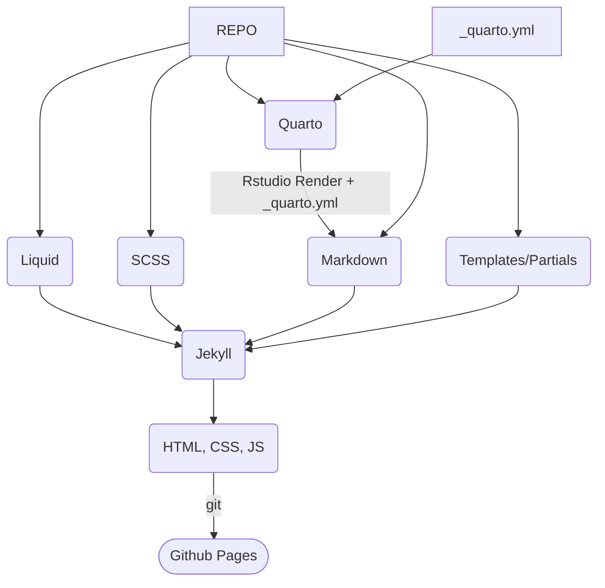

# NCCS

## Contents

- [Development](#development)
- [Fields](#fields)
- [Quarto](#quarto)

## Development 

### To install the site locally:

Command-line instructions

1. Clone the repo with `git clone future-address-here`
2. `cd` (navigate) into the repo
3. `bundle install` to load gems
4. `bundle exec jekyll serve` to spin the site up locally

Alternatively after you've set up the project, you can use the command shortcuts in the `Rakefile` to save yourself some typing:

|Command|Description|
|:---|:---|
|`rake dev`|Starts Jekyll locally|
|`rake build`|Run the Jekyll build process locally|

### Development Principles

- **No build system**
    - There is no build system (Webpack, Vite, etc) in order to:
       - Simplify - Removes extra steps required to deploy (such as generating assets)
       - Future-proof - Increases the chances this project will work without major updates for a long time to come.
       - Reduce dependencies - Removes the need to use Node or other environments in addition to Ruby to build the site.
    - This project instead relies on provided Jekyll SCSS support for styles and browser-supported ESM modules for JavaScript.
- **Github Pages enabled**
    - This project is designed to be used with Github Pages with no additional Github Action setup required.
    - To activate, go to Settings / Pages / Source -> Deploy from Branch, then select the `main` branch.
    - Any commits to the `main` branch will trigger a new build.

### Installation Troubleshooting

This project assumes that:

- A relatively recent version of Ruby has been installed on your machine.
    - `which ruby` will tell you if and where Ruby has been installed on your machine.
    - `ruby --version` will give you the version of Ruby installed.
- You have sufficient privileges to install Ruby gems via `bundle install`

### Other Troubleshooting

- When previewing the site locally and a `:baseurl` has been set in the `_config.yml` file, you'll need to make sure that there is a trailing slash.
    - Example: `http://127.0.0.1:4000/nccs/` instead of `http://127.0.0.1:4000/nccs`

# Fields

## Content Type Fields

Each content type (Datasets, Resources, Stories) has it's own `readme.md` file documenting the fields accepted for each type. Many of the fields are shared across all three, and any unique fields have been called out.

## Author and Citation

The author and citation fields have been built to follow the [Quarto Citation](https://quarto.org/docs/authoring/create-citeable-articles.html) formats.

The simplest version of the citation is to set it as:

`citation: true`

Which will cause all default fields to be used. But for customization, refer to the following fields:

- `author` - {Array} - Used in citation and author information
  - `id` - {String} (Preferred) uses the id of an author defined in `_data/people.yml` to populate fields.
  - `name` - {String} (Override) If no `id`, this field can provide an override that works to show in the author section AND citation information for the specified author. However, this will not correctly format the citation in the Chicago Author-Date style if this is the first listed author. See `citation.author`
  - `bio` - {String} (Override) Allows override of bio section. Useful if the author is not in `_data/people.yml`.
- `citation` - {Array}
  - `author` - {String} (Override) Will override all `author` fields and allow custom formatting. Intended for use if authors are not in the `_data/people.yml` file.
  - `container-title` - {String} Title of publication. If left blank, it will revert to the site name in `_config.yml`
  - `volume` - {Number} Volume of publication
  - `number` - {Number} Number of publication
- `citationData` - {Date}

# Quarto

This project makes affordance for using [Quarto](https://quarto.org/) to develop content. Currently the use of Quarto is only supported in `_stories` collection.

To use Quarto:

1. Open the repository root in [RStudio](https://posit.co/products/open-source/rstudio/)
2. Navigate to or open files in the `_stories` directory
3. Make any edits to a `.qmd` file needed
4. Hit 'Render' in Rstudio
5. Commit all changes to `git` and push up to the project.

The project settings will take care of the rest!

(Note: Github Pages will be set to pull from a specific branch. Make sure to either change the branch it's looking at to the one you're pushing changes to.)

## What happens when you edit a Quarto document:

1. The `_quarto.yml` in the repo root sets YAML defaults and is recognized by RStudio
2. With the defaults, Quarto renders to markdown to the same directory as the `.qmd` file and preserves all YAML headers
3. Jekyll, which is set to ignore `.qmd` files, recognizes the `.md` file in `_stories` and renders it to HTML, using all the appropriate templates (header, footer, etc)
4. Jekyll during the build phase copies over all local folders inside `_stories`, including generated diagrams, etc.
5. The `extract-media` field in `_quarto.yml` prepends any direct links to look for the copied assets from step 4.
6. Live content!

## Content Transformation Diagram

Here's another view of what's going on:

## Editing Tips

- Because we're rendering Quarto to markdown, it will not include [Bootstrap](https://getbootstrap.com/) or other layout libraries. This means anything relying on Bootstrap functionality (callouts, bootstrap layout classes, etc.)
- The Rstudio preview while editing inside the project will be rather unhelpful. It's recommended to use the Visual editor to preview OR to create the document somewhere else and port it to the project when ready for final stages.

## Previewing Quarto content

The best way to preview the content is to have Jekyll running in development mode (See [Development](#development)).

With the dev server up and a browser window open to the dev url (something like `http://http://127.0.0.1:4000/nccs/`) navigate to stories and find your new entry.

Once you're on that URL, anytime you hit 'Render' from Rstudio, Jekyll will recompile the `.md` and show updates. (It should automatically refresh, if not you can manually refresh to show the changes.)
