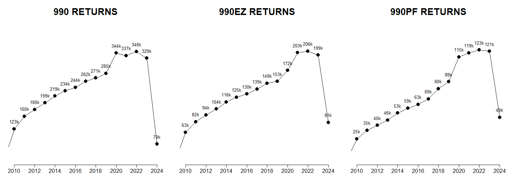

The IRS 990 Electronic Filing (Efile) Database refers to a collection of Form 990 documents submitted by tax-exempt organizations starting in 2012. Whereas the NCCS Core data series is more comprehensive in terms of organizations in the dataset (all paper + electronic filers), the Efile database provides the most comprehensive financial and operational information about the organization's activities, governance, and finances.

In 2015 the IRS began releasing Efile data containing almost all of the Form 990 + Schedule fields submitted by nonprofits, which greatly increased availability of the data on nonprofits. Previously most public nonprofit databases like the NCCS Core files were limited to the few dozen financial variables that were released through the IRS SOI Extract tables. The Efile database, in contrast, consists of millions of files containing individual returns that include over 2,000 fields from the 990 forms and schedules. 

The data is shared in XML formats that are challenging to use. NCCS provides a version that has been converted into a relational database with 126 distinct tables that reflect the discrte Parts represented on Form 990 and Schedules.  

<a class="btn -tertiary " href="https://nonprofit-open-data-collective.github.io/irs990efile/data-dictionary/data-dictionary.html">
  DATA DICTIONARY
</a>

Form 990 filings contain a wealth of information, including details about an organization's revenue, expenses, assets, liabilities, executive compensation, board members, mission statement, and descriptions of its programs and activities. 

The Efile Data is more comprehensive in terms of the fields that are available, but it is more limited in terms of organizations that appear in the database. The population of efilers contains all large organizations, most foundations, and some small organizations. Up until 2022 electronic filing was voluntary for most nonprofits except the following organizations:  

* Any nonprofit with over $10 million in assets 
* Nonprofits with revenue under $50K (via the 990-N postcard database)
* Private foundations and charitable trusts
* Community foundations were NOT required to efile (unless they had more than $10M in assets, which most do) 

There was rapid adoption because electronic filing is convenient, but it took some time for nonprofits to adapt and transition from paper filings. As a result, you see a steady increase in the number of efilers across time (see the table below). Efiling became mandatory in 2022 (which impacts 2021 tax year data), so into the future the efile dataset should contain all of the same nonprofits as the NCCS Core data series with about 10x more variables available.   

**990 Efile Returns by Form Type and Tax Year (990 Data Commons, Oct. 2025)**

| YEAR |     990 |   990EZ |   990PF |   990T |
|:-----|--------:|--------:|--------:|-------:|
| 2009 |  33,311 |  15,470 |   2,345 |      0 |
| 2010 | 123,025 |  63,326 |  25,249 |      0 |
| 2011 | 159,504 |  82,048 |  34,597 |      0 |
| 2012 | 179,688 |  93,750 |  39,933 |      0 |
| 2013 | 198,855 | 104,375 |  45,887 |      0 |
| 2014 | 218,619 | 116,417 |  53,442 |      0 |
| 2015 | 233,519 | 124,894 |  58,815 |      0 |
| 2016 | 243,903 | 130,484 |  62,988 |      0 |
| 2017 | 261,612 | 139,145 |  68,950 |      0 |
| 2018 | 271,442 | 149,384 |  80,138 |      0 |
| 2019 | 284,515 | 152,689 |  87,790 |      0 |
| 2020 | 343,790 | 171,891 | 114,967 | 22,674 |
| 2021 | 336,521 | 202,730 | 119,360 | 23,927 |
| 2022 | 348,034 | 205,532 | 122,533 | 22,611 |
| 2023 | 329,042 | 198,731 | 121,156 | 20,743 |
| 2024 |  78,817 |  80,682 |  48,860 |  3,245 |

Due to the absense of paper filers in this data series it is recommended for research that does not require the full population of filers. The larger the organization is the more likely they are to file electronically. Sample weights can also be created by comparing efilers to the nonprofits in the BMF or Core files.  

While most parts of Form 990 and Schedules are made available to the public, [some sensitive information is redacted by the IRS or nonprofits to protect the privacy of donors](https://www.adlercolvin.com/blog/2015/06/08/exempt-organizations-can-redact-donor-identifying-information-from-irs-form-990-schedule-b-before-public-disclosure/). 

 
 

 
 
