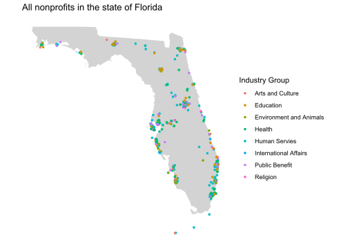
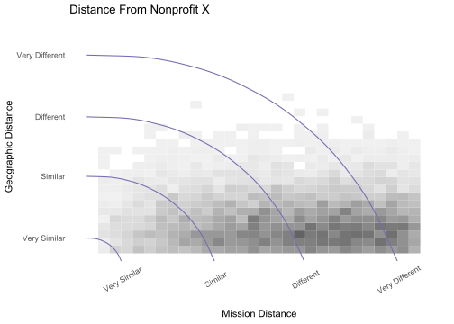
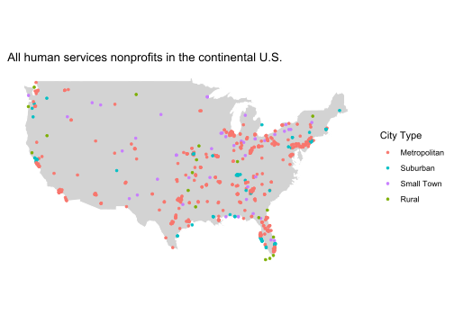
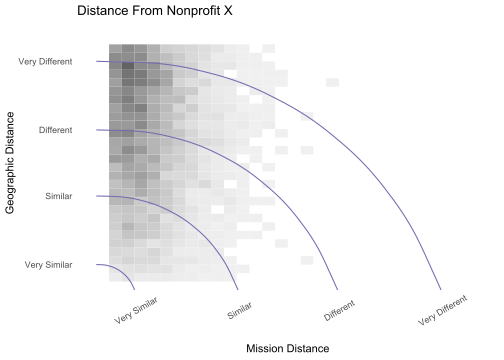
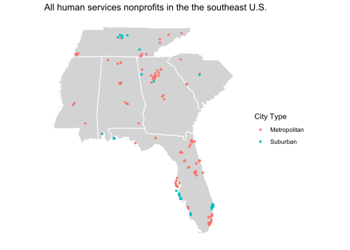
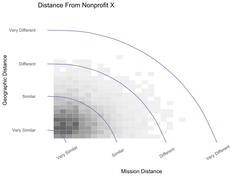

Nonprofit boards commission compensation studies when hiring new
executives and conducting performance evaluations. These studies
generate a range of reasonable salaries by creating a comparison set of
salaries in similar organizations. If a proposed salary falls outside
this range, the nonprofit may be over- or under-compensating their
executives.

These studies are typically difficult to conduct because they require a
substantial amount of data that is currently unavailable in a single
digitized format. Many for-profit consulting firms have compiled data,
but they charge nonprofits for their appraisal. This current industry
standard creates inequities in executive pay. Organizations without
financial resources to access high-quality studies are less likely to
have the knowledge needed to fairly compensate their executives.
Furthermore, a study not performed vigilantly can introduce bias into
the compensation estimates and amplify pay disparities.

Our team aims to democratize the process of executive compensation
appraisals to provide all nonprofits access to high-quality appraisals
without paying large consulting fees. In order to be useful, we need to
create a data set that accurately reflects the job market it is trying
to appraise. However, the answer to “what is the job market?” is highly
flexible depending on what type of nonprofit is being appraised.

For example, if an art museum in New York City is hiring a new CEO, we
want to compare their proposed compensation to compensations from art
museums in other large cities like San Francisco, Chicago, or Boston.
But if a small animal shelter in Jackson, Wyoming is hiring a new CEO,
we want to compare their proposed compensation to other small
animal-related nonprofits located in the Rocky Mountains. Before we can
appraise new nonprofits CEO compensations, we need to build an accurate
data base of current CEO compensations. This requires knowing for
essential factors for every nonprofit in the U.S. (1) who the CEO is,
and (2) how much they are being paid.

While these seem like straightforward questions, finding the answers is
by no means a simple task. Every nonprofit is annually required to file
form 990 with the IRS, and the IRS makes these fillings publicly
available. But just because the data is available, does not mean is it
easy to use.

These data are not standardized and require extensive cleaning and
classification. More problematic, some small nonprofits file Form
990-EZ, a simplified version of Form 990, which does not contain nearly
as much detailed information. This leaves us with an incomplete picture
for many organizational attributes.

Another issue is simply identifying who the CEO is. The language used
from nonprofit to nonprofit is highly nonstandard. Some nonprofits
directly list a Chief Executive Officer, while many list director,
president, or other titles to describe their organization leader. Simply
identifying which person serves performs the function the CEO is a task
in-and-of itself. See our project on name classifications for more
details. \[LINK HERE TO NAME CLEANING PROJECT\]

When creating an appraisal, we only want to consider other organizations
that are similar to the specific nonprofit being appraised. The
challenge in this project is to define what it means for two nonprofits
to be similar. Nonprofits can be compared on multiple characteristics
such as operating size, number of employees, amount of financial
support, geographic location, intended beneficiaries or services, and
scope of mission. For our comparison between nonprofits, we choose to
focus on three aspects: annual expenses, geographic location, and scope
of mission.

We selected annual expenses as a proxy for organizational size since it
is typically more stable than annual income for nonprofits. Often
nonprofits will receive grants that are paid to it all at once but are
spent over several years. We consider expenses to avoid these spikes in
income from grants.

For geographical characteristics we consider what state/territory and
the type of city (metropolitan, suburban, small town, rural) the
nonprofit is located in. And while geography is an important aspect to
account for, it is not enough on its own. Let’s consider Wave Hill
Public Garden and Cultural Center located in the Bronx. It is only seven
miles away from the Bronx River Art Center, A SMALL educational art
studio. Although these two organizations are located in the same
geographic region, they are hardly comparable because they have
different goals. It is more appropriate to compare Wave Hill to the
Santa Fe Botanical Garden in New Mexico or the Cleveland Botanical
Garden in Ohio since these organizations are all public gardens in major
metropolitan cities.

Quantifying the similarity of nonprofit missions is the most challenings
part of this project. The IRS uses the National Taxonomy of Exempt
Entities (NTEE) Codes to categorize a nonprofit’s scope of mission. The
NTEE system contains a hierarchical classification system that has over
650 basic codes and thousands of more specialized codes. In the plot
below we have included the basic codes and their hierarchical structure.
You can click on the nodes to explore how the codes are nested in this
structure. To learn more about NTEE codes, see \[LINK TO NTEE CODES
STORY\].

<!DOCTYPE html>
<html lang="en">
<head>
<meta charset="utf-8" />

<script>// https://d3js.org Version 4.10.2. Copyright 2017 Mike Bostock.
(function(t,n){"object"==typeof exports&&"undefined"!=typeof module?n(exports):"function"==typeof define&&define.amd?define(["exports"],n):n(t.d3=t.d3||{})})(this,function(t){"use strict";function n(t){return function(n,e){return ss(t(n),e)}}function e(t,n){return[t,n]}function r(t,n,e){var r=(n-t)/Math.max(0,e),i=Math.floor(Math.log(r)/Math.LN10),o=r/Math.pow(10,i);return i>=0?(o>=Ts?10:o>=ks?5:o>=Ns?2:1)*Math.pow(10,i):-Math.pow(10,-i)/(o>=Ts?10:o>=ks?5:o>=Ns?2:1)}function i(t,n,e){var r=Math.abs(n-t)/Math.max(0,e),i=Math.pow(10,Math.floor(Math.log(r)/Math.LN10)),o=r/i;return o>=Ts?i*=10:o>=ks?i*=5:o>=Ns&&(i*=2),n<t?-i:i}function o(t){return t.length}function u(t){return"translate("+(t+.5)+",0)"}function a(t){return"translate(0,"+(t+.5)+")"}function c(t){return function(n){return+t(n)}}function s(t){var n=Math.max(0,t.bandwidth()-1)/2;return t.round()&&(n=Math.round(n)),function(e){return+t(e)+n}}function f(){return!this.__axis}function l(t,n){function e(e){var u=null==i?n.ticks?n.ticks.apply(n,r):n.domain():i,a=null==o?n.tickFormat?n.tickFormat.apply(n,r):Ls:o,y=Math.max(l,0)+p,g=n.range(),m=+g[0]+.5,x=+g[g.length-1]+.5,b=(n.bandwidth?s:c)(n.copy()),w=e.selection?e.selection():e,M=w.selectAll(".domain").data([null]),T=w.selectAll(".tick").data(u,n).order(),k=T.exit(),N=T.enter().append("g").attr("class","tick"),S=T.select("line"),E=T.select("text");M=M.merge(M.enter().insert("path",".tick").attr("class","domain").attr("stroke","#000")),T=T.merge(N),S=S.merge(N.append("line").attr("stroke","#000").attr(v+"2",d*l)),E=E.merge(N.append("text").attr("fill","#000").attr(v,d*y).attr("dy",t===qs?"0em":t===Ds?"0.71em":"0.32em")),e!==w&&(M=M.transition(e),T=T.transition(e),S=S.transition(e),E=E.transition(e),k=k.transition(e).attr("opacity",Fs).attr("transform",function(t){return isFinite(t=b(t))?_(t):this.getAttribute("transform")}),N.attr("opacity",Fs).attr("transform",function(t){var n=this.parentNode.__axis;return _(n&&isFinite(n=n(t))?n:b(t))})),k.remove(),M.attr("d",t===Os||t==Us?"M"+d*h+","+m+"H0.5V"+x+"H"+d*h:"M"+m+","+d*h+"V0.5H"+x+"V"+d*h),T.attr("opacity",1).attr("transform",function(t){return _(b(t))}),S.attr(v+"2",d*l),E.attr(v,d*y).text(a),w.filter(f).attr("fill","none").attr("font-size",10).attr("font-family","sans-serif").attr("text-anchor",t===Us?"start":t===Os?"end":"middle"),w.each(function(){this.__axis=b})}var r=[],i=null,o=null,l=6,h=6,p=3,d=t===qs||t===Os?-1:1,v=t===Os||t===Us?"x":"y",_=t===qs||t===Ds?u:a;return e.scale=function(t){return arguments.length?(n=t,e):n},e.ticks=function(){return r=Rs.call(arguments),e},e.tickArguments=function(t){return arguments.length?(r=null==t?[]:Rs.call(t),e):r.slice()},e.tickValues=function(t){return arguments.length?(i=null==t?null:Rs.call(t),e):i&&i.slice()},e.tickFormat=function(t){return arguments.length?(o=t,e):o},e.tickSize=function(t){return arguments.length?(l=h=+t,e):l},e.tickSizeInner=function(t){return arguments.length?(l=+t,e):l},e.tickSizeOuter=function(t){return arguments.length?(h=+t,e):h},e.tickPadding=function(t){return arguments.length?(p=+t,e):p},e}function h(){for(var t,n=0,e=arguments.length,r={};n<e;++n){if(!(t=arguments[n]+"")||t in r)throw new Error("illegal type: "+t);r[t]=[]}return new p(r)}function p(t){this._=t}function d(t,n){return t.trim().split(/^|\s+/).map(function(t){var e="",r=t.indexOf(".");if(r>=0&&(e=t.slice(r+1),t=t.slice(0,r)),t&&!n.hasOwnProperty(t))throw new Error("unknown type: "+t);return{type:t,name:e}})}function v(t,n){for(var e,r=0,i=t.length;r<i;++r)if((e=t[r]).name===n)return e.value}function _(t,n,e){for(var r=0,i=t.length;r<i;++r)if(t[r].name===n){t[r]=Is,t=t.slice(0,r).concat(t.slice(r+1));break}return null!=e&&t.push({name:n,value:e}),t}function y(t){return function(){var n=this.ownerDocument,e=this.namespaceURI;return e===Ys&&n.documentElement.namespaceURI===Ys?n.createElement(t):n.createElementNS(e,t)}}function g(t){return function(){return this.ownerDocument.createElementNS(t.space,t.local)}}function m(){return new x}function x(){this._="@"+(++Xs).toString(36)}function b(t,n,e){return t=w(t,n,e),function(n){var e=n.relatedTarget;e&&(e===this||8&e.compareDocumentPosition(this))||t.call(this,n)}}function w(n,e,r){return function(i){var o=t.event;t.event=i;try{n.call(this,this.__data__,e,r)}finally{t.event=o}}}function M(t){return t.trim().split(/^|\s+/).map(function(t){var n="",e=t.indexOf(".");return e>=0&&(n=t.slice(e+1),t=t.slice(0,e)),{type:t,name:n}})}function T(t){return function(){var n=this.__on;if(n){for(var e,r=0,i=-1,o=n.length;r<o;++r)e=n[r],t.type&&e.type!==t.type||e.name!==t.name?n[++i]=e:this.removeEventListener(e.type,e.listener,e.capture);++i?n.length=i:delete this.__on}}}function k(t,n,e){var r=Gs.hasOwnProperty(t.type)?b:w;return function(i,o,u){var a,c=this.__on,s=r(n,o,u);if(c)for(var f=0,l=c.length;f<l;++f)if((a=c[f]).type===t.type&&a.name===t.name)return this.removeEventListener(a.type,a.listener,a.capture),this.addEventListener(a.type,a.listener=s,a.capture=e),void(a.value=n);this.addEventListener(t.type,s,e),a={type:t.type,name:t.name,value:n,listener:s,capture:e},c?c.push(a):this.__on=[a]}}function N(n,e,r,i){var o=t.event;n.sourceEvent=t.event,t.event=n;try{return e.apply(r,i)}finally{t.event=o}}function S(){}function E(){return[]}function A(t,n){this.ownerDocument=t.ownerDocument,this.namespaceURI=t.namespaceURI,this._next=null,this._parent=t,this.__data__=n}function C(t,n,e,r,i,o){for(var u,a=0,c=n.length,s=o.length;a<s;++a)(u=n[a])?(u.__data__=o[a],r[a]=u):e[a]=new A(t,o[a]);for(;a<c;++a)(u=n[a])&&(i[a]=u)}function z(t,n,e,r,i,o,u){var a,c,s,f={},l=n.length,h=o.length,p=new Array(l);for(a=0;a<l;++a)(c=n[a])&&(p[a]=s=of+u.call(c,c.__data__,a,n),s in f?i[a]=c:f[s]=c);for(a=0;a<h;++a)(c=f[s=of+u.call(t,o[a],a,o)])?(r[a]=c,c.__data__=o[a],f[s]=null):e[a]=new A(t,o[a]);for(a=0;a<l;++a)(c=n[a])&&f[p[a]]===c&&(i[a]=c)}function P(t,n){return t<n?-1:t>n?1:t>=n?0:NaN}function R(t){return function(){this.removeAttribute(t)}}function L(t){return function(){this.removeAttributeNS(t.space,t.local)}}function q(t,n){return function(){this.setAttribute(t,n)}}function U(t,n){return function(){this.setAttributeNS(t.space,t.local,n)}}function D(t,n){return function(){var e=n.apply(this,arguments);null==e?this.removeAttribute(t):this.setAttribute(t,e)}}function O(t,n){return function(){var e=n.apply(this,arguments);null==e?this.removeAttributeNS(t.space,t.local):this.setAttributeNS(t.space,t.local,e)}}function F(t){return function(){this.style.removeProperty(t)}}function I(t,n,e){return function(){this.style.setProperty(t,n,e)}}function Y(t,n,e){return function(){var r=n.apply(this,arguments);null==r?this.style.removeProperty(t):this.style.setProperty(t,r,e)}}function B(t,n){return t.style.getPropertyValue(n)||uf(t).getComputedStyle(t,null).getPropertyValue(n)}function j(t){return function(){delete this[t]}}function H(t,n){return function(){this[t]=n}}function X(t,n){return function(){var e=n.apply(this,arguments);null==e?delete this[t]:this[t]=e}}function $(t){return t.trim().split(/^|\s+/)}function V(t){return t.classList||new W(t)}function W(t){this._node=t,this._names=$(t.getAttribute("class")||"")}function Z(t,n){for(var e=V(t),r=-1,i=n.length;++r<i;)e.add(n[r])}function G(t,n){for(var e=V(t),r=-1,i=n.length;++r<i;)e.remove(n[r])}function J(t){return function(){Z(this,t)}}function Q(t){return function(){G(this,t)}}function K(t,n){return function(){(n.apply(this,arguments)?Z:G)(this,t)}}function tt(){this.textContent=""}function nt(t){return function(){this.textContent=t}}function et(t){return function(){var n=t.apply(this,arguments);this.textContent=null==n?"":n}}function rt(){this.innerHTML=""}function it(t){return function(){this.innerHTML=t}}function ot(t){return function(){var n=t.apply(this,arguments);this.innerHTML=null==n?"":n}}function ut(){this.nextSibling&&this.parentNode.appendChild(this)}function at(){this.previousSibling&&this.parentNode.insertBefore(this,this.parentNode.firstChild)}function ct(){return null}function st(){var t=this.parentNode;t&&t.removeChild(this)}function ft(t,n,e){var r=uf(t),i=r.CustomEvent;"function"==typeof i?i=new i(n,e):(i=r.document.createEvent("Event"),e?(i.initEvent(n,e.bubbles,e.cancelable),i.detail=e.detail):i.initEvent(n,!1,!1)),t.dispatchEvent(i)}function lt(t,n){return function(){return ft(this,t,n)}}function ht(t,n){return function(){return ft(this,t,n.apply(this,arguments))}}function pt(t,n){this._groups=t,this._parents=n}function dt(){return new pt([[document.documentElement]],af)}function vt(){t.event.stopImmediatePropagation()}function _t(t,n){var e=t.document.documentElement,r=cf(t).on("dragstart.drag",null);n&&(r.on("click.drag",ff,!0),setTimeout(function(){r.on("click.drag",null)},0)),"onselectstart"in e?r.on("selectstart.drag",null):(e.style.MozUserSelect=e.__noselect,delete e.__noselect)}function yt(t,n,e,r,i,o,u,a,c,s){this.target=t,this.type=n,this.subject=e,this.identifier=r,this.active=i,this.x=o,this.y=u,this.dx=a,this.dy=c,this._=s}function gt(){return!t.event.button}function mt(){return this.parentNode}function xt(n){return null==n?{x:t.event.x,y:t.event.y}:n}function bt(){return"ontouchstart"in this}function wt(t,n){var e=Object.create(t.prototype);for(var r in n)e[r]=n[r];return e}function Mt(){}function Tt(t){var n;return t=(t+"").trim().toLowerCase(),(n=yf.exec(t))?(n=parseInt(n[1],16),new At(n>>8&15|n>>4&240,n>>4&15|240&n,(15&n)<<4|15&n,1)):(n=gf.exec(t))?kt(parseInt(n[1],16)):(n=mf.exec(t))?new At(n[1],n[2],n[3],1):(n=xf.exec(t))?new At(255*n[1]/100,255*n[2]/100,255*n[3]/100,1):(n=bf.exec(t))?Nt(n[1],n[2],n[3],n[4]):(n=wf.exec(t))?Nt(255*n[1]/100,255*n[2]/100,255*n[3]/100,n[4]):(n=Mf.exec(t))?Ct(n[1],n[2]/100,n[3]/100,1):(n=Tf.exec(t))?Ct(n[1],n[2]/100,n[3]/100,n[4]):kf.hasOwnProperty(t)?kt(kf[t]):"transparent"===t?new At(NaN,NaN,NaN,0):null}function kt(t){return new At(t>>16&255,t>>8&255,255&t,1)}function Nt(t,n,e,r){return r<=0&&(t=n=e=NaN),new At(t,n,e,r)}function St(t){return t instanceof Mt||(t=Tt(t)),t?(t=t.rgb(),new At(t.r,t.g,t.b,t.opacity)):new At}function Et(t,n,e,r){return 1===arguments.length?St(t):new At(t,n,e,null==r?1:r)}function At(t,n,e,r){this.r=+t,this.g=+n,this.b=+e,this.opacity=+r}function Ct(t,n,e,r){return r<=0?t=n=e=NaN:e<=0||e>=1?t=n=NaN:n<=0&&(t=NaN),new Rt(t,n,e,r)}function zt(t){if(t instanceof Rt)return new Rt(t.h,t.s,t.l,t.opacity);if(t instanceof Mt||(t=Tt(t)),!t)return new Rt;if(t instanceof Rt)return t;var n=(t=t.rgb()).r/255,e=t.g/255,r=t.b/255,i=Math.min(n,e,r),o=Math.max(n,e,r),u=NaN,a=o-i,c=(o+i)/2;return a?(u=n===o?(e-r)/a+6*(e<r):e===o?(r-n)/a+2:(n-e)/a+4,a/=c<.5?o+i:2-o-i,u*=60):a=c>0&&c<1?0:u,new Rt(u,a,c,t.opacity)}function Pt(t,n,e,r){return 1===arguments.length?zt(t):new Rt(t,n,e,null==r?1:r)}function Rt(t,n,e,r){this.h=+t,this.s=+n,this.l=+e,this.opacity=+r}function Lt(t,n,e){return 255*(t<60?n+(e-n)*t/60:t<180?e:t<240?n+(e-n)*(240-t)/60:n)}function qt(t){if(t instanceof Dt)return new Dt(t.l,t.a,t.b,t.opacity);if(t instanceof Ht){var n=t.h*Nf;return new Dt(t.l,Math.cos(n)*t.c,Math.sin(n)*t.c,t.opacity)}t instanceof At||(t=St(t));var e=Yt(t.r),r=Yt(t.g),i=Yt(t.b),o=Ot((.4124564*e+.3575761*r+.1804375*i)/Ef),u=Ot((.2126729*e+.7151522*r+.072175*i)/Af);return new Dt(116*u-16,500*(o-u),200*(u-Ot((.0193339*e+.119192*r+.9503041*i)/Cf)),t.opacity)}function Ut(t,n,e,r){return 1===arguments.length?qt(t):new Dt(t,n,e,null==r?1:r)}function Dt(t,n,e,r){this.l=+t,this.a=+n,this.b=+e,this.opacity=+r}function Ot(t){return t>Lf?Math.pow(t,1/3):t/Rf+zf}function Ft(t){return t>Pf?t*t*t:Rf*(t-zf)}function It(t){return 255*(t<=.0031308?12.92*t:1.055*Math.pow(t,1/2.4)-.055)}function Yt(t){return(t/=255)<=.04045?t/12.92:Math.pow((t+.055)/1.055,2.4)}function Bt(t){if(t instanceof Ht)return new Ht(t.h,t.c,t.l,t.opacity);t instanceof Dt||(t=qt(t));var n=Math.atan2(t.b,t.a)*Sf;return new Ht(n<0?n+360:n,Math.sqrt(t.a*t.a+t.b*t.b),t.l,t.opacity)}function jt(t,n,e,r){return 1===arguments.length?Bt(t):new Ht(t,n,e,null==r?1:r)}function Ht(t,n,e,r){this.h=+t,this.c=+n,this.l=+e,this.opacity=+r}function Xt(t){if(t instanceof Vt)return new Vt(t.h,t.s,t.l,t.opacity);t instanceof At||(t=St(t));var n=t.r/255,e=t.g/255,r=t.b/255,i=(Bf*r+If*n-Yf*e)/(Bf+If-Yf),o=r-i,u=(Ff*(e-i)-Df*o)/Of,a=Math.sqrt(u*u+o*o)/(Ff*i*(1-i)),c=a?Math.atan2(u,o)*Sf-120:NaN;return new Vt(c<0?c+360:c,a,i,t.opacity)}function $t(t,n,e,r){return 1===arguments.length?Xt(t):new Vt(t,n,e,null==r?1:r)}function Vt(t,n,e,r){this.h=+t,this.s=+n,this.l=+e,this.opacity=+r}function Wt(t,n,e,r,i){var o=t*t,u=o*t;return((1-3*t+3*o-u)*n+(4-6*o+3*u)*e+(1+3*t+3*o-3*u)*r+u*i)/6}function Zt(t,n){return function(e){return t+e*n}}function Gt(t,n,e){return t=Math.pow(t,e),n=Math.pow(n,e)-t,e=1/e,function(r){return Math.pow(t+r*n,e)}}function Jt(t,n){var e=n-t;return e?Zt(t,e>180||e<-180?e-360*Math.round(e/360):e):Jf(isNaN(t)?n:t)}function Qt(t){return 1==(t=+t)?Kt:function(n,e){return e-n?Gt(n,e,t):Jf(isNaN(n)?e:n)}}function Kt(t,n){var e=n-t;return e?Zt(t,e):Jf(isNaN(t)?n:t)}function tn(t){return function(n){var e,r,i=n.length,o=new Array(i),u=new Array(i),a=new Array(i);for(e=0;e<i;++e)r=Et(n[e]),o[e]=r.r||0,u[e]=r.g||0,a[e]=r.b||0;return o=t(o),u=t(u),a=t(a),r.opacity=1,function(t){return r.r=o(t),r.g=u(t),r.b=a(t),r+""}}}function nn(t){return function(){return t}}function en(t){return function(n){return t(n)+""}}function rn(t,n,e,r){function i(t){return t.length?t.pop()+" ":""}function o(t,r,i,o,u,a){if(t!==i||r!==o){var c=u.push("translate(",null,n,null,e);a.push({i:c-4,x:rl(t,i)},{i:c-2,x:rl(r,o)})}else(i||o)&&u.push("translate("+i+n+o+e)}function u(t,n,e,o){t!==n?(t-n>180?n+=360:n-t>180&&(t+=360),o.push({i:e.push(i(e)+"rotate(",null,r)-2,x:rl(t,n)})):n&&e.push(i(e)+"rotate("+n+r)}function a(t,n,e,o){t!==n?o.push({i:e.push(i(e)+"skewX(",null,r)-2,x:rl(t,n)}):n&&e.push(i(e)+"skewX("+n+r)}function c(t,n,e,r,o,u){if(t!==e||n!==r){var a=o.push(i(o)+"scale(",null,",",null,")");u.push({i:a-4,x:rl(t,e)},{i:a-2,x:rl(n,r)})}else 1===e&&1===r||o.push(i(o)+"scale("+e+","+r+")")}return function(n,e){var r=[],i=[];return n=t(n),e=t(e),o(n.translateX,n.translateY,e.translateX,e.translateY,r,i),u(n.rotate,e.rotate,r,i),a(n.skewX,e.skewX,r,i),c(n.scaleX,n.scaleY,e.scaleX,e.scaleY,r,i),n=e=null,function(t){for(var n,e=-1,o=i.length;++e<o;)r[(n=i[e]).i]=n.x(t);return r.join("")}}}function on(t){return((t=Math.exp(t))+1/t)/2}function un(t){return((t=Math.exp(t))-1/t)/2}function an(t){return((t=Math.exp(2*t))-1)/(t+1)}function cn(t){return function(n,e){var r=t((n=Pt(n)).h,(e=Pt(e)).h),i=Kt(n.s,e.s),o=Kt(n.l,e.l),u=Kt(n.opacity,e.opacity);return function(t){return n.h=r(t),n.s=i(t),n.l=o(t),n.opacity=u(t),n+""}}}function sn(t){return function(n,e){var r=t((n=jt(n)).h,(e=jt(e)).h),i=Kt(n.c,e.c),o=Kt(n.l,e.l),u=Kt(n.opacity,e.opacity);return function(t){return n.h=r(t),n.c=i(t),n.l=o(t),n.opacity=u(t),n+""}}}function fn(t){return function n(e){function r(n,r){var i=t((n=$t(n)).h,(r=$t(r)).h),o=Kt(n.s,r.s),u=Kt(n.l,r.l),a=Kt(n.opacity,r.opacity);return function(t){return n.h=i(t),n.s=o(t),n.l=u(Math.pow(t,e)),n.opacity=a(t),n+""}}return e=+e,r.gamma=n,r}(1)}function ln(){return El||(zl(hn),El=Cl.now()+Al)}function hn(){El=0}function pn(){this._call=this._time=this._next=null}function dn(t,n,e){var r=new pn;return r.restart(t,n,e),r}function vn(){ln(),++Ml;for(var t,n=Vf;n;)(t=El-n._time)>=0&&n._call.call(null,t),n=n._next;--Ml}function _n(){El=(Sl=Cl.now())+Al,Ml=Tl=0;try{vn()}finally{Ml=0,gn(),El=0}}function yn(){var t=Cl.now(),n=t-Sl;n>Nl&&(Al-=n,Sl=t)}function gn(){for(var t,n,e=Vf,r=1/0;e;)e._call?(r>e._time&&(r=e._time),t=e,e=e._next):(n=e._next,e._next=null,e=t?t._next=n:Vf=n);Wf=t,mn(r)}function mn(t){Ml||(Tl&&(Tl=clearTimeout(Tl)),t-El>24?(t<1/0&&(Tl=setTimeout(_n,t-Cl.now()-Al)),kl&&(kl=clearInterval(kl))):(kl||(Sl=Cl.now(),kl=setInterval(yn,Nl)),Ml=1,zl(_n)))}function xn(t,n){var e=t.__transition;if(!e||!(e=e[n])||e.state>ql)throw new Error("too late");return e}function bn(t,n){var e=t.__transition;if(!e||!(e=e[n])||e.state>Dl)throw new Error("too late");return e}function wn(t,n){var e=t.__transition;if(!e||!(e=e[n]))throw new Error("too late");return e}function Mn(t,n,e){function r(c){var s,f,l,h;if(e.state!==Ul)return o();for(s in a)if((h=a[s]).name===e.name){if(h.state===Ol)return Pl(r);h.state===Fl?(h.state=Yl,h.timer.stop(),h.on.call("interrupt",t,t.__data__,h.index,h.group),delete a[s]):+s<n&&(h.state=Yl,h.timer.stop(),delete a[s])}if(Pl(function(){e.state===Ol&&(e.state=Fl,e.timer.restart(i,e.delay,e.time),i(c))}),e.state=Dl,e.on.call("start",t,t.__data__,e.index,e.group),e.state===Dl){for(e.state=Ol,u=new Array(l=e.tween.length),s=0,f=-1;s<l;++s)(h=e.tween[s].value.call(t,t.__data__,e.index,e.group))&&(u[++f]=h);u.length=f+1}}function i(n){for(var r=n<e.duration?e.ease.call(null,n/e.duration):(e.timer.restart(o),e.state=Il,1),i=-1,a=u.length;++i<a;)u[i].call(null,r);e.state===Il&&(e.on.call("end",t,t.__data__,e.index,e.group),o())}function o(){e.state=Yl,e.timer.stop(),delete a[n];for(var r in a)return;delete t.__transition}var u,a=t.__transition;a[n]=e,e.timer=dn(function(t){e.state=Ul,e.timer.restart(r,e.delay,e.time),e.delay<=t&&r(t-e.delay)},0,e.time)}function Tn(t,n){var e,r;return function(){var i=bn(this,t),o=i.tween;if(o!==e)for(var u=0,a=(r=e=o).length;u<a;++u)if(r[u].name===n){(r=r.slice()).splice(u,1);break}i.tween=r}}function kn(t,n,e){var r,i;if("function"!=typeof e)throw new Error;return function(){var o=bn(this,t),u=o.tween;if(u!==r){i=(r=u).slice();for(var a={name:n,value:e},c=0,s=i.length;c<s;++c)if(i[c].name===n){i[c]=a;break}c===s&&i.push(a)}o.tween=i}}function Nn(t,n,e){var r=t._id;return t.each(function(){var t=bn(this,r);(t.value||(t.value={}))[n]=e.apply(this,arguments)}),function(t){return wn(t,r).value[n]}}function Sn(t){return function(){this.removeAttribute(t)}}function En(t){return function(){this.removeAttributeNS(t.space,t.local)}}function An(t,n,e){var r,i;return function(){var o=this.getAttribute(t);return o===e?null:o===r?i:i=n(r=o,e)}}function Cn(t,n,e){var r,i;return function(){var o=this.getAttributeNS(t.space,t.local);return o===e?null:o===r?i:i=n(r=o,e)}}function zn(t,n,e){var r,i,o;return function(){var u,a=e(this);{if(null!=a)return(u=this.getAttribute(t))===a?null:u===r&&a===i?o:o=n(r=u,i=a);this.removeAttribute(t)}}}function Pn(t,n,e){var r,i,o;return function(){var u,a=e(this);{if(null!=a)return(u=this.getAttributeNS(t.space,t.local))===a?null:u===r&&a===i?o:o=n(r=u,i=a);this.removeAttributeNS(t.space,t.local)}}}function Rn(t,n){function e(){var e=this,r=n.apply(e,arguments);return r&&function(n){e.setAttributeNS(t.space,t.local,r(n))}}return e._value=n,e}function Ln(t,n){function e(){var e=this,r=n.apply(e,arguments);return r&&function(n){e.setAttribute(t,r(n))}}return e._value=n,e}function qn(t,n){return function(){xn(this,t).delay=+n.apply(this,arguments)}}function Un(t,n){return n=+n,function(){xn(this,t).delay=n}}function Dn(t,n){return function(){bn(this,t).duration=+n.apply(this,arguments)}}function On(t,n){return n=+n,function(){bn(this,t).duration=n}}function Fn(t,n){if("function"!=typeof n)throw new Error;return function(){bn(this,t).ease=n}}function In(t){return(t+"").trim().split(/^|\s+/).every(function(t){var n=t.indexOf(".");return n>=0&&(t=t.slice(0,n)),!t||"start"===t})}function Yn(t,n,e){var r,i,o=In(n)?xn:bn;return function(){var u=o(this,t),a=u.on;a!==r&&(i=(r=a).copy()).on(n,e),u.on=i}}function Bn(t){return function(){var n=this.parentNode;for(var e in this.__transition)if(+e!==t)return;n&&n.removeChild(this)}}function jn(t,n){var e,r,i;return function(){var o=B(this,t),u=(this.style.removeProperty(t),B(this,t));return o===u?null:o===e&&u===r?i:i=n(e=o,r=u)}}function Hn(t){return function(){this.style.removeProperty(t)}}function Xn(t,n,e){var r,i;return function(){var o=B(this,t);return o===e?null:o===r?i:i=n(r=o,e)}}function $n(t,n,e){var r,i,o;return function(){var u=B(this,t),a=e(this);return null==a&&(this.style.removeProperty(t),a=B(this,t)),u===a?null:u===r&&a===i?o:o=n(r=u,i=a)}}function Vn(t,n,e){function r(){var r=this,i=n.apply(r,arguments);return i&&function(n){r.style.setProperty(t,i(n),e)}}return r._value=n,r}function Wn(t){return function(){this.textContent=t}}function Zn(t){return function(){var n=t(this);this.textContent=null==n?"":n}}function Gn(t,n,e,r){this._groups=t,this._parents=n,this._name=e,this._id=r}function Jn(t){return dt().transition(t)}function Qn(){return++$l}function Kn(t){return((t*=2)<=1?t*t:--t*(2-t)+1)/2}function te(t){return((t*=2)<=1?t*t*t:(t-=2)*t*t+2)/2}function ne(t){return(1-Math.cos(Jl*t))/2}function ee(t){return((t*=2)<=1?Math.pow(2,10*t-10):2-Math.pow(2,10-10*t))/2}function re(t){return((t*=2)<=1?1-Math.sqrt(1-t*t):Math.sqrt(1-(t-=2)*t)+1)/2}function ie(t){return(t=+t)<Kl?ch*t*t:t<nh?ch*(t-=th)*t+eh:t<ih?ch*(t-=rh)*t+oh:ch*(t-=uh)*t+ah}function oe(t,n){for(var e;!(e=t.__transition)||!(e=e[n]);)if(!(t=t.parentNode))return _h.time=ln(),_h;return e}function ue(){t.event.stopImmediatePropagation()}function ae(t){return{type:t}}function ce(){return!t.event.button}function se(){var t=this.ownerSVGElement||this;return[[0,0],[t.width.baseVal.value,t.height.baseVal.value]]}function fe(t){for(;!t.__brush;)if(!(t=t.parentNode))return;return t.__brush}function le(t){return t[0][0]===t[1][0]||t[0][1]===t[1][1]}function he(n){function e(t){var e=t.property("__brush",a).selectAll(".overlay").data([ae("overlay")]);e.enter().append("rect").attr("class","overlay").attr("pointer-events","all").attr("cursor",Eh.overlay).merge(e).each(function(){var t=fe(this).extent;cf(this).attr("x",t[0][0]).attr("y",t[0][1]).attr("width",t[1][0]-t[0][0]).attr("height",t[1][1]-t[0][1])}),t.selectAll(".selection").data([ae("selection")]).enter().append("rect").attr("class","selection").attr("cursor",Eh.selection).attr("fill","#777").attr("fill-opacity",.3).attr("stroke","#fff").attr("shape-rendering","crispEdges");var i=t.selectAll(".handle").data(n.handles,function(t){return t.type});i.exit().remove(),i.enter().append("rect").attr("class",function(t){return"handle handle--"+t.type}).attr("cursor",function(t){return Eh[t.type]}),t.each(r).attr("fill","none").attr("pointer-events","all").style("-webkit-tap-highlight-color","rgba(0,0,0,0)").on("mousedown.brush touchstart.brush",u)}function r(){var t=cf(this),n=fe(this).selection;n?(t.selectAll(".selection").style("display",null).attr("x",n[0][0]).attr("y",n[0][1]).attr("width",n[1][0]-n[0][0]).attr("height",n[1][1]-n[0][1]),t.selectAll(".handle").style("display",null).attr("x",function(t){return"e"===t.type[t.type.length-1]?n[1][0]-p/2:n[0][0]-p/2}).attr("y",function(t){return"s"===t.type[0]?n[1][1]-p/2:n[0][1]-p/2}).attr("width",function(t){return"n"===t.type||"s"===t.type?n[1][0]-n[0][0]+p:p}).attr("height",function(t){return"e"===t.type||"w"===t.type?n[1][1]-n[0][1]+p:p})):t.selectAll(".selection,.handle").style("display","none").attr("x",null).attr("y",null).attr("width",null).attr("height",null)}function i(t,n){return t.__brush.emitter||new o(t,n)}function o(t,n){this.that=t,this.args=n,this.state=t.__brush,this.active=0}function u(){function e(){var t=Ks(w);!L||x||b||(Math.abs(t[0]-U[0])>Math.abs(t[1]-U[1])?b=!0:x=!0),U=t,m=!0,xh(),o()}function o(){var t;switch(y=U[0]-q[0],g=U[1]-q[1],T){case wh:case bh:k&&(y=Math.max(C-a,Math.min(P-p,y)),s=a+y,d=p+y),N&&(g=Math.max(z-l,Math.min(R-v,g)),h=l+g,_=v+g);break;case Mh:k<0?(y=Math.max(C-a,Math.min(P-a,y)),s=a+y,d=p):k>0&&(y=Math.max(C-p,Math.min(P-p,y)),s=a,d=p+y),N<0?(g=Math.max(z-l,Math.min(R-l,g)),h=l+g,_=v):N>0&&(g=Math.max(z-v,Math.min(R-v,g)),h=l,_=v+g);break;case Th:k&&(s=Math.max(C,Math.min(P,a-y*k)),d=Math.max(C,Math.min(P,p+y*k))),N&&(h=Math.max(z,Math.min(R,l-g*N)),_=Math.max(z,Math.min(R,v+g*N)))}d<s&&(k*=-1,t=a,a=p,p=t,t=s,s=d,d=t,M in Ah&&F.attr("cursor",Eh[M=Ah[M]])),_<h&&(N*=-1,t=l,l=v,v=t,t=h,h=_,_=t,M in Ch&&F.attr("cursor",Eh[M=Ch[M]])),S.selection&&(A=S.selection),x&&(s=A[0][0],d=A[1][0]),b&&(h=A[0][1],_=A[1][1]),A[0][0]===s&&A[0][1]===h&&A[1][0]===d&&A[1][1]===_||(S.selection=[[s,h],[d,_]],r.call(w),D.brush())}function u(){if(ue(),t.event.touches){if(t.event.touches.length)return;c&&clearTimeout(c),c=setTimeout(function(){c=null},500),O.on("touchmove.brush touchend.brush touchcancel.brush",null)}else _t(t.event.view,m),I.on("keydown.brush keyup.brush mousemove.brush mouseup.brush",null);O.attr("pointer-events","all"),F.attr("cursor",Eh.overlay),S.selection&&(A=S.selection),le(A)&&(S.selection=null,r.call(w)),D.end()}if(t.event.touches){if(t.event.changedTouches.length<t.event.touches.length)return xh()}else if(c)return;if(f.apply(this,arguments)){var a,s,l,h,p,d,v,_,y,g,m,x,b,w=this,M=t.event.target.__data__.type,T="selection"===(t.event.metaKey?M="overlay":M)?bh:t.event.altKey?Th:Mh,k=n===Nh?null:zh[M],N=n===kh?null:Ph[M],S=fe(w),E=S.extent,A=S.selection,C=E[0][0],z=E[0][1],P=E[1][0],R=E[1][1],L=k&&N&&t.event.shiftKey,q=Ks(w),U=q,D=i(w,arguments).beforestart();"overlay"===M?S.selection=A=[[a=n===Nh?C:q[0],l=n===kh?z:q[1]],[p=n===Nh?P:a,v=n===kh?R:l]]:(a=A[0][0],l=A[0][1],p=A[1][0],v=A[1][1]),s=a,h=l,d=p,_=v;var O=cf(w).attr("pointer-events","none"),F=O.selectAll(".overlay").attr("cursor",Eh[M]);if(t.event.touches)O.on("touchmove.brush",e,!0).on("touchend.brush touchcancel.brush",u,!0);else{var I=cf(t.event.view).on("keydown.brush",function(){switch(t.event.keyCode){case 16:L=k&&N;break;case 18:T===Mh&&(k&&(p=d-y*k,a=s+y*k),N&&(v=_-g*N,l=h+g*N),T=Th,o());break;case 32:T!==Mh&&T!==Th||(k<0?p=d-y:k>0&&(a=s-y),N<0?v=_-g:N>0&&(l=h-g),T=wh,F.attr("cursor",Eh.selection),o());break;default:return}xh()},!0).on("keyup.brush",function(){switch(t.event.keyCode){case 16:L&&(x=b=L=!1,o());break;case 18:T===Th&&(k<0?p=d:k>0&&(a=s),N<0?v=_:N>0&&(l=h),T=Mh,o());break;case 32:T===wh&&(t.event.altKey?(k&&(p=d-y*k,a=s+y*k),N&&(v=_-g*N,l=h+g*N),T=Th):(k<0?p=d:k>0&&(a=s),N<0?v=_:N>0&&(l=h),T=Mh),F.attr("cursor",Eh[M]),o());break;default:return}xh()},!0).on("mousemove.brush",e,!0).on("mouseup.brush",u,!0);lf(t.event.view)}ue(),jl(w),r.call(w),D.start()}}function a(){var t=this.__brush||{selection:null};return t.extent=s.apply(this,arguments),t.dim=n,t}var c,s=se,f=ce,l=h(e,"start","brush","end"),p=6;return e.move=function(t,e){t.selection?t.on("start.brush",function(){i(this,arguments).beforestart().start()}).on("interrupt.brush end.brush",function(){i(this,arguments).end()}).tween("brush",function(){function t(t){u.selection=1===t&&le(s)?null:f(t),r.call(o),a.brush()}var o=this,u=o.__brush,a=i(o,arguments),c=u.selection,s=n.input("function"==typeof e?e.apply(this,arguments):e,u.extent),f=cl(c,s);return c&&s?t:t(1)}):t.each(function(){var t=this,o=arguments,u=t.__brush,a=n.input("function"==typeof e?e.apply(t,o):e,u.extent),c=i(t,o).beforestart();jl(t),u.selection=null==a||le(a)?null:a,r.call(t),c.start().brush().end()})},o.prototype={beforestart:function(){return 1==++this.active&&(this.state.emitter=this,this.starting=!0),this},start:function(){return this.starting&&(this.starting=!1,this.emit("start")),this},brush:function(){return this.emit("brush"),this},end:function(){return 0==--this.active&&(delete this.state.emitter,this.emit("end")),this},emit:function(t){N(new mh(e,t,n.output(this.state.selection)),l.apply,l,[t,this.that,this.args])}},e.extent=function(t){return arguments.length?(s="function"==typeof t?t:gh([[+t[0][0],+t[0][1]],[+t[1][0],+t[1][1]]]),e):s},e.filter=function(t){return arguments.length?(f="function"==typeof t?t:gh(!!t),e):f},e.handleSize=function(t){return arguments.length?(p=+t,e):p},e.on=function(){var t=l.on.apply(l,arguments);return t===l?e:t},e}function pe(t){return function(n,e){return t(n.source.value+n.target.value,e.source.value+e.target.value)}}function de(){this._x0=this._y0=this._x1=this._y1=null,this._=""}function ve(){return new de}function _e(t){return t.source}function ye(t){return t.target}function ge(t){return t.radius}function me(t){return t.startAngle}function xe(t){return t.endAngle}function be(){}function we(t,n){var e=new be;if(t instanceof be)t.each(function(t,n){e.set(n,t)});else if(Array.isArray(t)){var r,i=-1,o=t.length;if(null==n)for(;++i<o;)e.set(i,t[i]);else for(;++i<o;)e.set(n(r=t[i],i,t),r)}else if(t)for(var u in t)e.set(u,t[u]);return e}function Me(){return{}}function Te(t,n,e){t[n]=e}function ke(){return we()}function Ne(t,n,e){t.set(n,e)}function Se(){}function Ee(t,n){var e=new Se;if(t instanceof Se)t.each(function(t){e.add(t)});else if(t){var r=-1,i=t.length;if(null==n)for(;++r<i;)e.add(t[r]);else for(;++r<i;)e.add(n(t[r],r,t))}return e}function Ae(t){return new Function("d","return {"+t.map(function(t,n){return JSON.stringify(t)+": d["+n+"]"}).join(",")+"}")}function Ce(t,n){var e=Ae(t);return function(r,i){return n(e(r),i,t)}}function ze(t){var n=Object.create(null),e=[];return t.forEach(function(t){for(var r in t)r in n||e.push(n[r]=r)}),e}function Pe(t,n,e,r){if(isNaN(n)||isNaN(e))return t;var i,o,u,a,c,s,f,l,h,p=t._root,d={data:r},v=t._x0,_=t._y0,y=t._x1,g=t._y1;if(!p)return t._root=d,t;for(;p.length;)if((s=n>=(o=(v+y)/2))?v=o:y=o,(f=e>=(u=(_+g)/2))?_=u:g=u,i=p,!(p=p[l=f<<1|s]))return i[l]=d,t;if(a=+t._x.call(null,p.data),c=+t._y.call(null,p.data),n===a&&e===c)return d.next=p,i?i[l]=d:t._root=d,t;do{i=i?i[l]=new Array(4):t._root=new Array(4),(s=n>=(o=(v+y)/2))?v=o:y=o,(f=e>=(u=(_+g)/2))?_=u:g=u}while((l=f<<1|s)==(h=(c>=u)<<1|a>=o));return i[h]=p,i[l]=d,t}function Re(t){return t[0]}function Le(t){return t[1]}function qe(t,n,e){var r=new Ue(null==n?Re:n,null==e?Le:e,NaN,NaN,NaN,NaN);return null==t?r:r.addAll(t)}function Ue(t,n,e,r,i,o){this._x=t,this._y=n,this._x0=e,this._y0=r,this._x1=i,this._y1=o,this._root=void 0}function De(t){for(var n={data:t.data},e=n;t=t.next;)e=e.next={data:t.data};return n}function Oe(t){return t.x+t.vx}function Fe(t){return t.y+t.vy}function Ie(t){return t.index}function Ye(t,n){var e=t.get(n);if(!e)throw new Error("missing: "+n);return e}function Be(t){return t.x}function je(t){return t.y}function He(t){return new Xe(t)}function Xe(t){if(!(n=xp.exec(t)))throw new Error("invalid format: "+t);var n,e=n[1]||" ",r=n[2]||">",i=n[3]||"-",o=n[4]||"",u=!!n[5],a=n[6]&&+n[6],c=!!n[7],s=n[8]&&+n[8].slice(1),f=n[9]||"";"n"===f?(c=!0,f="g"):mp[f]||(f=""),(u||"0"===e&&"="===r)&&(u=!0,e="0",r="="),this.fill=e,this.align=r,this.sign=i,this.symbol=o,this.zero=u,this.width=a,this.comma=c,this.precision=s,this.type=f}function $e(n){return bp=Tp(n),t.format=bp.format,t.formatPrefix=bp.formatPrefix,bp}function Ve(){this.reset()}function We(t,n,e){var r=t.s=n+e,i=r-n,o=r-i;t.t=n-o+(e-i)}function Ze(t){return t>1?0:t<-1?cd:Math.acos(t)}function Ge(t){return t>1?sd:t<-1?-sd:Math.asin(t)}function Je(t){return(t=wd(t/2))*t}function Qe(){}function Ke(t,n){t&&Sd.hasOwnProperty(t.type)&&Sd[t.type](t,n)}function tr(t,n,e){var r,i=-1,o=t.length-e;for(n.lineStart();++i<o;)r=t[i],n.point(r[0],r[1],r[2]);n.lineEnd()}function nr(t,n){var e=-1,r=t.length;for(n.polygonStart();++e<r;)tr(t[e],n,1);n.polygonEnd()}function er(){zd.point=ir}function rr(){or(Ap,Cp)}function ir(t,n){zd.point=or,Ap=t,Cp=n,zp=t*=pd,Pp=yd(n=(n*=pd)/2+fd),Rp=wd(n)}function or(t,n){n=(n*=pd)/2+fd;var e=(t*=pd)-zp,r=e>=0?1:-1,i=r*e,o=yd(n),u=wd(n),a=Rp*u,c=Pp*o+a*yd(i),s=a*r*wd(i);Ad.add(_d(s,c)),zp=t,Pp=o,Rp=u}function ur(t){return[_d(t[1],t[0]),Ge(t[2])]}function ar(t){var n=t[0],e=t[1],r=yd(e);return[r*yd(n),r*wd(n),wd(e)]}function cr(t,n){return t[0]*n[0]+t[1]*n[1]+t[2]*n[2]}function sr(t,n){return[t[1]*n[2]-t[2]*n[1],t[2]*n[0]-t[0]*n[2],t[0]*n[1]-t[1]*n[0]]}function fr(t,n){t[0]+=n[0],t[1]+=n[1],t[2]+=n[2]}function lr(t,n){return[t[0]*n,t[1]*n,t[2]*n]}function hr(t){var n=Td(t[0]*t[0]+t[1]*t[1]+t[2]*t[2]);t[0]/=n,t[1]/=n,t[2]/=n}function pr(t,n){Bp.push(jp=[Lp=t,Up=t]),n<qp&&(qp=n),n>Dp&&(Dp=n)}function dr(t,n){var e=ar([t*pd,n*pd]);if(Yp){var r=sr(Yp,e),i=sr([r[1],-r[0],0],r);hr(i),i=ur(i);var o,u=t-Op,a=u>0?1:-1,c=i[0]*hd*a,s=dd(u)>180;s^(a*Op<c&&c<a*t)?(o=i[1]*hd)>Dp&&(Dp=o):(c=(c+360)%360-180,s^(a*Op<c&&c<a*t)?(o=-i[1]*hd)<qp&&(qp=o):(n<qp&&(qp=n),n>Dp&&(Dp=n))),s?t<Op?xr(Lp,t)>xr(Lp,Up)&&(Up=t):xr(t,Up)>xr(Lp,Up)&&(Lp=t):Up>=Lp?(t<Lp&&(Lp=t),t>Up&&(Up=t)):t>Op?xr(Lp,t)>xr(Lp,Up)&&(Up=t):xr(t,Up)>xr(Lp,Up)&&(Lp=t)}else Bp.push(jp=[Lp=t,Up=t]);n<qp&&(qp=n),n>Dp&&(Dp=n),Yp=e,Op=t}function vr(){Rd.point=dr}function _r(){jp[0]=Lp,jp[1]=Up,Rd.point=pr,Yp=null}function yr(t,n){if(Yp){var e=t-Op;Pd.add(dd(e)>180?e+(e>0?360:-360):e)}else Fp=t,Ip=n;zd.point(t,n),dr(t,n)}function gr(){zd.lineStart()}function mr(){yr(Fp,Ip),zd.lineEnd(),dd(Pd)>ad&&(Lp=-(Up=180)),jp[0]=Lp,jp[1]=Up,Yp=null}function xr(t,n){return(n-=t)<0?n+360:n}function br(t,n){return t[0]-n[0]}function wr(t,n){return t[0]<=t[1]?t[0]<=n&&n<=t[1]:n<t[0]||t[1]<n}function Mr(t,n){t*=pd;var e=yd(n*=pd);Tr(e*yd(t),e*wd(t),wd(n))}function Tr(t,n,e){$p+=(t-$p)/++Hp,Vp+=(n-Vp)/Hp,Wp+=(e-Wp)/Hp}function kr(){Ld.point=Nr}function Nr(t,n){t*=pd;var e=yd(n*=pd);rd=e*yd(t),id=e*wd(t),od=wd(n),Ld.point=Sr,Tr(rd,id,od)}function Sr(t,n){t*=pd;var e=yd(n*=pd),r=e*yd(t),i=e*wd(t),o=wd(n),u=_d(Td((u=id*o-od*i)*u+(u=od*r-rd*o)*u+(u=rd*i-id*r)*u),rd*r+id*i+od*o);Xp+=u,Zp+=u*(rd+(rd=r)),Gp+=u*(id+(id=i)),Jp+=u*(od+(od=o)),Tr(rd,id,od)}function Er(){Ld.point=Mr}function Ar(){Ld.point=zr}function Cr(){Pr(nd,ed),Ld.point=Mr}function zr(t,n){nd=t,ed=n,t*=pd,n*=pd,Ld.point=Pr;var e=yd(n);rd=e*yd(t),id=e*wd(t),od=wd(n),Tr(rd,id,od)}function Pr(t,n){t*=pd;var e=yd(n*=pd),r=e*yd(t),i=e*wd(t),o=wd(n),u=id*o-od*i,a=od*r-rd*o,c=rd*i-id*r,s=Td(u*u+a*a+c*c),f=Ge(s),l=s&&-f/s;Qp+=l*u,Kp+=l*a,td+=l*c,Xp+=f,Zp+=f*(rd+(rd=r)),Gp+=f*(id+(id=i)),Jp+=f*(od+(od=o)),Tr(rd,id,od)}function Rr(t,n){return[t>cd?t-ld:t<-cd?t+ld:t,n]}function Lr(t,n,e){return(t%=ld)?n||e?Ud(Ur(t),Dr(n,e)):Ur(t):n||e?Dr(n,e):Rr}function qr(t){return function(n,e){return n+=t,[n>cd?n-ld:n<-cd?n+ld:n,e]}}function Ur(t){var n=qr(t);return n.invert=qr(-t),n}function Dr(t,n){function e(t,n){var e=yd(n),a=yd(t)*e,c=wd(t)*e,s=wd(n),f=s*r+a*i;return[_d(c*o-f*u,a*r-s*i),Ge(f*o+c*u)]}var r=yd(t),i=wd(t),o=yd(n),u=wd(n);return e.invert=function(t,n){var e=yd(n),a=yd(t)*e,c=wd(t)*e,s=wd(n),f=s*o-c*u;return[_d(c*o+s*u,a*r+f*i),Ge(f*r-a*i)]},e}function Or(t,n,e,r,i,o){if(e){var u=yd(n),a=wd(n),c=r*e;null==i?(i=n+r*ld,o=n-c/2):(i=Fr(u,i),o=Fr(u,o),(r>0?i<o:i>o)&&(i+=r*ld));for(var s,f=i;r>0?f>o:f<o;f-=c)s=ur([u,-a*yd(f),-a*wd(f)]),t.point(s[0],s[1])}}function Fr(t,n){(n=ar(n))[0]-=t,hr(n);var e=Ze(-n[1]);return((-n[2]<0?-e:e)+ld-ad)%ld}function Ir(t,n,e,r){this.x=t,this.z=n,this.o=e,this.e=r,this.v=!1,this.n=this.p=null}function Yr(t){if(n=t.length){for(var n,e,r=0,i=t[0];++r<n;)i.n=e=t[r],e.p=i,i=e;i.n=e=t[0],e.p=i}}function Br(t,n,e,r){function i(i,o){return t<=i&&i<=e&&n<=o&&o<=r}function o(i,o,a,s){var f=0,l=0;if(null==i||(f=u(i,a))!==(l=u(o,a))||c(i,o)<0^a>0)do{s.point(0===f||3===f?t:e,f>1?r:n)}while((f=(f+a+4)%4)!==l);else s.point(o[0],o[1])}function u(r,i){return dd(r[0]-t)<ad?i>0?0:3:dd(r[0]-e)<ad?i>0?2:1:dd(r[1]-n)<ad?i>0?1:0:i>0?3:2}function a(t,n){return c(t.x,n.x)}function c(t,n){var e=u(t,1),r=u(n,1);return e!==r?e-r:0===e?n[1]-t[1]:1===e?t[0]-n[0]:2===e?t[1]-n[1]:n[0]-t[0]}return function(u){function c(t,n){i(t,n)&&w.point(t,n)}function s(){for(var n=0,e=0,i=h.length;e<i;++e)for(var o,u,a=h[e],c=1,s=a.length,f=a[0],l=f[0],p=f[1];c<s;++c)o=l,u=p,l=(f=a[c])[0],p=f[1],u<=r?p>r&&(l-o)*(r-u)>(p-u)*(t-o)&&++n:p<=r&&(l-o)*(r-u)<(p-u)*(t-o)&&--n;return n}function f(o,u){var a=i(o,u);if(h&&p.push([o,u]),x)d=o,v=u,_=a,x=!1,a&&(w.lineStart(),w.point(o,u));else if(a&&m)w.point(o,u);else{var c=[y=Math.max(tv,Math.min(Kd,y)),g=Math.max(tv,Math.min(Kd,g))],s=[o=Math.max(tv,Math.min(Kd,o)),u=Math.max(tv,Math.min(Kd,u))];Gd(c,s,t,n,e,r)?(m||(w.lineStart(),w.point(c[0],c[1])),w.point(s[0],s[1]),a||w.lineEnd(),b=!1):a&&(w.lineStart(),w.point(o,u),b=!1)}y=o,g=u,m=a}var l,h,p,d,v,_,y,g,m,x,b,w=u,M=Zd(),T={point:c,lineStart:function(){T.point=f,h&&h.push(p=[]),x=!0,m=!1,y=g=NaN},lineEnd:function(){l&&(f(d,v),_&&m&&M.rejoin(),l.push(M.result())),T.point=c,m&&w.lineEnd()},polygonStart:function(){w=M,l=[],h=[],b=!0},polygonEnd:function(){var t=s(),n=b&&t,e=(l=Cs(l)).length;(n||e)&&(u.polygonStart(),n&&(u.lineStart(),o(null,null,1,u),u.lineEnd()),e&&Qd(l,a,t,o,u),u.polygonEnd()),w=u,l=h=p=null}};return T}}function jr(){iv.point=iv.lineEnd=Qe}function Hr(t,n){Dd=t*=pd,Od=wd(n*=pd),Fd=yd(n),iv.point=Xr}function Xr(t,n){t*=pd;var e=wd(n*=pd),r=yd(n),i=dd(t-Dd),o=yd(i),u=r*wd(i),a=Fd*e-Od*r*o,c=Od*e+Fd*r*o;rv.add(_d(Td(u*u+a*a),c)),Dd=t,Od=e,Fd=r}function $r(t,n){return!(!t||!fv.hasOwnProperty(t.type))&&fv[t.type](t,n)}function Vr(t,n){return 0===cv(t,n)}function Wr(t,n){var e=cv(t[0],t[1]);return cv(t[0],n)+cv(n,t[1])<=e+ad}function Zr(t,n){return!!ev(t.map(Gr),Jr(n))}function Gr(t){return(t=t.map(Jr)).pop(),t}function Jr(t){return[t[0]*pd,t[1]*pd]}function Qr(t,n,e){var r=Ms(t,n-ad,e).concat(n);return function(t){return r.map(function(n){return[t,n]})}}function Kr(t,n,e){var r=Ms(t,n-ad,e).concat(n);return function(t){return r.map(function(n){return[n,t]})}}function ti(){function t(){return{type:"MultiLineString",coordinates:n()}}function n(){return Ms(gd(o/_)*_,i,_).map(h).concat(Ms(gd(s/y)*y,c,y).map(p)).concat(Ms(gd(r/d)*d,e,d).filter(function(t){return dd(t%_)>ad}).map(f)).concat(Ms(gd(a/v)*v,u,v).filter(function(t){return dd(t%y)>ad}).map(l))}var e,r,i,o,u,a,c,s,f,l,h,p,d=10,v=d,_=90,y=360,g=2.5;return t.lines=function(){return n().map(function(t){return{type:"LineString",coordinates:t}})},t.outline=function(){return{type:"Polygon",coordinates:[h(o).concat(p(c).slice(1),h(i).reverse().slice(1),p(s).reverse().slice(1))]}},t.extent=function(n){return arguments.length?t.extentMajor(n).extentMinor(n):t.extentMinor()},t.extentMajor=function(n){return arguments.length?(o=+n[0][0],i=+n[1][0],s=+n[0][1],c=+n[1][1],o>i&&(n=o,o=i,i=n),s>c&&(n=s,s=c,c=n),t.precision(g)):[[o,s],[i,c]]},t.extentMinor=function(n){return arguments.length?(r=+n[0][0],e=+n[1][0],a=+n[0][1],u=+n[1][1],r>e&&(n=r,r=e,e=n),a>u&&(n=a,a=u,u=n),t.precision(g)):[[r,a],[e,u]]},t.step=function(n){return arguments.length?t.stepMajor(n).stepMinor(n):t.stepMinor()},t.stepMajor=function(n){return arguments.length?(_=+n[0],y=+n[1],t):[_,y]},t.stepMinor=function(n){return arguments.length?(d=+n[0],v=+n[1],t):[d,v]},t.precision=function(n){return arguments.length?(g=+n,f=Qr(a,u,90),l=Kr(r,e,g),h=Qr(s,c,90),p=Kr(o,i,g),t):g},t.extentMajor([[-180,-90+ad],[180,90-ad]]).extentMinor([[-180,-80-ad],[180,80+ad]])}function ni(){dv.point=ei}function ei(t,n){dv.point=ri,Id=Bd=t,Yd=jd=n}function ri(t,n){pv.add(jd*t-Bd*n),Bd=t,jd=n}function ii(){ri(Id,Yd)}function oi(t,n){xv+=t,bv+=n,++wv}function ui(){Av.point=ai}function ai(t,n){Av.point=ci,oi($d=t,Vd=n)}function ci(t,n){var e=t-$d,r=n-Vd,i=Td(e*e+r*r);Mv+=i*($d+t)/2,Tv+=i*(Vd+n)/2,kv+=i,oi($d=t,Vd=n)}function si(){Av.point=oi}function fi(){Av.point=hi}function li(){pi(Hd,Xd)}function hi(t,n){Av.point=pi,oi(Hd=$d=t,Xd=Vd=n)}function pi(t,n){var e=t-$d,r=n-Vd,i=Td(e*e+r*r);Mv+=i*($d+t)/2,Tv+=i*(Vd+n)/2,kv+=i,Nv+=(i=Vd*t-$d*n)*($d+t),Sv+=i*(Vd+n),Ev+=3*i,oi($d=t,Vd=n)}function di(t){this._context=t}function vi(t,n){Uv.point=_i,zv=Rv=t,Pv=Lv=n}function _i(t,n){Rv-=t,Lv-=n,qv.add(Td(Rv*Rv+Lv*Lv)),Rv=t,Lv=n}function yi(){this._string=[]}function gi(t){return"m0,"+t+"a"+t+","+t+" 0 1,1 0,"+-2*t+"a"+t+","+t+" 0 1,1 0,"+2*t+"z"}function mi(t){return t.length>1}function xi(t,n){return((t=t.x)[0]<0?t[1]-sd-ad:sd-t[1])-((n=n.x)[0]<0?n[1]-sd-ad:sd-n[1])}function bi(t,n,e,r){var i,o,u=wd(t-e);return dd(u)>ad?vd((wd(n)*(o=yd(r))*wd(e)-wd(r)*(i=yd(n))*wd(t))/(i*o*u)):(n+r)/2}function wi(t){return function(n){var e=new Mi;for(var r in t)e[r]=t[r];return e.stream=n,e}}function Mi(){}function Ti(t,n,e){var r=n[1][0]-n[0][0],i=n[1][1]-n[0][1],o=t.clipExtent&&t.clipExtent();t.scale(150).translate([0,0]),null!=o&&t.clipExtent(null),Ed(e,t.stream(mv));var u=mv.result(),a=Math.min(r/(u[1][0]-u[0][0]),i/(u[1][1]-u[0][1])),c=+n[0][0]+(r-a*(u[1][0]+u[0][0]))/2,s=+n[0][1]+(i-a*(u[1][1]+u[0][1]))/2;return null!=o&&t.clipExtent(o),t.scale(150*a).translate([c,s])}function ki(t,n,e){return Ti(t,[[0,0],n],e)}function Ni(t){return wi({point:function(n,e){n=t(n,e),this.stream.point(n[0],n[1])}})}function Si(t,n){function e(r,i,o,u,a,c,s,f,l,h,p,d,v,_){var y=s-r,g=f-i,m=y*y+g*g;if(m>4*n&&v--){var x=u+h,b=a+p,w=c+d,M=Td(x*x+b*b+w*w),T=Ge(w/=M),k=dd(dd(w)-1)<ad||dd(o-l)<ad?(o+l)/2:_d(b,x),N=t(k,T),S=N[0],E=N[1],A=S-r,C=E-i,z=g*A-y*C;(z*z/m>n||dd((y*A+g*C)/m-.5)>.3||u*h+a*p+c*d<Yv)&&(e(r,i,o,u,a,c,S,E,k,x/=M,b/=M,w,v,_),_.point(S,E),e(S,E,k,x,b,w,s,f,l,h,p,d,v,_))}}return function(n){function r(e,r){e=t(e,r),n.point(e[0],e[1])}function i(){y=NaN,w.point=o,n.lineStart()}function o(r,i){var o=ar([r,i]),u=t(r,i);e(y,g,_,m,x,b,y=u[0],g=u[1],_=r,m=o[0],x=o[1],b=o[2],Iv,n),n.point(y,g)}function u(){w.point=r,n.lineEnd()}function a(){i(),w.point=c,w.lineEnd=s}function c(t,n){o(f=t,n),l=y,h=g,p=m,d=x,v=b,w.point=o}function s(){e(y,g,_,m,x,b,l,h,f,p,d,v,Iv,n),w.lineEnd=u,u()}var f,l,h,p,d,v,_,y,g,m,x,b,w={point:r,lineStart:i,lineEnd:u,polygonStart:function(){n.polygonStart(),w.lineStart=a},polygonEnd:function(){n.polygonEnd(),w.lineStart=i}};return w}}function Ei(t){return Ai(function(){return t})()}function Ai(t){function n(t){return t=f(t[0]*pd,t[1]*pd),[t[0]*_+a,c-t[1]*_]}function e(t){return(t=f.invert((t[0]-a)/_,(c-t[1])/_))&&[t[0]*hd,t[1]*hd]}function r(t,n){return t=u(t,n),[t[0]*_+a,c-t[1]*_]}function i(){f=Ud(s=Lr(b,w,M),u);var t=u(m,x);return a=y-t[0]*_,c=g+t[1]*_,o()}function o(){return d=v=null,n}var u,a,c,s,f,l,h,p,d,v,_=150,y=480,g=250,m=0,x=0,b=0,w=0,M=0,T=null,k=Ov,N=null,S=lv,E=.5,A=Bv(r,E);return n.stream=function(t){return d&&v===t?d:d=jv(k(s,A(S(v=t))))},n.clipAngle=function(t){return arguments.length?(k=+t?Fv(T=t*pd,6*pd):(T=null,Ov),o()):T*hd},n.clipExtent=function(t){return arguments.length?(S=null==t?(N=l=h=p=null,lv):Br(N=+t[0][0],l=+t[0][1],h=+t[1][0],p=+t[1][1]),o()):null==N?null:[[N,l],[h,p]]},n.scale=function(t){return arguments.length?(_=+t,i()):_},n.translate=function(t){return arguments.length?(y=+t[0],g=+t[1],i()):[y,g]},n.center=function(t){return arguments.length?(m=t[0]%360*pd,x=t[1]%360*pd,i()):[m*hd,x*hd]},n.rotate=function(t){return arguments.length?(b=t[0]%360*pd,w=t[1]%360*pd,M=t.length>2?t[2]%360*pd:0,i()):[b*hd,w*hd,M*hd]},n.precision=function(t){return arguments.length?(A=Bv(r,E=t*t),o()):Td(E)},n.fitExtent=function(t,e){return Ti(n,t,e)},n.fitSize=function(t,e){return ki(n,t,e)},function(){return u=t.apply(this,arguments),n.invert=u.invert&&e,i()}}function Ci(t){var n=0,e=cd/3,r=Ai(t),i=r(n,e);return i.parallels=function(t){return arguments.length?r(n=t[0]*pd,e=t[1]*pd):[n*hd,e*hd]},i}function zi(t){function n(t,n){return[t*e,wd(n)/e]}var e=yd(t);return n.invert=function(t,n){return[t/e,Ge(n*e)]},n}function Pi(t,n){function e(t,n){var e=Td(o-2*i*wd(n))/i;return[e*wd(t*=i),u-e*yd(t)]}var r=wd(t),i=(r+wd(n))/2;if(dd(i)<ad)return zi(t);var o=1+r*(2*i-r),u=Td(o)/i;return e.invert=function(t,n){var e=u-n;return[_d(t,dd(e))/i*Md(e),Ge((o-(t*t+e*e)*i*i)/(2*i))]},e}function Ri(t){var n=t.length;return{point:function(e,r){for(var i=-1;++i<n;)t[i].point(e,r)},sphere:function(){for(var e=-1;++e<n;)t[e].sphere()},lineStart:function(){for(var e=-1;++e<n;)t[e].lineStart()},lineEnd:function(){for(var e=-1;++e<n;)t[e].lineEnd()},polygonStart:function(){for(var e=-1;++e<n;)t[e].polygonStart()},polygonEnd:function(){for(var e=-1;++e<n;)t[e].polygonEnd()}}}function Li(t){return function(n,e){var r=yd(n),i=yd(e),o=t(r*i);return[o*i*wd(n),o*wd(e)]}}function qi(t){return function(n,e){var r=Td(n*n+e*e),i=t(r),o=wd(i),u=yd(i);return[_d(n*o,r*u),Ge(r&&e*o/r)]}}function Ui(t,n){return[t,xd(kd((sd+n)/2))]}function Di(t){function n(){var n=cd*a(),u=o(Wd(o.rotate()).invert([0,0]));return s(null==f?[[u[0]-n,u[1]-n],[u[0]+n,u[1]+n]]:t===Ui?[[Math.max(u[0]-n,f),e],[Math.min(u[0]+n,r),i]]:[[f,Math.max(u[1]-n,e)],[r,Math.min(u[1]+n,i)]])}var e,r,i,o=Ei(t),u=o.center,a=o.scale,c=o.translate,s=o.clipExtent,f=null;return o.scale=function(t){return arguments.length?(a(t),n()):a()},o.translate=function(t){return arguments.length?(c(t),n()):c()},o.center=function(t){return arguments.length?(u(t),n()):u()},o.clipExtent=function(t){return arguments.length?(null==t?f=e=r=i=null:(f=+t[0][0],e=+t[0][1],r=+t[1][0],i=+t[1][1]),n()):null==f?null:[[f,e],[r,i]]},n()}function Oi(t){return kd((sd+t)/2)}function Fi(t,n){function e(t,n){o>0?n<-sd+ad&&(n=-sd+ad):n>sd-ad&&(n=sd-ad);var e=o/bd(Oi(n),i);return[e*wd(i*t),o-e*yd(i*t)]}var r=yd(t),i=t===n?wd(t):xd(r/yd(n))/xd(Oi(n)/Oi(t)),o=r*bd(Oi(t),i)/i;return i?(e.invert=function(t,n){var e=o-n,r=Md(i)*Td(t*t+e*e);return[_d(t,dd(e))/i*Md(e),2*vd(bd(o/r,1/i))-sd]},e):Ui}function Ii(t,n){return[t,n]}function Yi(t,n){function e(t,n){var e=o-n,r=i*t;return[e*wd(r),o-e*yd(r)]}var r=yd(t),i=t===n?wd(t):(r-yd(n))/(n-t),o=r/i+t;return dd(i)<ad?Ii:(e.invert=function(t,n){var e=o-n;return[_d(t,dd(e))/i*Md(e),o-Md(i)*Td(t*t+e*e)]},e)}function Bi(t,n){var e=yd(n),r=yd(t)*e;return[e*wd(t)/r,wd(n)/r]}function ji(t,n,e,r){return 1===t&&1===n&&0===e&&0===r?lv:wi({point:function(i,o){this.stream.point(i*t+e,o*n+r)}})}function Hi(t,n){return[yd(n)*wd(t),wd(n)]}function Xi(t,n){var e=yd(n),r=1+yd(t)*e;return[e*wd(t)/r,wd(n)/r]}function $i(t,n){return[xd(kd((sd+n)/2)),-t]}function Vi(t,n){return t.parent===n.parent?1:2}function Wi(t){return t.reduce(Zi,0)/t.length}function Zi(t,n){return t+n.x}function Gi(t){return 1+t.reduce(Ji,0)}function Ji(t,n){return Math.max(t,n.y)}function Qi(t){for(var n;n=t.children;)t=n[0];return t}function Ki(t){for(var n;n=t.children;)t=n[n.length-1];return t}function to(t){var n=0,e=t.children,r=e&&e.length;if(r)for(;--r>=0;)n+=e[r].value;else n=1;t.value=n}function no(t,n){if(t===n)return t;var e=t.ancestors(),r=n.ancestors(),i=null;for(t=e.pop(),n=r.pop();t===n;)i=t,t=e.pop(),n=r.pop();return i}function eo(t,n){var e,r,i,o,u,a=new uo(t),c=+t.value&&(a.value=t.value),s=[a];for(null==n&&(n=ro);e=s.pop();)if(c&&(e.value=+e.data.value),(i=n(e.data))&&(u=i.length))for(e.children=new Array(u),o=u-1;o>=0;--o)s.push(r=e.children[o]=new uo(i[o])),r.parent=e,r.depth=e.depth+1;return a.eachBefore(oo)}function ro(t){return t.children}function io(t){t.data=t.data.data}function oo(t){var n=0;do{t.height=n}while((t=t.parent)&&t.height<++n)}function uo(t){this.data=t,this.depth=this.height=0,this.parent=null}function ao(t){for(var n,e,r=t.length;r;)e=Math.random()*r--|0,n=t[r],t[r]=t[e],t[e]=n;return t}function co(t,n){var e,r;if(lo(n,t))return[n];for(e=0;e<t.length;++e)if(so(n,t[e])&&lo(vo(t[e],n),t))return[t[e],n];for(e=0;e<t.length-1;++e)for(r=e+1;r<t.length;++r)if(so(vo(t[e],t[r]),n)&&so(vo(t[e],n),t[r])&&so(vo(t[r],n),t[e])&&lo(_o(t[e],t[r],n),t))return[t[e],t[r],n];throw new Error}function so(t,n){var e=t.r-n.r,r=n.x-t.x,i=n.y-t.y;return e<0||e*e<r*r+i*i}function fo(t,n){var e=t.r-n.r+1e-6,r=n.x-t.x,i=n.y-t.y;return e>0&&e*e>r*r+i*i}function lo(t,n){for(var e=0;e<n.length;++e)if(!fo(t,n[e]))return!1;return!0}function ho(t){switch(t.length){case 1:return po(t[0]);case 2:return vo(t[0],t[1]);case 3:return _o(t[0],t[1],t[2])}}function po(t){return{x:t.x,y:t.y,r:t.r}}function vo(t,n){var e=t.x,r=t.y,i=t.r,o=n.x,u=n.y,a=n.r,c=o-e,s=u-r,f=a-i,l=Math.sqrt(c*c+s*s);return{x:(e+o+c/l*f)/2,y:(r+u+s/l*f)/2,r:(l+i+a)/2}}function _o(t,n,e){var r=t.x,i=t.y,o=t.r,u=n.x,a=n.y,c=n.r,s=e.x,f=e.y,l=e.r,h=r-u,p=r-s,d=i-a,v=i-f,_=c-o,y=l-o,g=r*r+i*i-o*o,m=g-u*u-a*a+c*c,x=g-s*s-f*f+l*l,b=p*d-h*v,w=(d*x-v*m)/(2*b)-r,M=(v*_-d*y)/b,T=(p*m-h*x)/(2*b)-i,k=(h*y-p*_)/b,N=M*M+k*k-1,S=2*(o+w*M+T*k),E=w*w+T*T-o*o,A=-(N?(S+Math.sqrt(S*S-4*N*E))/(2*N):E/S);return{x:r+w+M*A,y:i+T+k*A,r:A}}function yo(t,n,e){var r=t.x,i=t.y,o=n.r+e.r,u=t.r+e.r,a=n.x-r,c=n.y-i,s=a*a+c*c;if(s){var f=.5+((u*=u)-(o*=o))/(2*s),l=Math.sqrt(Math.max(0,2*o*(u+s)-(u-=s)*u-o*o))/(2*s);e.x=r+f*a+l*c,e.y=i+f*c-l*a}else e.x=r+u,e.y=i}function go(t,n){var e=n.x-t.x,r=n.y-t.y,i=t.r+n.r;return i*i-1e-6>e*e+r*r}function mo(t){var n=t._,e=t.next._,r=n.r+e.r,i=(n.x*e.r+e.x*n.r)/r,o=(n.y*e.r+e.y*n.r)/r;return i*i+o*o}function xo(t){this._=t,this.next=null,this.previous=null}function bo(t){if(!(i=t.length))return 0;var n,e,r,i,o,u,a,c,s,f,l;if(n=t[0],n.x=0,n.y=0,!(i>1))return n.r;if(e=t[1],n.x=-e.r,e.x=n.r,e.y=0,!(i>2))return n.r+e.r;yo(e,n,r=t[2]),n=new xo(n),e=new xo(e),r=new xo(r),n.next=r.previous=e,e.next=n.previous=r,r.next=e.previous=n;t:for(a=3;a<i;++a){yo(n._,e._,r=t[a]),r=new xo(r),c=e.next,s=n.previous,f=e._.r,l=n._.r;do{if(f<=l){if(go(c._,r._)){e=c,n.next=e,e.previous=n,--a;continue t}f+=c._.r,c=c.next}else{if(go(s._,r._)){(n=s).next=e,e.previous=n,--a;continue t}l+=s._.r,s=s.previous}}while(c!==s.next);for(r.previous=n,r.next=e,n.next=e.previous=e=r,o=mo(n);(r=r.next)!==e;)(u=mo(r))<o&&(n=r,o=u);e=n.next}for(n=[e._],r=e;(r=r.next)!==e;)n.push(r._);for(r=Zv(n),a=0;a<i;++a)n=t[a],n.x-=r.x,n.y-=r.y;return r.r}function wo(t){return null==t?null:Mo(t)}function Mo(t){if("function"!=typeof t)throw new Error;return t}function To(){return 0}function ko(t){return Math.sqrt(t.value)}function No(t){return function(n){n.children||(n.r=Math.max(0,+t(n)||0))}}function So(t,n){return function(e){if(r=e.children){var r,i,o,u=r.length,a=t(e)*n||0;if(a)for(i=0;i<u;++i)r[i].r+=a;if(o=bo(r),a)for(i=0;i<u;++i)r[i].r-=a;e.r=o+a}}}function Eo(t){return function(n){var e=n.parent;n.r*=t,e&&(n.x=e.x+t*n.x,n.y=e.y+t*n.y)}}function Ao(t){return t.id}function Co(t){return t.parentId}function zo(t,n){return t.parent===n.parent?1:2}function Po(t){var n=t.children;return n?n[0]:t.t}function Ro(t){var n=t.children;return n?n[n.length-1]:t.t}function Lo(t,n,e){var r=e/(n.i-t.i);n.c-=r,n.s+=e,t.c+=r,n.z+=e,n.m+=e}function qo(t){for(var n,e=0,r=0,i=t.children,o=i.length;--o>=0;)(n=i[o]).z+=e,n.m+=e,e+=n.s+(r+=n.c)}function Uo(t,n,e){return t.a.parent===n.parent?t.a:e}function Do(t,n){this._=t,this.parent=null,this.children=null,this.A=null,this.a=this,this.z=0,this.m=0,this.c=0,this.s=0,this.t=null,this.i=n}function Oo(t){for(var n,e,r,i,o,u=new Do(t,0),a=[u];n=a.pop();)if(r=n._.children)for(n.children=new Array(o=r.length),i=o-1;i>=0;--i)a.push(e=n.children[i]=new Do(r[i],i)),e.parent=n;return(u.parent=new Do(null,0)).children=[u],u}function Fo(t,n,e,r,i,o){for(var u,a,c,s,f,l,h,p,d,v,_,y=[],g=n.children,m=0,x=0,b=g.length,w=n.value;m<b;){c=i-e,s=o-r;do{f=g[x++].value}while(!f&&x<b);for(l=h=f,_=f*f*(v=Math.max(s/c,c/s)/(w*t)),d=Math.max(h/_,_/l);x<b;++x){if(f+=a=g[x].value,a<l&&(l=a),a>h&&(h=a),_=f*f*v,(p=Math.max(h/_,_/l))>d){f-=a;break}d=p}y.push(u={value:f,dice:c<s,children:g.slice(m,x)}),u.dice?Qv(u,e,r,i,w?r+=s*f/w:o):e_(u,e,r,w?e+=c*f/w:i,o),w-=f,m=x}return y}function Io(t,n){return t[0]-n[0]||t[1]-n[1]}function Yo(t){for(var n=t.length,e=[0,1],r=2,i=2;i<n;++i){for(;r>1&&u_(t[e[r-2]],t[e[r-1]],t[i])<=0;)--r;e[r++]=i}return e.slice(0,r)}function Bo(t){this._size=t,this._call=this._error=null,this._tasks=[],this._data=[],this._waiting=this._active=this._ended=this._start=0}function jo(t){if(!t._start)try{Ho(t)}catch(n){if(t._tasks[t._ended+t._active-1])$o(t,n);else if(!t._data)throw n}}function Ho(t){for(;t._start=t._waiting&&t._active<t._size;){var n=t._ended+t._active,e=t._tasks[n],r=e.length-1,i=e[r];e[r]=Xo(t,n),--t._waiting,++t._active,e=i.apply(null,e),t._tasks[n]&&(t._tasks[n]=e||c_)}}function Xo(t,n){return function(e,r){t._tasks[n]&&(--t._active,++t._ended,t._tasks[n]=null,null==t._error&&(null!=e?$o(t,e):(t._data[n]=r,t._waiting?jo(t):Vo(t))))}}function $o(t,n){var e,r=t._tasks.length;for(t._error=n,t._data=void 0,t._waiting=NaN;--r>=0;)if((e=t._tasks[r])&&(t._tasks[r]=null,e.abort))try{e.abort()}catch(n){}t._active=NaN,Vo(t)}function Vo(t){if(!t._active&&t._call){var n=t._data;t._data=void 0,t._call(t._error,n)}}function Wo(t){if(null==t)t=1/0;else if(!((t=+t)>=1))throw new Error("invalid concurrency");return new Bo(t)}function Zo(t){return function(n,e){t(null==n?e:null)}}function Go(t){var n=t.responseType;return n&&"text"!==n?t.response:t.responseText}function Jo(t,n){return function(e){return t(e.responseText,n)}}function Qo(t){function n(n){var o=n+"",u=e.get(o);if(!u){if(i!==E_)return i;e.set(o,u=r.push(n))}return t[(u-1)%t.length]}var e=we(),r=[],i=E_;return t=null==t?[]:S_.call(t),n.domain=function(t){if(!arguments.length)return r.slice();r=[],e=we();for(var i,o,u=-1,a=t.length;++u<a;)e.has(o=(i=t[u])+"")||e.set(o,r.push(i));return n},n.range=function(e){return arguments.length?(t=S_.call(e),n):t.slice()},n.unknown=function(t){return arguments.length?(i=t,n):i},n.copy=function(){return Qo().domain(r).range(t).unknown(i)},n}function Ko(){function t(){var t=i().length,r=u[1]<u[0],l=u[r-0],h=u[1-r];n=(h-l)/Math.max(1,t-c+2*s),a&&(n=Math.floor(n)),l+=(h-l-n*(t-c))*f,e=n*(1-c),a&&(l=Math.round(l),e=Math.round(e));var p=Ms(t).map(function(t){return l+n*t});return o(r?p.reverse():p)}var n,e,r=Qo().unknown(void 0),i=r.domain,o=r.range,u=[0,1],a=!1,c=0,s=0,f=.5;return delete r.unknown,r.domain=function(n){return arguments.length?(i(n),t()):i()},r.range=function(n){return arguments.length?(u=[+n[0],+n[1]],t()):u.slice()},r.rangeRound=function(n){return u=[+n[0],+n[1]],a=!0,t()},r.bandwidth=function(){return e},r.step=function(){return n},r.round=function(n){return arguments.length?(a=!!n,t()):a},r.padding=function(n){return arguments.length?(c=s=Math.max(0,Math.min(1,n)),t()):c},r.paddingInner=function(n){return arguments.length?(c=Math.max(0,Math.min(1,n)),t()):c},r.paddingOuter=function(n){return arguments.length?(s=Math.max(0,Math.min(1,n)),t()):s},r.align=function(n){return arguments.length?(f=Math.max(0,Math.min(1,n)),t()):f},r.copy=function(){return Ko().domain(i()).range(u).round(a).paddingInner(c).paddingOuter(s).align(f)},t()}function tu(t){var n=t.copy;return t.padding=t.paddingOuter,delete t.paddingInner,delete t.paddingOuter,t.copy=function(){return tu(n())},t}function nu(t,n){return(n-=t=+t)?function(e){return(e-t)/n}:A_(n)}function eu(t){return function(n,e){var r=t(n=+n,e=+e);return function(t){return t<=n?0:t>=e?1:r(t)}}}function ru(t){return function(n,e){var r=t(n=+n,e=+e);return function(t){return t<=0?n:t>=1?e:r(t)}}}function iu(t,n,e,r){var i=t[0],o=t[1],u=n[0],a=n[1];return o<i?(i=e(o,i),u=r(a,u)):(i=e(i,o),u=r(u,a)),function(t){return u(i(t))}}function ou(t,n,e,r){var i=Math.min(t.length,n.length)-1,o=new Array(i),u=new Array(i),a=-1;for(t[i]<t[0]&&(t=t.slice().reverse(),n=n.slice().reverse());++a<i;)o[a]=e(t[a],t[a+1]),u[a]=r(n[a],n[a+1]);return function(n){var e=hs(t,n,1,i)-1;return u[e](o[e](n))}}function uu(t,n){return n.domain(t.domain()).range(t.range()).interpolate(t.interpolate()).clamp(t.clamp())}function au(t,n){function e(){return i=Math.min(a.length,c.length)>2?ou:iu,o=u=null,r}function r(n){return(o||(o=i(a,c,f?eu(t):t,s)))(+n)}var i,o,u,a=z_,c=z_,s=cl,f=!1;return r.invert=function(t){return(u||(u=i(c,a,nu,f?ru(n):n)))(+t)},r.domain=function(t){return arguments.length?(a=N_.call(t,C_),e()):a.slice()},r.range=function(t){return arguments.length?(c=S_.call(t),e()):c.slice()},r.rangeRound=function(t){return c=S_.call(t),s=sl,e()},r.clamp=function(t){return arguments.length?(f=!!t,e()):f},r.interpolate=function(t){return arguments.length?(s=t,e()):s},e()}function cu(t){var n=t.domain;return t.ticks=function(t){var e=n();return Ss(e[0],e[e.length-1],null==t?10:t)},t.tickFormat=function(t,e){return P_(n(),t,e)},t.nice=function(e){null==e&&(e=10);var i,o=n(),u=0,a=o.length-1,c=o[u],s=o[a];return s<c&&(i=c,c=s,s=i,i=u,u=a,a=i),(i=r(c,s,e))>0?i=r(c=Math.floor(c/i)*i,s=Math.ceil(s/i)*i,e):i<0&&(i=r(c=Math.ceil(c*i)/i,s=Math.floor(s*i)/i,e)),i>0?(o[u]=Math.floor(c/i)*i,o[a]=Math.ceil(s/i)*i,n(o)):i<0&&(o[u]=Math.ceil(c*i)/i,o[a]=Math.floor(s*i)/i,n(o)),t},t}function su(){var t=au(nu,rl);return t.copy=function(){return uu(t,su())},cu(t)}function fu(){function t(t){return+t}var n=[0,1];return t.invert=t,t.domain=t.range=function(e){return arguments.length?(n=N_.call(e,C_),t):n.slice()},t.copy=function(){return fu().domain(n)},cu(t)}function lu(t,n){return(n=Math.log(n/t))?function(e){return Math.log(e/t)/n}:A_(n)}function hu(t,n){return t<0?function(e){return-Math.pow(-n,e)*Math.pow(-t,1-e)}:function(e){return Math.pow(n,e)*Math.pow(t,1-e)}}function pu(t){return isFinite(t)?+("1e"+t):t<0?0:t}function du(t){return 10===t?pu:t===Math.E?Math.exp:function(n){return Math.pow(t,n)}}function vu(t){return t===Math.E?Math.log:10===t&&Math.log10||2===t&&Math.log2||(t=Math.log(t),function(n){return Math.log(n)/t})}function _u(t){return function(n){return-t(-n)}}function yu(){function n(){return o=vu(i),u=du(i),r()[0]<0&&(o=_u(o),u=_u(u)),e}var e=au(lu,hu).domain([1,10]),r=e.domain,i=10,o=vu(10),u=du(10);return e.base=function(t){return arguments.length?(i=+t,n()):i},e.domain=function(t){return arguments.length?(r(t),n()):r()},e.ticks=function(t){var n,e=r(),a=e[0],c=e[e.length-1];(n=c<a)&&(h=a,a=c,c=h);var s,f,l,h=o(a),p=o(c),d=null==t?10:+t,v=[];if(!(i%1)&&p-h<d){if(h=Math.round(h)-1,p=Math.round(p)+1,a>0){for(;h<p;++h)for(f=1,s=u(h);f<i;++f)if(!((l=s*f)<a)){if(l>c)break;v.push(l)}}else for(;h<p;++h)for(f=i-1,s=u(h);f>=1;--f)if(!((l=s*f)<a)){if(l>c)break;v.push(l)}}else v=Ss(h,p,Math.min(p-h,d)).map(u);return n?v.reverse():v},e.tickFormat=function(n,r){if(null==r&&(r=10===i?".0e":","),"function"!=typeof r&&(r=t.format(r)),n===1/0)return r;null==n&&(n=10);var a=Math.max(1,i*n/e.ticks().length);return function(t){var n=t/u(Math.round(o(t)));return n*i<i-.5&&(n*=i),n<=a?r(t):""}},e.nice=function(){return r(R_(r(),{floor:function(t){return u(Math.floor(o(t)))},ceil:function(t){return u(Math.ceil(o(t)))}}))},e.copy=function(){return uu(e,yu().base(i))},e}function gu(t,n){return t<0?-Math.pow(-t,n):Math.pow(t,n)}function mu(){var t=1,n=au(function(n,e){return(e=gu(e,t)-(n=gu(n,t)))?function(r){return(gu(r,t)-n)/e}:A_(e)},function(n,e){return e=gu(e,t)-(n=gu(n,t)),function(r){return gu(n+e*r,1/t)}}),e=n.domain;return n.exponent=function(n){return arguments.length?(t=+n,e(e())):t},n.copy=function(){return uu(n,mu().exponent(t))},cu(n)}function xu(){function t(){var t=0,o=Math.max(1,r.length);for(i=new Array(o-1);++t<o;)i[t-1]=As(e,t/o);return n}function n(t){if(!isNaN(t=+t))return r[hs(i,t)]}var e=[],r=[],i=[];return n.invertExtent=function(t){var n=r.indexOf(t);return n<0?[NaN,NaN]:[n>0?i[n-1]:e[0],n<i.length?i[n]:e[e.length-1]]},n.domain=function(n){if(!arguments.length)return e.slice();e=[];for(var r,i=0,o=n.length;i<o;++i)null==(r=n[i])||isNaN(r=+r)||e.push(r);return e.sort(ss),t()},n.range=function(n){return arguments.length?(r=S_.call(n),t()):r.slice()},n.quantiles=function(){return i.slice()},n.copy=function(){return xu().domain(e).range(r)},n}function bu(){function t(t){if(t<=t)return u[hs(o,t,0,i)]}function n(){var n=-1;for(o=new Array(i);++n<i;)o[n]=((n+1)*r-(n-i)*e)/(i+1);return t}var e=0,r=1,i=1,o=[.5],u=[0,1];return t.domain=function(t){return arguments.length?(e=+t[0],r=+t[1],n()):[e,r]},t.range=function(t){return arguments.length?(i=(u=S_.call(t)).length-1,n()):u.slice()},t.invertExtent=function(t){var n=u.indexOf(t);return n<0?[NaN,NaN]:n<1?[e,o[0]]:n>=i?[o[i-1],r]:[o[n-1],o[n]]},t.copy=function(){return bu().domain([e,r]).range(u)},cu(t)}function wu(){function t(t){if(t<=t)return e[hs(n,t,0,r)]}var n=[.5],e=[0,1],r=1;return t.domain=function(i){return arguments.length?(n=S_.call(i),r=Math.min(n.length,e.length-1),t):n.slice()},t.range=function(i){return arguments.length?(e=S_.call(i),r=Math.min(n.length,e.length-1),t):e.slice()},t.invertExtent=function(t){var r=e.indexOf(t);return[n[r-1],n[r]]},t.copy=function(){return wu().domain(n).range(e)},t}function Mu(t,n,e,r){function i(n){return t(n=new Date(+n)),n}return i.floor=i,i.ceil=function(e){return t(e=new Date(e-1)),n(e,1),t(e),e},i.round=function(t){var n=i(t),e=i.ceil(t);return t-n<e-t?n:e},i.offset=function(t,e){return n(t=new Date(+t),null==e?1:Math.floor(e)),t},i.range=function(e,r,o){var u=[];if(e=i.ceil(e),o=null==o?1:Math.floor(o),!(e<r&&o>0))return u;do{u.push(new Date(+e))}while(n(e,o),t(e),e<r);return u},i.filter=function(e){return Mu(function(n){if(n>=n)for(;t(n),!e(n);)n.setTime(n-1)},function(t,r){if(t>=t)if(r<0)for(;++r<=0;)for(;n(t,-1),!e(t););else for(;--r>=0;)for(;n(t,1),!e(t););})},e&&(i.count=function(n,r){return L_.setTime(+n),q_.setTime(+r),t(L_),t(q_),Math.floor(e(L_,q_))},i.every=function(t){return t=Math.floor(t),isFinite(t)&&t>0?t>1?i.filter(r?function(n){return r(n)%t==0}:function(n){return i.count(0,n)%t==0}):i:null}),i}function Tu(t){return Mu(function(n){n.setDate(n.getDate()-(n.getDay()+7-t)%7),n.setHours(0,0,0,0)},function(t,n){t.setDate(t.getDate()+7*n)},function(t,n){return(n-t-(n.getTimezoneOffset()-t.getTimezoneOffset())*O_)/F_})}function ku(t){return Mu(function(n){n.setUTCDate(n.getUTCDate()-(n.getUTCDay()+7-t)%7),n.setUTCHours(0,0,0,0)},function(t,n){t.setUTCDate(t.getUTCDate()+7*n)},function(t,n){return(n-t)/F_})}function Nu(t){if(0<=t.y&&t.y<100){var n=new Date(-1,t.m,t.d,t.H,t.M,t.S,t.L);return n.setFullYear(t.y),n}return new Date(t.y,t.m,t.d,t.H,t.M,t.S,t.L)}function Su(t){if(0<=t.y&&t.y<100){var n=new Date(Date.UTC(-1,t.m,t.d,t.H,t.M,t.S,t.L));return n.setUTCFullYear(t.y),n}return new Date(Date.UTC(t.y,t.m,t.d,t.H,t.M,t.S,t.L))}function Eu(t){return{y:t,m:0,d:1,H:0,M:0,S:0,L:0}}function Au(t){function n(t,n){return function(e){var r,i,o,u=[],a=-1,c=0,s=t.length;for(e instanceof Date||(e=new Date(+e));++a<s;)37===t.charCodeAt(a)&&(u.push(t.slice(c,a)),null!=(i=Dy[r=t.charAt(++a)])?r=t.charAt(++a):i="e"===r?" ":"0",(o=n[r])&&(r=o(e,i)),u.push(r),c=a+1);return u.push(t.slice(c,a)),u.join("")}}function e(t,n){return function(e){var i=Eu(1900);if(r(i,t,e+="",0)!=e.length)return null;if("p"in i&&(i.H=i.H%12+12*i.p),"W"in i||"U"in i){"w"in i||(i.w="W"in i?1:0);var o="Z"in i?Su(Eu(i.y)).getUTCDay():n(Eu(i.y)).getDay();i.m=0,i.d="W"in i?(i.w+6)%7+7*i.W-(o+5)%7:i.w+7*i.U-(o+6)%7}return"Z"in i?(i.H+=i.Z/100|0,i.M+=i.Z%100,Su(i)):n(i)}}function r(t,n,e,r){for(var i,o,u=0,a=n.length,c=e.length;u<a;){if(r>=c)return-1;if(37===(i=n.charCodeAt(u++))){if(i=n.charAt(u++),!(o=T[i in Dy?n.charAt(u++):i])||(r=o(t,e,r))<0)return-1}else if(i!=e.charCodeAt(r++))return-1}return r}var i=t.dateTime,o=t.date,u=t.time,a=t.periods,c=t.days,s=t.shortDays,f=t.months,l=t.shortMonths,h=Pu(a),p=Ru(a),d=Pu(c),v=Ru(c),_=Pu(s),y=Ru(s),g=Pu(f),m=Ru(f),x=Pu(l),b=Ru(l),w={a:function(t){return s[t.getDay()]},A:function(t){return c[t.getDay()]},b:function(t){return l[t.getMonth()]},B:function(t){return f[t.getMonth()]},c:null,d:Wu,e:Wu,H:Zu,I:Gu,j:Ju,L:Qu,m:Ku,M:ta,p:function(t){return a[+(t.getHours()>=12)]},S:na,U:ea,w:ra,W:ia,x:null,X:null,y:oa,Y:ua,Z:aa,"%":wa},M={a:function(t){return s[t.getUTCDay()]},A:function(t){return c[t.getUTCDay()]},b:function(t){return l[t.getUTCMonth()]},B:function(t){return f[t.getUTCMonth()]},c:null,d:ca,e:ca,H:sa,I:fa,j:la,L:ha,m:pa,M:da,p:function(t){return a[+(t.getUTCHours()>=12)]},S:va,U:_a,w:ya,W:ga,x:null,X:null,y:ma,Y:xa,Z:ba,"%":wa},T={a:function(t,n,e){var r=_.exec(n.slice(e));return r?(t.w=y[r[0].toLowerCase()],e+r[0].length):-1},A:function(t,n,e){var r=d.exec(n.slice(e));return r?(t.w=v[r[0].toLowerCase()],e+r[0].length):-1},b:function(t,n,e){var r=x.exec(n.slice(e));return r?(t.m=b[r[0].toLowerCase()],e+r[0].length):-1},B:function(t,n,e){var r=g.exec(n.slice(e));return r?(t.m=m[r[0].toLowerCase()],e+r[0].length):-1},c:function(t,n,e){return r(t,i,n,e)},d:Yu,e:Yu,H:ju,I:ju,j:Bu,L:$u,m:Iu,M:Hu,p:function(t,n,e){var r=h.exec(n.slice(e));return r?(t.p=p[r[0].toLowerCase()],e+r[0].length):-1},S:Xu,U:qu,w:Lu,W:Uu,x:function(t,n,e){return r(t,o,n,e)},X:function(t,n,e){return r(t,u,n,e)},y:Ou,Y:Du,Z:Fu,"%":Vu};return w.x=n(o,w),w.X=n(u,w),w.c=n(i,w),M.x=n(o,M),M.X=n(u,M),M.c=n(i,M),{format:function(t){var e=n(t+="",w);return e.toString=function(){return t},e},parse:function(t){var n=e(t+="",Nu);return n.toString=function(){return t},n},utcFormat:function(t){var e=n(t+="",M);return e.toString=function(){return t},e},utcParse:function(t){var n=e(t,Su);return n.toString=function(){return t},n}}}function Cu(t,n,e){var r=t<0?"-":"",i=(r?-t:t)+"",o=i.length;return r+(o<e?new Array(e-o+1).join(n)+i:i)}function zu(t){return t.replace(Iy,"\\$&")}function Pu(t){return new RegExp("^(?:"+t.map(zu).join("|")+")","i")}function Ru(t){for(var n={},e=-1,r=t.length;++e<r;)n[t[e].toLowerCase()]=e;return n}function Lu(t,n,e){var r=Oy.exec(n.slice(e,e+1));return r?(t.w=+r[0],e+r[0].length):-1}function qu(t,n,e){var r=Oy.exec(n.slice(e));return r?(t.U=+r[0],e+r[0].length):-1}function Uu(t,n,e){var r=Oy.exec(n.slice(e));return r?(t.W=+r[0],e+r[0].length):-1}function Du(t,n,e){var r=Oy.exec(n.slice(e,e+4));return r?(t.y=+r[0],e+r[0].length):-1}function Ou(t,n,e){var r=Oy.exec(n.slice(e,e+2));return r?(t.y=+r[0]+(+r[0]>68?1900:2e3),e+r[0].length):-1}function Fu(t,n,e){var r=/^(Z)|([+-]\d\d)(?:\:?(\d\d))?/.exec(n.slice(e,e+6));return r?(t.Z=r[1]?0:-(r[2]+(r[3]||"00")),e+r[0].length):-1}function Iu(t,n,e){var r=Oy.exec(n.slice(e,e+2));return r?(t.m=r[0]-1,e+r[0].length):-1}function Yu(t,n,e){var r=Oy.exec(n.slice(e,e+2));return r?(t.d=+r[0],e+r[0].length):-1}function Bu(t,n,e){var r=Oy.exec(n.slice(e,e+3));return r?(t.m=0,t.d=+r[0],e+r[0].length):-1}function ju(t,n,e){var r=Oy.exec(n.slice(e,e+2));return r?(t.H=+r[0],e+r[0].length):-1}function Hu(t,n,e){var r=Oy.exec(n.slice(e,e+2));return r?(t.M=+r[0],e+r[0].length):-1}function Xu(t,n,e){var r=Oy.exec(n.slice(e,e+2));return r?(t.S=+r[0],e+r[0].length):-1}function $u(t,n,e){var r=Oy.exec(n.slice(e,e+3));return r?(t.L=+r[0],e+r[0].length):-1}function Vu(t,n,e){var r=Fy.exec(n.slice(e,e+1));return r?e+r[0].length:-1}function Wu(t,n){return Cu(t.getDate(),n,2)}function Zu(t,n){return Cu(t.getHours(),n,2)}function Gu(t,n){return Cu(t.getHours()%12||12,n,2)}function Ju(t,n){return Cu(1+$_.count(fy(t),t),n,3)}function Qu(t,n){return Cu(t.getMilliseconds(),n,3)}function Ku(t,n){return Cu(t.getMonth()+1,n,2)}function ta(t,n){return Cu(t.getMinutes(),n,2)}function na(t,n){return Cu(t.getSeconds(),n,2)}function ea(t,n){return Cu(W_.count(fy(t),t),n,2)}function ra(t){return t.getDay()}function ia(t,n){return Cu(Z_.count(fy(t),t),n,2)}function oa(t,n){return Cu(t.getFullYear()%100,n,2)}function ua(t,n){return Cu(t.getFullYear()%1e4,n,4)}function aa(t){var n=t.getTimezoneOffset();return(n>0?"-":(n*=-1,"+"))+Cu(n/60|0,"0",2)+Cu(n%60,"0",2)}function ca(t,n){return Cu(t.getUTCDate(),n,2)}function sa(t,n){return Cu(t.getUTCHours(),n,2)}function fa(t,n){return Cu(t.getUTCHours()%12||12,n,2)}function la(t,n){return Cu(1+_y.count(Ly(t),t),n,3)}function ha(t,n){return Cu(t.getUTCMilliseconds(),n,3)}function pa(t,n){return Cu(t.getUTCMonth()+1,n,2)}function da(t,n){return Cu(t.getUTCMinutes(),n,2)}function va(t,n){return Cu(t.getUTCSeconds(),n,2)}function _a(t,n){return Cu(gy.count(Ly(t),t),n,2)}function ya(t){return t.getUTCDay()}function ga(t,n){return Cu(my.count(Ly(t),t),n,2)}function ma(t,n){return Cu(t.getUTCFullYear()%100,n,2)}function xa(t,n){return Cu(t.getUTCFullYear()%1e4,n,4)}function ba(){return"+0000"}function wa(){return"%"}function Ma(n){return qy=Au(n),t.timeFormat=qy.format,t.timeParse=qy.parse,t.utcFormat=qy.utcFormat,t.utcParse=qy.utcParse,qy}function Ta(t){return new Date(t)}function ka(t){return t instanceof Date?+t:+new Date(+t)}function Na(t,n,e,r,o,u,a,c,s){function f(i){return(a(i)<i?v:u(i)<i?_:o(i)<i?y:r(i)<i?g:n(i)<i?e(i)<i?m:x:t(i)<i?b:w)(i)}function l(n,e,r,o){if(null==n&&(n=10),"number"==typeof n){var u=Math.abs(r-e)/n,a=fs(function(t){return t[2]}).right(M,u);a===M.length?(o=i(e/Zy,r/Zy,n),n=t):a?(o=(a=M[u/M[a-1][2]<M[a][2]/u?a-1:a])[1],n=a[0]):(o=i(e,r,n),n=c)}return null==o?n:n.every(o)}var h=au(nu,rl),p=h.invert,d=h.domain,v=s(".%L"),_=s(":%S"),y=s("%I:%M"),g=s("%I %p"),m=s("%a %d"),x=s("%b %d"),b=s("%B"),w=s("%Y"),M=[[a,1,jy],[a,5,5*jy],[a,15,15*jy],[a,30,30*jy],[u,1,Hy],[u,5,5*Hy],[u,15,15*Hy],[u,30,30*Hy],[o,1,Xy],[o,3,3*Xy],[o,6,6*Xy],[o,12,12*Xy],[r,1,$y],[r,2,2*$y],[e,1,Vy],[n,1,Wy],[n,3,3*Wy],[t,1,Zy]];return h.invert=function(t){return new Date(p(t))},h.domain=function(t){return arguments.length?d(N_.call(t,ka)):d().map(Ta)},h.ticks=function(t,n){var e,r=d(),i=r[0],o=r[r.length-1],u=o<i;return u&&(e=i,i=o,o=e),e=l(t,i,o,n),e=e?e.range(i,o+1):[],u?e.reverse():e},h.tickFormat=function(t,n){return null==n?f:s(n)},h.nice=function(t,n){var e=d();return(t=l(t,e[0],e[e.length-1],n))?d(R_(e,t)):h},h.copy=function(){return uu(h,Na(t,n,e,r,o,u,a,c,s))},h}function Sa(t){var n=t.length;return function(e){return t[Math.max(0,Math.min(n-1,Math.floor(e*n)))]}}function Ea(t){function n(n){var o=(n-e)/(r-e);return t(i?Math.max(0,Math.min(1,o)):o)}var e=0,r=1,i=!1;return n.domain=function(t){return arguments.length?(e=+t[0],r=+t[1],n):[e,r]},n.clamp=function(t){return arguments.length?(i=!!t,n):i},n.interpolator=function(e){return arguments.length?(t=e,n):t},n.copy=function(){return Ea(t).domain([e,r]).clamp(i)},cu(n)}function Aa(t){return t>1?0:t<-1?gg:Math.acos(t)}function Ca(t){return t>=1?mg:t<=-1?-mg:Math.asin(t)}function za(t){return t.innerRadius}function Pa(t){return t.outerRadius}function Ra(t){return t.startAngle}function La(t){return t.endAngle}function qa(t){return t&&t.padAngle}function Ua(t,n,e,r,i,o,u,a){var c=e-t,s=r-n,f=u-i,l=a-o,h=(f*(n-o)-l*(t-i))/(l*c-f*s);return[t+h*c,n+h*s]}function Da(t,n,e,r,i,o,u){var a=t-e,c=n-r,s=(u?o:-o)/_g(a*a+c*c),f=s*c,l=-s*a,h=t+f,p=n+l,d=e+f,v=r+l,_=(h+d)/2,y=(p+v)/2,g=d-h,m=v-p,x=g*g+m*m,b=i-o,w=h*v-d*p,M=(m<0?-1:1)*_g(pg(0,b*b*x-w*w)),T=(w*m-g*M)/x,k=(-w*g-m*M)/x,N=(w*m+g*M)/x,S=(-w*g+m*M)/x,E=T-_,A=k-y,C=N-_,z=S-y;return E*E+A*A>C*C+z*z&&(T=N,k=S),{cx:T,cy:k,x01:-f,y01:-l,x11:T*(i/b-1),y11:k*(i/b-1)}}function Oa(t){this._context=t}function Fa(t){return t[0]}function Ia(t){return t[1]}function Ya(t){this._curve=t}function Ba(t){function n(n){return new Ya(t(n))}return n._curve=t,n}function ja(t){var n=t.curve;return t.angle=t.x,delete t.x,t.radius=t.y,delete t.y,t.curve=function(t){return arguments.length?n(Ba(t)):n()._curve},t}function Ha(t){return t.source}function Xa(t){return t.target}function $a(t){function n(){var n,a=Cg.call(arguments),c=e.apply(this,a),s=r.apply(this,a);if(u||(u=n=ve()),t(u,+i.apply(this,(a[0]=c,a)),+o.apply(this,a),+i.apply(this,(a[0]=s,a)),+o.apply(this,a)),n)return u=null,n+""||null}var e=Ha,r=Xa,i=Fa,o=Ia,u=null;return n.source=function(t){return arguments.length?(e=t,n):e},n.target=function(t){return arguments.length?(r=t,n):r},n.x=function(t){return arguments.length?(i="function"==typeof t?t:sg(+t),n):i},n.y=function(t){return arguments.length?(o="function"==typeof t?t:sg(+t),n):o},n.context=function(t){return arguments.length?(u=null==t?null:t,n):u},n}function Va(t,n,e,r,i){t.moveTo(n,e),t.bezierCurveTo(n=(n+r)/2,e,n,i,r,i)}function Wa(t,n,e,r,i){t.moveTo(n,e),t.bezierCurveTo(n,e=(e+i)/2,r,e,r,i)}function Za(t,n,e,r,i){var o=Ag(n,e),u=Ag(n,e=(e+i)/2),a=Ag(r,e),c=Ag(r,i);t.moveTo(o[0],o[1]),t.bezierCurveTo(u[0],u[1],a[0],a[1],c[0],c[1])}function Ga(t,n,e){t._context.bezierCurveTo((2*t._x0+t._x1)/3,(2*t._y0+t._y1)/3,(t._x0+2*t._x1)/3,(t._y0+2*t._y1)/3,(t._x0+4*t._x1+n)/6,(t._y0+4*t._y1+e)/6)}function Ja(t){this._context=t}function Qa(t){this._context=t}function Ka(t){this._context=t}function tc(t,n){this._basis=new Ja(t),this._beta=n}function nc(t,n,e){t._context.bezierCurveTo(t._x1+t._k*(t._x2-t._x0),t._y1+t._k*(t._y2-t._y0),t._x2+t._k*(t._x1-n),t._y2+t._k*(t._y1-e),t._x2,t._y2)}function ec(t,n){this._context=t,this._k=(1-n)/6}function rc(t,n){this._context=t,this._k=(1-n)/6}function ic(t,n){this._context=t,this._k=(1-n)/6}function oc(t,n,e){var r=t._x1,i=t._y1,o=t._x2,u=t._y2;if(t._l01_a>yg){var a=2*t._l01_2a+3*t._l01_a*t._l12_a+t._l12_2a,c=3*t._l01_a*(t._l01_a+t._l12_a);r=(r*a-t._x0*t._l12_2a+t._x2*t._l01_2a)/c,i=(i*a-t._y0*t._l12_2a+t._y2*t._l01_2a)/c}if(t._l23_a>yg){var s=2*t._l23_2a+3*t._l23_a*t._l12_a+t._l12_2a,f=3*t._l23_a*(t._l23_a+t._l12_a);o=(o*s+t._x1*t._l23_2a-n*t._l12_2a)/f,u=(u*s+t._y1*t._l23_2a-e*t._l12_2a)/f}t._context.bezierCurveTo(r,i,o,u,t._x2,t._y2)}function uc(t,n){this._context=t,this._alpha=n}function ac(t,n){this._context=t,this._alpha=n}function cc(t,n){this._context=t,this._alpha=n}function sc(t){this._context=t}function fc(t){return t<0?-1:1}function lc(t,n,e){var r=t._x1-t._x0,i=n-t._x1,o=(t._y1-t._y0)/(r||i<0&&-0),u=(e-t._y1)/(i||r<0&&-0),a=(o*i+u*r)/(r+i);return(fc(o)+fc(u))*Math.min(Math.abs(o),Math.abs(u),.5*Math.abs(a))||0}function hc(t,n){var e=t._x1-t._x0;return e?(3*(t._y1-t._y0)/e-n)/2:n}function pc(t,n,e){var r=t._x0,i=t._y0,o=t._x1,u=t._y1,a=(o-r)/3;t._context.bezierCurveTo(r+a,i+a*n,o-a,u-a*e,o,u)}function dc(t){this._context=t}function vc(t){this._context=new _c(t)}function _c(t){this._context=t}function yc(t){this._context=t}function gc(t){var n,e,r=t.length-1,i=new Array(r),o=new Array(r),u=new Array(r);for(i[0]=0,o[0]=2,u[0]=t[0]+2*t[1],n=1;n<r-1;++n)i[n]=1,o[n]=4,u[n]=4*t[n]+2*t[n+1];for(i[r-1]=2,o[r-1]=7,u[r-1]=8*t[r-1]+t[r],n=1;n<r;++n)e=i[n]/o[n-1],o[n]-=e,u[n]-=e*u[n-1];for(i[r-1]=u[r-1]/o[r-1],n=r-2;n>=0;--n)i[n]=(u[n]-i[n+1])/o[n];for(o[r-1]=(t[r]+i[r-1])/2,n=0;n<r-1;++n)o[n]=2*t[n+1]-i[n+1];return[i,o]}function mc(t,n){this._context=t,this._t=n}function xc(t,n){return t[n]}function bc(t){for(var n,e=0,r=-1,i=t.length;++r<i;)(n=+t[r][1])&&(e+=n);return e}function wc(t){return t[0]}function Mc(t){return t[1]}function Tc(){this._=null}function kc(t){t.U=t.C=t.L=t.R=t.P=t.N=null}function Nc(t,n){var e=n,r=n.R,i=e.U;i?i.L===e?i.L=r:i.R=r:t._=r,r.U=i,e.U=r,e.R=r.L,e.R&&(e.R.U=e),r.L=e}function Sc(t,n){var e=n,r=n.L,i=e.U;i?i.L===e?i.L=r:i.R=r:t._=r,r.U=i,e.U=r,e.L=r.R,e.L&&(e.L.U=e),r.R=e}function Ec(t){for(;t.L;)t=t.L;return t}function Ac(t,n,e,r){var i=[null,null],o=lm.push(i)-1;return i.left=t,i.right=n,e&&zc(i,t,n,e),r&&zc(i,n,t,r),sm[t.index].halfedges.push(o),sm[n.index].halfedges.push(o),i}function Cc(t,n,e){var r=[n,e];return r.left=t,r}function zc(t,n,e,r){t[0]||t[1]?t.left===e?t[1]=r:t[0]=r:(t[0]=r,t.left=n,t.right=e)}function Pc(t,n,e,r,i){var o,u=t[0],a=t[1],c=u[0],s=u[1],f=0,l=1,h=a[0]-c,p=a[1]-s;if(o=n-c,h||!(o>0)){if(o/=h,h<0){if(o<f)return;o<l&&(l=o)}else if(h>0){if(o>l)return;o>f&&(f=o)}if(o=r-c,h||!(o<0)){if(o/=h,h<0){if(o>l)return;o>f&&(f=o)}else if(h>0){if(o<f)return;o<l&&(l=o)}if(o=e-s,p||!(o>0)){if(o/=p,p<0){if(o<f)return;o<l&&(l=o)}else if(p>0){if(o>l)return;o>f&&(f=o)}if(o=i-s,p||!(o<0)){if(o/=p,p<0){if(o>l)return;o>f&&(f=o)}else if(p>0){if(o<f)return;o<l&&(l=o)}return!(f>0||l<1)||(f>0&&(t[0]=[c+f*h,s+f*p]),l<1&&(t[1]=[c+l*h,s+l*p]),!0)}}}}}function Rc(t,n,e,r,i){var o=t[1];if(o)return!0;var u,a,c=t[0],s=t.left,f=t.right,l=s[0],h=s[1],p=f[0],d=f[1],v=(l+p)/2,_=(h+d)/2;if(d===h){if(v<n||v>=r)return;if(l>p){if(c){if(c[1]>=i)return}else c=[v,e];o=[v,i]}else{if(c){if(c[1]<e)return}else c=[v,i];o=[v,e]}}else if(u=(l-p)/(d-h),a=_-u*v,u<-1||u>1)if(l>p){if(c){if(c[1]>=i)return}else c=[(e-a)/u,e];o=[(i-a)/u,i]}else{if(c){if(c[1]<e)return}else c=[(i-a)/u,i];o=[(e-a)/u,e]}else if(h<d){if(c){if(c[0]>=r)return}else c=[n,u*n+a];o=[r,u*r+a]}else{if(c){if(c[0]<n)return}else c=[r,u*r+a];o=[n,u*n+a]}return t[0]=c,t[1]=o,!0}function Lc(t,n,e,r){for(var i,o=lm.length;o--;)Rc(i=lm[o],t,n,e,r)&&Pc(i,t,n,e,r)&&(Math.abs(i[0][0]-i[1][0])>dm||Math.abs(i[0][1]-i[1][1])>dm)||delete lm[o]}function qc(t){return sm[t.index]={site:t,halfedges:[]}}function Uc(t,n){var e=t.site,r=n.left,i=n.right;return e===i&&(i=r,r=e),i?Math.atan2(i[1]-r[1],i[0]-r[0]):(e===r?(r=n[1],i=n[0]):(r=n[0],i=n[1]),Math.atan2(r[0]-i[0],i[1]-r[1]))}function Dc(t,n){return n[+(n.left!==t.site)]}function Oc(t,n){return n[+(n.left===t.site)]}function Fc(){for(var t,n,e,r,i=0,o=sm.length;i<o;++i)if((t=sm[i])&&(r=(n=t.halfedges).length)){var u=new Array(r),a=new Array(r);for(e=0;e<r;++e)u[e]=e,a[e]=Uc(t,lm[n[e]]);for(u.sort(function(t,n){return a[n]-a[t]}),e=0;e<r;++e)a[e]=n[u[e]];for(e=0;e<r;++e)n[e]=a[e]}}function Ic(t,n,e,r){var i,o,u,a,c,s,f,l,h,p,d,v,_=sm.length,y=!0;for(i=0;i<_;++i)if(o=sm[i]){for(u=o.site,a=(c=o.halfedges).length;a--;)lm[c[a]]||c.splice(a,1);for(a=0,s=c.length;a<s;)d=(p=Oc(o,lm[c[a]]))[0],v=p[1],l=(f=Dc(o,lm[c[++a%s]]))[0],h=f[1],(Math.abs(d-l)>dm||Math.abs(v-h)>dm)&&(c.splice(a,0,lm.push(Cc(u,p,Math.abs(d-t)<dm&&r-v>dm?[t,Math.abs(l-t)<dm?h:r]:Math.abs(v-r)<dm&&e-d>dm?[Math.abs(h-r)<dm?l:e,r]:Math.abs(d-e)<dm&&v-n>dm?[e,Math.abs(l-e)<dm?h:n]:Math.abs(v-n)<dm&&d-t>dm?[Math.abs(h-n)<dm?l:t,n]:null))-1),++s);s&&(y=!1)}if(y){var g,m,x,b=1/0;for(i=0,y=null;i<_;++i)(o=sm[i])&&(x=(g=(u=o.site)[0]-t)*g+(m=u[1]-n)*m)<b&&(b=x,y=o);if(y){var w=[t,n],M=[t,r],T=[e,r],k=[e,n];y.halfedges.push(lm.push(Cc(u=y.site,w,M))-1,lm.push(Cc(u,M,T))-1,lm.push(Cc(u,T,k))-1,lm.push(Cc(u,k,w))-1)}}for(i=0;i<_;++i)(o=sm[i])&&(o.halfedges.length||delete sm[i])}function Yc(){kc(this),this.x=this.y=this.arc=this.site=this.cy=null}function Bc(t){var n=t.P,e=t.N;if(n&&e){var r=n.site,i=t.site,o=e.site;if(r!==o){var u=i[0],a=i[1],c=r[0]-u,s=r[1]-a,f=o[0]-u,l=o[1]-a,h=2*(c*l-s*f);if(!(h>=-vm)){var p=c*c+s*s,d=f*f+l*l,v=(l*p-s*d)/h,_=(c*d-f*p)/h,y=hm.pop()||new Yc;y.arc=t,y.site=i,y.x=v+u,y.y=(y.cy=_+a)+Math.sqrt(v*v+_*_),t.circle=y;for(var g=null,m=fm._;m;)if(y.y<m.y||y.y===m.y&&y.x<=m.x){if(!m.L){g=m.P;break}m=m.L}else{if(!m.R){g=m;break}m=m.R}fm.insert(g,y),g||(am=y)}}}}function jc(t){var n=t.circle;n&&(n.P||(am=n.N),fm.remove(n),hm.push(n),kc(n),t.circle=null)}function Hc(){kc(this),this.edge=this.site=this.circle=null}function Xc(t){var n=pm.pop()||new Hc;return n.site=t,n}function $c(t){jc(t),cm.remove(t),pm.push(t),kc(t)}function Vc(t){var n=t.circle,e=n.x,r=n.cy,i=[e,r],o=t.P,u=t.N,a=[t];$c(t);for(var c=o;c.circle&&Math.abs(e-c.circle.x)<dm&&Math.abs(r-c.circle.cy)<dm;)o=c.P,a.unshift(c),$c(c),c=o;a.unshift(c),jc(c);for(var s=u;s.circle&&Math.abs(e-s.circle.x)<dm&&Math.abs(r-s.circle.cy)<dm;)u=s.N,a.push(s),$c(s),s=u;a.push(s),jc(s);var f,l=a.length;for(f=1;f<l;++f)s=a[f],c=a[f-1],zc(s.edge,c.site,s.site,i);c=a[0],(s=a[l-1]).edge=Ac(c.site,s.site,null,i),Bc(c),Bc(s)}function Wc(t){for(var n,e,r,i,o=t[0],u=t[1],a=cm._;a;)if((r=Zc(a,u)-o)>dm)a=a.L;else{if(!((i=o-Gc(a,u))>dm)){r>-dm?(n=a.P,e=a):i>-dm?(n=a,e=a.N):n=e=a;break}if(!a.R){n=a;break}a=a.R}qc(t);var c=Xc(t);if(cm.insert(n,c),n||e){if(n===e)return jc(n),e=Xc(n.site),cm.insert(c,e),c.edge=e.edge=Ac(n.site,c.site),Bc(n),void Bc(e);if(e){jc(n),jc(e);var s=n.site,f=s[0],l=s[1],h=t[0]-f,p=t[1]-l,d=e.site,v=d[0]-f,_=d[1]-l,y=2*(h*_-p*v),g=h*h+p*p,m=v*v+_*_,x=[(_*g-p*m)/y+f,(h*m-v*g)/y+l];zc(e.edge,s,d,x),c.edge=Ac(s,t,null,x),e.edge=Ac(t,d,null,x),Bc(n),Bc(e)}else c.edge=Ac(n.site,c.site)}}function Zc(t,n){var e=t.site,r=e[0],i=e[1],o=i-n;if(!o)return r;var u=t.P;if(!u)return-1/0;var a=(e=u.site)[0],c=e[1],s=c-n;if(!s)return a;var f=a-r,l=1/o-1/s,h=f/s;return l?(-h+Math.sqrt(h*h-2*l*(f*f/(-2*s)-c+s/2+i-o/2)))/l+r:(r+a)/2}function Gc(t,n){var e=t.N;if(e)return Zc(e,n);var r=t.site;return r[1]===n?r[0]:1/0}function Jc(t,n,e){return(t[0]-e[0])*(n[1]-t[1])-(t[0]-n[0])*(e[1]-t[1])}function Qc(t,n){return n[1]-t[1]||n[0]-t[0]}function Kc(t,n){var e,r,i,o=t.sort(Qc).pop();for(lm=[],sm=new Array(t.length),cm=new Tc,fm=new Tc;;)if(i=am,o&&(!i||o[1]<i.y||o[1]===i.y&&o[0]<i.x))o[0]===e&&o[1]===r||(Wc(o),e=o[0],r=o[1]),o=t.pop();else{if(!i)break;Vc(i.arc)}if(Fc(),n){var u=+n[0][0],a=+n[0][1],c=+n[1][0],s=+n[1][1];Lc(u,a,c,s),Ic(u,a,c,s)}this.edges=lm,this.cells=sm,cm=fm=lm=sm=null}function ts(t,n,e){this.target=t,this.type=n,this.transform=e}function ns(t,n,e){this.k=t,this.x=n,this.y=e}function es(t){return t.__zoom||ym}function rs(){t.event.stopImmediatePropagation()}function is(){return!t.event.button}function os(){var t,n,e=this;return e instanceof SVGElement?(t=(e=e.ownerSVGElement||e).width.baseVal.value,n=e.height.baseVal.value):(t=e.clientWidth,n=e.clientHeight),[[0,0],[t,n]]}function us(){return this.__zoom||ym}function as(){return-t.event.deltaY*(t.event.deltaMode?120:1)/500}function cs(){return"ontouchstart"in this}var ss=function(t,n){return t<n?-1:t>n?1:t>=n?0:NaN},fs=function(t){return 1===t.length&&(t=n(t)),{left:function(n,e,r,i){for(null==r&&(r=0),null==i&&(i=n.length);r<i;){var o=r+i>>>1;t(n[o],e)<0?r=o+1:i=o}return r},right:function(n,e,r,i){for(null==r&&(r=0),null==i&&(i=n.length);r<i;){var o=r+i>>>1;t(n[o],e)>0?i=o:r=o+1}return r}}},ls=fs(ss),hs=ls.right,ps=ls.left,ds=function(t){return null===t?NaN:+t},vs=function(t,n){var e,r,i=t.length,o=0,u=-1,a=0,c=0;if(null==n)for(;++u<i;)isNaN(e=ds(t[u]))||(c+=(r=e-a)*(e-(a+=r/++o)));else for(;++u<i;)isNaN(e=ds(n(t[u],u,t)))||(c+=(r=e-a)*(e-(a+=r/++o)));if(o>1)return c/(o-1)},_s=function(t,n){var e=vs(t,n);return e?Math.sqrt(e):e},ys=function(t,n){var e,r,i,o=t.length,u=-1;if(null==n){for(;++u<o;)if(null!=(e=t[u])&&e>=e)for(r=i=e;++u<o;)null!=(e=t[u])&&(r>e&&(r=e),i<e&&(i=e))}else for(;++u<o;)if(null!=(e=n(t[u],u,t))&&e>=e)for(r=i=e;++u<o;)null!=(e=n(t[u],u,t))&&(r>e&&(r=e),i<e&&(i=e));return[r,i]},gs=Array.prototype,ms=gs.slice,xs=gs.map,bs=function(t){return function(){return t}},ws=function(t){return t},Ms=function(t,n,e){t=+t,n=+n,e=(i=arguments.length)<2?(n=t,t=0,1):i<3?1:+e;for(var r=-1,i=0|Math.max(0,Math.ceil((n-t)/e)),o=new Array(i);++r<i;)o[r]=t+r*e;return o},Ts=Math.sqrt(50),ks=Math.sqrt(10),Ns=Math.sqrt(2),Ss=function(t,n,e){var i,o,u,a=n<t,c=-1;if(a&&(i=t,t=n,n=i),0===(u=r(t,n,e))||!isFinite(u))return[];if(u>0)for(t=Math.ceil(t/u),n=Math.floor(n/u),o=new Array(i=Math.ceil(n-t+1));++c<i;)o[c]=(t+c)*u;else for(t=Math.floor(t*u),n=Math.ceil(n*u),o=new Array(i=Math.ceil(t-n+1));++c<i;)o[c]=(t-c)/u;return a&&o.reverse(),o},Es=function(t){return Math.ceil(Math.log(t.length)/Math.LN2)+1},As=function(t,n,e){if(null==e&&(e=ds),r=t.length){if((n=+n)<=0||r<2)return+e(t[0],0,t);if(n>=1)return+e(t[r-1],r-1,t);var r,i=(r-1)*n,o=Math.floor(i),u=+e(t[o],o,t);return u+(+e(t[o+1],o+1,t)-u)*(i-o)}},Cs=function(t){for(var n,e,r,i=t.length,o=-1,u=0;++o<i;)u+=t[o].length;for(e=new Array(u);--i>=0;)for(n=(r=t[i]).length;--n>=0;)e[--u]=r[n];return e},zs=function(t,n){var e,r,i=t.length,o=-1;if(null==n){for(;++o<i;)if(null!=(e=t[o])&&e>=e)for(r=e;++o<i;)null!=(e=t[o])&&r>e&&(r=e)}else for(;++o<i;)if(null!=(e=n(t[o],o,t))&&e>=e)for(r=e;++o<i;)null!=(e=n(t[o],o,t))&&r>e&&(r=e);return r},Ps=function(t){if(!(i=t.length))return[];for(var n=-1,e=zs(t,o),r=new Array(e);++n<e;)for(var i,u=-1,a=r[n]=new Array(i);++u<i;)a[u]=t[u][n];return r},Rs=Array.prototype.slice,Ls=function(t){return t},qs=1,Us=2,Ds=3,Os=4,Fs=1e-6,Is={value:function(){}};p.prototype=h.prototype={constructor:p,on:function(t,n){var e,r=this._,i=d(t+"",r),o=-1,u=i.length;{if(!(arguments.length<2)){if(null!=n&&"function"!=typeof n)throw new Error("invalid callback: "+n);for(;++o<u;)if(e=(t=i[o]).type)r[e]=_(r[e],t.name,n);else if(null==n)for(e in r)r[e]=_(r[e],t.name,null);return this}for(;++o<u;)if((e=(t=i[o]).type)&&(e=v(r[e],t.name)))return e}},copy:function(){var t={},n=this._;for(var e in n)t[e]=n[e].slice();return new p(t)},call:function(t,n){if((e=arguments.length-2)>0)for(var e,r,i=new Array(e),o=0;o<e;++o)i[o]=arguments[o+2];if(!this._.hasOwnProperty(t))throw new Error("unknown type: "+t);for(o=0,e=(r=this._[t]).length;o<e;++o)r[o].value.apply(n,i)},apply:function(t,n,e){if(!this._.hasOwnProperty(t))throw new Error("unknown type: "+t);for(var r=this._[t],i=0,o=r.length;i<o;++i)r[i].value.apply(n,e)}};var Ys="http://www.w3.org/1999/xhtml",Bs={svg:"http://www.w3.org/2000/svg",xhtml:Ys,xlink:"http://www.w3.org/1999/xlink",xml:"http://www.w3.org/XML/1998/namespace",xmlns:"http://www.w3.org/2000/xmlns/"},js=function(t){var n=t+="",e=n.indexOf(":");return e>=0&&"xmlns"!==(n=t.slice(0,e))&&(t=t.slice(e+1)),Bs.hasOwnProperty(n)?{space:Bs[n],local:t}:t},Hs=function(t){var n=js(t);return(n.local?g:y)(n)},Xs=0;x.prototype=m.prototype={constructor:x,get:function(t){for(var n=this._;!(n in t);)if(!(t=t.parentNode))return;return t[n]},set:function(t,n){return t[this._]=n},remove:function(t){return this._ in t&&delete t[this._]},toString:function(){return this._}};var $s=function(t){return function(){return this.matches(t)}};if("undefined"!=typeof document){var Vs=document.documentElement;if(!Vs.matches){var Ws=Vs.webkitMatchesSelector||Vs.msMatchesSelector||Vs.mozMatchesSelector||Vs.oMatchesSelector;$s=function(t){return function(){return Ws.call(this,t)}}}}var Zs=$s,Gs={};t.event=null,"undefined"!=typeof document&&("onmouseenter"in document.documentElement||(Gs={mouseenter:"mouseover",mouseleave:"mouseout"}));var Js=function(){for(var n,e=t.event;n=e.sourceEvent;)e=n;return e},Qs=function(t,n){var e=t.ownerSVGElement||t;if(e.createSVGPoint){var r=e.createSVGPoint();return r.x=n.clientX,r.y=n.clientY,r=r.matrixTransform(t.getScreenCTM().inverse()),[r.x,r.y]}var i=t.getBoundingClientRect();return[n.clientX-i.left-t.clientLeft,n.clientY-i.top-t.clientTop]},Ks=function(t){var n=Js();return n.changedTouches&&(n=n.changedTouches[0]),Qs(t,n)},tf=function(t){return null==t?S:function(){return this.querySelector(t)}},nf=function(t){return null==t?E:function(){return this.querySelectorAll(t)}},ef=function(t){return new Array(t.length)};A.prototype={constructor:A,appendChild:function(t){return this._parent.insertBefore(t,this._next)},insertBefore:function(t,n){return this._parent.insertBefore(t,n)},querySelector:function(t){return this._parent.querySelector(t)},querySelectorAll:function(t){return this._parent.querySelectorAll(t)}};var rf=function(t){return function(){return t}},of="$",uf=function(t){return t.ownerDocument&&t.ownerDocument.defaultView||t.document&&t||t.defaultView};W.prototype={add:function(t){this._names.indexOf(t)<0&&(this._names.push(t),this._node.setAttribute("class",this._names.join(" ")))},remove:function(t){var n=this._names.indexOf(t);n>=0&&(this._names.splice(n,1),this._node.setAttribute("class",this._names.join(" ")))},contains:function(t){return this._names.indexOf(t)>=0}};var af=[null];pt.prototype=dt.prototype={constructor:pt,select:function(t){"function"!=typeof t&&(t=tf(t));for(var n=this._groups,e=n.length,r=new Array(e),i=0;i<e;++i)for(var o,u,a=n[i],c=a.length,s=r[i]=new Array(c),f=0;f<c;++f)(o=a[f])&&(u=t.call(o,o.__data__,f,a))&&("__data__"in o&&(u.__data__=o.__data__),s[f]=u);return new pt(r,this._parents)},selectAll:function(t){"function"!=typeof t&&(t=nf(t));for(var n=this._groups,e=n.length,r=[],i=[],o=0;o<e;++o)for(var u,a=n[o],c=a.length,s=0;s<c;++s)(u=a[s])&&(r.push(t.call(u,u.__data__,s,a)),i.push(u));return new pt(r,i)},filter:function(t){"function"!=typeof t&&(t=Zs(t));for(var n=this._groups,e=n.length,r=new Array(e),i=0;i<e;++i)for(var o,u=n[i],a=u.length,c=r[i]=[],s=0;s<a;++s)(o=u[s])&&t.call(o,o.__data__,s,u)&&c.push(o);return new pt(r,this._parents)},data:function(t,n){if(!t)return p=new Array(this.size()),s=-1,this.each(function(t){p[++s]=t}),p;var e=n?z:C,r=this._parents,i=this._groups;"function"!=typeof t&&(t=rf(t));for(var o=i.length,u=new Array(o),a=new Array(o),c=new Array(o),s=0;s<o;++s){var f=r[s],l=i[s],h=l.length,p=t.call(f,f&&f.__data__,s,r),d=p.length,v=a[s]=new Array(d),_=u[s]=new Array(d);e(f,l,v,_,c[s]=new Array(h),p,n);for(var y,g,m=0,x=0;m<d;++m)if(y=v[m]){for(m>=x&&(x=m+1);!(g=_[x])&&++x<d;);y._next=g||null}}return u=new pt(u,r),u._enter=a,u._exit=c,u},enter:function(){return new pt(this._enter||this._groups.map(ef),this._parents)},exit:function(){return new pt(this._exit||this._groups.map(ef),this._parents)},merge:function(t){for(var n=this._groups,e=t._groups,r=n.length,i=e.length,o=Math.min(r,i),u=new Array(r),a=0;a<o;++a)for(var c,s=n[a],f=e[a],l=s.length,h=u[a]=new Array(l),p=0;p<l;++p)(c=s[p]||f[p])&&(h[p]=c);for(;a<r;++a)u[a]=n[a];return new pt(u,this._parents)},order:function(){for(var t=this._groups,n=-1,e=t.length;++n<e;)for(var r,i=t[n],o=i.length-1,u=i[o];--o>=0;)(r=i[o])&&(u&&u!==r.nextSibling&&u.parentNode.insertBefore(r,u),u=r);return this},sort:function(t){t||(t=P);for(var n=this._groups,e=n.length,r=new Array(e),i=0;i<e;++i){for(var o,u=n[i],a=u.length,c=r[i]=new Array(a),s=0;s<a;++s)(o=u[s])&&(c[s]=o);c.sort(function(n,e){return n&&e?t(n.__data__,e.__data__):!n-!e})}return new pt(r,this._parents).order()},call:function(){var t=arguments[0];return arguments[0]=this,t.apply(null,arguments),this},nodes:function(){var t=new Array(this.size()),n=-1;return this.each(function(){t[++n]=this}),t},node:function(){for(var t=this._groups,n=0,e=t.length;n<e;++n)for(var r=t[n],i=0,o=r.length;i<o;++i){var u=r[i];if(u)return u}return null},size:function(){var t=0;return this.each(function(){++t}),t},empty:function(){return!this.node()},each:function(t){for(var n=this._groups,e=0,r=n.length;e<r;++e)for(var i,o=n[e],u=0,a=o.length;u<a;++u)(i=o[u])&&t.call(i,i.__data__,u,o);return this},attr:function(t,n){var e=js(t);if(arguments.length<2){var r=this.node();return e.local?r.getAttributeNS(e.space,e.local):r.getAttribute(e)}return this.each((null==n?e.local?L:R:"function"==typeof n?e.local?O:D:e.local?U:q)(e,n))},style:function(t,n,e){return arguments.length>1?this.each((null==n?F:"function"==typeof n?Y:I)(t,n,null==e?"":e)):B(this.node(),t)},property:function(t,n){return arguments.length>1?this.each((null==n?j:"function"==typeof n?X:H)(t,n)):this.node()[t]},classed:function(t,n){var e=$(t+"");if(arguments.length<2){for(var r=V(this.node()),i=-1,o=e.length;++i<o;)if(!r.contains(e[i]))return!1;return!0}return this.each(("function"==typeof n?K:n?J:Q)(e,n))},text:function(t){return arguments.length?this.each(null==t?tt:("function"==typeof t?et:nt)(t)):this.node().textContent},html:function(t){return arguments.length?this.each(null==t?rt:("function"==typeof t?ot:it)(t)):this.node().innerHTML},raise:function(){return this.each(ut)},lower:function(){return this.each(at)},append:function(t){var n="function"==typeof t?t:Hs(t);return this.select(function(){return this.appendChild(n.apply(this,arguments))})},insert:function(t,n){var e="function"==typeof t?t:Hs(t),r=null==n?ct:"function"==typeof n?n:tf(n);return this.select(function(){return this.insertBefore(e.apply(this,arguments),r.apply(this,arguments)||null)})},remove:function(){return this.each(st)},datum:function(t){return arguments.length?this.property("__data__",t):this.node().__data__},on:function(t,n,e){var r,i,o=M(t+""),u=o.length;{if(!(arguments.length<2)){for(a=n?k:T,null==e&&(e=!1),r=0;r<u;++r)this.each(a(o[r],n,e));return this}var a=this.node().__on;if(a)for(var c,s=0,f=a.length;s<f;++s)for(r=0,c=a[s];r<u;++r)if((i=o[r]).type===c.type&&i.name===c.name)return c.value}},dispatch:function(t,n){return this.each(("function"==typeof n?ht:lt)(t,n))}};var cf=function(t){return"string"==typeof t?new pt([[document.querySelector(t)]],[document.documentElement]):new pt([[t]],af)},sf=function(t,n,e){arguments.length<3&&(e=n,n=Js().changedTouches);for(var r,i=0,o=n?n.length:0;i<o;++i)if((r=n[i]).identifier===e)return Qs(t,r);return null},ff=function(){t.event.preventDefault(),t.event.stopImmediatePropagation()},lf=function(t){var n=t.document.documentElement,e=cf(t).on("dragstart.drag",ff,!0);"onselectstart"in n?e.on("selectstart.drag",ff,!0):(n.__noselect=n.style.MozUserSelect,n.style.MozUserSelect="none")},hf=function(t){return function(){return t}};yt.prototype.on=function(){var t=this._.on.apply(this._,arguments);return t===this._?this:t};var pf=function(t,n,e){t.prototype=n.prototype=e,e.constructor=t},df="\\s*([+-]?\\d+)\\s*",vf="\\s*([+-]?\\d*\\.?\\d+(?:[eE][+-]?\\d+)?)\\s*",_f="\\s*([+-]?\\d*\\.?\\d+(?:[eE][+-]?\\d+)?)%\\s*",yf=/^#([0-9a-f]{3})$/,gf=/^#([0-9a-f]{6})$/,mf=new RegExp("^rgb\\("+[df,df,df]+"\\)$"),xf=new RegExp("^rgb\\("+[_f,_f,_f]+"\\)$"),bf=new RegExp("^rgba\\("+[df,df,df,vf]+"\\)$"),wf=new RegExp("^rgba\\("+[_f,_f,_f,vf]+"\\)$"),Mf=new RegExp("^hsl\\("+[vf,_f,_f]+"\\)$"),Tf=new RegExp("^hsla\\("+[vf,_f,_f,vf]+"\\)$"),kf={aliceblue:15792383,antiquewhite:16444375,aqua:65535,aquamarine:8388564,azure:15794175,beige:16119260,bisque:16770244,black:0,blanchedalmond:16772045,blue:255,blueviolet:9055202,brown:10824234,burlywood:14596231,cadetblue:6266528,chartreuse:8388352,chocolate:13789470,coral:16744272,cornflowerblue:6591981,cornsilk:16775388,crimson:14423100,cyan:65535,darkblue:139,darkcyan:35723,darkgoldenrod:12092939,darkgray:11119017,darkgreen:25600,darkgrey:11119017,darkkhaki:12433259,darkmagenta:9109643,darkolivegreen:5597999,darkorange:16747520,darkorchid:10040012,darkred:9109504,darksalmon:15308410,darkseagreen:9419919,darkslateblue:4734347,darkslategray:3100495,darkslategrey:3100495,darkturquoise:52945,darkviolet:9699539,deeppink:16716947,deepskyblue:49151,dimgray:6908265,dimgrey:6908265,dodgerblue:2003199,firebrick:11674146,floralwhite:16775920,forestgreen:2263842,fuchsia:16711935,gainsboro:14474460,ghostwhite:16316671,gold:16766720,goldenrod:14329120,gray:8421504,green:32768,greenyellow:11403055,grey:8421504,honeydew:15794160,hotpink:16738740,indianred:13458524,indigo:4915330,ivory:16777200,khaki:15787660,lavender:15132410,lavenderblush:16773365,lawngreen:8190976,lemonchiffon:16775885,lightblue:11393254,lightcoral:15761536,lightcyan:14745599,lightgoldenrodyellow:16448210,lightgray:13882323,lightgreen:9498256,lightgrey:13882323,lightpink:16758465,lightsalmon:16752762,lightseagreen:2142890,lightskyblue:8900346,lightslategray:7833753,lightslategrey:7833753,lightsteelblue:11584734,lightyellow:16777184,lime:65280,limegreen:3329330,linen:16445670,magenta:16711935,maroon:8388608,mediumaquamarine:6737322,mediumblue:205,mediumorchid:12211667,mediumpurple:9662683,mediumseagreen:3978097,mediumslateblue:8087790,mediumspringgreen:64154,mediumturquoise:4772300,mediumvioletred:13047173,midnightblue:1644912,mintcream:16121850,mistyrose:16770273,moccasin:16770229,navajowhite:16768685,navy:128,oldlace:16643558,olive:8421376,olivedrab:7048739,orange:16753920,orangered:16729344,orchid:14315734,palegoldenrod:15657130,palegreen:10025880,paleturquoise:11529966,palevioletred:14381203,papayawhip:16773077,peachpuff:16767673,peru:13468991,pink:16761035,plum:14524637,powderblue:11591910,purple:8388736,rebeccapurple:6697881,red:16711680,rosybrown:12357519,royalblue:4286945,saddlebrown:9127187,salmon:16416882,sandybrown:16032864,seagreen:3050327,seashell:16774638,sienna:10506797,silver:12632256,skyblue:8900331,slateblue:6970061,slategray:7372944,slategrey:7372944,snow:16775930,springgreen:65407,steelblue:4620980,tan:13808780,teal:32896,thistle:14204888,tomato:16737095,turquoise:4251856,violet:15631086,wheat:16113331,white:16777215,whitesmoke:16119285,yellow:16776960,yellowgreen:10145074};pf(Mt,Tt,{displayable:function(){return this.rgb().displayable()},toString:function(){return this.rgb()+""}}),pf(At,Et,wt(Mt,{brighter:function(t){return t=null==t?1/.7:Math.pow(1/.7,t),new At(this.r*t,this.g*t,this.b*t,this.opacity)},darker:function(t){return t=null==t?.7:Math.pow(.7,t),new At(this.r*t,this.g*t,this.b*t,this.opacity)},rgb:function(){return this},displayable:function(){return 0<=this.r&&this.r<=255&&0<=this.g&&this.g<=255&&0<=this.b&&this.b<=255&&0<=this.opacity&&this.opacity<=1},toString:function(){var t=this.opacity;return(1===(t=isNaN(t)?1:Math.max(0,Math.min(1,t)))?"rgb(":"rgba(")+Math.max(0,Math.min(255,Math.round(this.r)||0))+", "+Math.max(0,Math.min(255,Math.round(this.g)||0))+", "+Math.max(0,Math.min(255,Math.round(this.b)||0))+(1===t?")":", "+t+")")}})),pf(Rt,Pt,wt(Mt,{brighter:function(t){return t=null==t?1/.7:Math.pow(1/.7,t),new Rt(this.h,this.s,this.l*t,this.opacity)},darker:function(t){return t=null==t?.7:Math.pow(.7,t),new Rt(this.h,this.s,this.l*t,this.opacity)},rgb:function(){var t=this.h%360+360*(this.h<0),n=isNaN(t)||isNaN(this.s)?0:this.s,e=this.l,r=e+(e<.5?e:1-e)*n,i=2*e-r;return new At(Lt(t>=240?t-240:t+120,i,r),Lt(t,i,r),Lt(t<120?t+240:t-120,i,r),this.opacity)},displayable:function(){return(0<=this.s&&this.s<=1||isNaN(this.s))&&0<=this.l&&this.l<=1&&0<=this.opacity&&this.opacity<=1}}));var Nf=Math.PI/180,Sf=180/Math.PI,Ef=.95047,Af=1,Cf=1.08883,zf=4/29,Pf=6/29,Rf=3*Pf*Pf,Lf=Pf*Pf*Pf;pf(Dt,Ut,wt(Mt,{brighter:function(t){return new Dt(this.l+18*(null==t?1:t),this.a,this.b,this.opacity)},darker:function(t){return new Dt(this.l-18*(null==t?1:t),this.a,this.b,this.opacity)},rgb:function(){var t=(this.l+16)/116,n=isNaN(this.a)?t:t+this.a/500,e=isNaN(this.b)?t:t-this.b/200;return t=Af*Ft(t),n=Ef*Ft(n),e=Cf*Ft(e),new At(It(3.2404542*n-1.5371385*t-.4985314*e),It(-.969266*n+1.8760108*t+.041556*e),It(.0556434*n-.2040259*t+1.0572252*e),this.opacity)}})),pf(Ht,jt,wt(Mt,{brighter:function(t){return new Ht(this.h,this.c,this.l+18*(null==t?1:t),this.opacity)},darker:function(t){return new Ht(this.h,this.c,this.l-18*(null==t?1:t),this.opacity)},rgb:function(){return qt(this).rgb()}}));var qf=-.14861,Uf=1.78277,Df=-.29227,Of=-.90649,Ff=1.97294,If=Ff*Of,Yf=Ff*Uf,Bf=Uf*Df-Of*qf;pf(Vt,$t,wt(Mt,{brighter:function(t){return t=null==t?1/.7:Math.pow(1/.7,t),new Vt(this.h,this.s,this.l*t,this.opacity)},darker:function(t){return t=null==t?.7:Math.pow(.7,t),new Vt(this.h,this.s,this.l*t,this.opacity)},rgb:function(){var t=isNaN(this.h)?0:(this.h+120)*Nf,n=+this.l,e=isNaN(this.s)?0:this.s*n*(1-n),r=Math.cos(t),i=Math.sin(t);return new At(255*(n+e*(qf*r+Uf*i)),255*(n+e*(Df*r+Of*i)),255*(n+e*(Ff*r)),this.opacity)}}));var jf,Hf,Xf,$f,Vf,Wf,Zf=function(t){var n=t.length-1;return function(e){var r=e<=0?e=0:e>=1?(e=1,n-1):Math.floor(e*n),i=t[r],o=t[r+1],u=r>0?t[r-1]:2*i-o,a=r<n-1?t[r+2]:2*o-i;return Wt((e-r/n)*n,u,i,o,a)}},Gf=function(t){var n=t.length;return function(e){var r=Math.floor(((e%=1)<0?++e:e)*n),i=t[(r+n-1)%n],o=t[r%n],u=t[(r+1)%n],a=t[(r+2)%n];return Wt((e-r/n)*n,i,o,u,a)}},Jf=function(t){return function(){return t}},Qf=function t(n){function e(t,n){var e=r((t=Et(t)).r,(n=Et(n)).r),i=r(t.g,n.g),o=r(t.b,n.b),u=Kt(t.opacity,n.opacity);return function(n){return t.r=e(n),t.g=i(n),t.b=o(n),t.opacity=u(n),t+""}}var r=Qt(n);return e.gamma=t,e}(1),Kf=tn(Zf),tl=tn(Gf),nl=function(t,n){var e,r=n?n.length:0,i=t?Math.min(r,t.length):0,o=new Array(r),u=new Array(r);for(e=0;e<i;++e)o[e]=cl(t[e],n[e]);for(;e<r;++e)u[e]=n[e];return function(t){for(e=0;e<i;++e)u[e]=o[e](t);return u}},el=function(t,n){var e=new Date;return t=+t,n-=t,function(r){return e.setTime(t+n*r),e}},rl=function(t,n){return t=+t,n-=t,function(e){return t+n*e}},il=function(t,n){var e,r={},i={};null!==t&&"object"==typeof t||(t={}),null!==n&&"object"==typeof n||(n={});for(e in n)e in t?r[e]=cl(t[e],n[e]):i[e]=n[e];return function(t){for(e in r)i[e]=r[e](t);return i}},ol=/[-+]?(?:\d+\.?\d*|\.?\d+)(?:[eE][-+]?\d+)?/g,ul=new RegExp(ol.source,"g"),al=function(t,n){var e,r,i,o=ol.lastIndex=ul.lastIndex=0,u=-1,a=[],c=[];for(t+="",n+="";(e=ol.exec(t))&&(r=ul.exec(n));)(i=r.index)>o&&(i=n.slice(o,i),a[u]?a[u]+=i:a[++u]=i),(e=e[0])===(r=r[0])?a[u]?a[u]+=r:a[++u]=r:(a[++u]=null,c.push({i:u,x:rl(e,r)})),o=ul.lastIndex;return o<n.length&&(i=n.slice(o),a[u]?a[u]+=i:a[++u]=i),a.length<2?c[0]?en(c[0].x):nn(n):(n=c.length,function(t){for(var e,r=0;r<n;++r)a[(e=c[r]).i]=e.x(t);return a.join("")})},cl=function(t,n){var e,r=typeof n;return null==n||"boolean"===r?Jf(n):("number"===r?rl:"string"===r?(e=Tt(n))?(n=e,Qf):al:n instanceof Tt?Qf:n instanceof Date?el:Array.isArray(n)?nl:"function"!=typeof n.valueOf&&"function"!=typeof n.toString||isNaN(n)?il:rl)(t,n)},sl=function(t,n){return t=+t,n-=t,function(e){return Math.round(t+n*e)}},fl=180/Math.PI,ll={translateX:0,translateY:0,rotate:0,skewX:0,scaleX:1,scaleY:1},hl=function(t,n,e,r,i,o){var u,a,c;return(u=Math.sqrt(t*t+n*n))&&(t/=u,n/=u),(c=t*e+n*r)&&(e-=t*c,r-=n*c),(a=Math.sqrt(e*e+r*r))&&(e/=a,r/=a,c/=a),t*r<n*e&&(t=-t,n=-n,c=-c,u=-u),{translateX:i,translateY:o,rotate:Math.atan2(n,t)*fl,skewX:Math.atan(c)*fl,scaleX:u,scaleY:a}},pl=rn(function(t){return"none"===t?ll:(jf||(jf=document.createElement("DIV"),Hf=document.documentElement,Xf=document.defaultView),jf.style.transform=t,t=Xf.getComputedStyle(Hf.appendChild(jf),null).getPropertyValue("transform"),Hf.removeChild(jf),t=t.slice(7,-1).split(","),hl(+t[0],+t[1],+t[2],+t[3],+t[4],+t[5]))},"px, ","px)","deg)"),dl=rn(function(t){return null==t?ll:($f||($f=document.createElementNS("http://www.w3.org/2000/svg","g")),$f.setAttribute("transform",t),(t=$f.transform.baseVal.consolidate())?(t=t.matrix,hl(t.a,t.b,t.c,t.d,t.e,t.f)):ll)},", ",")",")"),vl=Math.SQRT2,_l=function(t,n){var e,r,i=t[0],o=t[1],u=t[2],a=n[0],c=n[1],s=n[2],f=a-i,l=c-o,h=f*f+l*l;if(h<1e-12)r=Math.log(s/u)/vl,e=function(t){return[i+t*f,o+t*l,u*Math.exp(vl*t*r)]};else{var p=Math.sqrt(h),d=(s*s-u*u+4*h)/(2*u*2*p),v=(s*s-u*u-4*h)/(2*s*2*p),_=Math.log(Math.sqrt(d*d+1)-d),y=Math.log(Math.sqrt(v*v+1)-v);r=(y-_)/vl,e=function(t){var n=t*r,e=on(_),a=u/(2*p)*(e*an(vl*n+_)-un(_));return[i+a*f,o+a*l,u*e/on(vl*n+_)]}}return e.duration=1e3*r,e},yl=cn(Jt),gl=cn(Kt),ml=sn(Jt),xl=sn(Kt),bl=fn(Jt),wl=fn(Kt),Ml=0,Tl=0,kl=0,Nl=1e3,Sl=0,El=0,Al=0,Cl="object"==typeof performance&&performance.now?performance:Date,zl="object"==typeof window&&window.requestAnimationFrame?window.requestAnimationFrame.bind(window):function(t){setTimeout(t,17)};pn.prototype=dn.prototype={constructor:pn,restart:function(t,n,e){if("function"!=typeof t)throw new TypeError("callback is not a function");e=(null==e?ln():+e)+(null==n?0:+n),this._next||Wf===this||(Wf?Wf._next=this:Vf=this,Wf=this),this._call=t,this._time=e,mn()},stop:function(){this._call&&(this._call=null,this._time=1/0,mn())}};var Pl=function(t,n,e){var r=new pn;return n=null==n?0:+n,r.restart(function(e){r.stop(),t(e+n)},n,e),r},Rl=h("start","end","interrupt"),Ll=[],ql=0,Ul=1,Dl=2,Ol=3,Fl=4,Il=5,Yl=6,Bl=function(t,n,e,r,i,o){var u=t.__transition;if(u){if(e in u)return}else t.__transition={};Mn(t,e,{name:n,index:r,group:i,on:Rl,tween:Ll,time:o.time,delay:o.delay,duration:o.duration,ease:o.ease,timer:null,state:ql})},jl=function(t,n){var e,r,i,o=t.__transition,u=!0;if(o){n=null==n?null:n+"";for(i in o)(e=o[i]).name===n?(r=e.state>Dl&&e.state<Il,e.state=Yl,e.timer.stop(),r&&e.on.call("interrupt",t,t.__data__,e.index,e.group),delete o[i]):u=!1;u&&delete t.__transition}},Hl=function(t,n){var e;return("number"==typeof n?rl:n instanceof Tt?Qf:(e=Tt(n))?(n=e,Qf):al)(t,n)},Xl=dt.prototype.constructor,$l=0,Vl=dt.prototype;Gn.prototype=Jn.prototype={constructor:Gn,select:function(t){var n=this._name,e=this._id;"function"!=typeof t&&(t=tf(t));for(var r=this._groups,i=r.length,o=new Array(i),u=0;u<i;++u)for(var a,c,s=r[u],f=s.length,l=o[u]=new Array(f),h=0;h<f;++h)(a=s[h])&&(c=t.call(a,a.__data__,h,s))&&("__data__"in a&&(c.__data__=a.__data__),l[h]=c,Bl(l[h],n,e,h,l,wn(a,e)));return new Gn(o,this._parents,n,e)},selectAll:function(t){var n=this._name,e=this._id;"function"!=typeof t&&(t=nf(t));for(var r=this._groups,i=r.length,o=[],u=[],a=0;a<i;++a)for(var c,s=r[a],f=s.length,l=0;l<f;++l)if(c=s[l]){for(var h,p=t.call(c,c.__data__,l,s),d=wn(c,e),v=0,_=p.length;v<_;++v)(h=p[v])&&Bl(h,n,e,v,p,d);o.push(p),u.push(c)}return new Gn(o,u,n,e)},filter:function(t){"function"!=typeof t&&(t=Zs(t));for(var n=this._groups,e=n.length,r=new Array(e),i=0;i<e;++i)for(var o,u=n[i],a=u.length,c=r[i]=[],s=0;s<a;++s)(o=u[s])&&t.call(o,o.__data__,s,u)&&c.push(o);return new Gn(r,this._parents,this._name,this._id)},merge:function(t){if(t._id!==this._id)throw new Error;for(var n=this._groups,e=t._groups,r=n.length,i=e.length,o=Math.min(r,i),u=new Array(r),a=0;a<o;++a)for(var c,s=n[a],f=e[a],l=s.length,h=u[a]=new Array(l),p=0;p<l;++p)(c=s[p]||f[p])&&(h[p]=c);for(;a<r;++a)u[a]=n[a];return new Gn(u,this._parents,this._name,this._id)},selection:function(){return new Xl(this._groups,this._parents)},transition:function(){for(var t=this._name,n=this._id,e=Qn(),r=this._groups,i=r.length,o=0;o<i;++o)for(var u,a=r[o],c=a.length,s=0;s<c;++s)if(u=a[s]){var f=wn(u,n);Bl(u,t,e,s,a,{time:f.time+f.delay+f.duration,delay:0,duration:f.duration,ease:f.ease})}return new Gn(r,this._parents,t,e)},call:Vl.call,nodes:Vl.nodes,node:Vl.node,size:Vl.size,empty:Vl.empty,each:Vl.each,on:function(t,n){var e=this._id;return arguments.length<2?wn(this.node(),e).on.on(t):this.each(Yn(e,t,n))},attr:function(t,n){var e=js(t),r="transform"===e?dl:Hl;return this.attrTween(t,"function"==typeof n?(e.local?Pn:zn)(e,r,Nn(this,"attr."+t,n)):null==n?(e.local?En:Sn)(e):(e.local?Cn:An)(e,r,n+""))},attrTween:function(t,n){var e="attr."+t;if(arguments.length<2)return(e=this.tween(e))&&e._value;if(null==n)return this.tween(e,null);if("function"!=typeof n)throw new Error;var r=js(t);return this.tween(e,(r.local?Rn:Ln)(r,n))},style:function(t,n,e){var r="transform"==(t+="")?pl:Hl;return null==n?this.styleTween(t,jn(t,r)).on("end.style."+t,Hn(t)):this.styleTween(t,"function"==typeof n?$n(t,r,Nn(this,"style."+t,n)):Xn(t,r,n+""),e)},styleTween:function(t,n,e){var r="style."+(t+="");if(arguments.length<2)return(r=this.tween(r))&&r._value;if(null==n)return this.tween(r,null);if("function"!=typeof n)throw new Error;return this.tween(r,Vn(t,n,null==e?"":e))},text:function(t){return this.tween("text","function"==typeof t?Zn(Nn(this,"text",t)):Wn(null==t?"":t+""))},remove:function(){return this.on("end.remove",Bn(this._id))},tween:function(t,n){var e=this._id;if(t+="",arguments.length<2){for(var r,i=wn(this.node(),e).tween,o=0,u=i.length;o<u;++o)if((r=i[o]).name===t)return r.value;return null}return this.each((null==n?Tn:kn)(e,t,n))},delay:function(t){var n=this._id;return arguments.length?this.each(("function"==typeof t?qn:Un)(n,t)):wn(this.node(),n).delay},duration:function(t){var n=this._id;return arguments.length?this.each(("function"==typeof t?Dn:On)(n,t)):wn(this.node(),n).duration},ease:function(t){var n=this._id;return arguments.length?this.each(Fn(n,t)):wn(this.node(),n).ease}};var Wl=function t(n){function e(t){return Math.pow(t,n)}return n=+n,e.exponent=t,e}(3),Zl=function t(n){function e(t){return 1-Math.pow(1-t,n)}return n=+n,e.exponent=t,e}(3),Gl=function t(n){function e(t){return((t*=2)<=1?Math.pow(t,n):2-Math.pow(2-t,n))/2}return n=+n,e.exponent=t,e}(3),Jl=Math.PI,Ql=Jl/2,Kl=4/11,th=6/11,nh=8/11,eh=.75,rh=9/11,ih=10/11,oh=.9375,uh=21/22,ah=63/64,ch=1/Kl/Kl,sh=function t(n){function e(t){return t*t*((n+1)*t-n)}return n=+n,e.overshoot=t,e}(1.70158),fh=function t(n){function e(t){return--t*t*((n+1)*t+n)+1}return n=+n,e.overshoot=t,e}(1.70158),lh=function t(n){function e(t){return((t*=2)<1?t*t*((n+1)*t-n):(t-=2)*t*((n+1)*t+n)+2)/2}return n=+n,e.overshoot=t,e}(1.70158),hh=2*Math.PI,ph=function t(n,e){function r(t){return n*Math.pow(2,10*--t)*Math.sin((i-t)/e)}var i=Math.asin(1/(n=Math.max(1,n)))*(e/=hh);return r.amplitude=function(n){return t(n,e*hh)},r.period=function(e){return t(n,e)},r}(1,.3),dh=function t(n,e){function r(t){return 1-n*Math.pow(2,-10*(t=+t))*Math.sin((t+i)/e)}var i=Math.asin(1/(n=Math.max(1,n)))*(e/=hh);return r.amplitude=function(n){return t(n,e*hh)},r.period=function(e){return t(n,e)},r}(1,.3),vh=function t(n,e){function r(t){return((t=2*t-1)<0?n*Math.pow(2,10*t)*Math.sin((i-t)/e):2-n*Math.pow(2,-10*t)*Math.sin((i+t)/e))/2}var i=Math.asin(1/(n=Math.max(1,n)))*(e/=hh);return r.amplitude=function(n){return t(n,e*hh)},r.period=function(e){return t(n,e)},r}(1,.3),_h={time:null,delay:0,duration:250,ease:te};dt.prototype.interrupt=function(t){return this.each(function(){jl(this,t)})},dt.prototype.transition=function(t){var n,e;t instanceof Gn?(n=t._id,t=t._name):(n=Qn(),(e=_h).time=ln(),t=null==t?null:t+"");for(var r=this._groups,i=r.length,o=0;o<i;++o)for(var u,a=r[o],c=a.length,s=0;s<c;++s)(u=a[s])&&Bl(u,t,n,s,a,e||oe(u,n));return new Gn(r,this._parents,t,n)};var yh=[null],gh=function(t){return function(){return t}},mh=function(t,n,e){this.target=t,this.type=n,this.selection=e},xh=function(){t.event.preventDefault(),t.event.stopImmediatePropagation()},bh={name:"drag"},wh={name:"space"},Mh={name:"handle"},Th={name:"center"},kh={name:"x",handles:["e","w"].map(ae),input:function(t,n){return t&&[[t[0],n[0][1]],[t[1],n[1][1]]]},output:function(t){return t&&[t[0][0],t[1][0]]}},Nh={name:"y",handles:["n","s"].map(ae),input:function(t,n){return t&&[[n[0][0],t[0]],[n[1][0],t[1]]]},output:function(t){return t&&[t[0][1],t[1][1]]}},Sh={name:"xy",handles:["n","e","s","w","nw","ne","se","sw"].map(ae),input:function(t){return t},output:function(t){return t}},Eh={overlay:"crosshair",selection:"move",n:"ns-resize",e:"ew-resize",s:"ns-resize",w:"ew-resize",nw:"nwse-resize",ne:"nesw-resize",se:"nwse-resize",sw:"nesw-resize"},Ah={e:"w",w:"e",nw:"ne",ne:"nw",se:"sw",sw:"se"},Ch={n:"s",s:"n",nw:"sw",ne:"se",se:"ne",sw:"nw"},zh={overlay:1,selection:1,n:null,e:1,s:null,w:-1,nw:-1,ne:1,se:1,sw:-1},Ph={overlay:1,selection:1,n:-1,e:null,s:1,w:null,nw:-1,ne:-1,se:1,sw:1},Rh=Math.cos,Lh=Math.sin,qh=Math.PI,Uh=qh/2,Dh=2*qh,Oh=Math.max,Fh=Array.prototype.slice,Ih=function(t){return function(){return t}},Yh=Math.PI,Bh=2*Yh,jh=Bh-1e-6;de.prototype=ve.prototype={constructor:de,moveTo:function(t,n){this._+="M"+(this._x0=this._x1=+t)+","+(this._y0=this._y1=+n)},closePath:function(){null!==this._x1&&(this._x1=this._x0,this._y1=this._y0,this._+="Z")},lineTo:function(t,n){this._+="L"+(this._x1=+t)+","+(this._y1=+n)},quadraticCurveTo:function(t,n,e,r){this._+="Q"+ +t+","+ +n+","+(this._x1=+e)+","+(this._y1=+r)},bezierCurveTo:function(t,n,e,r,i,o){this._+="C"+ +t+","+ +n+","+ +e+","+ +r+","+(this._x1=+i)+","+(this._y1=+o)},arcTo:function(t,n,e,r,i){t=+t,n=+n,e=+e,r=+r,i=+i;var o=this._x1,u=this._y1,a=e-t,c=r-n,s=o-t,f=u-n,l=s*s+f*f;if(i<0)throw new Error("negative radius: "+i);if(null===this._x1)this._+="M"+(this._x1=t)+","+(this._y1=n);else if(l>1e-6)if(Math.abs(f*a-c*s)>1e-6&&i){var h=e-o,p=r-u,d=a*a+c*c,v=h*h+p*p,_=Math.sqrt(d),y=Math.sqrt(l),g=i*Math.tan((Yh-Math.acos((d+l-v)/(2*_*y)))/2),m=g/y,x=g/_;Math.abs(m-1)>1e-6&&(this._+="L"+(t+m*s)+","+(n+m*f)),this._+="A"+i+","+i+",0,0,"+ +(f*h>s*p)+","+(this._x1=t+x*a)+","+(this._y1=n+x*c)}else this._+="L"+(this._x1=t)+","+(this._y1=n);else;},arc:function(t,n,e,r,i,o){t=+t,n=+n;var u=(e=+e)*Math.cos(r),a=e*Math.sin(r),c=t+u,s=n+a,f=1^o,l=o?r-i:i-r;if(e<0)throw new Error("negative radius: "+e);null===this._x1?this._+="M"+c+","+s:(Math.abs(this._x1-c)>1e-6||Math.abs(this._y1-s)>1e-6)&&(this._+="L"+c+","+s),e&&(l<0&&(l=l%Bh+Bh),l>jh?this._+="A"+e+","+e+",0,1,"+f+","+(t-u)+","+(n-a)+"A"+e+","+e+",0,1,"+f+","+(this._x1=c)+","+(this._y1=s):l>1e-6&&(this._+="A"+e+","+e+",0,"+ +(l>=Yh)+","+f+","+(this._x1=t+e*Math.cos(i))+","+(this._y1=n+e*Math.sin(i))))},rect:function(t,n,e,r){this._+="M"+(this._x0=this._x1=+t)+","+(this._y0=this._y1=+n)+"h"+ +e+"v"+ +r+"h"+-e+"Z"},toString:function(){return this._}};be.prototype=we.prototype={constructor:be,has:function(t){return"$"+t in this},get:function(t){return this["$"+t]},set:function(t,n){return this["$"+t]=n,this},remove:function(t){var n="$"+t;return n in this&&delete this[n]},clear:function(){for(var t in this)"$"===t[0]&&delete this[t]},keys:function(){var t=[];for(var n in this)"$"===n[0]&&t.push(n.slice(1));return t},values:function(){var t=[];for(var n in this)"$"===n[0]&&t.push(this[n]);return t},entries:function(){var t=[];for(var n in this)"$"===n[0]&&t.push({key:n.slice(1),value:this[n]});return t},size:function(){var t=0;for(var n in this)"$"===n[0]&&++t;return t},empty:function(){for(var t in this)if("$"===t[0])return!1;return!0},each:function(t){for(var n in this)"$"===n[0]&&t(this[n],n.slice(1),this)}};var Hh=we.prototype;Se.prototype=Ee.prototype={constructor:Se,has:Hh.has,add:function(t){return t+="",this["$"+t]=t,this},remove:Hh.remove,clear:Hh.clear,values:Hh.keys,size:Hh.size,empty:Hh.empty,each:Hh.each};var Xh={},$h={},Vh=34,Wh=10,Zh=13,Gh=function(t){function n(t,n){function e(){if(s)return $h;if(f)return f=!1,Xh;var n,e,r=a;if(t.charCodeAt(r)===Vh){for(;a++<u&&t.charCodeAt(a)!==Vh||t.charCodeAt(++a)===Vh;);return(n=a)>=u?s=!0:(e=t.charCodeAt(a++))===Wh?f=!0:e===Zh&&(f=!0,t.charCodeAt(a)===Wh&&++a),t.slice(r+1,n-1).replace(/""/g,'"')}for(;a<u;){if((e=t.charCodeAt(n=a++))===Wh)f=!0;else if(e===Zh)f=!0,t.charCodeAt(a)===Wh&&++a;else if(e!==o)continue;return t.slice(r,n)}return s=!0,t.slice(r,u)}var r,i=[],u=t.length,a=0,c=0,s=u<=0,f=!1;for(t.charCodeAt(u-1)===Wh&&--u,t.charCodeAt(u-1)===Zh&&--u;(r=e())!==$h;){for(var l=[];r!==Xh&&r!==$h;)l.push(r),r=e();n&&null==(l=n(l,c++))||i.push(l)}return i}function e(n){return n.map(r).join(t)}function r(t){return null==t?"":i.test(t+="")?'"'+t.replace(/"/g,'""')+'"':t}var i=new RegExp('["'+t+"\n\r]"),o=t.charCodeAt(0);return{parse:function(t,e){var r,i,o=n(t,function(t,n){if(r)return r(t,n-1);i=t,r=e?Ce(t,e):Ae(t)});return o.columns=i,o},parseRows:n,format:function(n,e){return null==e&&(e=ze(n)),[e.map(r).join(t)].concat(n.map(function(n){return e.map(function(t){return r(n[t])}).join(t)})).join("\n")},formatRows:function(t){return t.map(e).join("\n")}}},Jh=Gh(","),Qh=Jh.parse,Kh=Jh.parseRows,tp=Jh.format,np=Jh.formatRows,ep=Gh("\t"),rp=ep.parse,ip=ep.parseRows,op=ep.format,up=ep.formatRows,ap=function(t){return function(){return t}},cp=function(){return 1e-6*(Math.random()-.5)},sp=function(t,n,e,r,i){this.node=t,this.x0=n,this.y0=e,this.x1=r,this.y1=i},fp=qe.prototype=Ue.prototype;fp.copy=function(){var t,n,e=new Ue(this._x,this._y,this._x0,this._y0,this._x1,this._y1),r=this._root;if(!r)return e;if(!r.length)return e._root=De(r),e;for(t=[{source:r,target:e._root=new Array(4)}];r=t.pop();)for(var i=0;i<4;++i)(n=r.source[i])&&(n.length?t.push({source:n,target:r.target[i]=new Array(4)}):r.target[i]=De(n));return e},fp.add=function(t){var n=+this._x.call(null,t),e=+this._y.call(null,t);return Pe(this.cover(n,e),n,e,t)},fp.addAll=function(t){var n,e,r,i,o=t.length,u=new Array(o),a=new Array(o),c=1/0,s=1/0,f=-1/0,l=-1/0;for(e=0;e<o;++e)isNaN(r=+this._x.call(null,n=t[e]))||isNaN(i=+this._y.call(null,n))||(u[e]=r,a[e]=i,r<c&&(c=r),r>f&&(f=r),i<s&&(s=i),i>l&&(l=i));for(f<c&&(c=this._x0,f=this._x1),l<s&&(s=this._y0,l=this._y1),this.cover(c,s).cover(f,l),e=0;e<o;++e)Pe(this,u[e],a[e],t[e]);return this},fp.cover=function(t,n){if(isNaN(t=+t)||isNaN(n=+n))return this;var e=this._x0,r=this._y0,i=this._x1,o=this._y1;if(isNaN(e))i=(e=Math.floor(t))+1,o=(r=Math.floor(n))+1;else{if(!(e>t||t>i||r>n||n>o))return this;var u,a,c=i-e,s=this._root;switch(a=(n<(r+o)/2)<<1|t<(e+i)/2){case 0:do{u=new Array(4),u[a]=s,s=u}while(c*=2,i=e+c,o=r+c,t>i||n>o);break;case 1:do{u=new Array(4),u[a]=s,s=u}while(c*=2,e=i-c,o=r+c,e>t||n>o);break;case 2:do{u=new Array(4),u[a]=s,s=u}while(c*=2,i=e+c,r=o-c,t>i||r>n);break;case 3:do{u=new Array(4),u[a]=s,s=u}while(c*=2,e=i-c,r=o-c,e>t||r>n)}this._root&&this._root.length&&(this._root=s)}return this._x0=e,this._y0=r,this._x1=i,this._y1=o,this},fp.data=function(){var t=[];return this.visit(function(n){if(!n.length)do{t.push(n.data)}while(n=n.next)}),t},fp.extent=function(t){return arguments.length?this.cover(+t[0][0],+t[0][1]).cover(+t[1][0],+t[1][1]):isNaN(this._x0)?void 0:[[this._x0,this._y0],[this._x1,this._y1]]},fp.find=function(t,n,e){var r,i,o,u,a,c,s,f=this._x0,l=this._y0,h=this._x1,p=this._y1,d=[],v=this._root;for(v&&d.push(new sp(v,f,l,h,p)),null==e?e=1/0:(f=t-e,l=n-e,h=t+e,p=n+e,e*=e);c=d.pop();)if(!(!(v=c.node)||(i=c.x0)>h||(o=c.y0)>p||(u=c.x1)<f||(a=c.y1)<l))if(v.length){var _=(i+u)/2,y=(o+a)/2;d.push(new sp(v[3],_,y,u,a),new sp(v[2],i,y,_,a),new sp(v[1],_,o,u,y),new sp(v[0],i,o,_,y)),(s=(n>=y)<<1|t>=_)&&(c=d[d.length-1],d[d.length-1]=d[d.length-1-s],d[d.length-1-s]=c)}else{var g=t-+this._x.call(null,v.data),m=n-+this._y.call(null,v.data),x=g*g+m*m;if(x<e){var b=Math.sqrt(e=x);f=t-b,l=n-b,h=t+b,p=n+b,r=v.data}}return r},fp.remove=function(t){if(isNaN(o=+this._x.call(null,t))||isNaN(u=+this._y.call(null,t)))return this;var n,e,r,i,o,u,a,c,s,f,l,h,p=this._root,d=this._x0,v=this._y0,_=this._x1,y=this._y1;if(!p)return this;if(p.length)for(;;){if((s=o>=(a=(d+_)/2))?d=a:_=a,(f=u>=(c=(v+y)/2))?v=c:y=c,n=p,!(p=p[l=f<<1|s]))return this;if(!p.length)break;(n[l+1&3]||n[l+2&3]||n[l+3&3])&&(e=n,h=l)}for(;p.data!==t;)if(r=p,!(p=p.next))return this;return(i=p.next)&&delete p.next,r?(i?r.next=i:delete r.next,this):n?(i?n[l]=i:delete n[l],(p=n[0]||n[1]||n[2]||n[3])&&p===(n[3]||n[2]||n[1]||n[0])&&!p.length&&(e?e[h]=p:this._root=p),this):(this._root=i,this)},fp.removeAll=function(t){for(var n=0,e=t.length;n<e;++n)this.remove(t[n]);return this},fp.root=function(){return this._root},fp.size=function(){var t=0;return this.visit(function(n){if(!n.length)do{++t}while(n=n.next)}),t},fp.visit=function(t){var n,e,r,i,o,u,a=[],c=this._root;for(c&&a.push(new sp(c,this._x0,this._y0,this._x1,this._y1));n=a.pop();)if(!t(c=n.node,r=n.x0,i=n.y0,o=n.x1,u=n.y1)&&c.length){var s=(r+o)/2,f=(i+u)/2;(e=c[3])&&a.push(new sp(e,s,f,o,u)),(e=c[2])&&a.push(new sp(e,r,f,s,u)),(e=c[1])&&a.push(new sp(e,s,i,o,f)),(e=c[0])&&a.push(new sp(e,r,i,s,f))}return this},fp.visitAfter=function(t){var n,e=[],r=[];for(this._root&&e.push(new sp(this._root,this._x0,this._y0,this._x1,this._y1));n=e.pop();){var i=n.node;if(i.length){var o,u=n.x0,a=n.y0,c=n.x1,s=n.y1,f=(u+c)/2,l=(a+s)/2;(o=i[0])&&e.push(new sp(o,u,a,f,l)),(o=i[1])&&e.push(new sp(o,f,a,c,l)),(o=i[2])&&e.push(new sp(o,u,l,f,s)),(o=i[3])&&e.push(new sp(o,f,l,c,s))}r.push(n)}for(;n=r.pop();)t(n.node,n.x0,n.y0,n.x1,n.y1);return this},fp.x=function(t){return arguments.length?(this._x=t,this):this._x},fp.y=function(t){return arguments.length?(this._y=t,this):this._y};var lp,hp=10,pp=Math.PI*(3-Math.sqrt(5)),dp=function(t,n){if((e=(t=n?t.toExponential(n-1):t.toExponential()).indexOf("e"))<0)return null;var e,r=t.slice(0,e);return[r.length>1?r[0]+r.slice(2):r,+t.slice(e+1)]},vp=function(t){return(t=dp(Math.abs(t)))?t[1]:NaN},_p=function(t,n){return function(e,r){for(var i=e.length,o=[],u=0,a=t[0],c=0;i>0&&a>0&&(c+a+1>r&&(a=Math.max(1,r-c)),o.push(e.substring(i-=a,i+a)),!((c+=a+1)>r));)a=t[u=(u+1)%t.length];return o.reverse().join(n)}},yp=function(t){return function(n){return n.replace(/[0-9]/g,function(n){return t[+n]})}},gp=function(t,n){var e=dp(t,n);if(!e)return t+"";var r=e[0],i=e[1];return i<0?"0."+new Array(-i).join("0")+r:r.length>i+1?r.slice(0,i+1)+"."+r.slice(i+1):r+new Array(i-r.length+2).join("0")},mp={"":function(t,n){t:for(var e,r=(t=t.toPrecision(n)).length,i=1,o=-1;i<r;++i)switch(t[i]){case".":o=e=i;break;case"0":0===o&&(o=i),e=i;break;case"e":break t;default:o>0&&(o=0)}return o>0?t.slice(0,o)+t.slice(e+1):t},"%":function(t,n){return(100*t).toFixed(n)},b:function(t){return Math.round(t).toString(2)},c:function(t){return t+""},d:function(t){return Math.round(t).toString(10)},e:function(t,n){return t.toExponential(n)},f:function(t,n){return t.toFixed(n)},g:function(t,n){return t.toPrecision(n)},o:function(t){return Math.round(t).toString(8)},p:function(t,n){return gp(100*t,n)},r:gp,s:function(t,n){var e=dp(t,n);if(!e)return t+"";var r=e[0],i=e[1],o=i-(lp=3*Math.max(-8,Math.min(8,Math.floor(i/3))))+1,u=r.length;return o===u?r:o>u?r+new Array(o-u+1).join("0"):o>0?r.slice(0,o)+"."+r.slice(o):"0."+new Array(1-o).join("0")+dp(t,Math.max(0,n+o-1))[0]},X:function(t){return Math.round(t).toString(16).toUpperCase()},x:function(t){return Math.round(t).toString(16)}},xp=/^(?:(.)?([<>=^]))?([+\-\( ])?([$#])?(0)?(\d+)?(,)?(\.\d+)?([a-z%])?$/i;He.prototype=Xe.prototype,Xe.prototype.toString=function(){return this.fill+this.align+this.sign+this.symbol+(this.zero?"0":"")+(null==this.width?"":Math.max(1,0|this.width))+(this.comma?",":"")+(null==this.precision?"":"."+Math.max(0,0|this.precision))+this.type};var bp,wp=function(t){return t},Mp=["y","z","a","f","p","n","µ","m","","k","M","G","T","P","E","Z","Y"],Tp=function(t){function n(t){function n(t){var n,r,u,f=_,x=y;if("c"===v)x=g(t)+x,t="";else{var b=(t=+t)<0;if(t=g(Math.abs(t),d),b&&0==+t&&(b=!1),f=(b?"("===s?s:"-":"-"===s||"("===s?"":s)+f,x=x+("s"===v?Mp[8+lp/3]:"")+(b&&"("===s?")":""),m)for(n=-1,r=t.length;++n<r;)if(48>(u=t.charCodeAt(n))||u>57){x=(46===u?i+t.slice(n+1):t.slice(n))+x,t=t.slice(0,n);break}}p&&!l&&(t=e(t,1/0));var w=f.length+t.length+x.length,M=w<h?new Array(h-w+1).join(a):"";switch(p&&l&&(t=e(M+t,M.length?h-x.length:1/0),M=""),c){case"<":t=f+t+x+M;break;case"=":t=f+M+t+x;break;case"^":t=M.slice(0,w=M.length>>1)+f+t+x+M.slice(w);break;default:t=M+f+t+x}return o(t)}var a=(t=He(t)).fill,c=t.align,s=t.sign,f=t.symbol,l=t.zero,h=t.width,p=t.comma,d=t.precision,v=t.type,_="$"===f?r[0]:"#"===f&&/[boxX]/.test(v)?"0"+v.toLowerCase():"",y="$"===f?r[1]:/[%p]/.test(v)?u:"",g=mp[v],m=!v||/[defgprs%]/.test(v);return d=null==d?v?6:12:/[gprs]/.test(v)?Math.max(1,Math.min(21,d)):Math.max(0,Math.min(20,d)),n.toString=function(){return t+""},n}var e=t.grouping&&t.thousands?_p(t.grouping,t.thousands):wp,r=t.currency,i=t.decimal,o=t.numerals?yp(t.numerals):wp,u=t.percent||"%";return{format:n,formatPrefix:function(t,e){var r=n((t=He(t),t.type="f",t)),i=3*Math.max(-8,Math.min(8,Math.floor(vp(e)/3))),o=Math.pow(10,-i),u=Mp[8+i/3];return function(t){return r(o*t)+u}}}};$e({decimal:".",thousands:",",grouping:[3],currency:["$",""]});var kp=function(t){return Math.max(0,-vp(Math.abs(t)))},Np=function(t,n){return Math.max(0,3*Math.max(-8,Math.min(8,Math.floor(vp(n)/3)))-vp(Math.abs(t)))},Sp=function(t,n){return t=Math.abs(t),n=Math.abs(n)-t,Math.max(0,vp(n)-vp(t))+1},Ep=function(){return new Ve};Ve.prototype={constructor:Ve,reset:function(){this.s=this.t=0},add:function(t){We(ud,t,this.t),We(this,ud.s,this.s),this.s?this.t+=ud.t:this.s=ud.t},valueOf:function(){return this.s}};var Ap,Cp,zp,Pp,Rp,Lp,qp,Up,Dp,Op,Fp,Ip,Yp,Bp,jp,Hp,Xp,$p,Vp,Wp,Zp,Gp,Jp,Qp,Kp,td,nd,ed,rd,id,od,ud=new Ve,ad=1e-6,cd=Math.PI,sd=cd/2,fd=cd/4,ld=2*cd,hd=180/cd,pd=cd/180,dd=Math.abs,vd=Math.atan,_d=Math.atan2,yd=Math.cos,gd=Math.ceil,md=Math.exp,xd=Math.log,bd=Math.pow,wd=Math.sin,Md=Math.sign||function(t){return t>0?1:t<0?-1:0},Td=Math.sqrt,kd=Math.tan,Nd={Feature:function(t,n){Ke(t.geometry,n)},FeatureCollection:function(t,n){for(var e=t.features,r=-1,i=e.length;++r<i;)Ke(e[r].geometry,n)}},Sd={Sphere:function(t,n){n.sphere()},Point:function(t,n){t=t.coordinates,n.point(t[0],t[1],t[2])},MultiPoint:function(t,n){for(var e=t.coordinates,r=-1,i=e.length;++r<i;)t=e[r],n.point(t[0],t[1],t[2])},LineString:function(t,n){tr(t.coordinates,n,0)},MultiLineString:function(t,n){for(var e=t.coordinates,r=-1,i=e.length;++r<i;)tr(e[r],n,0)},Polygon:function(t,n){nr(t.coordinates,n)},MultiPolygon:function(t,n){for(var e=t.coordinates,r=-1,i=e.length;++r<i;)nr(e[r],n)},GeometryCollection:function(t,n){for(var e=t.geometries,r=-1,i=e.length;++r<i;)Ke(e[r],n)}},Ed=function(t,n){t&&Nd.hasOwnProperty(t.type)?Nd[t.type](t,n):Ke(t,n)},Ad=Ep(),Cd=Ep(),zd={point:Qe,lineStart:Qe,lineEnd:Qe,polygonStart:function(){Ad.reset(),zd.lineStart=er,zd.lineEnd=rr},polygonEnd:function(){var t=+Ad;Cd.add(t<0?ld+t:t),this.lineStart=this.lineEnd=this.point=Qe},sphere:function(){Cd.add(ld)}},Pd=Ep(),Rd={point:pr,lineStart:vr,lineEnd:_r,polygonStart:function(){Rd.point=yr,Rd.lineStart=gr,Rd.lineEnd=mr,Pd.reset(),zd.polygonStart()},polygonEnd:function(){zd.polygonEnd(),Rd.point=pr,Rd.lineStart=vr,Rd.lineEnd=_r,Ad<0?(Lp=-(Up=180),qp=-(Dp=90)):Pd>ad?Dp=90:Pd<-ad&&(qp=-90),jp[0]=Lp,jp[1]=Up}},Ld={sphere:Qe,point:Mr,lineStart:kr,lineEnd:Er,polygonStart:function(){Ld.lineStart=Ar,Ld.lineEnd=Cr},polygonEnd:function(){Ld.lineStart=kr,Ld.lineEnd=Er}},qd=function(t){return function(){return t}},Ud=function(t,n){function e(e,r){return e=t(e,r),n(e[0],e[1])}return t.invert&&n.invert&&(e.invert=function(e,r){return(e=n.invert(e,r))&&t.invert(e[0],e[1])}),e};Rr.invert=Rr;var Dd,Od,Fd,Id,Yd,Bd,jd,Hd,Xd,$d,Vd,Wd=function(t){function n(n){return n=t(n[0]*pd,n[1]*pd),n[0]*=hd,n[1]*=hd,n}return t=Lr(t[0]*pd,t[1]*pd,t.length>2?t[2]*pd:0),n.invert=function(n){return n=t.invert(n[0]*pd,n[1]*pd),n[0]*=hd,n[1]*=hd,n},n},Zd=function(){var t,n=[];return{point:function(n,e){t.push([n,e])},lineStart:function(){n.push(t=[])},lineEnd:Qe,rejoin:function(){n.length>1&&n.push(n.pop().concat(n.shift()))},result:function(){var e=n;return n=[],t=null,e}}},Gd=function(t,n,e,r,i,o){var u,a=t[0],c=t[1],s=0,f=1,l=n[0]-a,h=n[1]-c;if(u=e-a,l||!(u>0)){if(u/=l,l<0){if(u<s)return;u<f&&(f=u)}else if(l>0){if(u>f)return;u>s&&(s=u)}if(u=i-a,l||!(u<0)){if(u/=l,l<0){if(u>f)return;u>s&&(s=u)}else if(l>0){if(u<s)return;u<f&&(f=u)}if(u=r-c,h||!(u>0)){if(u/=h,h<0){if(u<s)return;u<f&&(f=u)}else if(h>0){if(u>f)return;u>s&&(s=u)}if(u=o-c,h||!(u<0)){if(u/=h,h<0){if(u>f)return;u>s&&(s=u)}else if(h>0){if(u<s)return;u<f&&(f=u)}return s>0&&(t[0]=a+s*l,t[1]=c+s*h),f<1&&(n[0]=a+f*l,n[1]=c+f*h),!0}}}}},Jd=function(t,n){return dd(t[0]-n[0])<ad&&dd(t[1]-n[1])<ad},Qd=function(t,n,e,r,i){var o,u,a=[],c=[];if(t.forEach(function(t){if(!((n=t.length-1)<=0)){var n,e,r=t[0],u=t[n];if(Jd(r,u)){for(i.lineStart(),o=0;o<n;++o)i.point((r=t[o])[0],r[1]);i.lineEnd()}else a.push(e=new Ir(r,t,null,!0)),c.push(e.o=new Ir(r,null,e,!1)),a.push(e=new Ir(u,t,null,!1)),c.push(e.o=new Ir(u,null,e,!0))}}),a.length){for(c.sort(n),Yr(a),Yr(c),o=0,u=c.length;o<u;++o)c[o].e=e=!e;for(var s,f,l=a[0];;){for(var h=l,p=!0;h.v;)if((h=h.n)===l)return;s=h.z,i.lineStart();do{if(h.v=h.o.v=!0,h.e){if(p)for(o=0,u=s.length;o<u;++o)i.point((f=s[o])[0],f[1]);else r(h.x,h.n.x,1,i);h=h.n}else{if(p)for(s=h.p.z,o=s.length-1;o>=0;--o)i.point((f=s[o])[0],f[1]);else r(h.x,h.p.x,-1,i);h=h.p}s=(h=h.o).z,p=!p}while(!h.v);i.lineEnd()}}},Kd=1e9,tv=-Kd,nv=Ep(),ev=function(t,n){var e=n[0],r=n[1],i=[wd(e),-yd(e),0],o=0,u=0;nv.reset();for(var a=0,c=t.length;a<c;++a)if(f=(s=t[a]).length)for(var s,f,l=s[f-1],h=l[0],p=l[1]/2+fd,d=wd(p),v=yd(p),_=0;_<f;++_,h=g,d=x,v=b,l=y){var y=s[_],g=y[0],m=y[1]/2+fd,x=wd(m),b=yd(m),w=g-h,M=w>=0?1:-1,T=M*w,k=T>cd,N=d*x;if(nv.add(_d(N*M*wd(T),v*b+N*yd(T))),o+=k?w+M*ld:w,k^h>=e^g>=e){var S=sr(ar(l),ar(y));hr(S);var E=sr(i,S);hr(E);var A=(k^w>=0?-1:1)*Ge(E[2]);(r>A||r===A&&(S[0]||S[1]))&&(u+=k^w>=0?1:-1)}}return(o<-ad||o<ad&&nv<-ad)^1&u},rv=Ep(),iv={sphere:Qe,point:Qe,lineStart:function(){iv.point=Hr,iv.lineEnd=jr},lineEnd:Qe,polygonStart:Qe,polygonEnd:Qe},ov=function(t){return rv.reset(),Ed(t,iv),+rv},uv=[null,null],av={type:"LineString",coordinates:uv},cv=function(t,n){return uv[0]=t,uv[1]=n,ov(av)},sv={Feature:function(t,n){return $r(t.geometry,n)},FeatureCollection:function(t,n){for(var e=t.features,r=-1,i=e.length;++r<i;)if($r(e[r].geometry,n))return!0;return!1}},fv={Sphere:function(){return!0},Point:function(t,n){return Vr(t.coordinates,n)},MultiPoint:function(t,n){for(var e=t.coordinates,r=-1,i=e.length;++r<i;)if(Vr(e[r],n))return!0;return!1},LineString:function(t,n){return Wr(t.coordinates,n)},MultiLineString:function(t,n){for(var e=t.coordinates,r=-1,i=e.length;++r<i;)if(Wr(e[r],n))return!0;return!1},Polygon:function(t,n){return Zr(t.coordinates,n)},MultiPolygon:function(t,n){for(var e=t.coordinates,r=-1,i=e.length;++r<i;)if(Zr(e[r],n))return!0;return!1},GeometryCollection:function(t,n){for(var e=t.geometries,r=-1,i=e.length;++r<i;)if($r(e[r],n))return!0;return!1}},lv=function(t){return t},hv=Ep(),pv=Ep(),dv={point:Qe,lineStart:Qe,lineEnd:Qe,polygonStart:function(){dv.lineStart=ni,dv.lineEnd=ii},polygonEnd:function(){dv.lineStart=dv.lineEnd=dv.point=Qe,hv.add(dd(pv)),pv.reset()},result:function(){var t=hv/2;return hv.reset(),t}},vv=1/0,_v=vv,yv=-vv,gv=yv,mv={point:function(t,n){t<vv&&(vv=t),t>yv&&(yv=t),n<_v&&(_v=n),n>gv&&(gv=n)},lineStart:Qe,lineEnd:Qe,polygonStart:Qe,polygonEnd:Qe,result:function(){var t=[[vv,_v],[yv,gv]];return yv=gv=-(_v=vv=1/0),t}},xv=0,bv=0,wv=0,Mv=0,Tv=0,kv=0,Nv=0,Sv=0,Ev=0,Av={point:oi,lineStart:ui,lineEnd:si,polygonStart:function(){Av.lineStart=fi,Av.lineEnd=li},polygonEnd:function(){Av.point=oi,Av.lineStart=ui,Av.lineEnd=si},result:function(){var t=Ev?[Nv/Ev,Sv/Ev]:kv?[Mv/kv,Tv/kv]:wv?[xv/wv,bv/wv]:[NaN,NaN];return xv=bv=wv=Mv=Tv=kv=Nv=Sv=Ev=0,t}};di.prototype={_radius:4.5,pointRadius:function(t){return this._radius=t,this},polygonStart:function(){this._line=0},polygonEnd:function(){this._line=NaN},lineStart:function(){this._point=0},lineEnd:function(){0===this._line&&this._context.closePath(),this._point=NaN},point:function(t,n){switch(this._point){case 0:this._context.moveTo(t,n),this._point=1;break;case 1:this._context.lineTo(t,n);break;default:this._context.moveTo(t+this._radius,n),this._context.arc(t,n,this._radius,0,ld)}},result:Qe};var Cv,zv,Pv,Rv,Lv,qv=Ep(),Uv={point:Qe,lineStart:function(){Uv.point=vi},lineEnd:function(){Cv&&_i(zv,Pv),Uv.point=Qe},polygonStart:function(){Cv=!0},polygonEnd:function(){Cv=null},result:function(){var t=+qv;return qv.reset(),t}};yi.prototype={_radius:4.5,_circle:gi(4.5),pointRadius:function(t){return(t=+t)!==this._radius&&(this._radius=t,this._circle=null),this},polygonStart:function(){this._line=0},polygonEnd:function(){this._line=NaN},lineStart:function(){this._point=0},lineEnd:function(){0===this._line&&this._string.push("Z"),this._point=NaN},point:function(t,n){switch(this._point){case 0:this._string.push("M",t,",",n),this._point=1;break;case 1:this._string.push("L",t,",",n);break;default:null==this._circle&&(this._circle=gi(this._radius)),this._string.push("M",t,",",n,this._circle)}},result:function(){if(this._string.length){var t=this._string.join("");return this._string=[],t}return null}};var Dv=function(t,n,e,r){return function(i,o){function u(n,e){var r=i(n,e);t(n=r[0],e=r[1])&&o.point(n,e)}function a(t,n){var e=i(t,n);_.point(e[0],e[1])}function c(){b.point=a,_.lineStart()}function s(){b.point=u,_.lineEnd()}function f(t,n){v.push([t,n]);var e=i(t,n);m.point(e[0],e[1])}function l(){m.lineStart(),v=[]}function h(){f(v[0][0],v[0][1]),m.lineEnd();var t,n,e,r,i=m.clean(),u=g.result(),a=u.length;if(v.pop(),p.push(v),v=null,a)if(1&i){if(e=u[0],(n=e.length-1)>0){for(x||(o.polygonStart(),x=!0),o.lineStart(),t=0;t<n;++t)o.point((r=e[t])[0],r[1]);o.lineEnd()}}else a>1&&2&i&&u.push(u.pop().concat(u.shift())),d.push(u.filter(mi))}var p,d,v,_=n(o),y=i.invert(r[0],r[1]),g=Zd(),m=n(g),x=!1,b={point:u,lineStart:c,lineEnd:s,polygonStart:function(){b.point=f,b.lineStart=l,b.lineEnd=h,d=[],p=[]},polygonEnd:function(){b.point=u,b.lineStart=c,b.lineEnd=s,d=Cs(d);var t=ev(p,y);d.length?(x||(o.polygonStart(),x=!0),Qd(d,xi,t,e,o)):t&&(x||(o.polygonStart(),x=!0),o.lineStart(),e(null,null,1,o),o.lineEnd()),x&&(o.polygonEnd(),x=!1),d=p=null},sphere:function(){o.polygonStart(),o.lineStart(),e(null,null,1,o),o.lineEnd(),o.polygonEnd()}};return b}},Ov=Dv(function(){return!0},function(t){var n,e=NaN,r=NaN,i=NaN;return{lineStart:function(){t.lineStart(),n=1},point:function(o,u){var a=o>0?cd:-cd,c=dd(o-e);dd(c-cd)<ad?(t.point(e,r=(r+u)/2>0?sd:-sd),t.point(i,r),t.lineEnd(),t.lineStart(),t.point(a,r),t.point(o,r),n=0):i!==a&&c>=cd&&(dd(e-i)<ad&&(e-=i*ad),dd(o-a)<ad&&(o-=a*ad),r=bi(e,r,o,u),t.point(i,r),t.lineEnd(),t.lineStart(),t.point(a,r),n=0),t.point(e=o,r=u),i=a},lineEnd:function(){t.lineEnd(),e=r=NaN},clean:function(){return 2-n}}},function(t,n,e,r){var i;if(null==t)i=e*sd,r.point(-cd,i),r.point(0,i),r.point(cd,i),r.point(cd,0),r.point(cd,-i),r.point(0,-i),r.point(-cd,-i),r.point(-cd,0),r.point(-cd,i);else if(dd(t[0]-n[0])>ad){var o=t[0]<n[0]?cd:-cd;i=e*o/2,r.point(-o,i),r.point(0,i),r.point(o,i)}else r.point(n[0],n[1])},[-cd,-sd]),Fv=function(t,n){function e(t,n){return yd(t)*yd(n)>o}function r(t,n,e){var r=[1,0,0],i=sr(ar(t),ar(n)),u=cr(i,i),a=i[0],c=u-a*a;if(!c)return!e&&t;var s=o*u/c,f=-o*a/c,l=sr(r,i),h=lr(r,s);fr(h,lr(i,f));var p=l,d=cr(h,p),v=cr(p,p),_=d*d-v*(cr(h,h)-1);if(!(_<0)){var y=Td(_),g=lr(p,(-d-y)/v);if(fr(g,h),g=ur(g),!e)return g;var m,x=t[0],b=n[0],w=t[1],M=n[1];b<x&&(m=x,x=b,b=m);var T=b-x,k=dd(T-cd)<ad,N=k||T<ad;if(!k&&M<w&&(m=w,w=M,M=m),N?k?w+M>0^g[1]<(dd(g[0]-x)<ad?w:M):w<=g[1]&&g[1]<=M:T>cd^(x<=g[0]&&g[0]<=b)){var S=lr(p,(-d+y)/v);return fr(S,h),[g,ur(S)]}}}function i(n,e){var r=u?t:cd-t,i=0;return n<-r?i|=1:n>r&&(i|=2),e<-r?i|=4:e>r&&(i|=8),i}var o=yd(t),u=o>0,a=dd(o)>ad;return Dv(e,function(t){var n,o,c,s,f;return{lineStart:function(){s=c=!1,f=1},point:function(l,h){var p,d=[l,h],v=e(l,h),_=u?v?0:i(l,h):v?i(l+(l<0?cd:-cd),h):0;if(!n&&(s=c=v)&&t.lineStart(),v!==c&&(!(p=r(n,d))||Jd(n,p)||Jd(d,p))&&(d[0]+=ad,d[1]+=ad,v=e(d[0],d[1])),v!==c)f=0,v?(t.lineStart(),p=r(d,n),t.point(p[0],p[1])):(p=r(n,d),t.point(p[0],p[1]),t.lineEnd()),n=p;else if(a&&n&&u^v){var y;_&o||!(y=r(d,n,!0))||(f=0,u?(t.lineStart(),t.point(y[0][0],y[0][1]),t.point(y[1][0],y[1][1]),t.lineEnd()):(t.point(y[1][0],y[1][1]),t.lineEnd(),t.lineStart(),t.point(y[0][0],y[0][1])))}!v||n&&Jd(n,d)||t.point(d[0],d[1]),n=d,c=v,o=_},lineEnd:function(){c&&t.lineEnd(),n=null},clean:function(){return f|(s&&c)<<1}}},function(e,r,i,o){Or(o,t,n,i,e,r)},u?[0,-t]:[-cd,t-cd])};Mi.prototype={constructor:Mi,point:function(t,n){this.stream.point(t,n)},sphere:function(){this.stream.sphere()},lineStart:function(){this.stream.lineStart()},lineEnd:function(){this.stream.lineEnd()},polygonStart:function(){this.stream.polygonStart()},polygonEnd:function(){this.stream.polygonEnd()}};var Iv=16,Yv=yd(30*pd),Bv=function(t,n){return+n?Si(t,n):Ni(t)},jv=wi({point:function(t,n){this.stream.point(t*pd,n*pd)}}),Hv=function(){return Ci(Pi).scale(155.424).center([0,33.6442])},Xv=function(){return Hv().parallels([29.5,45.5]).scale(1070).translate([480,250]).rotate([96,0]).center([-.6,38.7])},$v=Li(function(t){return Td(2/(1+t))});$v.invert=qi(function(t){return 2*Ge(t/2)});var Vv=Li(function(t){return(t=Ze(t))&&t/wd(t)});Vv.invert=qi(function(t){return t});Ui.invert=function(t,n){return[t,2*vd(md(n))-sd]};Ii.invert=Ii;Bi.invert=qi(vd);Hi.invert=qi(Ge);Xi.invert=qi(function(t){return 2*vd(t)});$i.invert=function(t,n){return[-n,2*vd(md(t))-sd]};uo.prototype=eo.prototype={constructor:uo,count:function(){return this.eachAfter(to)},each:function(t){var n,e,r,i,o=this,u=[o];do{for(n=u.reverse(),u=[];o=n.pop();)if(t(o),e=o.children)for(r=0,i=e.length;r<i;++r)u.push(e[r])}while(u.length);return this},eachAfter:function(t){for(var n,e,r,i=this,o=[i],u=[];i=o.pop();)if(u.push(i),n=i.children)for(e=0,r=n.length;e<r;++e)o.push(n[e]);for(;i=u.pop();)t(i);return this},eachBefore:function(t){for(var n,e,r=this,i=[r];r=i.pop();)if(t(r),n=r.children)for(e=n.length-1;e>=0;--e)i.push(n[e]);return this},sum:function(t){return this.eachAfter(function(n){for(var e=+t(n.data)||0,r=n.children,i=r&&r.length;--i>=0;)e+=r[i].value;n.value=e})},sort:function(t){return this.eachBefore(function(n){n.children&&n.children.sort(t)})},path:function(t){for(var n=this,e=no(n,t),r=[n];n!==e;)n=n.parent,r.push(n);for(var i=r.length;t!==e;)r.splice(i,0,t),t=t.parent;return r},ancestors:function(){for(var t=this,n=[t];t=t.parent;)n.push(t);return n},descendants:function(){var t=[];return this.each(function(n){t.push(n)}),t},leaves:function(){var t=[];return this.eachBefore(function(n){n.children||t.push(n)}),t},links:function(){var t=this,n=[];return t.each(function(e){e!==t&&n.push({source:e.parent,target:e})}),n},copy:function(){return eo(this).eachBefore(io)}};var Wv=Array.prototype.slice,Zv=function(t){for(var n,e,r=0,i=(t=ao(Wv.call(t))).length,o=[];r<i;)n=t[r],e&&fo(e,n)?++r:(e=ho(o=co(o,n)),r=0);return e},Gv=function(t){return function(){return t}},Jv=function(t){t.x0=Math.round(t.x0),t.y0=Math.round(t.y0),t.x1=Math.round(t.x1),t.y1=Math.round(t.y1)},Qv=function(t,n,e,r,i){for(var o,u=t.children,a=-1,c=u.length,s=t.value&&(r-n)/t.value;++a<c;)(o=u[a]).y0=e,o.y1=i,o.x0=n,o.x1=n+=o.value*s},Kv="$",t_={depth:-1},n_={};Do.prototype=Object.create(uo.prototype);var e_=function(t,n,e,r,i){for(var o,u=t.children,a=-1,c=u.length,s=t.value&&(i-e)/t.value;++a<c;)(o=u[a]).x0=n,o.x1=r,o.y0=e,o.y1=e+=o.value*s},r_=(1+Math.sqrt(5))/2,i_=function t(n){function e(t,e,r,i,o){Fo(n,t,e,r,i,o)}return e.ratio=function(n){return t((n=+n)>1?n:1)},e}(r_),o_=function t(n){function e(t,e,r,i,o){if((u=t._squarify)&&u.ratio===n)for(var u,a,c,s,f,l=-1,h=u.length,p=t.value;++l<h;){for(c=(a=u[l]).children,s=a.value=0,f=c.length;s<f;++s)a.value+=c[s].value;a.dice?Qv(a,e,r,i,r+=(o-r)*a.value/p):e_(a,e,r,e+=(i-e)*a.value/p,o),p-=a.value}else t._squarify=u=Fo(n,t,e,r,i,o),u.ratio=n}return e.ratio=function(n){return t((n=+n)>1?n:1)},e}(r_),u_=function(t,n,e){return(n[0]-t[0])*(e[1]-t[1])-(n[1]-t[1])*(e[0]-t[0])},a_=[].slice,c_={};Bo.prototype=Wo.prototype={constructor:Bo,defer:function(t){if("function"!=typeof t)throw new Error("invalid callback");if(this._call)throw new Error("defer after await");if(null!=this._error)return this;var n=a_.call(arguments,1);return n.push(t),++this._waiting,this._tasks.push(n),jo(this),this},abort:function(){return null==this._error&&$o(this,new Error("abort")),this},await:function(t){if("function"!=typeof t)throw new Error("invalid callback");if(this._call)throw new Error("multiple await");return this._call=function(n,e){t.apply(null,[n].concat(e))},Vo(this),this},awaitAll:function(t){if("function"!=typeof t)throw new Error("invalid callback");if(this._call)throw new Error("multiple await");return this._call=t,Vo(this),this}};var s_=function(){return Math.random()},f_=function t(n){function e(t,e){return t=null==t?0:+t,e=null==e?1:+e,1===arguments.length?(e=t,t=0):e-=t,function(){return n()*e+t}}return e.source=t,e}(s_),l_=function t(n){function e(t,e){var r,i;return t=null==t?0:+t,e=null==e?1:+e,function(){var o;if(null!=r)o=r,r=null;else do{r=2*n()-1,o=2*n()-1,i=r*r+o*o}while(!i||i>1);return t+e*o*Math.sqrt(-2*Math.log(i)/i)}}return e.source=t,e}(s_),h_=function t(n){function e(){var t=l_.source(n).apply(this,arguments);return function(){return Math.exp(t())}}return e.source=t,e}(s_),p_=function t(n){function e(t){return function(){for(var e=0,r=0;r<t;++r)e+=n();return e}}return e.source=t,e}(s_),d_=function t(n){function e(t){var e=p_.source(n)(t);return function(){return e()/t}}return e.source=t,e}(s_),v_=function t(n){function e(t){return function(){return-Math.log(1-n())/t}}return e.source=t,e}(s_),__=function(t,n){function e(t){var n,e=s.status;if(!e&&Go(s)||e>=200&&e<300||304===e){if(o)try{n=o.call(r,s)}catch(t){return void a.call("error",r,t)}else n=s;a.call("load",r,n)}else a.call("error",r,t)}var r,i,o,u,a=h("beforesend","progress","load","error"),c=we(),s=new XMLHttpRequest,f=null,l=null,p=0;if("undefined"==typeof XDomainRequest||"withCredentials"in s||!/^(http(s)?:)?\/\//.test(t)||(s=new XDomainRequest),"onload"in s?s.onload=s.onerror=s.ontimeout=e:s.onreadystatechange=function(t){s.readyState>3&&e(t)},s.onprogress=function(t){a.call("progress",r,t)},r={header:function(t,n){return t=(t+"").toLowerCase(),arguments.length<2?c.get(t):(null==n?c.remove(t):c.set(t,n+""),r)},mimeType:function(t){return arguments.length?(i=null==t?null:t+"",r):i},responseType:function(t){return arguments.length?(u=t,r):u},timeout:function(t){return arguments.length?(p=+t,r):p},user:function(t){return arguments.length<1?f:(f=null==t?null:t+"",r)},password:function(t){return arguments.length<1?l:(l=null==t?null:t+"",r)},response:function(t){return o=t,r},get:function(t,n){return r.send("GET",t,n)},post:function(t,n){return r.send("POST",t,n)},send:function(n,e,o){return s.open(n,t,!0,f,l),null==i||c.has("accept")||c.set("accept",i+",*/*"),s.setRequestHeader&&c.each(function(t,n){s.setRequestHeader(n,t)}),null!=i&&s.overrideMimeType&&s.overrideMimeType(i),null!=u&&(s.responseType=u),p>0&&(s.timeout=p),null==o&&"function"==typeof e&&(o=e,e=null),null!=o&&1===o.length&&(o=Zo(o)),null!=o&&r.on("error",o).on("load",function(t){o(null,t)}),a.call("beforesend",r,s),s.send(null==e?null:e),r},abort:function(){return s.abort(),r},on:function(){var t=a.on.apply(a,arguments);return t===a?r:t}},null!=n){if("function"!=typeof n)throw new Error("invalid callback: "+n);return r.get(n)}return r},y_=function(t,n){return function(e,r){var i=__(e).mimeType(t).response(n);if(null!=r){if("function"!=typeof r)throw new Error("invalid callback: "+r);return i.get(r)}return i}},g_=y_("text/html",function(t){return document.createRange().createContextualFragment(t.responseText)}),m_=y_("application/json",function(t){return JSON.parse(t.responseText)}),x_=y_("text/plain",function(t){return t.responseText}),b_=y_("application/xml",function(t){var n=t.responseXML;if(!n)throw new Error("parse error");return n}),w_=function(t,n){return function(e,r,i){arguments.length<3&&(i=r,r=null);var o=__(e).mimeType(t);return o.row=function(t){return arguments.length?o.response(Jo(n,r=t)):r},o.row(r),i?o.get(i):o}},M_=w_("text/csv",Qh),T_=w_("text/tab-separated-values",rp),k_=Array.prototype,N_=k_.map,S_=k_.slice,E_={name:"implicit"},A_=function(t){return function(){return t}},C_=function(t){return+t},z_=[0,1],P_=function(n,e,r){var o,u=n[0],a=n[n.length-1],c=i(u,a,null==e?10:e);switch((r=He(null==r?",f":r)).type){case"s":var s=Math.max(Math.abs(u),Math.abs(a));return null!=r.precision||isNaN(o=Np(c,s))||(r.precision=o),t.formatPrefix(r,s);case"":case"e":case"g":case"p":case"r":null!=r.precision||isNaN(o=Sp(c,Math.max(Math.abs(u),Math.abs(a))))||(r.precision=o-("e"===r.type));break;case"f":case"%":null!=r.precision||isNaN(o=kp(c))||(r.precision=o-2*("%"===r.type))}return t.format(r)},R_=function(t,n){var e,r=0,i=(t=t.slice()).length-1,o=t[r],u=t[i];return u<o&&(e=r,r=i,i=e,e=o,o=u,u=e),t[r]=n.floor(o),t[i]=n.ceil(u),t},L_=new Date,q_=new Date,U_=Mu(function(){},function(t,n){t.setTime(+t+n)},function(t,n){return n-t});U_.every=function(t){return t=Math.floor(t),isFinite(t)&&t>0?t>1?Mu(function(n){n.setTime(Math.floor(n/t)*t)},function(n,e){n.setTime(+n+e*t)},function(n,e){return(e-n)/t}):U_:null};var D_=U_.range,O_=6e4,F_=6048e5,I_=Mu(function(t){t.setTime(1e3*Math.floor(t/1e3))},function(t,n){t.setTime(+t+1e3*n)},function(t,n){return(n-t)/1e3},function(t){return t.getUTCSeconds()}),Y_=I_.range,B_=Mu(function(t){t.setTime(Math.floor(t/O_)*O_)},function(t,n){t.setTime(+t+n*O_)},function(t,n){return(n-t)/O_},function(t){return t.getMinutes()}),j_=B_.range,H_=Mu(function(t){var n=t.getTimezoneOffset()*O_%36e5;n<0&&(n+=36e5),t.setTime(36e5*Math.floor((+t-n)/36e5)+n)},function(t,n){t.setTime(+t+36e5*n)},function(t,n){return(n-t)/36e5},function(t){return t.getHours()}),X_=H_.range,$_=Mu(function(t){t.setHours(0,0,0,0)},function(t,n){t.setDate(t.getDate()+n)},function(t,n){return(n-t-(n.getTimezoneOffset()-t.getTimezoneOffset())*O_)/864e5},function(t){return t.getDate()-1}),V_=$_.range,W_=Tu(0),Z_=Tu(1),G_=Tu(2),J_=Tu(3),Q_=Tu(4),K_=Tu(5),ty=Tu(6),ny=W_.range,ey=Z_.range,ry=G_.range,iy=J_.range,oy=Q_.range,uy=K_.range,ay=ty.range,cy=Mu(function(t){t.setDate(1),t.setHours(0,0,0,0)},function(t,n){t.setMonth(t.getMonth()+n)},function(t,n){return n.getMonth()-t.getMonth()+12*(n.getFullYear()-t.getFullYear())},function(t){return t.getMonth()}),sy=cy.range,fy=Mu(function(t){t.setMonth(0,1),t.setHours(0,0,0,0)},function(t,n){t.setFullYear(t.getFullYear()+n)},function(t,n){return n.getFullYear()-t.getFullYear()},function(t){return t.getFullYear()});fy.every=function(t){return isFinite(t=Math.floor(t))&&t>0?Mu(function(n){n.setFullYear(Math.floor(n.getFullYear()/t)*t),n.setMonth(0,1),n.setHours(0,0,0,0)},function(n,e){n.setFullYear(n.getFullYear()+e*t)}):null};var ly=fy.range,hy=Mu(function(t){t.setUTCSeconds(0,0)},function(t,n){t.setTime(+t+n*O_)},function(t,n){return(n-t)/O_},function(t){return t.getUTCMinutes()}),py=hy.range,dy=Mu(function(t){t.setUTCMinutes(0,0,0)},function(t,n){t.setTime(+t+36e5*n)},function(t,n){return(n-t)/36e5},function(t){return t.getUTCHours()}),vy=dy.range,_y=Mu(function(t){t.setUTCHours(0,0,0,0)},function(t,n){t.setUTCDate(t.getUTCDate()+n)},function(t,n){return(n-t)/864e5},function(t){return t.getUTCDate()-1}),yy=_y.range,gy=ku(0),my=ku(1),xy=ku(2),by=ku(3),wy=ku(4),My=ku(5),Ty=ku(6),ky=gy.range,Ny=my.range,Sy=xy.range,Ey=by.range,Ay=wy.range,Cy=My.range,zy=Ty.range,Py=Mu(function(t){t.setUTCDate(1),t.setUTCHours(0,0,0,0)},function(t,n){t.setUTCMonth(t.getUTCMonth()+n)},function(t,n){return n.getUTCMonth()-t.getUTCMonth()+12*(n.getUTCFullYear()-t.getUTCFullYear())},function(t){return t.getUTCMonth()}),Ry=Py.range,Ly=Mu(function(t){t.setUTCMonth(0,1),t.setUTCHours(0,0,0,0)},function(t,n){t.setUTCFullYear(t.getUTCFullYear()+n)},function(t,n){return n.getUTCFullYear()-t.getUTCFullYear()},function(t){return t.getUTCFullYear()});Ly.every=function(t){return isFinite(t=Math.floor(t))&&t>0?Mu(function(n){n.setUTCFullYear(Math.floor(n.getUTCFullYear()/t)*t),n.setUTCMonth(0,1),n.setUTCHours(0,0,0,0)},function(n,e){n.setUTCFullYear(n.getUTCFullYear()+e*t)}):null};var qy,Uy=Ly.range,Dy={"-":"",_:" ",0:"0"},Oy=/^\s*\d+/,Fy=/^%/,Iy=/[\\\^\$\*\+\?\|\[\]\(\)\.\{\}]/g;Ma({dateTime:"%x, %X",date:"%-m/%-d/%Y",time:"%-I:%M:%S %p",periods:["AM","PM"],days:["Sunday","Monday","Tuesday","Wednesday","Thursday","Friday","Saturday"],shortDays:["Sun","Mon","Tue","Wed","Thu","Fri","Sat"],months:["January","February","March","April","May","June","July","August","September","October","November","December"],shortMonths:["Jan","Feb","Mar","Apr","May","Jun","Jul","Aug","Sep","Oct","Nov","Dec"]});var Yy=Date.prototype.toISOString?function(t){return t.toISOString()}:t.utcFormat("%Y-%m-%dT%H:%M:%S.%LZ"),By=+new Date("2000-01-01T00:00:00.000Z")?function(t){var n=new Date(t);return isNaN(n)?null:n}:t.utcParse("%Y-%m-%dT%H:%M:%S.%LZ"),jy=1e3,Hy=60*jy,Xy=60*Hy,$y=24*Xy,Vy=7*$y,Wy=30*$y,Zy=365*$y,Gy=function(t){return t.match(/.{6}/g).map(function(t){return"#"+t})},Jy=Gy("1f77b4ff7f0e2ca02cd627289467bd8c564be377c27f7f7fbcbd2217becf"),Qy=Gy("393b795254a36b6ecf9c9ede6379398ca252b5cf6bcedb9c8c6d31bd9e39e7ba52e7cb94843c39ad494ad6616be7969c7b4173a55194ce6dbdde9ed6"),Ky=Gy("3182bd6baed69ecae1c6dbefe6550dfd8d3cfdae6bfdd0a231a35474c476a1d99bc7e9c0756bb19e9ac8bcbddcdadaeb636363969696bdbdbdd9d9d9"),tg=Gy("1f77b4aec7e8ff7f0effbb782ca02c98df8ad62728ff98969467bdc5b0d58c564bc49c94e377c2f7b6d27f7f7fc7c7c7bcbd22dbdb8d17becf9edae5"),ng=wl($t(300,.5,0),$t(-240,.5,1)),eg=wl($t(-100,.75,.35),$t(80,1.5,.8)),rg=wl($t(260,.75,.35),$t(80,1.5,.8)),ig=$t(),og=Sa(Gy("44015444025645045745055946075a46085c460a5d460b5e470d60470e6147106347116447136548146748166848176948186a481a6c481b6d481c6e481d6f481f70482071482173482374482475482576482677482878482979472a7a472c7a472d7b472e7c472f7d46307e46327e46337f463480453581453781453882443983443a83443b84433d84433e85423f854240864241864142874144874045884046883f47883f48893e49893e4a893e4c8a3d4d8a3d4e8a3c4f8a3c508b3b518b3b528b3a538b3a548c39558c39568c38588c38598c375a8c375b8d365c8d365d8d355e8d355f8d34608d34618d33628d33638d32648e32658e31668e31678e31688e30698e306a8e2f6b8e2f6c8e2e6d8e2e6e8e2e6f8e2d708e2d718e2c718e2c728e2c738e2b748e2b758e2a768e2a778e2a788e29798e297a8e297b8e287c8e287d8e277e8e277f8e27808e26818e26828e26828e25838e25848e25858e24868e24878e23888e23898e238a8d228b8d228c8d228d8d218e8d218f8d21908d21918c20928c20928c20938c1f948c1f958b1f968b1f978b1f988b1f998a1f9a8a1e9b8a1e9c891e9d891f9e891f9f881fa0881fa1881fa1871fa28720a38620a48621a58521a68522a78522a88423a98324aa8325ab8225ac8226ad8127ad8128ae8029af7f2ab07f2cb17e2db27d2eb37c2fb47c31b57b32b67a34b67935b77937b87838b9773aba763bbb753dbc743fbc7340bd7242be7144bf7046c06f48c16e4ac16d4cc26c4ec36b50c46a52c56954c56856c66758c7655ac8645cc8635ec96260ca6063cb5f65cb5e67cc5c69cd5b6ccd5a6ece5870cf5773d05675d05477d1537ad1517cd2507fd34e81d34d84d44b86d54989d5488bd6468ed64590d74393d74195d84098d83e9bd93c9dd93ba0da39a2da37a5db36a8db34aadc32addc30b0dd2fb2dd2db5de2bb8de29bade28bddf26c0df25c2df23c5e021c8e020cae11fcde11dd0e11cd2e21bd5e21ad8e219dae319dde318dfe318e2e418e5e419e7e419eae51aece51befe51cf1e51df4e61ef6e620f8e621fbe723fde725")),ug=Sa(Gy("00000401000501010601010802010902020b02020d03030f03031204041405041606051806051a07061c08071e0907200a08220b09240c09260d0a290e0b2b100b2d110c2f120d31130d34140e36150e38160f3b180f3d19103f1a10421c10441d11471e114920114b21114e22115024125325125527125829115a2a115c2c115f2d11612f116331116533106734106936106b38106c390f6e3b0f703d0f713f0f72400f74420f75440f764510774710784910784a10794c117a4e117b4f127b51127c52137c54137d56147d57157e59157e5a167e5c167f5d177f5f187f601880621980641a80651a80671b80681c816a1c816b1d816d1d816e1e81701f81721f817320817521817621817822817922827b23827c23827e24828025828125818326818426818627818827818928818b29818c29818e2a81902a81912b81932b80942c80962c80982d80992d809b2e7f9c2e7f9e2f7fa02f7fa1307ea3307ea5317ea6317da8327daa337dab337cad347cae347bb0357bb2357bb3367ab5367ab73779b83779ba3878bc3978bd3977bf3a77c03a76c23b75c43c75c53c74c73d73c83e73ca3e72cc3f71cd4071cf4070d0416fd2426fd3436ed5446dd6456cd8456cd9466bdb476adc4869de4968df4a68e04c67e24d66e34e65e44f64e55064e75263e85362e95462ea5661eb5760ec5860ed5a5fee5b5eef5d5ef05f5ef1605df2625df2645cf3655cf4675cf4695cf56b5cf66c5cf66e5cf7705cf7725cf8745cf8765cf9785df9795df97b5dfa7d5efa7f5efa815ffb835ffb8560fb8761fc8961fc8a62fc8c63fc8e64fc9065fd9266fd9467fd9668fd9869fd9a6afd9b6bfe9d6cfe9f6dfea16efea36ffea571fea772fea973feaa74feac76feae77feb078feb27afeb47bfeb67cfeb77efeb97ffebb81febd82febf84fec185fec287fec488fec68afec88cfeca8dfecc8ffecd90fecf92fed194fed395fed597fed799fed89afdda9cfddc9efddea0fde0a1fde2a3fde3a5fde5a7fde7a9fde9aafdebacfcecaefceeb0fcf0b2fcf2b4fcf4b6fcf6b8fcf7b9fcf9bbfcfbbdfcfdbf")),ag=Sa(Gy("00000401000501010601010802010a02020c02020e03021004031204031405041706041907051b08051d09061f0a07220b07240c08260d08290e092b10092d110a30120a32140b34150b37160b39180c3c190c3e1b0c411c0c431e0c451f0c48210c4a230c4c240c4f260c51280b53290b552b0b572d0b592f0a5b310a5c320a5e340a5f3609613809623909633b09643d09653e0966400a67420a68440a68450a69470b6a490b6a4a0c6b4c0c6b4d0d6c4f0d6c510e6c520e6d540f6d550f6d57106e59106e5a116e5c126e5d126e5f136e61136e62146e64156e65156e67166e69166e6a176e6c186e6d186e6f196e71196e721a6e741a6e751b6e771c6d781c6d7a1d6d7c1d6d7d1e6d7f1e6c801f6c82206c84206b85216b87216b88226a8a226a8c23698d23698f24699025689225689326679526679727669827669a28659b29649d29649f2a63a02a63a22b62a32c61a52c60a62d60a82e5fa92e5eab2f5ead305dae305cb0315bb1325ab3325ab43359b63458b73557b93556ba3655bc3754bd3853bf3952c03a51c13a50c33b4fc43c4ec63d4dc73e4cc83f4bca404acb4149cc4248ce4347cf4446d04545d24644d34743d44842d54a41d74b3fd84c3ed94d3dda4e3cdb503bdd513ade5238df5337e05536e15635e25734e35933e45a31e55c30e65d2fe75e2ee8602de9612bea632aeb6429eb6628ec6726ed6925ee6a24ef6c23ef6e21f06f20f1711ff1731df2741cf3761bf37819f47918f57b17f57d15f67e14f68013f78212f78410f8850ff8870ef8890cf98b0bf98c0af98e09fa9008fa9207fa9407fb9606fb9706fb9906fb9b06fb9d07fc9f07fca108fca309fca50afca60cfca80dfcaa0ffcac11fcae12fcb014fcb216fcb418fbb61afbb81dfbba1ffbbc21fbbe23fac026fac228fac42afac62df9c72ff9c932f9cb35f8cd37f8cf3af7d13df7d340f6d543f6d746f5d949f5db4cf4dd4ff4df53f4e156f3e35af3e55df2e661f2e865f2ea69f1ec6df1ed71f1ef75f1f179f2f27df2f482f3f586f3f68af4f88ef5f992f6fa96f8fb9af9fc9dfafda1fcffa4")),cg=Sa(Gy("0d088710078813078916078a19068c1b068d1d068e20068f2206902406912605912805922a05932c05942e05952f059631059733059735049837049938049a3a049a3c049b3e049c3f049c41049d43039e44039e46039f48039f4903a04b03a14c02a14e02a25002a25102a35302a35502a45601a45801a45901a55b01a55c01a65e01a66001a66100a76300a76400a76600a76700a86900a86a00a86c00a86e00a86f00a87100a87201a87401a87501a87701a87801a87a02a87b02a87d03a87e03a88004a88104a78305a78405a78606a68707a68808a68a09a58b0aa58d0ba58e0ca48f0da4910ea3920fa39410a29511a19613a19814a099159f9a169f9c179e9d189d9e199da01a9ca11b9ba21d9aa31e9aa51f99a62098a72197a82296aa2395ab2494ac2694ad2793ae2892b02991b12a90b22b8fb32c8eb42e8db52f8cb6308bb7318ab83289ba3388bb3488bc3587bd3786be3885bf3984c03a83c13b82c23c81c33d80c43e7fc5407ec6417dc7427cc8437bc9447aca457acb4679cc4778cc4977cd4a76ce4b75cf4c74d04d73d14e72d24f71d35171d45270d5536fd5546ed6556dd7566cd8576bd9586ada5a6ada5b69db5c68dc5d67dd5e66de5f65de6164df6263e06363e16462e26561e26660e3685fe4695ee56a5de56b5de66c5ce76e5be76f5ae87059e97158e97257ea7457eb7556eb7655ec7754ed7953ed7a52ee7b51ef7c51ef7e50f07f4ff0804ef1814df1834cf2844bf3854bf3874af48849f48948f58b47f58c46f68d45f68f44f79044f79143f79342f89441f89540f9973ff9983ef99a3efa9b3dfa9c3cfa9e3bfb9f3afba139fba238fca338fca537fca636fca835fca934fdab33fdac33fdae32fdaf31fdb130fdb22ffdb42ffdb52efeb72dfeb82cfeba2cfebb2bfebd2afebe2afec029fdc229fdc328fdc527fdc627fdc827fdca26fdcb26fccd25fcce25fcd025fcd225fbd324fbd524fbd724fad824fada24f9dc24f9dd25f8df25f8e125f7e225f7e425f6e626f6e826f5e926f5eb27f4ed27f3ee27f3f027f2f227f1f426f1f525f0f724f0f921")),sg=function(t){return function(){return t}},fg=Math.abs,lg=Math.atan2,hg=Math.cos,pg=Math.max,dg=Math.min,vg=Math.sin,_g=Math.sqrt,yg=1e-12,gg=Math.PI,mg=gg/2,xg=2*gg;Oa.prototype={areaStart:function(){this._line=0},areaEnd:function(){this._line=NaN},lineStart:function(){this._point=0},lineEnd:function(){(this._line||0!==this._line&&1===this._point)&&this._context.closePath(),this._line=1-this._line},point:function(t,n){switch(t=+t,n=+n,this._point){case 0:this._point=1,this._line?this._context.lineTo(t,n):this._context.moveTo(t,n);break;case 1:this._point=2;default:this._context.lineTo(t,n)}}};var bg=function(t){return new Oa(t)},wg=function(){function t(t){var a,c,s,f=t.length,l=!1;for(null==i&&(u=o(s=ve())),a=0;a<=f;++a)!(a<f&&r(c=t[a],a,t))===l&&((l=!l)?u.lineStart():u.lineEnd()),l&&u.point(+n(c,a,t),+e(c,a,t));if(s)return u=null,s+""||null}var n=Fa,e=Ia,r=sg(!0),i=null,o=bg,u=null;return t.x=function(e){return arguments.length?(n="function"==typeof e?e:sg(+e),t):n},t.y=function(n){return arguments.length?(e="function"==typeof n?n:sg(+n),t):e},t.defined=function(n){return arguments.length?(r="function"==typeof n?n:sg(!!n),t):r},t.curve=function(n){return arguments.length?(o=n,null!=i&&(u=o(i)),t):o},t.context=function(n){return arguments.length?(null==n?i=u=null:u=o(i=n),t):i},t},Mg=function(){function t(t){var n,f,l,h,p,d=t.length,v=!1,_=new Array(d),y=new Array(d);for(null==a&&(s=c(p=ve())),n=0;n<=d;++n){if(!(n<d&&u(h=t[n],n,t))===v)if(v=!v)f=n,s.areaStart(),s.lineStart();else{for(s.lineEnd(),s.lineStart(),l=n-1;l>=f;--l)s.point(_[l],y[l]);s.lineEnd(),s.areaEnd()}v&&(_[n]=+e(h,n,t),y[n]=+i(h,n,t),s.point(r?+r(h,n,t):_[n],o?+o(h,n,t):y[n]))}if(p)return s=null,p+""||null}function n(){return wg().defined(u).curve(c).context(a)}var e=Fa,r=null,i=sg(0),o=Ia,u=sg(!0),a=null,c=bg,s=null;return t.x=function(n){return arguments.length?(e="function"==typeof n?n:sg(+n),r=null,t):e},t.x0=function(n){return arguments.length?(e="function"==typeof n?n:sg(+n),t):e},t.x1=function(n){return arguments.length?(r=null==n?null:"function"==typeof n?n:sg(+n),t):r},t.y=function(n){return arguments.length?(i="function"==typeof n?n:sg(+n),o=null,t):i},t.y0=function(n){return arguments.length?(i="function"==typeof n?n:sg(+n),t):i},t.y1=function(n){return arguments.length?(o=null==n?null:"function"==typeof n?n:sg(+n),t):o},t.lineX0=t.lineY0=function(){return n().x(e).y(i)},t.lineY1=function(){return n().x(e).y(o)},t.lineX1=function(){return n().x(r).y(i)},t.defined=function(n){return arguments.length?(u="function"==typeof n?n:sg(!!n),t):u},t.curve=function(n){return arguments.length?(c=n,null!=a&&(s=c(a)),t):c},t.context=function(n){return arguments.length?(null==n?a=s=null:s=c(a=n),t):a},t},Tg=function(t,n){return n<t?-1:n>t?1:n>=t?0:NaN},kg=function(t){return t},Ng=Ba(bg);Ya.prototype={areaStart:function(){this._curve.areaStart()},areaEnd:function(){this._curve.areaEnd()},lineStart:function(){this._curve.lineStart()},lineEnd:function(){this._curve.lineEnd()},point:function(t,n){this._curve.point(n*Math.sin(t),n*-Math.cos(t))}};var Sg=function(){return ja(wg().curve(Ng))},Eg=function(){var t=Mg().curve(Ng),n=t.curve,e=t.lineX0,r=t.lineX1,i=t.lineY0,o=t.lineY1;return t.angle=t.x,delete t.x,t.startAngle=t.x0,delete t.x0,t.endAngle=t.x1,delete t.x1,t.radius=t.y,delete t.y,t.innerRadius=t.y0,delete t.y0,t.outerRadius=t.y1,delete t.y1,t.lineStartAngle=function(){return ja(e())},delete t.lineX0,t.lineEndAngle=function(){return ja(r())},delete t.lineX1,t.lineInnerRadius=function(){return ja(i())},delete t.lineY0,t.lineOuterRadius=function(){return ja(o())},delete t.lineY1,t.curve=function(t){return arguments.length?n(Ba(t)):n()._curve},t},Ag=function(t,n){return[(n=+n)*Math.cos(t-=Math.PI/2),n*Math.sin(t)]},Cg=Array.prototype.slice,zg={draw:function(t,n){var e=Math.sqrt(n/gg);t.moveTo(e,0),t.arc(0,0,e,0,xg)}},Pg={draw:function(t,n){var e=Math.sqrt(n/5)/2;t.moveTo(-3*e,-e),t.lineTo(-e,-e),t.lineTo(-e,-3*e),t.lineTo(e,-3*e),t.lineTo(e,-e),t.lineTo(3*e,-e),t.lineTo(3*e,e),t.lineTo(e,e),t.lineTo(e,3*e),t.lineTo(-e,3*e),t.lineTo(-e,e),t.lineTo(-3*e,e),t.closePath()}},Rg=Math.sqrt(1/3),Lg=2*Rg,qg={draw:function(t,n){var e=Math.sqrt(n/Lg),r=e*Rg;t.moveTo(0,-e),t.lineTo(r,0),t.lineTo(0,e),t.lineTo(-r,0),t.closePath()}},Ug=Math.sin(gg/10)/Math.sin(7*gg/10),Dg=Math.sin(xg/10)*Ug,Og=-Math.cos(xg/10)*Ug,Fg={draw:function(t,n){var e=Math.sqrt(.8908130915292852*n),r=Dg*e,i=Og*e;t.moveTo(0,-e),t.lineTo(r,i);for(var o=1;o<5;++o){var u=xg*o/5,a=Math.cos(u),c=Math.sin(u);t.lineTo(c*e,-a*e),t.lineTo(a*r-c*i,c*r+a*i)}t.closePath()}},Ig={draw:function(t,n){var e=Math.sqrt(n),r=-e/2;t.rect(r,r,e,e)}},Yg=Math.sqrt(3),Bg={draw:function(t,n){var e=-Math.sqrt(n/(3*Yg));t.moveTo(0,2*e),t.lineTo(-Yg*e,-e),t.lineTo(Yg*e,-e),t.closePath()}},jg=-.5,Hg=Math.sqrt(3)/2,Xg=1/Math.sqrt(12),$g=3*(Xg/2+1),Vg={draw:function(t,n){var e=Math.sqrt(n/$g),r=e/2,i=e*Xg,o=r,u=e*Xg+e,a=-o,c=u;t.moveTo(r,i),t.lineTo(o,u),t.lineTo(a,c),t.lineTo(jg*r-Hg*i,Hg*r+jg*i),t.lineTo(jg*o-Hg*u,Hg*o+jg*u),t.lineTo(jg*a-Hg*c,Hg*a+jg*c),t.lineTo(jg*r+Hg*i,jg*i-Hg*r),t.lineTo(jg*o+Hg*u,jg*u-Hg*o),t.lineTo(jg*a+Hg*c,jg*c-Hg*a),t.closePath()}},Wg=[zg,Pg,qg,Ig,Fg,Bg,Vg],Zg=function(){};Ja.prototype={areaStart:function(){this._line=0},areaEnd:function(){this._line=NaN},lineStart:function(){this._x0=this._x1=this._y0=this._y1=NaN,this._point=0},lineEnd:function(){switch(this._point){case 3:Ga(this,this._x1,this._y1);case 2:this._context.lineTo(this._x1,this._y1)}(this._line||0!==this._line&&1===this._point)&&this._context.closePath(),this._line=1-this._line},point:function(t,n){switch(t=+t,n=+n,this._point){case 0:this._point=1,this._line?this._context.lineTo(t,n):this._context.moveTo(t,n);break;case 1:this._point=2;break;case 2:this._point=3,this._context.lineTo((5*this._x0+this._x1)/6,(5*this._y0+this._y1)/6);default:Ga(this,t,n)}this._x0=this._x1,this._x1=t,this._y0=this._y1,this._y1=n}};Qa.prototype={areaStart:Zg,areaEnd:Zg,lineStart:function(){this._x0=this._x1=this._x2=this._x3=this._x4=this._y0=this._y1=this._y2=this._y3=this._y4=NaN,this._point=0},lineEnd:function(){switch(this._point){case 1:this._context.moveTo(this._x2,this._y2),this._context.closePath();break;case 2:this._context.moveTo((this._x2+2*this._x3)/3,(this._y2+2*this._y3)/3),this._context.lineTo((this._x3+2*this._x2)/3,(this._y3+2*this._y2)/3),this._context.closePath();break;case 3:this.point(this._x2,this._y2),this.point(this._x3,this._y3),this.point(this._x4,this._y4)}},point:function(t,n){switch(t=+t,n=+n,this._point){case 0:this._point=1,this._x2=t,this._y2=n;break;case 1:this._point=2,this._x3=t,this._y3=n;break;case 2:this._point=3,this._x4=t,this._y4=n,this._context.moveTo((this._x0+4*this._x1+t)/6,(this._y0+4*this._y1+n)/6);break;default:Ga(this,t,n)}this._x0=this._x1,this._x1=t,this._y0=this._y1,this._y1=n}};Ka.prototype={areaStart:function(){this._line=0},areaEnd:function(){this._line=NaN},lineStart:function(){this._x0=this._x1=this._y0=this._y1=NaN,this._point=0},lineEnd:function(){(this._line||0!==this._line&&3===this._point)&&this._context.closePath(),this._line=1-this._line},point:function(t,n){switch(t=+t,n=+n,this._point){case 0:this._point=1;break;case 1:this._point=2;break;case 2:this._point=3;var e=(this._x0+4*this._x1+t)/6,r=(this._y0+4*this._y1+n)/6;this._line?this._context.lineTo(e,r):this._context.moveTo(e,r);break;case 3:this._point=4;default:Ga(this,t,n)}this._x0=this._x1,this._x1=t,this._y0=this._y1,this._y1=n}};tc.prototype={lineStart:function(){this._x=[],this._y=[],this._basis.lineStart()},lineEnd:function(){var t=this._x,n=this._y,e=t.length-1;if(e>0)for(var r,i=t[0],o=n[0],u=t[e]-i,a=n[e]-o,c=-1;++c<=e;)r=c/e,this._basis.point(this._beta*t[c]+(1-this._beta)*(i+r*u),this._beta*n[c]+(1-this._beta)*(o+r*a));this._x=this._y=null,this._basis.lineEnd()},point:function(t,n){this._x.push(+t),this._y.push(+n)}};var Gg=function t(n){function e(t){return 1===n?new Ja(t):new tc(t,n)}return e.beta=function(n){return t(+n)},e}(.85);ec.prototype={areaStart:function(){this._line=0},areaEnd:function(){this._line=NaN},lineStart:function(){this._x0=this._x1=this._x2=this._y0=this._y1=this._y2=NaN,this._point=0},lineEnd:function(){switch(this._point){case 2:this._context.lineTo(this._x2,this._y2);break;case 3:nc(this,this._x1,this._y1)}(this._line||0!==this._line&&1===this._point)&&this._context.closePath(),this._line=1-this._line},point:function(t,n){switch(t=+t,n=+n,this._point){case 0:this._point=1,this._line?this._context.lineTo(t,n):this._context.moveTo(t,n);break;case 1:this._point=2,this._x1=t,this._y1=n;break;case 2:this._point=3;default:nc(this,t,n)}this._x0=this._x1,this._x1=this._x2,this._x2=t,this._y0=this._y1,this._y1=this._y2,this._y2=n}};var Jg=function t(n){function e(t){return new ec(t,n)}return e.tension=function(n){return t(+n)},e}(0);rc.prototype={areaStart:Zg,areaEnd:Zg,lineStart:function(){this._x0=this._x1=this._x2=this._x3=this._x4=this._x5=this._y0=this._y1=this._y2=this._y3=this._y4=this._y5=NaN,this._point=0},lineEnd:function(){switch(this._point){case 1:this._context.moveTo(this._x3,this._y3),this._context.closePath();break;case 2:this._context.lineTo(this._x3,this._y3),this._context.closePath();break;case 3:this.point(this._x3,this._y3),this.point(this._x4,this._y4),this.point(this._x5,this._y5)}},point:function(t,n){switch(t=+t,n=+n,this._point){case 0:this._point=1,this._x3=t,this._y3=n;break;case 1:this._point=2,this._context.moveTo(this._x4=t,this._y4=n);break;case 2:this._point=3,this._x5=t,this._y5=n;break;default:nc(this,t,n)}this._x0=this._x1,this._x1=this._x2,this._x2=t,this._y0=this._y1,this._y1=this._y2,this._y2=n}};var Qg=function t(n){function e(t){return new rc(t,n)}return e.tension=function(n){return t(+n)},e}(0);ic.prototype={areaStart:function(){this._line=0},areaEnd:function(){this._line=NaN},lineStart:function(){this._x0=this._x1=this._x2=this._y0=this._y1=this._y2=NaN,this._point=0},lineEnd:function(){(this._line||0!==this._line&&3===this._point)&&this._context.closePath(),this._line=1-this._line},point:function(t,n){switch(t=+t,n=+n,this._point){case 0:this._point=1;break;case 1:this._point=2;break;case 2:this._point=3,this._line?this._context.lineTo(this._x2,this._y2):this._context.moveTo(this._x2,this._y2);break;case 3:this._point=4;default:nc(this,t,n)}this._x0=this._x1,this._x1=this._x2,this._x2=t,this._y0=this._y1,this._y1=this._y2,this._y2=n}};var Kg=function t(n){function e(t){return new ic(t,n)}return e.tension=function(n){return t(+n)},e}(0);uc.prototype={areaStart:function(){this._line=0},areaEnd:function(){this._line=NaN},lineStart:function(){this._x0=this._x1=this._x2=this._y0=this._y1=this._y2=NaN,this._l01_a=this._l12_a=this._l23_a=this._l01_2a=this._l12_2a=this._l23_2a=this._point=0},lineEnd:function(){switch(this._point){case 2:this._context.lineTo(this._x2,this._y2);break;case 3:this.point(this._x2,this._y2)}(this._line||0!==this._line&&1===this._point)&&this._context.closePath(),this._line=1-this._line},point:function(t,n){if(t=+t,n=+n,this._point){var e=this._x2-t,r=this._y2-n;this._l23_a=Math.sqrt(this._l23_2a=Math.pow(e*e+r*r,this._alpha))}switch(this._point){case 0:this._point=1,this._line?this._context.lineTo(t,n):this._context.moveTo(t,n);break;case 1:this._point=2;break;case 2:this._point=3;default:oc(this,t,n)}this._l01_a=this._l12_a,this._l12_a=this._l23_a,this._l01_2a=this._l12_2a,this._l12_2a=this._l23_2a,this._x0=this._x1,this._x1=this._x2,this._x2=t,this._y0=this._y1,this._y1=this._y2,this._y2=n}};var tm=function t(n){function e(t){return n?new uc(t,n):new ec(t,0)}return e.alpha=function(n){return t(+n)},e}(.5);ac.prototype={areaStart:Zg,areaEnd:Zg,lineStart:function(){this._x0=this._x1=this._x2=this._x3=this._x4=this._x5=this._y0=this._y1=this._y2=this._y3=this._y4=this._y5=NaN,this._l01_a=this._l12_a=this._l23_a=this._l01_2a=this._l12_2a=this._l23_2a=this._point=0},lineEnd:function(){switch(this._point){case 1:this._context.moveTo(this._x3,this._y3),this._context.closePath();break;case 2:this._context.lineTo(this._x3,this._y3),this._context.closePath();break;case 3:this.point(this._x3,this._y3),this.point(this._x4,this._y4),this.point(this._x5,this._y5)}},point:function(t,n){if(t=+t,n=+n,this._point){var e=this._x2-t,r=this._y2-n;this._l23_a=Math.sqrt(this._l23_2a=Math.pow(e*e+r*r,this._alpha))}switch(this._point){case 0:this._point=1,this._x3=t,this._y3=n;break;case 1:this._point=2,this._context.moveTo(this._x4=t,this._y4=n);break;case 2:this._point=3,this._x5=t,this._y5=n;break;default:oc(this,t,n)}this._l01_a=this._l12_a,this._l12_a=this._l23_a,this._l01_2a=this._l12_2a,this._l12_2a=this._l23_2a,this._x0=this._x1,this._x1=this._x2,this._x2=t,this._y0=this._y1,this._y1=this._y2,this._y2=n}};var nm=function t(n){function e(t){return n?new ac(t,n):new rc(t,0)}return e.alpha=function(n){return t(+n)},e}(.5);cc.prototype={areaStart:function(){this._line=0},areaEnd:function(){this._line=NaN},lineStart:function(){this._x0=this._x1=this._x2=this._y0=this._y1=this._y2=NaN,this._l01_a=this._l12_a=this._l23_a=this._l01_2a=this._l12_2a=this._l23_2a=this._point=0},lineEnd:function(){(this._line||0!==this._line&&3===this._point)&&this._context.closePath(),this._line=1-this._line},point:function(t,n){if(t=+t,n=+n,this._point){var e=this._x2-t,r=this._y2-n;this._l23_a=Math.sqrt(this._l23_2a=Math.pow(e*e+r*r,this._alpha))}switch(this._point){case 0:this._point=1;break;case 1:this._point=2;break;case 2:this._point=3,this._line?this._context.lineTo(this._x2,this._y2):this._context.moveTo(this._x2,this._y2);break;case 3:this._point=4;default:oc(this,t,n)}this._l01_a=this._l12_a,this._l12_a=this._l23_a,this._l01_2a=this._l12_2a,this._l12_2a=this._l23_2a,this._x0=this._x1,this._x1=this._x2,this._x2=t,this._y0=this._y1,this._y1=this._y2,this._y2=n}};var em=function t(n){function e(t){return n?new cc(t,n):new ic(t,0)}return e.alpha=function(n){return t(+n)},e}(.5);sc.prototype={areaStart:Zg,areaEnd:Zg,lineStart:function(){this._point=0},lineEnd:function(){this._point&&this._context.closePath()},point:function(t,n){t=+t,n=+n,this._point?this._context.lineTo(t,n):(this._point=1,this._context.moveTo(t,n))}};dc.prototype={areaStart:function(){this._line=0},areaEnd:function(){this._line=NaN},lineStart:function(){this._x0=this._x1=this._y0=this._y1=this._t0=NaN,this._point=0},lineEnd:function(){switch(this._point){case 2:this._context.lineTo(this._x1,this._y1);break;case 3:pc(this,this._t0,hc(this,this._t0))}(this._line||0!==this._line&&1===this._point)&&this._context.closePath(),this._line=1-this._line},point:function(t,n){var e=NaN;if(t=+t,n=+n,t!==this._x1||n!==this._y1){switch(this._point){case 0:this._point=1,this._line?this._context.lineTo(t,n):this._context.moveTo(t,n);break;case 1:this._point=2;break;case 2:this._point=3,pc(this,hc(this,e=lc(this,t,n)),e);break;default:pc(this,this._t0,e=lc(this,t,n))}this._x0=this._x1,this._x1=t,this._y0=this._y1,this._y1=n,this._t0=e}}},(vc.prototype=Object.create(dc.prototype)).point=function(t,n){dc.prototype.point.call(this,n,t)},_c.prototype={moveTo:function(t,n){this._context.moveTo(n,t)},closePath:function(){this._context.closePath()},lineTo:function(t,n){this._context.lineTo(n,t)},bezierCurveTo:function(t,n,e,r,i,o){this._context.bezierCurveTo(n,t,r,e,o,i)}},yc.prototype={areaStart:function(){this._line=0},areaEnd:function(){this._line=NaN},lineStart:function(){this._x=[],this._y=[]},lineEnd:function(){var t=this._x,n=this._y,e=t.length;if(e)if(this._line?this._context.lineTo(t[0],n[0]):this._context.moveTo(t[0],n[0]),2===e)this._context.lineTo(t[1],n[1]);else for(var r=gc(t),i=gc(n),o=0,u=1;u<e;++o,++u)this._context.bezierCurveTo(r[0][o],i[0][o],r[1][o],i[1][o],t[u],n[u]);(this._line||0!==this._line&&1===e)&&this._context.closePath(),this._line=1-this._line,this._x=this._y=null},point:function(t,n){this._x.push(+t),this._y.push(+n)}};mc.prototype={areaStart:function(){this._line=0},areaEnd:function(){this._line=NaN},lineStart:function(){this._x=this._y=NaN,this._point=0},lineEnd:function(){0<this._t&&this._t<1&&2===this._point&&this._context.lineTo(this._x,this._y),(this._line||0!==this._line&&1===this._point)&&this._context.closePath(),this._line>=0&&(this._t=1-this._t,this._line=1-this._line)},point:function(t,n){switch(t=+t,n=+n,this._point){case 0:this._point=1,this._line?this._context.lineTo(t,n):this._context.moveTo(t,n);break;case 1:this._point=2;default:if(this._t<=0)this._context.lineTo(this._x,n),this._context.lineTo(t,n);else{var e=this._x*(1-this._t)+t*this._t;this._context.lineTo(e,this._y),this._context.lineTo(e,n)}}this._x=t,this._y=n}};var rm=function(t,n){if((i=t.length)>1)for(var e,r,i,o=1,u=t[n[0]],a=u.length;o<i;++o)for(r=u,u=t[n[o]],e=0;e<a;++e)u[e][1]+=u[e][0]=isNaN(r[e][1])?r[e][0]:r[e][1]},im=function(t){for(var n=t.length,e=new Array(n);--n>=0;)e[n]=n;return e},om=function(t){var n=t.map(bc);return im(t).sort(function(t,e){return n[t]-n[e]})},um=function(t){return function(){return t}};Tc.prototype={constructor:Tc,insert:function(t,n){var e,r,i;if(t){if(n.P=t,n.N=t.N,t.N&&(t.N.P=n),t.N=n,t.R){for(t=t.R;t.L;)t=t.L;t.L=n}else t.R=n;e=t}else this._?(t=Ec(this._),n.P=null,n.N=t,t.P=t.L=n,e=t):(n.P=n.N=null,this._=n,e=null);for(n.L=n.R=null,n.U=e,n.C=!0,t=n;e&&e.C;)e===(r=e.U).L?(i=r.R)&&i.C?(e.C=i.C=!1,r.C=!0,t=r):(t===e.R&&(Nc(this,e),e=(t=e).U),e.C=!1,r.C=!0,Sc(this,r)):(i=r.L)&&i.C?(e.C=i.C=!1,r.C=!0,t=r):(t===e.L&&(Sc(this,e),e=(t=e).U),e.C=!1,r.C=!0,Nc(this,r)),e=t.U;this._.C=!1},remove:function(t){t.N&&(t.N.P=t.P),t.P&&(t.P.N=t.N),t.N=t.P=null;var n,e,r,i=t.U,o=t.L,u=t.R;if(e=o?u?Ec(u):o:u,i?i.L===t?i.L=e:i.R=e:this._=e,o&&u?(r=e.C,e.C=t.C,e.L=o,o.U=e,e!==u?(i=e.U,e.U=t.U,t=e.R,i.L=t,e.R=u,u.U=e):(e.U=i,i=e,t=e.R)):(r=t.C,t=e),t&&(t.U=i),!r)if(t&&t.C)t.C=!1;else{do{if(t===this._)break;if(t===i.L){if((n=i.R).C&&(n.C=!1,i.C=!0,Nc(this,i),n=i.R),n.L&&n.L.C||n.R&&n.R.C){n.R&&n.R.C||(n.L.C=!1,n.C=!0,Sc(this,n),n=i.R),n.C=i.C,i.C=n.R.C=!1,Nc(this,i),t=this._;break}}else if((n=i.L).C&&(n.C=!1,i.C=!0,Sc(this,i),n=i.L),n.L&&n.L.C||n.R&&n.R.C){n.L&&n.L.C||(n.R.C=!1,n.C=!0,Nc(this,n),n=i.L),n.C=i.C,i.C=n.L.C=!1,Sc(this,i),t=this._;break}n.C=!0,t=i,i=i.U}while(!t.C);t&&(t.C=!1)}}};var am,cm,sm,fm,lm,hm=[],pm=[],dm=1e-6,vm=1e-12;Kc.prototype={constructor:Kc,polygons:function(){var t=this.edges;return this.cells.map(function(n){var e=n.halfedges.map(function(e){return Dc(n,t[e])});return e.data=n.site.data,e})},triangles:function(){var t=[],n=this.edges;return this.cells.forEach(function(e,r){if(o=(i=e.halfedges).length)for(var i,o,u,a=e.site,c=-1,s=n[i[o-1]],f=s.left===a?s.right:s.left;++c<o;)u=f,f=(s=n[i[c]]).left===a?s.right:s.left,u&&f&&r<u.index&&r<f.index&&Jc(a,u,f)<0&&t.push([a.data,u.data,f.data])}),t},links:function(){return this.edges.filter(function(t){return t.right}).map(function(t){return{source:t.left.data,target:t.right.data}})},find:function(t,n,e){for(var r,i,o=this,u=o._found||0,a=o.cells.length;!(i=o.cells[u]);)if(++u>=a)return null;var c=t-i.site[0],s=n-i.site[1],f=c*c+s*s;do{i=o.cells[r=u],u=null,i.halfedges.forEach(function(e){var r=o.edges[e],a=r.left;if(a!==i.site&&a||(a=r.right)){var c=t-a[0],s=n-a[1],l=c*c+s*s;l<f&&(f=l,u=a.index)}})}while(null!==u);return o._found=r,null==e||f<=e*e?i.site:null}};var _m=function(t){return function(){return t}};ns.prototype={constructor:ns,scale:function(t){return 1===t?this:new ns(this.k*t,this.x,this.y)},translate:function(t,n){return 0===t&0===n?this:new ns(this.k,this.x+this.k*t,this.y+this.k*n)},apply:function(t){return[t[0]*this.k+this.x,t[1]*this.k+this.y]},applyX:function(t){return t*this.k+this.x},applyY:function(t){return t*this.k+this.y},invert:function(t){return[(t[0]-this.x)/this.k,(t[1]-this.y)/this.k]},invertX:function(t){return(t-this.x)/this.k},invertY:function(t){return(t-this.y)/this.k},rescaleX:function(t){return t.copy().domain(t.range().map(this.invertX,this).map(t.invert,t))},rescaleY:function(t){return t.copy().domain(t.range().map(this.invertY,this).map(t.invert,t))},toString:function(){return"translate("+this.x+","+this.y+") scale("+this.k+")"}};var ym=new ns(1,0,0);es.prototype=ns.prototype;var gm=function(){t.event.preventDefault(),t.event.stopImmediatePropagation()};t.version="4.10.2",t.bisect=hs,t.bisectRight=hs,t.bisectLeft=ps,t.ascending=ss,t.bisector=fs,t.cross=function(t,n,r){var i,o,u,a,c=t.length,s=n.length,f=new Array(c*s);for(null==r&&(r=e),i=u=0;i<c;++i)for(a=t[i],o=0;o<s;++o,++u)f[u]=r(a,n[o]);return f},t.descending=function(t,n){return n<t?-1:n>t?1:n>=t?0:NaN},t.deviation=_s,t.extent=ys,t.histogram=function(){function t(t){var o,u,a=t.length,c=new Array(a);for(o=0;o<a;++o)c[o]=n(t[o],o,t);var s=e(c),f=s[0],l=s[1],h=r(c,f,l);Array.isArray(h)||(h=i(f,l,h),h=Ms(Math.ceil(f/h)*h,Math.floor(l/h)*h,h));for(var p=h.length;h[0]<=f;)h.shift(),--p;for(;h[p-1]>l;)h.pop(),--p;var d,v=new Array(p+1);for(o=0;o<=p;++o)(d=v[o]=[]).x0=o>0?h[o-1]:f,d.x1=o<p?h[o]:l;for(o=0;o<a;++o)f<=(u=c[o])&&u<=l&&v[hs(h,u,0,p)].push(t[o]);return v}var n=ws,e=ys,r=Es;return t.value=function(e){return arguments.length?(n="function"==typeof e?e:bs(e),t):n},t.domain=function(n){return arguments.length?(e="function"==typeof n?n:bs([n[0],n[1]]),t):e},t.thresholds=function(n){return arguments.length?(r="function"==typeof n?n:bs(Array.isArray(n)?ms.call(n):n),t):r},t},t.thresholdFreedmanDiaconis=function(t,n,e){return t=xs.call(t,ds).sort(ss),Math.ceil((e-n)/(2*(As(t,.75)-As(t,.25))*Math.pow(t.length,-1/3)))},t.thresholdScott=function(t,n,e){return Math.ceil((e-n)/(3.5*_s(t)*Math.pow(t.length,-1/3)))},t.thresholdSturges=Es,t.max=function(t,n){var e,r,i=t.length,o=-1;if(null==n){for(;++o<i;)if(null!=(e=t[o])&&e>=e)for(r=e;++o<i;)null!=(e=t[o])&&e>r&&(r=e)}else for(;++o<i;)if(null!=(e=n(t[o],o,t))&&e>=e)for(r=e;++o<i;)null!=(e=n(t[o],o,t))&&e>r&&(r=e);return r},t.mean=function(t,n){var e,r=t.length,i=r,o=-1,u=0;if(null==n)for(;++o<r;)isNaN(e=ds(t[o]))?--i:u+=e;else for(;++o<r;)isNaN(e=ds(n(t[o],o,t)))?--i:u+=e;if(i)return u/i},t.median=function(t,n){var e,r=t.length,i=-1,o=[];if(null==n)for(;++i<r;)isNaN(e=ds(t[i]))||o.push(e);else for(;++i<r;)isNaN(e=ds(n(t[i],i,t)))||o.push(e);return As(o.sort(ss),.5)},t.merge=Cs,t.min=zs,t.pairs=function(t,n){null==n&&(n=e);for(var r=0,i=t.length-1,o=t[0],u=new Array(i<0?0:i);r<i;)u[r]=n(o,o=t[++r]);return u},t.permute=function(t,n){for(var e=n.length,r=new Array(e);e--;)r[e]=t[n[e]];return r},t.quantile=As,t.range=Ms,t.scan=function(t,n){if(e=t.length){var e,r,i=0,o=0,u=t[o];for(null==n&&(n=ss);++i<e;)(n(r=t[i],u)<0||0!==n(u,u))&&(u=r,o=i);return 0===n(u,u)?o:void 0}},t.shuffle=function(t,n,e){for(var r,i,o=(null==e?t.length:e)-(n=null==n?0:+n);o;)i=Math.random()*o--|0,r=t[o+n],t[o+n]=t[i+n],t[i+n]=r;return t},t.sum=function(t,n){var e,r=t.length,i=-1,o=0;if(null==n)for(;++i<r;)(e=+t[i])&&(o+=e);else for(;++i<r;)(e=+n(t[i],i,t))&&(o+=e);return o},t.ticks=Ss,t.tickIncrement=r,t.tickStep=i,t.transpose=Ps,t.variance=vs,t.zip=function(){return Ps(arguments)},t.axisTop=function(t){return l(qs,t)},t.axisRight=function(t){return l(Us,t)},t.axisBottom=function(t){return l(Ds,t)},t.axisLeft=function(t){return l(Os,t)},t.brush=function(){return he(Sh)},t.brushX=function(){return he(kh)},t.brushY=function(){return he(Nh)},t.brushSelection=function(t){var n=t.__brush;return n?n.dim.output(n.selection):null},t.chord=function(){function t(t){var o,u,a,c,s,f,l=t.length,h=[],p=Ms(l),d=[],v=[],_=v.groups=new Array(l),y=new Array(l*l);for(o=0,s=-1;++s<l;){for(u=0,f=-1;++f<l;)u+=t[s][f];h.push(u),d.push(Ms(l)),o+=u}for(e&&p.sort(function(t,n){return e(h[t],h[n])}),r&&d.forEach(function(n,e){n.sort(function(n,i){return r(t[e][n],t[e][i])})}),c=(o=Oh(0,Dh-n*l)/o)?n:Dh/l,u=0,s=-1;++s<l;){for(a=u,f=-1;++f<l;){var g=p[s],m=d[g][f],x=t[g][m],b=u,w=u+=x*o;y[m*l+g]={index:g,subindex:m,startAngle:b,endAngle:w,value:x}}_[g]={index:g,startAngle:a,endAngle:u,value:h[g]},u+=c}for(s=-1;++s<l;)for(f=s-1;++f<l;){var M=y[f*l+s],T=y[s*l+f];(M.value||T.value)&&v.push(M.value<T.value?{source:T,target:M}:{source:M,target:T})}return i?v.sort(i):v}var n=0,e=null,r=null,i=null;return t.padAngle=function(e){return arguments.length?(n=Oh(0,e),t):n},t.sortGroups=function(n){return arguments.length?(e=n,t):e},t.sortSubgroups=function(n){return arguments.length?(r=n,t):r},t.sortChords=function(n){return arguments.length?(null==n?i=null:(i=pe(n))._=n,t):i&&i._},t},t.ribbon=function(){function t(){var t,a=Fh.call(arguments),c=n.apply(this,a),s=e.apply(this,a),f=+r.apply(this,(a[0]=c,a)),l=i.apply(this,a)-Uh,h=o.apply(this,a)-Uh,p=f*Rh(l),d=f*Lh(l),v=+r.apply(this,(a[0]=s,a)),_=i.apply(this,a)-Uh,y=o.apply(this,a)-Uh;if(u||(u=t=ve()),u.moveTo(p,d),u.arc(0,0,f,l,h),l===_&&h===y||(u.quadraticCurveTo(0,0,v*Rh(_),v*Lh(_)),u.arc(0,0,v,_,y)),u.quadraticCurveTo(0,0,p,d),u.closePath(),t)return u=null,t+""||null}var n=_e,e=ye,r=ge,i=me,o=xe,u=null;return t.radius=function(n){return arguments.length?(r="function"==typeof n?n:Ih(+n),t):r},t.startAngle=function(n){return arguments.length?(i="function"==typeof n?n:Ih(+n),t):i},t.endAngle=function(n){return arguments.length?(o="function"==typeof n?n:Ih(+n),t):o},t.source=function(e){return arguments.length?(n=e,t):n},t.target=function(n){return arguments.length?(e=n,t):e},t.context=function(n){return arguments.length?(u=null==n?null:n,t):u},t},t.nest=function(){function t(n,i,u,a){if(i>=o.length)return null!=e&&n.sort(e),null!=r?r(n):n;for(var c,s,f,l=-1,h=n.length,p=o[i++],d=we(),v=u();++l<h;)(f=d.get(c=p(s=n[l])+""))?f.push(s):d.set(c,[s]);return d.each(function(n,e){a(v,e,t(n,i,u,a))}),v}function n(t,e){if(++e>o.length)return t;var i,a=u[e-1];return null!=r&&e>=o.length?i=t.entries():(i=[],t.each(function(t,r){i.push({key:r,values:n(t,e)})})),null!=a?i.sort(function(t,n){return a(t.key,n.key)}):i}var e,r,i,o=[],u=[];return i={object:function(n){return t(n,0,Me,Te)},map:function(n){return t(n,0,ke,Ne)},entries:function(e){return n(t(e,0,ke,Ne),0)},key:function(t){return o.push(t),i},sortKeys:function(t){return u[o.length-1]=t,i},sortValues:function(t){return e=t,i},rollup:function(t){return r=t,i}}},t.set=Ee,t.map=we,t.keys=function(t){var n=[];for(var e in t)n.push(e);return n},t.values=function(t){var n=[];for(var e in t)n.push(t[e]);return n},t.entries=function(t){var n=[];for(var e in t)n.push({key:e,value:t[e]});return n},t.color=Tt,t.rgb=Et,t.hsl=Pt,t.lab=Ut,t.hcl=jt,t.cubehelix=$t,t.dispatch=h,t.drag=function(){function n(t){t.on("mousedown.drag",e).filter(bt).on("touchstart.drag",o).on("touchmove.drag",u).on("touchend.drag touchcancel.drag",a).style("touch-action","none").style("-webkit-tap-highlight-color","rgba(0,0,0,0)")}function e(){if(!p&&d.apply(this,arguments)){var n=c("mouse",v.apply(this,arguments),Ks,this,arguments);n&&(cf(t.event.view).on("mousemove.drag",r,!0).on("mouseup.drag",i,!0),lf(t.event.view),vt(),l=!1,s=t.event.clientX,f=t.event.clientY,n("start"))}}function r(){if(ff(),!l){var n=t.event.clientX-s,e=t.event.clientY-f;l=n*n+e*e>x}y.mouse("drag")}function i(){cf(t.event.view).on("mousemove.drag mouseup.drag",null),_t(t.event.view,l),ff(),y.mouse("end")}function o(){if(d.apply(this,arguments)){var n,e,r=t.event.changedTouches,i=v.apply(this,arguments),o=r.length;for(n=0;n<o;++n)(e=c(r[n].identifier,i,sf,this,arguments))&&(vt(),e("start"))}}function u(){var n,e,r=t.event.changedTouches,i=r.length;for(n=0;n<i;++n)(e=y[r[n].identifier])&&(ff(),e("drag"))}function a(){var n,e,r=t.event.changedTouches,i=r.length;for(p&&clearTimeout(p),p=setTimeout(function(){p=null},500),n=0;n<i;++n)(e=y[r[n].identifier])&&(vt(),e("end"))}function c(e,r,i,o,u){var a,c,s,f=i(r,e),l=g.copy();if(N(new yt(n,"beforestart",a,e,m,f[0],f[1],0,0,l),function(){return null!=(t.event.subject=a=_.apply(o,u))&&(c=a.x-f[0]||0,s=a.y-f[1]||0,!0)}))return function t(h){var p,d=f;switch(h){case"start":y[e]=t,p=m++;break;case"end":delete y[e],--m;case"drag":f=i(r,e),p=m}N(new yt(n,h,a,e,p,f[0]+c,f[1]+s,f[0]-d[0],f[1]-d[1],l),l.apply,l,[h,o,u])}}var s,f,l,p,d=gt,v=mt,_=xt,y={},g=h("start","drag","end"),m=0,x=0;return n.filter=function(t){return arguments.length?(d="function"==typeof t?t:hf(!!t),n):d},n.container=function(t){return arguments.length?(v="function"==typeof t?t:hf(t),n):v},n.subject=function(t){return arguments.length?(_="function"==typeof t?t:hf(t),n):_},n.on=function(){var t=g.on.apply(g,arguments);return t===g?n:t},n.clickDistance=function(t){return arguments.length?(x=(t=+t)*t,n):Math.sqrt(x)},n},t.dragDisable=lf,t.dragEnable=_t,t.dsvFormat=Gh,t.csvParse=Qh,t.csvParseRows=Kh,t.csvFormat=tp,t.csvFormatRows=np,t.tsvParse=rp,t.tsvParseRows=ip,t.tsvFormat=op,t.tsvFormatRows=up,t.easeLinear=function(t){return+t},t.easeQuad=Kn,t.easeQuadIn=function(t){return t*t},t.easeQuadOut=function(t){return t*(2-t)},t.easeQuadInOut=Kn,t.easeCubic=te,t.easeCubicIn=function(t){return t*t*t},t.easeCubicOut=function(t){return--t*t*t+1},t.easeCubicInOut=te,t.easePoly=Gl,t.easePolyIn=Wl,t.easePolyOut=Zl,t.easePolyInOut=Gl,t.easeSin=ne,t.easeSinIn=function(t){return 1-Math.cos(t*Ql)},t.easeSinOut=function(t){return Math.sin(t*Ql)},t.easeSinInOut=ne,t.easeExp=ee,t.easeExpIn=function(t){return Math.pow(2,10*t-10)},t.easeExpOut=function(t){return 1-Math.pow(2,-10*t)},t.easeExpInOut=ee,t.easeCircle=re,t.easeCircleIn=function(t){return 1-Math.sqrt(1-t*t)},t.easeCircleOut=function(t){return Math.sqrt(1- --t*t)},t.easeCircleInOut=re,t.easeBounce=ie,t.easeBounceIn=function(t){return 1-ie(1-t)},t.easeBounceOut=ie,t.easeBounceInOut=function(t){return((t*=2)<=1?1-ie(1-t):ie(t-1)+1)/2},t.easeBack=lh,t.easeBackIn=sh,t.easeBackOut=fh,t.easeBackInOut=lh,t.easeElastic=dh,t.easeElasticIn=ph,t.easeElasticOut=dh,t.easeElasticInOut=vh,t.forceCenter=function(t,n){function e(){var e,i,o=r.length,u=0,a=0;for(e=0;e<o;++e)u+=(i=r[e]).x,a+=i.y;for(u=u/o-t,a=a/o-n,e=0;e<o;++e)(i=r[e]).x-=u,i.y-=a}var r;return null==t&&(t=0),null==n&&(n=0),e.initialize=function(t){r=t},e.x=function(n){return arguments.length?(t=+n,e):t},e.y=function(t){return arguments.length?(n=+t,e):n},e},t.forceCollide=function(t){function n(){for(var t,n,r,c,s,f,l,h=i.length,p=0;p<a;++p)for(n=qe(i,Oe,Fe).visitAfter(e),t=0;t<h;++t)r=i[t],f=o[r.index],l=f*f,c=r.x+r.vx,s=r.y+r.vy,n.visit(function(t,n,e,i,o){var a=t.data,h=t.r,p=f+h;if(!a)return n>c+p||i<c-p||e>s+p||o<s-p;if(a.index>r.index){var d=c-a.x-a.vx,v=s-a.y-a.vy,_=d*d+v*v;_<p*p&&(0===d&&(d=cp(),_+=d*d),0===v&&(v=cp(),_+=v*v),_=(p-(_=Math.sqrt(_)))/_*u,r.vx+=(d*=_)*(p=(h*=h)/(l+h)),r.vy+=(v*=_)*p,a.vx-=d*(p=1-p),a.vy-=v*p)}})}function e(t){if(t.data)return t.r=o[t.data.index];for(var n=t.r=0;n<4;++n)t[n]&&t[n].r>t.r&&(t.r=t[n].r)}function r(){if(i){var n,e,r=i.length;for(o=new Array(r),n=0;n<r;++n)e=i[n],o[e.index]=+t(e,n,i)}}var i,o,u=1,a=1;return"function"!=typeof t&&(t=ap(null==t?1:+t)),n.initialize=function(t){i=t,r()},n.iterations=function(t){return arguments.length?(a=+t,n):a},n.strength=function(t){return arguments.length?(u=+t,n):u},n.radius=function(e){return arguments.length?(t="function"==typeof e?e:ap(+e),r(),n):t},n},t.forceLink=function(t){function n(n){for(var e=0,r=t.length;e<p;++e)for(var i,a,c,f,l,h,d,v=0;v<r;++v)a=(i=t[v]).source,f=(c=i.target).x+c.vx-a.x-a.vx||cp(),l=c.y+c.vy-a.y-a.vy||cp(),f*=h=((h=Math.sqrt(f*f+l*l))-u[v])/h*n*o[v],l*=h,c.vx-=f*(d=s[v]),c.vy-=l*d,a.vx+=f*(d=1-d),a.vy+=l*d}function e(){if(a){var n,e,l=a.length,h=t.length,p=we(a,f);for(n=0,c=new Array(l);n<h;++n)(e=t[n]).index=n,"object"!=typeof e.source&&(e.source=Ye(p,e.source)),"object"!=typeof e.target&&(e.target=Ye(p,e.target)),c[e.source.index]=(c[e.source.index]||0)+1,c[e.target.index]=(c[e.target.index]||0)+1;for(n=0,s=new Array(h);n<h;++n)e=t[n],s[n]=c[e.source.index]/(c[e.source.index]+c[e.target.index]);o=new Array(h),r(),u=new Array(h),i()}}function r(){if(a)for(var n=0,e=t.length;n<e;++n)o[n]=+l(t[n],n,t)}function i(){if(a)for(var n=0,e=t.length;n<e;++n)u[n]=+h(t[n],n,t)}var o,u,a,c,s,f=Ie,l=function(t){return 1/Math.min(c[t.source.index],c[t.target.index])},h=ap(30),p=1;return null==t&&(t=[]),n.initialize=function(t){a=t,e()},n.links=function(r){return arguments.length?(t=r,e(),n):t},n.id=function(t){return arguments.length?(f=t,n):f},n.iterations=function(t){return arguments.length?(p=+t,n):p},n.strength=function(t){return arguments.length?(l="function"==typeof t?t:ap(+t),r(),n):l},n.distance=function(t){return arguments.length?(h="function"==typeof t?t:ap(+t),i(),n):h},n},t.forceManyBody=function(){function t(t){var n,a=i.length,c=qe(i,Be,je).visitAfter(e);for(u=t,n=0;n<a;++n)o=i[n],c.visit(r)}function n(){if(i){var t,n,e=i.length;for(a=new Array(e),t=0;t<e;++t)n=i[t],a[n.index]=+c(n,t,i)}}function e(t){var n,e,r,i,o,u=0;if(t.length){for(r=i=o=0;o<4;++o)(n=t[o])&&(e=n.value)&&(u+=e,r+=e*n.x,i+=e*n.y);t.x=r/u,t.y=i/u}else{(n=t).x=n.data.x,n.y=n.data.y;do{u+=a[n.data.index]}while(n=n.next)}t.value=u}function r(t,n,e,r){if(!t.value)return!0;var i=t.x-o.x,c=t.y-o.y,h=r-n,p=i*i+c*c;if(h*h/l<p)return p<f&&(0===i&&(i=cp(),p+=i*i),0===c&&(c=cp(),p+=c*c),p<s&&(p=Math.sqrt(s*p)),o.vx+=i*t.value*u/p,o.vy+=c*t.value*u/p),!0;if(!(t.length||p>=f)){(t.data!==o||t.next)&&(0===i&&(i=cp(),p+=i*i),0===c&&(c=cp(),p+=c*c),p<s&&(p=Math.sqrt(s*p)));do{t.data!==o&&(h=a[t.data.index]*u/p,o.vx+=i*h,o.vy+=c*h)}while(t=t.next)}}var i,o,u,a,c=ap(-30),s=1,f=1/0,l=.81;return t.initialize=function(t){i=t,n()},t.strength=function(e){return arguments.length?(c="function"==typeof e?e:ap(+e),n(),t):c},t.distanceMin=function(n){return arguments.length?(s=n*n,t):Math.sqrt(s)},t.distanceMax=function(n){return arguments.length?(f=n*n,t):Math.sqrt(f)},t.theta=function(n){return arguments.length?(l=n*n,t):Math.sqrt(l)},t},t.forceSimulation=function(t){function n(){e(),d.call("tick",o),u<a&&(p.stop(),d.call("end",o))}function e(){var n,e,r=t.length;for(u+=(s-u)*c,l.each(function(t){t(u)}),n=0;n<r;++n)null==(e=t[n]).fx?e.x+=e.vx*=f:(e.x=e.fx,e.vx=0),null==e.fy?e.y+=e.vy*=f:(e.y=e.fy,e.vy=0)}function r(){for(var n,e=0,r=t.length;e<r;++e){if(n=t[e],n.index=e,isNaN(n.x)||isNaN(n.y)){var i=hp*Math.sqrt(e),o=e*pp;n.x=i*Math.cos(o),n.y=i*Math.sin(o)}(isNaN(n.vx)||isNaN(n.vy))&&(n.vx=n.vy=0)}}function i(n){return n.initialize&&n.initialize(t),n}var o,u=1,a=.001,c=1-Math.pow(a,1/300),s=0,f=.6,l=we(),p=dn(n),d=h("tick","end");return null==t&&(t=[]),r(),o={tick:e,restart:function(){return p.restart(n),o},stop:function(){return p.stop(),o},nodes:function(n){return arguments.length?(t=n,r(),l.each(i),o):t},alpha:function(t){return arguments.length?(u=+t,o):u},alphaMin:function(t){return arguments.length?(a=+t,o):a},alphaDecay:function(t){return arguments.length?(c=+t,o):+c},alphaTarget:function(t){return arguments.length?(s=+t,o):s},velocityDecay:function(t){return arguments.length?(f=1-t,o):1-f},force:function(t,n){return arguments.length>1?(null==n?l.remove(t):l.set(t,i(n)),o):l.get(t)},find:function(n,e,r){var i,o,u,a,c,s=0,f=t.length;for(null==r?r=1/0:r*=r,s=0;s<f;++s)(u=(i=n-(a=t[s]).x)*i+(o=e-a.y)*o)<r&&(c=a,r=u);return c},on:function(t,n){return arguments.length>1?(d.on(t,n),o):d.on(t)}}},t.forceX=function(t){function n(t){for(var n,e=0,u=r.length;e<u;++e)(n=r[e]).vx+=(o[e]-n.x)*i[e]*t}function e(){if(r){var n,e=r.length;for(i=new Array(e),o=new Array(e),n=0;n<e;++n)i[n]=isNaN(o[n]=+t(r[n],n,r))?0:+u(r[n],n,r)}}var r,i,o,u=ap(.1);return"function"!=typeof t&&(t=ap(null==t?0:+t)),n.initialize=function(t){r=t,e()},n.strength=function(t){return arguments.length?(u="function"==typeof t?t:ap(+t),e(),n):u},n.x=function(r){return arguments.length?(t="function"==typeof r?r:ap(+r),e(),n):t},n},t.forceY=function(t){function n(t){for(var n,e=0,u=r.length;e<u;++e)(n=r[e]).vy+=(o[e]-n.y)*i[e]*t}function e(){if(r){var n,e=r.length;for(i=new Array(e),o=new Array(e),n=0;n<e;++n)i[n]=isNaN(o[n]=+t(r[n],n,r))?0:+u(r[n],n,r)}}var r,i,o,u=ap(.1);return"function"!=typeof t&&(t=ap(null==t?0:+t)),n.initialize=function(t){r=t,e()},n.strength=function(t){return arguments.length?(u="function"==typeof t?t:ap(+t),e(),n):u},n.y=function(r){return arguments.length?(t="function"==typeof r?r:ap(+r),e(),n):t},n},t.formatDefaultLocale=$e,t.formatLocale=Tp,t.formatSpecifier=He,t.precisionFixed=kp,t.precisionPrefix=Np,t.precisionRound=Sp,t.geoArea=function(t){return Cd.reset(),Ed(t,zd),2*Cd},t.geoBounds=function(t){var n,e,r,i,o,u,a;if(Dp=Up=-(Lp=qp=1/0),Bp=[],Ed(t,Rd),e=Bp.length){for(Bp.sort(br),n=1,o=[r=Bp[0]];n<e;++n)wr(r,(i=Bp[n])[0])||wr(r,i[1])?(xr(r[0],i[1])>xr(r[0],r[1])&&(r[1]=i[1]),xr(i[0],r[1])>xr(r[0],r[1])&&(r[0]=i[0])):o.push(r=i);for(u=-1/0,n=0,r=o[e=o.length-1];n<=e;r=i,++n)i=o[n],(a=xr(r[1],i[0]))>u&&(u=a,Lp=i[0],Up=r[1])}return Bp=jp=null,Lp===1/0||qp===1/0?[[NaN,NaN],[NaN,NaN]]:[[Lp,qp],[Up,Dp]]},t.geoCentroid=function(t){Hp=Xp=$p=Vp=Wp=Zp=Gp=Jp=Qp=Kp=td=0,Ed(t,Ld);var n=Qp,e=Kp,r=td,i=n*n+e*e+r*r;return i<1e-12&&(n=Zp,e=Gp,r=Jp,Xp<ad&&(n=$p,e=Vp,r=Wp),(i=n*n+e*e+r*r)<1e-12)?[NaN,NaN]:[_d(e,n)*hd,Ge(r/Td(i))*hd]},t.geoCircle=function(){function t(){var t=r.apply(this,arguments),a=i.apply(this,arguments)*pd,c=o.apply(this,arguments)*pd;return n=[],e=Lr(-t[0]*pd,-t[1]*pd,0).invert,Or(u,a,c,1),t={type:"Polygon",coordinates:[n]},n=e=null,t}var n,e,r=qd([0,0]),i=qd(90),o=qd(6),u={point:function(t,r){n.push(t=e(t,r)),t[0]*=hd,t[1]*=hd}};return t.center=function(n){return arguments.length?(r="function"==typeof n?n:qd([+n[0],+n[1]]),t):r},t.radius=function(n){return arguments.length?(i="function"==typeof n?n:qd(+n),t):i},t.precision=function(n){return arguments.length?(o="function"==typeof n?n:qd(+n),t):o},t},t.geoClipExtent=function(){var t,n,e,r=0,i=0,o=960,u=500;return e={stream:function(e){return t&&n===e?t:t=Br(r,i,o,u)(n=e)},extent:function(a){return arguments.length?(r=+a[0][0],i=+a[0][1],o=+a[1][0],u=+a[1][1],t=n=null,e):[[r,i],[o,u]]}}},t.geoContains=function(t,n){return(t&&sv.hasOwnProperty(t.type)?sv[t.type]:$r)(t,n)},t.geoDistance=cv,t.geoGraticule=ti,t.geoGraticule10=function(){return ti()()},t.geoInterpolate=function(t,n){var e=t[0]*pd,r=t[1]*pd,i=n[0]*pd,o=n[1]*pd,u=yd(r),a=wd(r),c=yd(o),s=wd(o),f=u*yd(e),l=u*wd(e),h=c*yd(i),p=c*wd(i),d=2*Ge(Td(Je(o-r)+u*c*Je(i-e))),v=wd(d),_=d?function(t){var n=wd(t*=d)/v,e=wd(d-t)/v,r=e*f+n*h,i=e*l+n*p,o=e*a+n*s;return[_d(i,r)*hd,_d(o,Td(r*r+i*i))*hd]}:function(){return[e*hd,r*hd]};return _.distance=d,_},t.geoLength=ov,t.geoPath=function(t,n){function e(t){return t&&("function"==typeof o&&i.pointRadius(+o.apply(this,arguments)),Ed(t,r(i))),i.result()}var r,i,o=4.5;return e.area=function(t){return Ed(t,r(dv)),dv.result()},e.measure=function(t){return Ed(t,r(Uv)),Uv.result()},e.bounds=function(t){return Ed(t,r(mv)),mv.result()},e.centroid=function(t){return Ed(t,r(Av)),Av.result()},e.projection=function(n){return arguments.length?(r=null==n?(t=null,lv):(t=n).stream,e):t},e.context=function(t){return arguments.length?(i=null==t?(n=null,new yi):new di(n=t),"function"!=typeof o&&i.pointRadius(o),e):n},e.pointRadius=function(t){return arguments.length?(o="function"==typeof t?t:(i.pointRadius(+t),+t),e):o},e.projection(t).context(n)},t.geoAlbers=Xv,t.geoAlbersUsa=function(){function t(t){var n=t[0],e=t[1];return a=null,i.point(n,e),a||(o.point(n,e),a)||(u.point(n,e),a)}function n(){return e=r=null,t}var e,r,i,o,u,a,c=Xv(),s=Hv().rotate([154,0]).center([-2,58.5]).parallels([55,65]),f=Hv().rotate([157,0]).center([-3,19.9]).parallels([8,18]),l={point:function(t,n){a=[t,n]}};return t.invert=function(t){var n=c.scale(),e=c.translate(),r=(t[0]-e[0])/n,i=(t[1]-e[1])/n;return(i>=.12&&i<.234&&r>=-.425&&r<-.214?s:i>=.166&&i<.234&&r>=-.214&&r<-.115?f:c).invert(t)},t.stream=function(t){return e&&r===t?e:e=Ri([c.stream(r=t),s.stream(t),f.stream(t)])},t.precision=function(t){return arguments.length?(c.precision(t),s.precision(t),f.precision(t),n()):c.precision()},t.scale=function(n){return arguments.length?(c.scale(n),s.scale(.35*n),f.scale(n),t.translate(c.translate())):c.scale()},t.translate=function(t){if(!arguments.length)return c.translate();var e=c.scale(),r=+t[0],a=+t[1];return i=c.translate(t).clipExtent([[r-.455*e,a-.238*e],[r+.455*e,a+.238*e]]).stream(l),o=s.translate([r-.307*e,a+.201*e]).clipExtent([[r-.425*e+ad,a+.12*e+ad],[r-.214*e-ad,a+.234*e-ad]]).stream(l),u=f.translate([r-.205*e,a+.212*e]).clipExtent([[r-.214*e+ad,a+.166*e+ad],[r-.115*e-ad,a+.234*e-ad]]).stream(l),n()},t.fitExtent=function(n,e){return Ti(t,n,e)},t.fitSize=function(n,e){return ki(t,n,e)},t.scale(1070)},t.geoAzimuthalEqualArea=function(){return Ei($v).scale(124.75).clipAngle(179.999)},t.geoAzimuthalEqualAreaRaw=$v,t.geoAzimuthalEquidistant=function(){return Ei(Vv).scale(79.4188).clipAngle(179.999)},t.geoAzimuthalEquidistantRaw=Vv,t.geoConicConformal=function(){return Ci(Fi).scale(109.5).parallels([30,30])},t.geoConicConformalRaw=Fi,t.geoConicEqualArea=Hv,t.geoConicEqualAreaRaw=Pi,t.geoConicEquidistant=function(){return Ci(Yi).scale(131.154).center([0,13.9389])},t.geoConicEquidistantRaw=Yi,t.geoEquirectangular=function(){return Ei(Ii).scale(152.63)},t.geoEquirectangularRaw=Ii,t.geoGnomonic=function(){return Ei(Bi).scale(144.049).clipAngle(60)},t.geoGnomonicRaw=Bi,t.geoIdentity=function(){function t(){return i=o=null,u}var n,e,r,i,o,u,a=1,c=0,s=0,f=1,l=1,h=lv,p=null,d=lv;return u={stream:function(t){return i&&o===t?i:i=h(d(o=t))},clipExtent:function(i){return arguments.length?(d=null==i?(p=n=e=r=null,lv):Br(p=+i[0][0],n=+i[0][1],e=+i[1][0],r=+i[1][1]),t()):null==p?null:[[p,n],[e,r]]},scale:function(n){return arguments.length?(h=ji((a=+n)*f,a*l,c,s),t()):a},translate:function(n){return arguments.length?(h=ji(a*f,a*l,c=+n[0],s=+n[1]),t()):[c,s]},reflectX:function(n){return arguments.length?(h=ji(a*(f=n?-1:1),a*l,c,s),t()):f<0},reflectY:function(n){return arguments.length?(h=ji(a*f,a*(l=n?-1:1),c,s),t()):l<0},fitExtent:function(t,n){return Ti(u,t,n)},fitSize:function(t,n){return ki(u,t,n)}}},t.geoProjection=Ei,t.geoProjectionMutator=Ai,t.geoMercator=function(){return Di(Ui).scale(961/ld)},t.geoMercatorRaw=Ui,t.geoOrthographic=function(){return Ei(Hi).scale(249.5).clipAngle(90+ad)},t.geoOrthographicRaw=Hi,t.geoStereographic=function(){return Ei(Xi).scale(250).clipAngle(142)},t.geoStereographicRaw=Xi,t.geoTransverseMercator=function(){var t=Di($i),n=t.center,e=t.rotate;return t.center=function(t){return arguments.length?n([-t[1],t[0]]):(t=n(),[t[1],-t[0]])},t.rotate=function(t){return arguments.length?e([t[0],t[1],t.length>2?t[2]+90:90]):(t=e(),[t[0],t[1],t[2]-90])},e([0,0,90]).scale(159.155)},t.geoTransverseMercatorRaw=$i,t.geoRotation=Wd,t.geoStream=Ed,t.geoTransform=function(t){return{stream:wi(t)}},t.cluster=function(){function t(t){var o,u=0;t.eachAfter(function(t){var e=t.children;e?(t.x=Wi(e),t.y=Gi(e)):(t.x=o?u+=n(t,o):0,t.y=0,o=t)});var a=Qi(t),c=Ki(t),s=a.x-n(a,c)/2,f=c.x+n(c,a)/2;return t.eachAfter(i?function(n){n.x=(n.x-t.x)*e,n.y=(t.y-n.y)*r}:function(n){n.x=(n.x-s)/(f-s)*e,n.y=(1-(t.y?n.y/t.y:1))*r})}var n=Vi,e=1,r=1,i=!1;return t.separation=function(e){return arguments.length?(n=e,t):n},t.size=function(n){return arguments.length?(i=!1,e=+n[0],r=+n[1],t):i?null:[e,r]},t.nodeSize=function(n){return arguments.length?(i=!0,e=+n[0],r=+n[1],t):i?[e,r]:null},t},t.hierarchy=eo,t.pack=function(){function t(t){return t.x=e/2,t.y=r/2,n?t.eachBefore(No(n)).eachAfter(So(i,.5)).eachBefore(Eo(1)):t.eachBefore(No(ko)).eachAfter(So(To,1)).eachAfter(So(i,t.r/Math.min(e,r))).eachBefore(Eo(Math.min(e,r)/(2*t.r))),t}var n=null,e=1,r=1,i=To;return t.radius=function(e){return arguments.length?(n=wo(e),t):n},t.size=function(n){return arguments.length?(e=+n[0],r=+n[1],t):[e,r]},t.padding=function(n){return arguments.length?(i="function"==typeof n?n:Gv(+n),t):i},t},t.packSiblings=function(t){return bo(t),t},t.packEnclose=Zv,t.partition=function(){function t(t){var u=t.height+1;return t.x0=t.y0=i,t.x1=e,t.y1=r/u,t.eachBefore(n(r,u)),o&&t.eachBefore(Jv),t}function n(t,n){return function(e){e.children&&Qv(e,e.x0,t*(e.depth+1)/n,e.x1,t*(e.depth+2)/n);var r=e.x0,o=e.y0,u=e.x1-i,a=e.y1-i;u<r&&(r=u=(r+u)/2),a<o&&(o=a=(o+a)/2),e.x0=r,e.y0=o,e.x1=u,e.y1=a}}var e=1,r=1,i=0,o=!1;return t.round=function(n){return arguments.length?(o=!!n,t):o},t.size=function(n){return arguments.length?(e=+n[0],r=+n[1],t):[e,r]},t.padding=function(n){return arguments.length?(i=+n,t):i},t},t.stratify=function(){function t(t){var r,i,o,u,a,c,s,f=t.length,l=new Array(f),h={};for(i=0;i<f;++i)r=t[i],a=l[i]=new uo(r),null!=(c=n(r,i,t))&&(c+="")&&(h[s=Kv+(a.id=c)]=s in h?n_:a);for(i=0;i<f;++i)if(a=l[i],null!=(c=e(t[i],i,t))&&(c+="")){if(!(u=h[Kv+c]))throw new Error("missing: "+c);if(u===n_)throw new Error("ambiguous: "+c);u.children?u.children.push(a):u.children=[a],a.parent=u}else{if(o)throw new Error("multiple roots");o=a}if(!o)throw new Error("no root");if(o.parent=t_,o.eachBefore(function(t){t.depth=t.parent.depth+1,--f}).eachBefore(oo),o.parent=null,f>0)throw new Error("cycle");return o}var n=Ao,e=Co;return t.id=function(e){return arguments.length?(n=Mo(e),t):n},t.parentId=function(n){return arguments.length?(e=Mo(n),t):e},t},t.tree=function(){function t(t){var r=Oo(t);if(r.eachAfter(n),r.parent.m=-r.z,r.eachBefore(e),c)t.eachBefore(i);else{var s=t,f=t,l=t;t.eachBefore(function(t){t.x<s.x&&(s=t),t.x>f.x&&(f=t),t.depth>l.depth&&(l=t)});var h=s===f?1:o(s,f)/2,p=h-s.x,d=u/(f.x+h+p),v=a/(l.depth||1);t.eachBefore(function(t){t.x=(t.x+p)*d,t.y=t.depth*v})}return t}function n(t){var n=t.children,e=t.parent.children,i=t.i?e[t.i-1]:null;if(n){qo(t);var u=(n[0].z+n[n.length-1].z)/2;i?(t.z=i.z+o(t._,i._),t.m=t.z-u):t.z=u}else i&&(t.z=i.z+o(t._,i._));t.parent.A=r(t,i,t.parent.A||e[0])}function e(t){t._.x=t.z+t.parent.m,t.m+=t.parent.m}function r(t,n,e){if(n){for(var r,i=t,u=t,a=n,c=i.parent.children[0],s=i.m,f=u.m,l=a.m,h=c.m;a=Ro(a),i=Po(i),a&&i;)c=Po(c),(u=Ro(u)).a=t,(r=a.z+l-i.z-s+o(a._,i._))>0&&(Lo(Uo(a,t,e),t,r),s+=r,f+=r),l+=a.m,s+=i.m,h+=c.m,f+=u.m;a&&!Ro(u)&&(u.t=a,u.m+=l-f),i&&!Po(c)&&(c.t=i,c.m+=s-h,e=t)}return e}function i(t){t.x*=u,t.y=t.depth*a}var o=zo,u=1,a=1,c=null;return t.separation=function(n){return arguments.length?(o=n,t):o},t.size=function(n){return arguments.length?(c=!1,u=+n[0],a=+n[1],t):c?null:[u,a]},t.nodeSize=function(n){return arguments.length?(c=!0,u=+n[0],a=+n[1],t):c?[u,a]:null},t},t.treemap=function(){function t(t){return t.x0=t.y0=0,t.x1=i,t.y1=o,t.eachBefore(n),u=[0],r&&t.eachBefore(Jv),t}function n(t){var n=u[t.depth],r=t.x0+n,i=t.y0+n,o=t.x1-n,h=t.y1-n;o<r&&(r=o=(r+o)/2),h<i&&(i=h=(i+h)/2),t.x0=r,t.y0=i,t.x1=o,t.y1=h,t.children&&(n=u[t.depth+1]=a(t)/2,r+=l(t)-n,i+=c(t)-n,o-=s(t)-n,h-=f(t)-n,o<r&&(r=o=(r+o)/2),h<i&&(i=h=(i+h)/2),e(t,r,i,o,h))}var e=i_,r=!1,i=1,o=1,u=[0],a=To,c=To,s=To,f=To,l=To;return t.round=function(n){return arguments.length?(r=!!n,t):r},t.size=function(n){return arguments.length?(i=+n[0],o=+n[1],t):[i,o]},t.tile=function(n){return arguments.length?(e=Mo(n),t):e},t.padding=function(n){return arguments.length?t.paddingInner(n).paddingOuter(n):t.paddingInner()},t.paddingInner=function(n){return arguments.length?(a="function"==typeof n?n:Gv(+n),t):a},t.paddingOuter=function(n){return arguments.length?t.paddingTop(n).paddingRight(n).paddingBottom(n).paddingLeft(n):t.paddingTop()},t.paddingTop=function(n){return arguments.length?(c="function"==typeof n?n:Gv(+n),t):c},t.paddingRight=function(n){return arguments.length?(s="function"==typeof n?n:Gv(+n),t):s},t.paddingBottom=function(n){return arguments.length?(f="function"==typeof n?n:Gv(+n),t):f},t.paddingLeft=function(n){return arguments.length?(l="function"==typeof n?n:Gv(+n),t):l},t},t.treemapBinary=function(t,n,e,r,i){function o(t,n,e,r,i,u,a){if(t>=n-1){var s=c[t];return s.x0=r,s.y0=i,s.x1=u,void(s.y1=a)}for(var l=f[t],h=e/2+l,p=t+1,d=n-1;p<d;){var v=p+d>>>1;f[v]<h?p=v+1:d=v}h-f[p-1]<f[p]-h&&t+1<p&&--p;var _=f[p]-l,y=e-_;if(u-r>a-i){var g=(r*y+u*_)/e;o(t,p,_,r,i,g,a),o(p,n,y,g,i,u,a)}else{var m=(i*y+a*_)/e;o(t,p,_,r,i,u,m),o(p,n,y,r,m,u,a)}}var u,a,c=t.children,s=c.length,f=new Array(s+1);for(f[0]=a=u=0;u<s;++u)f[u+1]=a+=c[u].value;o(0,s,t.value,n,e,r,i)},t.treemapDice=Qv,t.treemapSlice=e_,t.treemapSliceDice=function(t,n,e,r,i){(1&t.depth?e_:Qv)(t,n,e,r,i)},t.treemapSquarify=i_,t.treemapResquarify=o_,t.interpolate=cl,t.interpolateArray=nl,t.interpolateBasis=Zf,t.interpolateBasisClosed=Gf,t.interpolateDate=el,t.interpolateNumber=rl,t.interpolateObject=il,t.interpolateRound=sl,t.interpolateString=al,t.interpolateTransformCss=pl,t.interpolateTransformSvg=dl,t.interpolateZoom=_l,t.interpolateRgb=Qf,t.interpolateRgbBasis=Kf,t.interpolateRgbBasisClosed=tl,t.interpolateHsl=yl,t.interpolateHslLong=gl,t.interpolateLab=function(t,n){var e=Kt((t=Ut(t)).l,(n=Ut(n)).l),r=Kt(t.a,n.a),i=Kt(t.b,n.b),o=Kt(t.opacity,n.opacity);return function(n){return t.l=e(n),t.a=r(n),t.b=i(n),t.opacity=o(n),t+""}},t.interpolateHcl=ml,t.interpolateHclLong=xl,t.interpolateCubehelix=bl,t.interpolateCubehelixLong=wl,t.quantize=function(t,n){for(var e=new Array(n),r=0;r<n;++r)e[r]=t(r/(n-1));return e},t.path=ve,t.polygonArea=function(t){for(var n,e=-1,r=t.length,i=t[r-1],o=0;++e<r;)n=i,i=t[e],o+=n[1]*i[0]-n[0]*i[1];return o/2},t.polygonCentroid=function(t){for(var n,e,r=-1,i=t.length,o=0,u=0,a=t[i-1],c=0;++r<i;)n=a,a=t[r],c+=e=n[0]*a[1]-a[0]*n[1],o+=(n[0]+a[0])*e,u+=(n[1]+a[1])*e;return c*=3,[o/c,u/c]},t.polygonHull=function(t){if((e=t.length)<3)return null;var n,e,r=new Array(e),i=new Array(e);for(n=0;n<e;++n)r[n]=[+t[n][0],+t[n][1],n];for(r.sort(Io),n=0;n<e;++n)i[n]=[r[n][0],-r[n][1]];var o=Yo(r),u=Yo(i),a=u[0]===o[0],c=u[u.length-1]===o[o.length-1],s=[];for(n=o.length-1;n>=0;--n)s.push(t[r[o[n]][2]]);for(n=+a;n<u.length-c;++n)s.push(t[r[u[n]][2]]);return s},t.polygonContains=function(t,n){for(var e,r,i=t.length,o=t[i-1],u=n[0],a=n[1],c=o[0],s=o[1],f=!1,l=0;l<i;++l)e=(o=t[l])[0],(r=o[1])>a!=s>a&&u<(c-e)*(a-r)/(s-r)+e&&(f=!f),c=e,s=r;return f},t.polygonLength=function(t){for(var n,e,r=-1,i=t.length,o=t[i-1],u=o[0],a=o[1],c=0;++r<i;)n=u,e=a,n-=u=(o=t[r])[0],e-=a=o[1],c+=Math.sqrt(n*n+e*e);return c},t.quadtree=qe,t.queue=Wo,t.randomUniform=f_,t.randomNormal=l_,t.randomLogNormal=h_,t.randomBates=d_,t.randomIrwinHall=p_,t.randomExponential=v_,t.request=__,t.html=g_,t.json=m_,t.text=x_,t.xml=b_,t.csv=M_,t.tsv=T_,t.scaleBand=Ko,t.scalePoint=function(){return tu(Ko().paddingInner(1))},t.scaleIdentity=fu,t.scaleLinear=su,t.scaleLog=yu,t.scaleOrdinal=Qo,t.scaleImplicit=E_,t.scalePow=mu,t.scaleSqrt=function(){return mu().exponent(.5)},t.scaleQuantile=xu,t.scaleQuantize=bu,t.scaleThreshold=wu,t.scaleTime=function(){return Na(fy,cy,W_,$_,H_,B_,I_,U_,t.timeFormat).domain([new Date(2e3,0,1),new Date(2e3,0,2)])},t.scaleUtc=function(){return Na(Ly,Py,gy,_y,dy,hy,I_,U_,t.utcFormat).domain([Date.UTC(2e3,0,1),Date.UTC(2e3,0,2)])},t.schemeCategory10=Jy,t.schemeCategory20b=Qy,t.schemeCategory20c=Ky,t.schemeCategory20=tg,t.interpolateCubehelixDefault=ng,t.interpolateRainbow=function(t){(t<0||t>1)&&(t-=Math.floor(t));var n=Math.abs(t-.5);return ig.h=360*t-100,ig.s=1.5-1.5*n,ig.l=.8-.9*n,ig+""},t.interpolateWarm=eg,t.interpolateCool=rg,t.interpolateViridis=og,t.interpolateMagma=ug,t.interpolateInferno=ag,t.interpolatePlasma=cg,t.scaleSequential=Ea,t.creator=Hs,t.local=m,t.matcher=Zs,t.mouse=Ks,t.namespace=js,t.namespaces=Bs,t.select=cf,t.selectAll=function(t){return"string"==typeof t?new pt([document.querySelectorAll(t)],[document.documentElement]):new pt([null==t?[]:t],af)},t.selection=dt,t.selector=tf,t.selectorAll=nf,t.style=B,t.touch=sf,t.touches=function(t,n){null==n&&(n=Js().touches);for(var e=0,r=n?n.length:0,i=new Array(r);e<r;++e)i[e]=Qs(t,n[e]);return i},t.window=uf,t.customEvent=N,t.arc=function(){function t(){var t,s,f=+n.apply(this,arguments),l=+e.apply(this,arguments),h=o.apply(this,arguments)-mg,p=u.apply(this,arguments)-mg,d=fg(p-h),v=p>h;if(c||(c=t=ve()),l<f&&(s=l,l=f,f=s),l>yg)if(d>xg-yg)c.moveTo(l*hg(h),l*vg(h)),c.arc(0,0,l,h,p,!v),f>yg&&(c.moveTo(f*hg(p),f*vg(p)),c.arc(0,0,f,p,h,v));else{var _,y,g=h,m=p,x=h,b=p,w=d,M=d,T=a.apply(this,arguments)/2,k=T>yg&&(i?+i.apply(this,arguments):_g(f*f+l*l)),N=dg(fg(l-f)/2,+r.apply(this,arguments)),S=N,E=N;if(k>yg){var A=Ca(k/f*vg(T)),C=Ca(k/l*vg(T));(w-=2*A)>yg?(A*=v?1:-1,x+=A,b-=A):(w=0,x=b=(h+p)/2),(M-=2*C)>yg?(C*=v?1:-1,g+=C,m-=C):(M=0,g=m=(h+p)/2)}var z=l*hg(g),P=l*vg(g),R=f*hg(b),L=f*vg(b);if(N>yg){var q=l*hg(m),U=l*vg(m),D=f*hg(x),O=f*vg(x);if(d<gg){var F=w>yg?Ua(z,P,D,O,q,U,R,L):[R,L],I=z-F[0],Y=P-F[1],B=q-F[0],j=U-F[1],H=1/vg(Aa((I*B+Y*j)/(_g(I*I+Y*Y)*_g(B*B+j*j)))/2),X=_g(F[0]*F[0]+F[1]*F[1]);S=dg(N,(f-X)/(H-1)),E=dg(N,(l-X)/(H+1))}}M>yg?E>yg?(_=Da(D,O,z,P,l,E,v),y=Da(q,U,R,L,l,E,v),c.moveTo(_.cx+_.x01,_.cy+_.y01),E<N?c.arc(_.cx,_.cy,E,lg(_.y01,_.x01),lg(y.y01,y.x01),!v):(c.arc(_.cx,_.cy,E,lg(_.y01,_.x01),lg(_.y11,_.x11),!v),c.arc(0,0,l,lg(_.cy+_.y11,_.cx+_.x11),lg(y.cy+y.y11,y.cx+y.x11),!v),c.arc(y.cx,y.cy,E,lg(y.y11,y.x11),lg(y.y01,y.x01),!v))):(c.moveTo(z,P),c.arc(0,0,l,g,m,!v)):c.moveTo(z,P),f>yg&&w>yg?S>yg?(_=Da(R,L,q,U,f,-S,v),y=Da(z,P,D,O,f,-S,v),c.lineTo(_.cx+_.x01,_.cy+_.y01),S<N?c.arc(_.cx,_.cy,S,lg(_.y01,_.x01),lg(y.y01,y.x01),!v):(c.arc(_.cx,_.cy,S,lg(_.y01,_.x01),lg(_.y11,_.x11),!v),c.arc(0,0,f,lg(_.cy+_.y11,_.cx+_.x11),lg(y.cy+y.y11,y.cx+y.x11),v),c.arc(y.cx,y.cy,S,lg(y.y11,y.x11),lg(y.y01,y.x01),!v))):c.arc(0,0,f,b,x,v):c.lineTo(R,L)}else c.moveTo(0,0);if(c.closePath(),t)return c=null,t+""||null}var n=za,e=Pa,r=sg(0),i=null,o=Ra,u=La,a=qa,c=null;return t.centroid=function(){var t=(+n.apply(this,arguments)+ +e.apply(this,arguments))/2,r=(+o.apply(this,arguments)+ +u.apply(this,arguments))/2-gg/2;return[hg(r)*t,vg(r)*t]},t.innerRadius=function(e){return arguments.length?(n="function"==typeof e?e:sg(+e),t):n},t.outerRadius=function(n){return arguments.length?(e="function"==typeof n?n:sg(+n),t):e},t.cornerRadius=function(n){return arguments.length?(r="function"==typeof n?n:sg(+n),t):r},t.padRadius=function(n){return arguments.length?(i=null==n?null:"function"==typeof n?n:sg(+n),t):i},t.startAngle=function(n){return arguments.length?(o="function"==typeof n?n:sg(+n),t):o},t.endAngle=function(n){return arguments.length?(u="function"==typeof n?n:sg(+n),t):u},t.padAngle=function(n){return arguments.length?(a="function"==typeof n?n:sg(+n),t):a},t.context=function(n){return arguments.length?(c=null==n?null:n,t):c},t},t.area=Mg,t.line=wg,t.pie=function(){function t(t){var a,c,s,f,l,h=t.length,p=0,d=new Array(h),v=new Array(h),_=+i.apply(this,arguments),y=Math.min(xg,Math.max(-xg,o.apply(this,arguments)-_)),g=Math.min(Math.abs(y)/h,u.apply(this,arguments)),m=g*(y<0?-1:1);for(a=0;a<h;++a)(l=v[d[a]=a]=+n(t[a],a,t))>0&&(p+=l);for(null!=e?d.sort(function(t,n){return e(v[t],v[n])}):null!=r&&d.sort(function(n,e){return r(t[n],t[e])}),a=0,s=p?(y-h*m)/p:0;a<h;++a,_=f)c=d[a],f=_+((l=v[c])>0?l*s:0)+m,v[c]={data:t[c],index:a,value:l,startAngle:_,endAngle:f,padAngle:g};return v}var n=kg,e=Tg,r=null,i=sg(0),o=sg(xg),u=sg(0);return t.value=function(e){return arguments.length?(n="function"==typeof e?e:sg(+e),t):n},t.sortValues=function(n){return arguments.length?(e=n,r=null,t):e},t.sort=function(n){return arguments.length?(r=n,e=null,t):r},t.startAngle=function(n){return arguments.length?(i="function"==typeof n?n:sg(+n),t):i},t.endAngle=function(n){return arguments.length?(o="function"==typeof n?n:sg(+n),t):o},t.padAngle=function(n){return arguments.length?(u="function"==typeof n?n:sg(+n),t):u},t},t.areaRadial=Eg,t.radialArea=Eg,t.lineRadial=Sg,t.radialLine=Sg,t.pointRadial=Ag,t.linkHorizontal=function(){return $a(Va)},t.linkVertical=function(){return $a(Wa)},t.linkRadial=function(){var t=$a(Za);return t.angle=t.x,delete t.x,t.radius=t.y,delete t.y,t},t.symbol=function(){function t(){var t;if(r||(r=t=ve()),n.apply(this,arguments).draw(r,+e.apply(this,arguments)),t)return r=null,t+""||null}var n=sg(zg),e=sg(64),r=null;return t.type=function(e){return arguments.length?(n="function"==typeof e?e:sg(e),t):n},t.size=function(n){return arguments.length?(e="function"==typeof n?n:sg(+n),t):e},t.context=function(n){return arguments.length?(r=null==n?null:n,t):r},t},t.symbols=Wg,t.symbolCircle=zg,t.symbolCross=Pg,t.symbolDiamond=qg,t.symbolSquare=Ig,t.symbolStar=Fg,t.symbolTriangle=Bg,t.symbolWye=Vg,t.curveBasisClosed=function(t){return new Qa(t)},t.curveBasisOpen=function(t){return new Ka(t)},t.curveBasis=function(t){return new Ja(t)},t.curveBundle=Gg,t.curveCardinalClosed=Qg,t.curveCardinalOpen=Kg,t.curveCardinal=Jg,t.curveCatmullRomClosed=nm,t.curveCatmullRomOpen=em,t.curveCatmullRom=tm,t.curveLinearClosed=function(t){return new sc(t)},t.curveLinear=bg,t.curveMonotoneX=function(t){return new dc(t)},t.curveMonotoneY=function(t){return new vc(t)},t.curveNatural=function(t){return new yc(t)},t.curveStep=function(t){return new mc(t,.5)},t.curveStepAfter=function(t){return new mc(t,1)},t.curveStepBefore=function(t){return new mc(t,0)},t.stack=function(){function t(t){var o,u,a=n.apply(this,arguments),c=t.length,s=a.length,f=new Array(s);for(o=0;o<s;++o){for(var l,h=a[o],p=f[o]=new Array(c),d=0;d<c;++d)p[d]=l=[0,+i(t[d],h,d,t)],l.data=t[d];p.key=h}for(o=0,u=e(f);o<s;++o)f[u[o]].index=o;return r(f,u),f}var n=sg([]),e=im,r=rm,i=xc;return t.keys=function(e){return arguments.length?(n="function"==typeof e?e:sg(Cg.call(e)),t):n},t.value=function(n){return arguments.length?(i="function"==typeof n?n:sg(+n),t):i},t.order=function(n){return arguments.length?(e=null==n?im:"function"==typeof n?n:sg(Cg.call(n)),t):e},t.offset=function(n){return arguments.length?(r=null==n?rm:n,t):r},t},t.stackOffsetExpand=function(t,n){if((r=t.length)>0){for(var e,r,i,o=0,u=t[0].length;o<u;++o){for(i=e=0;e<r;++e)i+=t[e][o][1]||0;if(i)for(e=0;e<r;++e)t[e][o][1]/=i}rm(t,n)}},t.stackOffsetDiverging=function(t,n){if((a=t.length)>1)for(var e,r,i,o,u,a,c=0,s=t[n[0]].length;c<s;++c)for(o=u=0,e=0;e<a;++e)(i=(r=t[n[e]][c])[1]-r[0])>=0?(r[0]=o,r[1]=o+=i):i<0?(r[1]=u,r[0]=u+=i):r[0]=o},t.stackOffsetNone=rm,t.stackOffsetSilhouette=function(t,n){if((e=t.length)>0){for(var e,r=0,i=t[n[0]],o=i.length;r<o;++r){for(var u=0,a=0;u<e;++u)a+=t[u][r][1]||0;i[r][1]+=i[r][0]=-a/2}rm(t,n)}},t.stackOffsetWiggle=function(t,n){if((i=t.length)>0&&(r=(e=t[n[0]]).length)>0){for(var e,r,i,o=0,u=1;u<r;++u){for(var a=0,c=0,s=0;a<i;++a){for(var f=t[n[a]],l=f[u][1]||0,h=(l-(f[u-1][1]||0))/2,p=0;p<a;++p){var d=t[n[p]];h+=(d[u][1]||0)-(d[u-1][1]||0)}c+=l,s+=h*l}e[u-1][1]+=e[u-1][0]=o,c&&(o-=s/c)}e[u-1][1]+=e[u-1][0]=o,rm(t,n)}},t.stackOrderAscending=om,t.stackOrderDescending=function(t){return om(t).reverse()},t.stackOrderInsideOut=function(t){var n,e,r=t.length,i=t.map(bc),o=im(t).sort(function(t,n){return i[n]-i[t]}),u=0,a=0,c=[],s=[];for(n=0;n<r;++n)e=o[n],u<a?(u+=i[e],c.push(e)):(a+=i[e],s.push(e));return s.reverse().concat(c)},t.stackOrderNone=im,t.stackOrderReverse=function(t){return im(t).reverse()},t.timeInterval=Mu,t.timeMillisecond=U_,t.timeMilliseconds=D_,t.utcMillisecond=U_,t.utcMilliseconds=D_,t.timeSecond=I_,t.timeSeconds=Y_,t.utcSecond=I_,t.utcSeconds=Y_,t.timeMinute=B_,t.timeMinutes=j_,t.timeHour=H_,t.timeHours=X_,t.timeDay=$_,t.timeDays=V_,t.timeWeek=W_,t.timeWeeks=ny,t.timeSunday=W_,t.timeSundays=ny,t.timeMonday=Z_,t.timeMondays=ey,t.timeTuesday=G_,t.timeTuesdays=ry,t.timeWednesday=J_,t.timeWednesdays=iy,t.timeThursday=Q_,t.timeThursdays=oy,t.timeFriday=K_,t.timeFridays=uy,t.timeSaturday=ty,t.timeSaturdays=ay,t.timeMonth=cy,t.timeMonths=sy,t.timeYear=fy,t.timeYears=ly,t.utcMinute=hy,t.utcMinutes=py,t.utcHour=dy,t.utcHours=vy,t.utcDay=_y,t.utcDays=yy,t.utcWeek=gy,t.utcWeeks=ky,t.utcSunday=gy,t.utcSundays=ky,t.utcMonday=my,t.utcMondays=Ny,t.utcTuesday=xy,t.utcTuesdays=Sy,t.utcWednesday=by,t.utcWednesdays=Ey,t.utcThursday=wy,t.utcThursdays=Ay,t.utcFriday=My,t.utcFridays=Cy,t.utcSaturday=Ty,t.utcSaturdays=zy,t.utcMonth=Py,t.utcMonths=Ry,t.utcYear=Ly,t.utcYears=Uy,t.timeFormatDefaultLocale=Ma,t.timeFormatLocale=Au,t.isoFormat=Yy,t.isoParse=By,t.now=ln,t.timer=dn,t.timerFlush=vn,t.timeout=Pl,t.interval=function(t,n,e){var r=new pn,i=n;return null==n?(r.restart(t,n,e),r):(n=+n,e=null==e?ln():+e,r.restart(function o(u){u+=i,r.restart(o,i+=n,e),t(u)},n,e),r)},t.transition=Jn,t.active=function(t,n){var e,r,i=t.__transition;if(i){n=null==n?null:n+"";for(r in i)if((e=i[r]).state>Ul&&e.name===n)return new Gn([[t]],yh,n,+r)}return null},t.interrupt=jl,t.voronoi=function(){function t(t){return new Kc(t.map(function(r,i){var o=[Math.round(n(r,i,t)/dm)*dm,Math.round(e(r,i,t)/dm)*dm];return o.index=i,o.data=r,o}),r)}var n=wc,e=Mc,r=null;return t.polygons=function(n){return t(n).polygons()},t.links=function(n){return t(n).links()},t.triangles=function(n){return t(n).triangles()},t.x=function(e){return arguments.length?(n="function"==typeof e?e:um(+e),t):n},t.y=function(n){return arguments.length?(e="function"==typeof n?n:um(+n),t):e},t.extent=function(n){return arguments.length?(r=null==n?null:[[+n[0][0],+n[0][1]],[+n[1][0],+n[1][1]]],t):r&&[[r[0][0],r[0][1]],[r[1][0],r[1][1]]]},t.size=function(n){return arguments.length?(r=null==n?null:[[0,0],[+n[0],+n[1]]],t):r&&[r[1][0]-r[0][0],r[1][1]-r[0][1]]},t},t.zoom=function(){function n(t){t.property("__zoom",us).on("wheel.zoom",s).on("mousedown.zoom",f).on("dblclick.zoom",l).filter(cs).on("touchstart.zoom",p).on("touchmove.zoom",d).on("touchend.zoom touchcancel.zoom",v).style("touch-action","none").style("-webkit-tap-highlight-color","rgba(0,0,0,0)")}function e(t,n){return(n=Math.max(b,Math.min(w,n)))===t.k?t:new ns(n,t.x,t.y)}function r(t,n,e){var r=n[0]-e[0]*t.k,i=n[1]-e[1]*t.k;return r===t.x&&i===t.y?t:new ns(t.k,r,i)}function i(t,n){var e=t.invertX(n[0][0])-M,r=t.invertX(n[1][0])-T,i=t.invertY(n[0][1])-k,o=t.invertY(n[1][1])-S;return t.translate(r>e?(e+r)/2:Math.min(0,e)||Math.max(0,r),o>i?(i+o)/2:Math.min(0,i)||Math.max(0,o))}function o(t){return[(+t[0][0]+ +t[1][0])/2,(+t[0][1]+ +t[1][1])/2]}function u(t,n,e){t.on("start.zoom",function(){a(this,arguments).start()}).on("interrupt.zoom end.zoom",function(){a(this,arguments).end()}).tween("zoom",function(){var t=this,r=arguments,i=a(t,r),u=m.apply(t,r),c=e||o(u),s=Math.max(u[1][0]-u[0][0],u[1][1]-u[0][1]),f=t.__zoom,l="function"==typeof n?n.apply(t,r):n,h=A(f.invert(c).concat(s/f.k),l.invert(c).concat(s/l.k));return function(t){if(1===t)t=l;else{var n=h(t),e=s/n[2];t=new ns(e,c[0]-n[0]*e,c[1]-n[1]*e)}i.zoom(null,t)}})}function a(t,n){for(var e,r=0,i=C.length;r<i;++r)if((e=C[r]).that===t)return e;return new c(t,n)}function c(t,n){this.that=t,this.args=n,this.index=-1,this.active=0,this.extent=m.apply(t,n)}function s(){if(g.apply(this,arguments)){var t=a(this,arguments),n=this.__zoom,o=Math.max(b,Math.min(w,n.k*Math.pow(2,x.apply(this,arguments)))),u=Ks(this);if(t.wheel)t.mouse[0][0]===u[0]&&t.mouse[0][1]===u[1]||(t.mouse[1]=n.invert(t.mouse[0]=u)),clearTimeout(t.wheel);else{if(n.k===o)return;t.mouse=[u,n.invert(u)],jl(this),t.start()}gm(),t.wheel=setTimeout(function(){t.wheel=null,t.end()},R),t.zoom("mouse",i(r(e(n,o),t.mouse[0],t.mouse[1]),t.extent))}}function f(){if(!y&&g.apply(this,arguments)){var n=a(this,arguments),e=cf(t.event.view).on("mousemove.zoom",function(){if(gm(),!n.moved){var e=t.event.clientX-u,o=t.event.clientY-c;n.moved=e*e+o*o>L}n.zoom("mouse",i(r(n.that.__zoom,n.mouse[0]=Ks(n.that),n.mouse[1]),n.extent))},!0).on("mouseup.zoom",function(){e.on("mousemove.zoom mouseup.zoom",null),_t(t.event.view,n.moved),gm(),n.end()},!0),o=Ks(this),u=t.event.clientX,c=t.event.clientY;lf(t.event.view),rs(),n.mouse=[o,this.__zoom.invert(o)],jl(this),n.start()}}function l(){if(g.apply(this,arguments)){var o=this.__zoom,a=Ks(this),c=o.invert(a),s=i(r(e(o,o.k*(t.event.shiftKey?.5:2)),a,c),m.apply(this,arguments));gm(),E>0?cf(this).transition().duration(E).call(u,s,a):cf(this).call(n.transform,s)}}function p(){if(g.apply(this,arguments)){var n,e,r,i,o=a(this,arguments),u=t.event.changedTouches,c=u.length;for(rs(),e=0;e<c;++e)r=u[e],i=[i=sf(this,u,r.identifier),this.__zoom.invert(i),r.identifier],o.touch0?o.touch1||(o.touch1=i):(o.touch0=i,n=!0);if(_&&(_=clearTimeout(_),!o.touch1))return o.end(),void((i=cf(this).on("dblclick.zoom"))&&i.apply(this,arguments));n&&(_=setTimeout(function(){_=null},P),jl(this),o.start())}}function d(){var n,o,u,c,s=a(this,arguments),f=t.event.changedTouches,l=f.length;for(gm(),_&&(_=clearTimeout(_)),n=0;n<l;++n)o=f[n],u=sf(this,f,o.identifier),s.touch0&&s.touch0[2]===o.identifier?s.touch0[0]=u:s.touch1&&s.touch1[2]===o.identifier&&(s.touch1[0]=u);if(o=s.that.__zoom,s.touch1){var h=s.touch0[0],p=s.touch0[1],d=s.touch1[0],v=s.touch1[1],y=(y=d[0]-h[0])*y+(y=d[1]-h[1])*y,g=(g=v[0]-p[0])*g+(g=v[1]-p[1])*g;o=e(o,Math.sqrt(y/g)),u=[(h[0]+d[0])/2,(h[1]+d[1])/2],c=[(p[0]+v[0])/2,(p[1]+v[1])/2]}else{if(!s.touch0)return;u=s.touch0[0],c=s.touch0[1]}s.zoom("touch",i(r(o,u,c),s.extent))}function v(){var n,e,r=a(this,arguments),i=t.event.changedTouches,o=i.length;for(rs(),y&&clearTimeout(y),y=setTimeout(function(){y=null},P),n=0;n<o;++n)e=i[n],r.touch0&&r.touch0[2]===e.identifier?delete r.touch0:r.touch1&&r.touch1[2]===e.identifier&&delete r.touch1;r.touch1&&!r.touch0&&(r.touch0=r.touch1,delete r.touch1),r.touch0?r.touch0[1]=this.__zoom.invert(r.touch0[0]):r.end()}var _,y,g=is,m=os,x=as,b=0,w=1/0,M=-w,T=w,k=M,S=T,E=250,A=_l,C=[],z=h("start","zoom","end"),P=500,R=150,L=0;return n.transform=function(t,n){var e=t.selection?t.selection():t;e.property("__zoom",us),t!==e?u(t,n):e.interrupt().each(function(){a(this,arguments).start().zoom(null,"function"==typeof n?n.apply(this,arguments):n).end()})},n.scaleBy=function(t,e){n.scaleTo(t,function(){return this.__zoom.k*("function"==typeof e?e.apply(this,arguments):e)})},n.scaleTo=function(t,u){n.transform(t,function(){var t=m.apply(this,arguments),n=this.__zoom,a=o(t),c=n.invert(a);return i(r(e(n,"function"==typeof u?u.apply(this,arguments):u),a,c),t)})},n.translateBy=function(t,e,r){n.transform(t,function(){return i(this.__zoom.translate("function"==typeof e?e.apply(this,arguments):e,"function"==typeof r?r.apply(this,arguments):r),m.apply(this,arguments))})},n.translateTo=function(t,e,r){n.transform(t,function(){var t=m.apply(this,arguments),n=this.__zoom,u=o(t);return i(ym.translate(u[0],u[1]).scale(n.k).translate("function"==typeof e?-e.apply(this,arguments):-e,"function"==typeof r?-r.apply(this,arguments):-r),t)})},c.prototype={start:function(){return 1==++this.active&&(this.index=C.push(this)-1,this.emit("start")),this},zoom:function(t,n){return this.mouse&&"mouse"!==t&&(this.mouse[1]=n.invert(this.mouse[0])),this.touch0&&"touch"!==t&&(this.touch0[1]=n.invert(this.touch0[0])),this.touch1&&"touch"!==t&&(this.touch1[1]=n.invert(this.touch1[0])),this.that.__zoom=n,this.emit("zoom"),this},end:function(){return 0==--this.active&&(C.splice(this.index,1),this.index=-1,this.emit("end")),this},emit:function(t){N(new ts(n,t,this.that.__zoom),z.apply,z,[t,this.that,this.args])}},n.wheelDelta=function(t){return arguments.length?(x="function"==typeof t?t:_m(+t),n):x},n.filter=function(t){return arguments.length?(g="function"==typeof t?t:_m(!!t),n):g},n.extent=function(t){return arguments.length?(m="function"==typeof t?t:_m([[+t[0][0],+t[0][1]],[+t[1][0],+t[1][1]]]),n):m},n.scaleExtent=function(t){return arguments.length?(b=+t[0],w=+t[1],n):[b,w]},n.translateExtent=function(t){return arguments.length?(M=+t[0][0],T=+t[1][0],k=+t[0][1],S=+t[1][1],n):[[M,k],[T,S]]},n.duration=function(t){return arguments.length?(E=+t,n):E},n.interpolate=function(t){return arguments.length?(A=t,n):A},n.on=function(){var t=z.on.apply(z,arguments);return t===z?n:t},n.clickDistance=function(t){return arguments.length?(L=(t=+t)*t,n):Math.sqrt(L)},n},t.zoomTransform=es,t.zoomIdentity=ym,Object.defineProperty(t,"__esModule",{value:!0})});</script>

&#10;</head>
<body>

  

<script type="application/json" data-for="htmlwidget-dec5b8fa66b3f2a6acbb">{"x":{"data":{"name":"NTEE","tooltip":null,"children":[{"name":"Arts, Culture & Humanities","tooltip":"Broad Category: Arts, Culture & Humanities  Contains 1 Major Groups","children":[{"name":"Arts, Culture & Humanities  ","tooltip":"Major Group: Arts, Culture & Humanities    Contains 10 Divisions","children":[{"name":"Specality -  A","tooltip":"Division: Specality -  A  Contains 7 Subdivisions","children":[{"name":"Alliances & Advocacy  -  A      ","tooltip":"Subdivision: Alliances & Advocacy  -  A        Contains 1 NTEE Codes","children":[{"name":"A01","tooltip":"NTEE Code: A01  Definition: Organizations whose activities focus on influencing public policy within the Arts, Culture, and Humanities major group area. Includes a variety of activities from public education and influencing public opinion to lobbying national and state legislatures. "}]},{"name":"Management & Technical Assistance  -  A      ","tooltip":"Subdivision: Management & Technical Assistance  -  A        Contains 1 NTEE Codes","children":[{"name":"A02","tooltip":"NTEE Code: A02  Definition: Consultation, training, and other forms of management assistance services to nonprofit groups within the Arts, Culture, and Humanities major group area. "}]},{"name":"Professional Societies & Associations  -  A      ","tooltip":"Subdivision: Professional Societies & Associations  -  A        Contains 1 NTEE Codes","children":[{"name":"A03","tooltip":"NTEE Code: A03  Definition: Learned societies, professional councils, and other organizations that bring together individuals or organizations with a common professional or vocational interest within the Arts, Culture, and Humanities major group area. "}]},{"name":"Research Institutes & Public Policy Analysis  -  A      ","tooltip":"Subdivision: Research Institutes & Public Policy Analysis  -  A        Contains 1 NTEE Codes","children":[{"name":"A05","tooltip":"NTEE Code: A05  Definition: Organizations whose primary purpose is to conduct research and/or public policy analysis within the Arts, Culture, and Humanities major group area "}]},{"name":"Single Organization Support  -  A      ","tooltip":"Subdivision: Single Organization Support  -  A        Contains 1 NTEE Codes","children":[{"name":"A11","tooltip":"NTEE Code: A11  Definition: Organizations existing as a support and fund-raising entity for a single institution within the Arts, Culture & Humanities major group. "}]},{"name":"Fund Raising & Fund Distribution  -  A      ","tooltip":"Subdivision: Fund Raising & Fund Distribution  -  A        Contains 1 NTEE Codes","children":[{"name":"A12","tooltip":"NTEE Code: A12  Definition: Organizations that raise and distribute funds for multiple organizations within the Arts, Culture, and Humanities major group area. "}]},{"name":"Support N.E.C.  -  A      ","tooltip":"Subdivision: Support N.E.C.  -  A        Contains 1 NTEE Codes","children":[{"name":"A19","tooltip":"NTEE Code: A19  Definition: Organizations that provide all forms of support except for financial assistance or fund raising for other organizations within the Arts, Culture, and Humanities major group area. "}]}]},{"name":"Arts & Culture    ","tooltip":"Division: Arts & Culture      Contains 6 Subdivisions","children":[{"name":"Arts & Culture      ","tooltip":"Subdivision: Arts & Culture        Contains 1 NTEE Codes","children":[{"name":"A20","tooltip":"NTEE Code: A20  Definition: Organizations that promote, produce or provide access to a variety of arts experiences encompassing the visual, media or performing arts. "}]},{"name":"Cultural & Ethnic Awareness      ","tooltip":"Subdivision: Cultural & Ethnic Awareness        Contains 1 NTEE Codes","children":[{"name":"A23","tooltip":"NTEE Code: A23  Definition: Organizations that promote artistic expression within a particular ethnic community; work for the preservation and promotion of the traditions, values and lifestyles of different cultural groups; organize activities and events which promote cultural exchange locally or nationally; and encourage understanding and respect for different cultural heritages among the youthful members of the group as well as the mainstream population. "}]},{"name":"Folk Arts      ","tooltip":"Subdivision: Folk Arts        Contains 1 NTEE Codes","children":[{"name":"A24","tooltip":"NTEE Code: A24  Definition: Organizations that produce, promote and disseminate information on traditional music, dance, theater or folklore of various cultures and organizations that perform, present and support folk art in a specific region. "}]},{"name":"Arts Education      ","tooltip":"Subdivision: Arts Education        Contains 1 NTEE Codes","children":[{"name":"A25","tooltip":"NTEE Code: A25  Definition: Organizations that provide informal arts educational programming and/or instruction but do not grant diplomas or degrees; or which offer services regarding the arts to educational institutions or to public entities involved in education. "}]},{"name":"Arts & Humanities Councils & Agencies      ","tooltip":"Subdivision: Arts & Humanities Councils & Agencies        Contains 1 NTEE Codes","children":[{"name":"A26","tooltip":"NTEE Code: A26  Definition: Organizations that foster, nurture and sustain artistic excellence and create a climate in which the arts and humanities may flourish in a community. "}]},{"name":"Community Celebrations      ","tooltip":"Subdivision: Community Celebrations        Contains 1 NTEE Codes","children":[{"name":"A27","tooltip":"NTEE Code: A27  Definition: Organizations that are engaged in the promotion, production or performance of community and public celebratory events. "}]}]},{"name":"Media & Communications    ","tooltip":"Division: Media & Communications      Contains 5 Subdivisions","children":[{"name":"Media & Communications      ","tooltip":"Subdivision: Media & Communications        Contains 1 NTEE Codes","children":[{"name":"A30","tooltip":"NTEE Code: A30  Definition: Organizations that are involved in publishing, productions or programming utilizing any of a variety of media or in educational programs related to the media. Use this code for organizations involved in productions in different types of media or for those using types of media not specified below. "}]},{"name":"Film & Video      ","tooltip":"Subdivision: Film & Video        Contains 1 NTEE Codes","children":[{"name":"A31","tooltip":"NTEE Code: A31  Definition: Organizations that produce films, videos and holographic images for a variety of educational, documentary and cultural purposes, and/or promote public appreciation of film and video. Also included are organizations that encourage new, foreign and independent filmmakers through the organization and presentation of film expositions and festivals or which show old or difficult to obtain films in noncommercial facilities. "}]},{"name":"Television      ","tooltip":"Subdivision: Television        Contains 1 NTEE Codes","children":[{"name":"A32","tooltip":"NTEE Code: A32  Definition: Organizations engaged in television productions and broadcast. Includes producers of public television, cable television, community access television, broadcasting in schools, and interactive television. "}]},{"name":"Printing & Publishing      ","tooltip":"Subdivision: Printing & Publishing        Contains 1 NTEE Codes","children":[{"name":"A33","tooltip":"NTEE Code: A33  Definition: Organizations that publish a variety of materials on diverse topics. Includes university presses. "}]},{"name":"Radio      ","tooltip":"Subdivision: Radio        Contains 1 NTEE Codes","children":[{"name":"A34","tooltip":"NTEE Code: A34  Definition: Organizations engaged in radio productions and broadcast, including public radio stations and radio stations that offer programming that is designed for community residents who are blind or visually impaired (radio reading services). "}]}]},{"name":"Visual Arts    ","tooltip":"Division: Visual Arts      Contains 1 Subdivisions","children":[{"name":"Visual Arts      ","tooltip":"Subdivision: Visual Arts        Contains 1 NTEE Codes","children":[{"name":"A40","tooltip":"NTEE Code: A40  Definition: Organizations whose activities promote or provide access to a variety of visual arts. Included are organizations that focus on an art form in a specific medium such as stained glass or textiles. "}]}]},{"name":"Museums    ","tooltip":"Division: Museums      Contains 7 Subdivisions","children":[{"name":"Museums      ","tooltip":"Subdivision: Museums        Contains 1 NTEE Codes","children":[{"name":"A50","tooltip":"NTEE Code: A50  Definition: Organizations that acquire, preserve, research, exhibit and provide for the educational use of works of art, objects or artifacts that are related to the study of zoology, biology, botany, mineralogy, geology and other natural sciences; history; archeology; or science and technology. Use this code for types of museums not specified below. "}]},{"name":"Art Museums      ","tooltip":"Subdivision: Art Museums        Contains 1 NTEE Codes","children":[{"name":"A51","tooltip":"NTEE Code: A51  Definition: Organizations that acquire, preserve and exhibit collections of objects including fine art, decorative art, folk/ethnic art and textiles that are collected primarily for their aesthetic qualities and their importance as representatives of a particular artistic tradition or style. "}]},{"name":"Children's Museums      ","tooltip":"Subdivision: Children's Museums        Contains 1 NTEE Codes","children":[{"name":"A52","tooltip":"NTEE Code: A52  Definition: Organizations that develop and maintain educational exhibits that are structured for the size, interests and intellectual capacity of young children. Childrens museums are participatory and allow visitors to interact with the exhibits (touching, exploring, manipulating), and many offer organized lessons for groups of school children that focus on one or more of the exhibits. NOTE: See also A57, Science and Technology Museums, for other organizations with substantial activities and collections for children. "}]},{"name":"Folk Arts Museums      ","tooltip":"Subdivision: Folk Arts Museums        Contains 1 NTEE Codes","children":[{"name":"A53","tooltip":"NTEE Code: A53  Definition: Specialized museums, foundations and other organizations whose activities and collections preserve and promote the culture and history of a specific nationality, or racial or ethnic group, e.g. Native Americans. "}]},{"name":"History Museums      ","tooltip":"Subdivision: History Museums        Contains 1 NTEE Codes","children":[{"name":"A54","tooltip":"NTEE Code: A54  Definition: Organizations that acquire, preserve, research and exhibit collections of objects including documents, tools, implements and furnishings that have significance in helping to interpret or understand the past. History museums may specialize in a specific era such as early Greece or Rome, a particular geographical region such as California or Appalachia, a particular ethnic or cultural group such as Native Americans or a specific subject area such as costumes; and may contain items created or used by contemporary or historical figures. "}]},{"name":"Natural History & Natural Science Museums      ","tooltip":"Subdivision: Natural History & Natural Science Museums        Contains 1 NTEE Codes","children":[{"name":"A56","tooltip":"NTEE Code: A56  Definition: Organizations that acquire, preserve, research and exhibit collections of objects that have significance in the natural sciences including botany, zoology, geology and physical and cultural anthropology. "}]},{"name":"Science & Technology Museums      ","tooltip":"Subdivision: Science & Technology Museums        Contains 1 NTEE Codes","children":[{"name":"A57","tooltip":"NTEE Code: A57  Definition: Organizations that develop and maintain educational exhibits which illustrate principles from mathematics and the physical sciences. "}]}]},{"name":"Performing Arts    ","tooltip":"Division: Performing Arts      Contains 7 Subdivisions","children":[{"name":"Performing Arts      ","tooltip":"Subdivision: Performing Arts        Contains 1 NTEE Codes","children":[{"name":"A60","tooltip":"NTEE Code: A60  Definition: Organizations that provide access to the performing arts or a variety of art forms including the performing arts, and/or which present performing arts series. Use this code for organizations devoted to art forms not specified below. "}]},{"name":"Performing Arts Centers      ","tooltip":"Subdivision: Performing Arts Centers        Contains 1 NTEE Codes","children":[{"name":"A61","tooltip":"NTEE Code: A61  Definition: Organizations that operate facilities including theaters for the performing arts. "}]},{"name":"Dance      ","tooltip":"Subdivision: Dance        Contains 1 NTEE Codes","children":[{"name":"A62","tooltip":"NTEE Code: A62  Definition: Organizations that create and/or perform a variety of types of dance, including modern, folk, country and western, and square dancing. "}]},{"name":"Ballet      ","tooltip":"Subdivision: Ballet        Contains 1 NTEE Codes","children":[{"name":"A63","tooltip":"NTEE Code: A63  Definition: Dance organizations that create and/or perform primarily ballet. "}]},{"name":"Theater      ","tooltip":"Subdivision: Theater        Contains 1 NTEE Codes","children":[{"name":"A65","tooltip":"NTEE Code: A65  Definition: Organizations whose primary activity is the production of plays. (Organizations that present the productions of others should be classified as presenters. (A61) "}]},{"name":"Music      ","tooltip":"Subdivision: Music        Contains 1 NTEE Codes","children":[{"name":"A68","tooltip":"NTEE Code: A68  Definition: Organizations whose primary activity is the production of musical events, including concert series and music festivals. "}]},{"name":"Symphony Orchestras      ","tooltip":"Subdivision: Symphony Orchestras        Contains 1 NTEE Codes","children":[{"name":"A69","tooltip":"NTEE Code: A69  Definition: Organizations whose primary activity is the operation of a symphony 
 orchestra including youth symphonies. "}]}]},{"name":"Humanities    ","tooltip":"Division: Humanities      Contains 1 Subdivisions","children":[{"name":"Humanities      ","tooltip":"Subdivision: Humanities        Contains 1 NTEE Codes","children":[{"name":"A70","tooltip":"NTEE Code: A70  Definition: Organizations that promote the study, teaching, or appreciation of the humanities (archaeology, art history, history, modern and classical languages, philosophy and ethics, and theology and comparative religion). "}]}]},{"name":"Historical Organizations    ","tooltip":"Division: Historical Organizations      Contains 3 Subdivisions","children":[{"name":"Historical Organizations      ","tooltip":"Subdivision: Historical Organizations        Contains 1 NTEE Codes","children":[{"name":"A80","tooltip":"NTEE Code: A80  Definition: Organizations that promote awareness of and appreciation for history and historical artifacts. Use this code for organizations that are not specified below. "}]},{"name":"Historical Societies & Historic Preservation      ","tooltip":"Subdivision: Historical Societies & Historic Preservation        Contains 1 NTEE Codes","children":[{"name":"A82","tooltip":"NTEE Code: A82  Definition: Organizations that interpret, collect and preserve the historical heritage of a specific geographic location. "}]},{"name":"Commemorative Events      ","tooltip":"Subdivision: Commemorative Events        Contains 1 NTEE Codes","children":[{"name":"A84","tooltip":"NTEE Code: A84  Definition: Organizations that sponsor activities which celebrate, memorialize and sometimes recreate important events in history such as battles, treaties, speeches, centennials, independence days, catastrophes that had an important impact or other similar occasions. "}]}]},{"name":"Arts Services    ","tooltip":"Division: Arts Services      Contains 1 Subdivisions","children":[{"name":"Arts Services      ","tooltip":"Subdivision: Arts Services        Contains 1 NTEE Codes","children":[{"name":"A90","tooltip":"NTEE Code: A90  Definition: Organizations that provide services such as facilities or touring assistance for arts organizations. "}]}]},{"name":"Arts, Culture & Humanities N.E.C.    ","tooltip":"Division: Arts, Culture & Humanities N.E.C.      Contains 1 Subdivisions","children":[{"name":"Arts, Culture & Humanities N.E.C.      ","tooltip":"Subdivision: Arts, Culture & Humanities N.E.C.        Contains 1 NTEE Codes","children":[{"name":"A99","tooltip":"NTEE Code: A99  Definition: Organizations that provide arts and humanities services or products not covered by other categories. "}]}]}]}]},{"name":"Education","tooltip":"Broad Category: Education  Contains 1 Major Groups","children":[{"name":"Education  ","tooltip":"Major Group: Education    Contains 8 Divisions","children":[{"name":"Specality -  B","tooltip":"Division: Specality -  B  Contains 7 Subdivisions","children":[{"name":"Alliances & Advocacy  -  B      ","tooltip":"Subdivision: Alliances & Advocacy  -  B        Contains 1 NTEE Codes","children":[{"name":"B01","tooltip":"NTEE Code: B01  Definition: Organizations whose activities focus on influencing public policy within the Education major group area. Includes a variety of activities from public education and influencing public opinion to lobbying national and state legislatures. "}]},{"name":"Management & Technical Assistance  -  B      ","tooltip":"Subdivision: Management & Technical Assistance  -  B        Contains 1 NTEE Codes","children":[{"name":"B02","tooltip":"NTEE Code: B02  Definition: Consultation, training, and other forms of management assistance services to nonprofit groups within the Education major group area. "}]},{"name":"Professional Societies & Associations  -  B      ","tooltip":"Subdivision: Professional Societies & Associations  -  B        Contains 1 NTEE Codes","children":[{"name":"B03","tooltip":"NTEE Code: B03  Definition: Learned societies, professional councils, and other organizations that bring together individuals or organizations with a common professional or vocational interest within the Education major group area. "}]},{"name":"Research Institutes & Public Policy Analysis  -  B      ","tooltip":"Subdivision: Research Institutes & Public Policy Analysis  -  B        Contains 1 NTEE Codes","children":[{"name":"B05","tooltip":"NTEE Code: B05  Definition: Organizations whose primary purpose is to conduct research and/or public policy analysis within the Education major group area. "}]},{"name":"Single Organization Support  -  B      ","tooltip":"Subdivision: Single Organization Support  -  B        Contains 1 NTEE Codes","children":[{"name":"B11","tooltip":"NTEE Code: B11  Definition: Organizations existing as a support and fund-raising entity for a single institution within the Education major group. "}]},{"name":"Fund Raising & Fund Distribution  -  B      ","tooltip":"Subdivision: Fund Raising & Fund Distribution  -  B        Contains 1 NTEE Codes","children":[{"name":"B12","tooltip":"NTEE Code: B12  Definition: Organizations that raise and distribute funds for multiple organizations within the Education major group area. "}]},{"name":"Support N.E.C.  -  B      ","tooltip":"Subdivision: Support N.E.C.  -  B        Contains 1 NTEE Codes","children":[{"name":"B19","tooltip":"NTEE Code: B19  Definition: Organizations that provide all forms of support except for financial assistance or fund raising for other organizations within the Education major group area. "}]}]},{"name":"Elementary & Secondary Schools    ","tooltip":"Division: Elementary & Secondary Schools      Contains 6 Subdivisions","children":[{"name":"Elementary & Secondary Schools      ","tooltip":"Subdivision: Elementary & Secondary Schools        Contains 1 NTEE Codes","children":[{"name":"B20","tooltip":"NTEE Code: B20  Definition: Preschool, elementary and secondary schools that provide a formal education for children and adolescents in kindergarten or first grade through grade twelve. "}]},{"name":"Preschools      ","tooltip":"Subdivision: Preschools        Contains 1 NTEE Codes","children":[{"name":"B21","tooltip":"NTEE Code: B21  Definition: Separately organized preschools or nursery schools and/or kindergartens which provide foundation-level learning for children (usually age two through five and four and one half or five respectively) prior to entering the formal school setting. "}]},{"name":"Primary & Elementary Schools      ","tooltip":"Subdivision: Primary & Elementary Schools        Contains 1 NTEE Codes","children":[{"name":"B24","tooltip":"NTEE Code: B24  Definition: Schools classified as elementary by state and local practice and composed of any span of grades not above grade eight. Includes preschools and kindergartens if they are an integral part of an elementary school or a regularly established school system. "}]},{"name":"Secondary & High Schools      ","tooltip":"Subdivision: Secondary & High Schools        Contains 1 NTEE Codes","children":[{"name":"B25","tooltip":"NTEE Code: B25  Definition: Schools comprising any span of grades beginning with the next grade following an elementary school and ending at or below grade 12. Includes junior high schools or intermediate schools and high schools which provide formal instruction for students who want to prepare further education at the college level or for employment following graduation. "}]},{"name":"Special Education      ","tooltip":"Subdivision: Special Education        Contains 1 NTEE Codes","children":[{"name":"B28","tooltip":"NTEE Code: B28  Definition: Organizations that provide educational services including special placement and individualized programming, instruction and support services for children and youth who are gifted or have disabilities and require appropriately modified curricula, teaching methodologies and instructional materials in order to learn. "}]},{"name":"Charter Schools      ","tooltip":"Subdivision: Charter Schools        Contains 1 NTEE Codes","children":[{"name":"B29","tooltip":"NTEE Code: B29  Definition: Schools run independently of the traditional public school system but receiving public funding and operating by a charter. This performance contract details the schools mission, program, goals, students served, method of assessment, and ways to measure success. "}]}]},{"name":"Vocational & Technical Schools    ","tooltip":"Division: Vocational & Technical Schools      Contains 1 Subdivisions","children":[{"name":"Vocational & Technical Schools      ","tooltip":"Subdivision: Vocational & Technical Schools        Contains 1 NTEE Codes","children":[{"name":"B30","tooltip":"NTEE Code: B30  Definition: Separately organized trade high schools or vocational centers that provide formal preparation for semiskilled, skilled, technical or professional occupations for high-school-aged students and, in some cases, adults who want to develop skills for employment. "}]}]},{"name":"Adult Education    ","tooltip":"Division: Adult Education      Contains 1 Subdivisions","children":[{"name":"Adult Education      ","tooltip":"Subdivision: Adult Education        Contains 1 NTEE Codes","children":[{"name":"B60","tooltip":"NTEE Code: B60  Definition: Institutions outside the formal system of regular schools, colleges, universities and technical/trade schools that provide opportunities for adults to develop basic learning and communication skills, complete their high school education, expand their knowledge in a particular field or discipline or develop skills in a new area of interest. "}]}]},{"name":"Libraries    ","tooltip":"Division: Libraries      Contains 1 Subdivisions","children":[{"name":"Libraries      ","tooltip":"Subdivision: Libraries        Contains 1 NTEE Codes","children":[{"name":"B70","tooltip":"NTEE Code: B70  Definition: Facilities which house a collection of materials including books, manuscripts, journals, government documents and non-print formats such as paintings, musical recordings, videotapes, films and data files which are organized for access by a targeted population. "}]}]},{"name":"Student Services    ","tooltip":"Division: Student Services      Contains 4 Subdivisions","children":[{"name":"Student Services      ","tooltip":"Subdivision: Student Services        Contains 1 NTEE Codes","children":[{"name":"B80","tooltip":"NTEE Code: B80  Definition: Organizations that provide services, facilities and programs that support student needs, foster student learning and personal development, create a healthy and diverse community, and enrich student life. "}]},{"name":"Scholarships & Student Financial Aid      ","tooltip":"Subdivision: Scholarships & Student Financial Aid        Contains 1 NTEE Codes","children":[{"name":"B82","tooltip":"NTEE Code: B82  Definition: Organizations that enable students who demonstrate financial need to obtain the financial assistance they require to meet their educational and living expenses while in school. "}]},{"name":"Student Sororities & Fraternities      ","tooltip":"Subdivision: Student Sororities & Fraternities        Contains 1 NTEE Codes","children":[{"name":"B83","tooltip":"NTEE Code: B83  Definition: Associations for male and female students which are chapters of national or international organizations, have secret rites and restricted membership, and may undertake, as a part of their activities, community improvement or charitable projects. Included are student sororities and fraternities and honorary societies that represent specific academic disciplines. "}]},{"name":"Alumni Associations      ","tooltip":"Subdivision: Alumni Associations        Contains 1 NTEE Codes","children":[{"name":"B84","tooltip":"NTEE Code: B84  Definition: Organizations whose members are graduates of a particular educational institution who provide support for the institution in the form of financial contributions, student recruitment efforts, promotional activities, fund-raising events and continued ties with the academic program. "}]}]},{"name":"Educational Services    ","tooltip":"Division: Educational Services      Contains 3 Subdivisions","children":[{"name":"Educational Services      ","tooltip":"Subdivision: Educational Services        Contains 1 NTEE Codes","children":[{"name":"B90","tooltip":"NTEE Code: B90  Definition: Organizations that provide educational programs within the formal educational system or offered as an adjunct to the traditional school curriculum which help students succeed in school and prepare for life. Includes organizations that partner parents, families, schools, business and/or community leaders to broker resources for the benefit of local schools. "}]},{"name":"Remedial Reading & Encouragement      ","tooltip":"Subdivision: Remedial Reading & Encouragement        Contains 1 NTEE Codes","children":[{"name":"B92","tooltip":"NTEE Code: B92  Definition: Organizations that provide diagnostic testing and/or individual or group instruction for people who are having reading difficulties. Instruction focuses on phonics, dictionary skills, vocabulary development, spelling and study skills, comprehension and memory skills. "}]},{"name":"Parent & Teacher Groups      ","tooltip":"Subdivision: Parent & Teacher Groups        Contains 1 NTEE Codes","children":[{"name":"B94","tooltip":"NTEE Code: B94  Definition: Organizations of parents, educators, students, and other citizens who are active in their schools and communities promoting the health, education, and welfare of children. "}]}]},{"name":"Education N.E.C.    ","tooltip":"Division: Education N.E.C.      Contains 1 Subdivisions","children":[{"name":"Education N.E.C.      ","tooltip":"Subdivision: Education N.E.C.        Contains 1 NTEE Codes","children":[{"name":"B99","tooltip":"NTEE Code: B99  Definition: Use this code for organizations that clearly provide education services where the major purpose is unclear cannot be accurately assigned. "}]}]},{"name":"Higher Education    ","tooltip":"Division: Higher Education      Contains 4 Subdivisions","children":[{"name":"Higher Education      ","tooltip":"Subdivision: Higher Education        Contains 1 NTEE Codes","children":[{"name":"B40","tooltip":"NTEE Code: B40  Definition: Educational institutions that provide opportunities for individuals to acquire a higher level of knowledge, skills and specialization in their chosen area of interest in a formal school setting. Use this code for higher education institutions not specified below. "}]},{"name":"Two-Year Colleges      ","tooltip":"Subdivision: Two-Year Colleges        Contains 1 NTEE Codes","children":[{"name":"B41","tooltip":"NTEE Code: B41  Definition: Postsecondary educational institutions, known alternatively as community colleges or junior colleges and commonly organized into two-year programs, that offer instruction that has been adapted in content, level and schedule to meet the needs of the community in which they are located. Community or junior colleges award an Associates in Arts (A.A.) certificate. "}]},{"name":"Undergraduate Colleges      ","tooltip":"Subdivision: Undergraduate Colleges        Contains 1 NTEE Codes","children":[{"name":"B42","tooltip":"NTEE Code: B42  Definition: Educational institutions that offer college level courses of study that may lead to the customary bachelor of arts or science degree. "}]},{"name":"Universities      ","tooltip":"Subdivision: Universities        Contains 1 NTEE Codes","children":[{"name":"B43","tooltip":"NTEE Code: B43  Definition: Postsecondary educational institutions that offer postgraduate study at masters or doctorate levels in addition to an undergraduate program for people who meet entry level requirements and are interested in an advanced education. Some institutions of university status are known as colleges or institutes. "}]}]},{"name":"Graduate & Professional Schools    ","tooltip":"Division: Graduate & Professional Schools      Contains 1 Subdivisions","children":[{"name":"Graduate & Professional Schools      ","tooltip":"Subdivision: Graduate & Professional Schools        Contains 1 NTEE Codes","children":[{"name":"B50","tooltip":"NTEE Code: B50  Definition: Separately incorporated postsecondary educational institutions provide opportunities for people who have completed their undergraduate education to receive advanced, postgraduate training in a professional field leading to a masters degree or doctorate. "}]}]}]}]},{"name":"University","tooltip":"Broad Category: University  Contains 1 Major Groups","children":[{"name":"Education  ","tooltip":"Major Group: Education    Contains 2 Divisions","children":[{"name":"Specality -  B","tooltip":"Division: Specality -  B  Contains 7 Subdivisions","children":[{"name":"Alliances & Advocacy  -  B      ","tooltip":"Subdivision: Alliances & Advocacy  -  B        Contains 1 NTEE Codes","children":[{"name":"B01","tooltip":"NTEE Code: B01  Definition: Organizations whose activities focus on influencing public policy within the Education major group area. Includes a variety of activities from public education and influencing public opinion to lobbying national and state legislatures. "}]},{"name":"Management & Technical Assistance  -  B      ","tooltip":"Subdivision: Management & Technical Assistance  -  B        Contains 1 NTEE Codes","children":[{"name":"B02","tooltip":"NTEE Code: B02  Definition: Consultation, training, and other forms of management assistance services to nonprofit groups within the Education major group area. "}]},{"name":"Professional Societies & Associations  -  B      ","tooltip":"Subdivision: Professional Societies & Associations  -  B        Contains 1 NTEE Codes","children":[{"name":"B03","tooltip":"NTEE Code: B03  Definition: Learned societies, professional councils, and other organizations that bring together individuals or organizations with a common professional or vocational interest within the Education major group area. "}]},{"name":"Research Institutes & Public Policy Analysis  -  B      ","tooltip":"Subdivision: Research Institutes & Public Policy Analysis  -  B        Contains 1 NTEE Codes","children":[{"name":"B05","tooltip":"NTEE Code: B05  Definition: Organizations whose primary purpose is to conduct research and/or public policy analysis within the Education major group area. "}]},{"name":"Single Organization Support  -  B      ","tooltip":"Subdivision: Single Organization Support  -  B        Contains 1 NTEE Codes","children":[{"name":"B11","tooltip":"NTEE Code: B11  Definition: Organizations existing as a support and fund-raising entity for a single institution within the Education major group. "}]},{"name":"Fund Raising & Fund Distribution  -  B      ","tooltip":"Subdivision: Fund Raising & Fund Distribution  -  B        Contains 1 NTEE Codes","children":[{"name":"B12","tooltip":"NTEE Code: B12  Definition: Organizations that raise and distribute funds for multiple organizations within the Education major group area. "}]},{"name":"Support N.E.C.  -  B      ","tooltip":"Subdivision: Support N.E.C.  -  B        Contains 1 NTEE Codes","children":[{"name":"B19","tooltip":"NTEE Code: B19  Definition: Organizations that provide all forms of support except for financial assistance or fund raising for other organizations within the Education major group area. "}]}]},{"name":"Elementary & Secondary Schools    ","tooltip":"Division: Elementary & Secondary Schools      Contains 6 Subdivisions","children":[{"name":"Elementary & Secondary Schools      ","tooltip":"Subdivision: Elementary & Secondary Schools        Contains 1 NTEE Codes","children":[{"name":"B20","tooltip":"NTEE Code: B20  Definition: Preschool, elementary and secondary schools that provide a formal education for children and adolescents in kindergarten or first grade through grade twelve. "}]},{"name":"Preschools      ","tooltip":"Subdivision: Preschools        Contains 1 NTEE Codes","children":[{"name":"B21","tooltip":"NTEE Code: B21  Definition: Separately organized preschools or nursery schools and/or kindergartens which provide foundation-level learning for children (usually age two through five and four and one half or five respectively) prior to entering the formal school setting. "}]},{"name":"Primary & Elementary Schools      ","tooltip":"Subdivision: Primary & Elementary Schools        Contains 1 NTEE Codes","children":[{"name":"B24","tooltip":"NTEE Code: B24  Definition: Schools classified as elementary by state and local practice and composed of any span of grades not above grade eight. Includes preschools and kindergartens if they are an integral part of an elementary school or a regularly established school system. "}]},{"name":"Secondary & High Schools      ","tooltip":"Subdivision: Secondary & High Schools        Contains 1 NTEE Codes","children":[{"name":"B25","tooltip":"NTEE Code: B25  Definition: Schools comprising any span of grades beginning with the next grade following an elementary school and ending at or below grade 12. Includes junior high schools or intermediate schools and high schools which provide formal instruction for students who want to prepare further education at the college level or for employment following graduation. "}]},{"name":"Special Education      ","tooltip":"Subdivision: Special Education        Contains 1 NTEE Codes","children":[{"name":"B28","tooltip":"NTEE Code: B28  Definition: Organizations that provide educational services including special placement and individualized programming, instruction and support services for children and youth who are gifted or have disabilities and require appropriately modified curricula, teaching methodologies and instructional materials in order to learn. "}]},{"name":"Charter Schools      ","tooltip":"Subdivision: Charter Schools        Contains 1 NTEE Codes","children":[{"name":"B29","tooltip":"NTEE Code: B29  Definition: Schools run independently of the traditional public school system but receiving public funding and operating by a charter. This performance contract details the schools mission, program, goals, students served, method of assessment, and ways to measure success. "}]}]},{"name":"Vocational & Technical Schools    ","tooltip":"Division: Vocational & Technical Schools      Contains 1 Subdivisions","children":[{"name":"Vocational & Technical Schools      ","tooltip":"Subdivision: Vocational & Technical Schools        Contains 1 NTEE Codes","children":[{"name":"B30","tooltip":"NTEE Code: B30  Definition: Separately organized trade high schools or vocational centers that provide formal preparation for semiskilled, skilled, technical or professional occupations for high-school-aged students and, in some cases, adults who want to develop skills for employment. "}]}]},{"name":"Adult Education    ","tooltip":"Division: Adult Education      Contains 1 Subdivisions","children":[{"name":"Adult Education      ","tooltip":"Subdivision: Adult Education        Contains 1 NTEE Codes","children":[{"name":"B60","tooltip":"NTEE Code: B60  Definition: Institutions outside the formal system of regular schools, colleges, universities and technical/trade schools that provide opportunities for adults to develop basic learning and communication skills, complete their high school education, expand their knowledge in a particular field or discipline or develop skills in a new area of interest. "}]}]},{"name":"Libraries    ","tooltip":"Division: Libraries      Contains 1 Subdivisions","children":[{"name":"Libraries      ","tooltip":"Subdivision: Libraries        Contains 1 NTEE Codes","children":[{"name":"B70","tooltip":"NTEE Code: B70  Definition: Facilities which house a collection of materials including books, manuscripts, journals, government documents and non-print formats such as paintings, musical recordings, videotapes, films and data files which are organized for access by a targeted population. "}]}]},{"name":"Student Services    ","tooltip":"Division: Student Services      Contains 4 Subdivisions","children":[{"name":"Student Services      ","tooltip":"Subdivision: Student Services        Contains 1 NTEE Codes","children":[{"name":"B80","tooltip":"NTEE Code: B80  Definition: Organizations that provide services, facilities and programs that support student needs, foster student learning and personal development, create a healthy and diverse community, and enrich student life. "}]},{"name":"Scholarships & Student Financial Aid      ","tooltip":"Subdivision: Scholarships & Student Financial Aid        Contains 1 NTEE Codes","children":[{"name":"B82","tooltip":"NTEE Code: B82  Definition: Organizations that enable students who demonstrate financial need to obtain the financial assistance they require to meet their educational and living expenses while in school. "}]},{"name":"Student Sororities & Fraternities      ","tooltip":"Subdivision: Student Sororities & Fraternities        Contains 1 NTEE Codes","children":[{"name":"B83","tooltip":"NTEE Code: B83  Definition: Associations for male and female students which are chapters of national or international organizations, have secret rites and restricted membership, and may undertake, as a part of their activities, community improvement or charitable projects. Included are student sororities and fraternities and honorary societies that represent specific academic disciplines. "}]},{"name":"Alumni Associations      ","tooltip":"Subdivision: Alumni Associations        Contains 1 NTEE Codes","children":[{"name":"B84","tooltip":"NTEE Code: B84  Definition: Organizations whose members are graduates of a particular educational institution who provide support for the institution in the form of financial contributions, student recruitment efforts, promotional activities, fund-raising events and continued ties with the academic program. "}]}]},{"name":"Educational Services    ","tooltip":"Division: Educational Services      Contains 3 Subdivisions","children":[{"name":"Educational Services      ","tooltip":"Subdivision: Educational Services        Contains 1 NTEE Codes","children":[{"name":"B90","tooltip":"NTEE Code: B90  Definition: Organizations that provide educational programs within the formal educational system or offered as an adjunct to the traditional school curriculum which help students succeed in school and prepare for life. Includes organizations that partner parents, families, schools, business and/or community leaders to broker resources for the benefit of local schools. "}]},{"name":"Remedial Reading & Encouragement      ","tooltip":"Subdivision: Remedial Reading & Encouragement        Contains 1 NTEE Codes","children":[{"name":"B92","tooltip":"NTEE Code: B92  Definition: Organizations that provide diagnostic testing and/or individual or group instruction for people who are having reading difficulties. Instruction focuses on phonics, dictionary skills, vocabulary development, spelling and study skills, comprehension and memory skills. "}]},{"name":"Parent & Teacher Groups      ","tooltip":"Subdivision: Parent & Teacher Groups        Contains 1 NTEE Codes","children":[{"name":"B94","tooltip":"NTEE Code: B94  Definition: Organizations of parents, educators, students, and other citizens who are active in their schools and communities promoting the health, education, and welfare of children. "}]}]},{"name":"Education N.E.C.    ","tooltip":"Division: Education N.E.C.      Contains 1 Subdivisions","children":[{"name":"Education N.E.C.      ","tooltip":"Subdivision: Education N.E.C.        Contains 1 NTEE Codes","children":[{"name":"B99","tooltip":"NTEE Code: B99  Definition: Use this code for organizations that clearly provide education services where the major purpose is unclear cannot be accurately assigned. "}]}]},{"name":"Higher Education    ","tooltip":"Division: Higher Education      Contains 4 Subdivisions","children":[{"name":"Higher Education      ","tooltip":"Subdivision: Higher Education        Contains 1 NTEE Codes","children":[{"name":"B40","tooltip":"NTEE Code: B40  Definition: Educational institutions that provide opportunities for individuals to acquire a higher level of knowledge, skills and specialization in their chosen area of interest in a formal school setting. Use this code for higher education institutions not specified below. "}]},{"name":"Two-Year Colleges      ","tooltip":"Subdivision: Two-Year Colleges        Contains 1 NTEE Codes","children":[{"name":"B41","tooltip":"NTEE Code: B41  Definition: Postsecondary educational institutions, known alternatively as community colleges or junior colleges and commonly organized into two-year programs, that offer instruction that has been adapted in content, level and schedule to meet the needs of the community in which they are located. Community or junior colleges award an Associates in Arts (A.A.) certificate. "}]},{"name":"Undergraduate Colleges      ","tooltip":"Subdivision: Undergraduate Colleges        Contains 1 NTEE Codes","children":[{"name":"B42","tooltip":"NTEE Code: B42  Definition: Educational institutions that offer college level courses of study that may lead to the customary bachelor of arts or science degree. "}]},{"name":"Universities      ","tooltip":"Subdivision: Universities        Contains 1 NTEE Codes","children":[{"name":"B43","tooltip":"NTEE Code: B43  Definition: Postsecondary educational institutions that offer postgraduate study at masters or doctorate levels in addition to an undergraduate program for people who meet entry level requirements and are interested in an advanced education. Some institutions of university status are known as colleges or institutes. "}]}]},{"name":"Graduate & Professional Schools    ","tooltip":"Division: Graduate & Professional Schools      Contains 1 Subdivisions","children":[{"name":"Graduate & Professional Schools      ","tooltip":"Subdivision: Graduate & Professional Schools        Contains 1 NTEE Codes","children":[{"name":"B50","tooltip":"NTEE Code: B50  Definition: Separately incorporated postsecondary educational institutions provide opportunities for people who have completed their undergraduate education to receive advanced, postgraduate training in a professional field leading to a masters degree or doctorate. "}]}]}]}]},{"name":"Environment and Animals","tooltip":"Broad Category: Environment and Animals  Contains 2 Major Groups","children":[{"name":"Environment  ","tooltip":"Major Group: Environment    Contains 7 Divisions","children":[{"name":"Specality -  C","tooltip":"Division: Specality -  C  Contains 7 Subdivisions","children":[{"name":"Alliances & Advocacy  -  C      ","tooltip":"Subdivision: Alliances & Advocacy  -  C        Contains 1 NTEE Codes","children":[{"name":"C01","tooltip":"NTEE Code: C01  Definition: Organizations whose activities focus on influencing public policy within the Environment major group area. Includes a variety of activities from public education and influencing public opinion to lobbying national and state legislatures. "}]},{"name":"Management & Technical Assistance  -  C      ","tooltip":"Subdivision: Management & Technical Assistance  -  C        Contains 1 NTEE Codes","children":[{"name":"C02","tooltip":"NTEE Code: C02  Definition: Consultation, training, and other forms of management assistance services to nonprofit groups within the Environment major group area. "}]},{"name":"Professional Societies & Associations  -  C      ","tooltip":"Subdivision: Professional Societies & Associations  -  C        Contains 1 NTEE Codes","children":[{"name":"C03","tooltip":"NTEE Code: C03  Definition: Learned societies, professional councils, and other organizations that bring together individuals or organizations with a common professional or vocational interest within the Environment major group area. "}]},{"name":"Research Institutes & Public Policy Analysis  -  C      ","tooltip":"Subdivision: Research Institutes & Public Policy Analysis  -  C        Contains 1 NTEE Codes","children":[{"name":"C05","tooltip":"NTEE Code: C05  Definition: Organizations whose primary purpose is to conduct research and/or public policy analysis within the Environment major group area. "}]},{"name":"Single Organization Support  -  C      ","tooltip":"Subdivision: Single Organization Support  -  C        Contains 1 NTEE Codes","children":[{"name":"C11","tooltip":"NTEE Code: C11  Definition: Organizations existing as a support and fund-raising entity for a single institution within the Environment major group area. "}]},{"name":"Fund Raising & Fund Distribution  -  C      ","tooltip":"Subdivision: Fund Raising & Fund Distribution  -  C        Contains 1 NTEE Codes","children":[{"name":"C12","tooltip":"NTEE Code: C12  Definition: Organizations that raise and distribute funds for multiple organizations within the Environment major group area. "}]},{"name":"Support N.E.C.  -  C      ","tooltip":"Subdivision: Support N.E.C.  -  C        Contains 1 NTEE Codes","children":[{"name":"C19","tooltip":"NTEE Code: C19  Definition: Organizations that provide all forms of support except for financial assistance or fund raising for other organizations within the Environment major group area. "}]}]},{"name":"Pollution Abatement & Control    ","tooltip":"Division: Pollution Abatement & Control      Contains 2 Subdivisions","children":[{"name":"Pollution Abatement & Control      ","tooltip":"Subdivision: Pollution Abatement & Control        Contains 1 NTEE Codes","children":[{"name":"C20","tooltip":"NTEE Code: C20  Definition: Organizations which seek to ensure that communities have a clean and healthful environment that is free from air and water pollution, pesticides and other hazardous substances, damaging radiation and excessive levels of noise. "}]},{"name":"Recycling      ","tooltip":"Subdivision: Recycling        Contains 1 NTEE Codes","children":[{"name":"C27","tooltip":"NTEE Code: C27  Definition: Organizations that collect and process paper, aluminum, glass, and other materials that can be recycled and reused. "}]}]},{"name":"Natural Resources Conservation & Protection    ","tooltip":"Division: Natural Resources Conservation & Protection      Contains 5 Subdivisions","children":[{"name":"Natural Resources Conservation & Protection      ","tooltip":"Subdivision: Natural Resources Conservation & Protection        Contains 1 NTEE Codes","children":[{"name":"C30","tooltip":"NTEE Code: C30  Definition: Organizations that protect our natural resources from abuse, neglect, waste or exploitation and preserve their availability for future generations. "}]},{"name":"Water Resources, Wetlands Conservation & Management      ","tooltip":"Subdivision: Water Resources, Wetlands Conservation & Management        Contains 1 NTEE Codes","children":[{"name":"C32","tooltip":"NTEE Code: C32  Definition: Organizations that preserve and protect water resources from indiscriminate waste and ensure that the supply of quality water is adequate to meet the needs of the public, agriculture and industry. Also included are organizations that preserve and manage coastal lands including shorelines, coastal waters and lands extending inland from the shore which affect coastal waters; bays, lakes, rivers, wetlands, estuaries, watersheds and other aquatic habitats. "}]},{"name":"Land Resources Conservation      ","tooltip":"Subdivision: Land Resources Conservation        Contains 1 NTEE Codes","children":[{"name":"C34","tooltip":"NTEE Code: C34  Definition: Organizations that preserve and protect endangered land resources from indiscriminate development, destruction or decay and which manage the utilization of renewable and nonrenewable resources to ensure ongoing availability. Included are conservation of the nations forests, rangeland, vegetation, deserts, wild and scenic rivers and other wilderness areas and open land spaces; and reestablishment of areas that have been devastated by destructive activities such as strip mining or other destructive activities. "}]},{"name":"Energy Resources Conservation & Development      ","tooltip":"Subdivision: Energy Resources Conservation & Development        Contains 1 NTEE Codes","children":[{"name":"C35","tooltip":"NTEE Code: C35  Definition: Organizations that conserve existing energy resources, ensure efficient use of available energy and develop new energy resources while protecting the quality of the environment. "}]},{"name":"Forest Conservation      ","tooltip":"Subdivision: Forest Conservation        Contains 1 NTEE Codes","children":[{"name":"C36","tooltip":"NTEE Code: C36  Definition: Organizations involved with forest lands and the protection of the nations forests from insects, disease, fire, erosion, air pollution and other destructive forces. "}]}]},{"name":"Botanical, Horticultural & Landscape Services    ","tooltip":"Division: Botanical, Horticultural & Landscape Services      Contains 3 Subdivisions","children":[{"name":"Botanical, Horticultural & Landscape Services      ","tooltip":"Subdivision: Botanical, Horticultural & Landscape Services        Contains 1 NTEE Codes","children":[{"name":"C40","tooltip":"NTEE Code: C40  Definition: Organizations that are involved in the cultivation of plant life for a variety of purposes. "}]},{"name":"Botanical Gardens & Arboreta      ","tooltip":"Subdivision: Botanical Gardens & Arboreta        Contains 1 NTEE Codes","children":[{"name":"C41","tooltip":"NTEE Code: C41  Definition: Organizations that plant, maintain and display for public study and enjoyment collections of flowers, trees, shrubs and ground cover, some of which are rare and exotic. "}]},{"name":"Garden Clubs      ","tooltip":"Subdivision: Garden Clubs        Contains 1 NTEE Codes","children":[{"name":"C42","tooltip":"NTEE Code: C42  Definition: Organizations that provide organized opportunities for individuals to pursue their interest in ornamental plants, flowers, trees, shrubs, house plants, herbs, garden fruits and vegetables or other species of plants. "}]}]},{"name":"Environmental Beautification    ","tooltip":"Division: Environmental Beautification      Contains 1 Subdivisions","children":[{"name":"Environmental Beautification      ","tooltip":"Subdivision: Environmental Beautification        Contains 1 NTEE Codes","children":[{"name":"C50","tooltip":"NTEE Code: C50  Definition: Organizations that enhance the aesthetic characteristics of the built environment by acquiring and preserving open spaces for public enjoyment; planting trees, flowers and shrubs in public places; conducting recycling and roadside cleanup campaigns; and engaging in other environmental beautification activities. "}]}]},{"name":"Environmental Education    ","tooltip":"Division: Environmental Education      Contains 1 Subdivisions","children":[{"name":"Environmental Education      ","tooltip":"Subdivision: Environmental Education        Contains 1 NTEE Codes","children":[{"name":"C60","tooltip":"NTEE Code: C60  Definition: Organizations such as nature centers that provide informal classes which acquaint participants with particular aspects of their environment and increase their understanding of and appreciation for ecological balance. "}]}]},{"name":"Environment N.E.C.    ","tooltip":"Division: Environment N.E.C.      Contains 1 Subdivisions","children":[{"name":"Environment N.E.C.      ","tooltip":"Subdivision: Environment N.E.C.        Contains 1 NTEE Codes","children":[{"name":"C99","tooltip":"NTEE Code: C99  Definition: Use this code for organizations that clearly provide environmental quality services where the major purpose is unclear enough that a more specific code cannot be accurately assigned. "}]}]}]},{"name":"Animal-Related  ","tooltip":"Major Group: Animal-Related    Contains 7 Divisions","children":[{"name":"Specality -  D","tooltip":"Division: Specality -  D  Contains 7 Subdivisions","children":[{"name":"Alliances & Advocacy  -  D      ","tooltip":"Subdivision: Alliances & Advocacy  -  D        Contains 1 NTEE Codes","children":[{"name":"D01","tooltip":"NTEE Code: D01  Definition: Organizations whose activities focus on influencing public policy within the Animal-Related major group area. Includes a variety of activities from public education and influencing public opinion to lobbying national and state legislatures. "}]},{"name":"Management & Technical Assistance  -  D      ","tooltip":"Subdivision: Management & Technical Assistance  -  D        Contains 1 NTEE Codes","children":[{"name":"D02","tooltip":"NTEE Code: D02  Definition: Consultation, training, and other forms of management assistance services to nonprofit groups within the Animal-Related major group area. "}]},{"name":"Professional Societies & Associations  -  D      ","tooltip":"Subdivision: Professional Societies & Associations  -  D        Contains 1 NTEE Codes","children":[{"name":"D03","tooltip":"NTEE Code: D03  Definition: Learned societies, professional councils, and other organizations that bring together individuals or organizations with a common professional or vocational interest within the Animal-Related major group area. "}]},{"name":"Research Institutes & Public Policy Analysis  -  D      ","tooltip":"Subdivision: Research Institutes & Public Policy Analysis  -  D        Contains 1 NTEE Codes","children":[{"name":"D05","tooltip":"NTEE Code: D05  Definition: Organizations whose primary purpose is to conduct research and/or public policy analysis within the Animal-Related major group area. "}]},{"name":"Single Organization Support  -  D      ","tooltip":"Subdivision: Single Organization Support  -  D        Contains 1 NTEE Codes","children":[{"name":"D11","tooltip":"NTEE Code: D11  Definition: Organizations existing as a support and fund-raising entity for a single institution within the Animal-Related major group area. "}]},{"name":"Fund Raising & Fund Distribution  -  D      ","tooltip":"Subdivision: Fund Raising & Fund Distribution  -  D        Contains 1 NTEE Codes","children":[{"name":"D12","tooltip":"NTEE Code: D12  Definition: Organizations that raise and distribute funds for multiple organizations within the Animal-Related major group area. "}]},{"name":"Support N.E.C.  -  D      ","tooltip":"Subdivision: Support N.E.C.  -  D        Contains 1 NTEE Codes","children":[{"name":"D19","tooltip":"NTEE Code: D19  Definition: Organizations that provide all forms of support except for financial assistance or fund raising for other organizations within the Animal-Related major group area. "}]}]},{"name":"Animal Protection & Welfare    ","tooltip":"Division: Animal Protection & Welfare      Contains 1 Subdivisions","children":[{"name":"Animal Protection & Welfare      ","tooltip":"Subdivision: Animal Protection & Welfare        Contains 1 NTEE Codes","children":[{"name":"D20","tooltip":"NTEE Code: D20  Definition: Organizations such as animal shelters that provide for the humane care, protection and control of animals and which investigate instances of cruelty to animals. "}]}]},{"name":"Wildlife Preservation & Protection    ","tooltip":"Division: Wildlife Preservation & Protection      Contains 5 Subdivisions","children":[{"name":"Wildlife Preservation & Protection      ","tooltip":"Subdivision: Wildlife Preservation & Protection        Contains 1 NTEE Codes","children":[{"name":"D30","tooltip":"NTEE Code: D30  Definition: Organizations that are responsible for the conservation, protection, care and management of fish and wildlife resources and their habitats. Use this code for organizations that provide wildlife preservation services not specified below or which deal with multiple populations of wildlife. "}]},{"name":"Protection of Endangered Species      ","tooltip":"Subdivision: Protection of Endangered Species        Contains 1 NTEE Codes","children":[{"name":"D31","tooltip":"NTEE Code: D31  Definition: Organizations that identify and promote laws for the protection of species of birds, animals, fish or other wildlife that are at risk of extinction; and/or which sponsor programs for breeding endangered species in captivity and releasing them to selected habitats in the wild in which they are given a better chance for survival. "}]},{"name":"Bird Sanctuaries      ","tooltip":"Subdivision: Bird Sanctuaries        Contains 1 NTEE Codes","children":[{"name":"D32","tooltip":"NTEE Code: D32  Definition: Organizations that provide for the conservation, protection and management of different species of wild birds by establishing a system of preserves that are set aside for their habitation and protected from human depredation and interference. "}]},{"name":"Fisheries Resources      ","tooltip":"Subdivision: Fisheries Resources        Contains 1 NTEE Codes","children":[{"name":"D33","tooltip":"NTEE Code: D33  Definition: Organizations that provide for the conservation, protection and management of different species of fish by establishing coastal, lake, reservoir or other inland fisheries where different species of fish are hatched in protected environments and used to stock public waters that have been depleted. "}]},{"name":"Wildlife Sanctuaries      ","tooltip":"Subdivision: Wildlife Sanctuaries        Contains 1 NTEE Codes","children":[{"name":"D34","tooltip":"NTEE Code: D34  Definition: Organizations that provide for the conservation, protection and management of different species of wild animals by establishing a system of preserves that are set aside for their habitation and protected from human depredation and interference. "}]}]},{"name":"Veterinary Services    ","tooltip":"Division: Veterinary Services      Contains 1 Subdivisions","children":[{"name":"Veterinary Services      ","tooltip":"Subdivision: Veterinary Services        Contains 1 NTEE Codes","children":[{"name":"D40","tooltip":"NTEE Code: D40  Definition: Organizations that provide preventive, diagnostic and treatment services for animals that have illnesses, injuries or emotional problems; and which put to sleep animals that are aged or in severe pain because of untreatable health problems. "}]}]},{"name":"Zoos & Aquariums    ","tooltip":"Division: Zoos & Aquariums      Contains 1 Subdivisions","children":[{"name":"Zoos & Aquariums      ","tooltip":"Subdivision: Zoos & Aquariums        Contains 1 NTEE Codes","children":[{"name":"D50","tooltip":"NTEE Code: D50  Definition: Organizations that house collections of living animals, birds, reptiles, living aquatic plants and animals including fish, shellfish, and shore birds, insects and other wildlife for the purpose of study and public viewing. "}]}]},{"name":"Animal Services N.E.C.    ","tooltip":"Division: Animal Services N.E.C.      Contains 2 Subdivisions","children":[{"name":"Animal Services N.E.C.      ","tooltip":"Subdivision: Animal Services N.E.C.        Contains 1 NTEE Codes","children":[{"name":"D60","tooltip":"NTEE Code: D60  Definition: Organizations that offer services which help individuals develop an understanding of the animal species in which they have an interest and/or to work more effectively with their pets. "}]},{"name":"Animal Training      ","tooltip":"Subdivision: Animal Training        Contains 1 NTEE Codes","children":[{"name":"D61","tooltip":"NTEE Code: D61  Definition: Organizations that provide classes for people who want to develop a basic understanding and control of their pets \\[These are typically section 501(c)(7) exempt organizations\\]. "}]}]},{"name":"Animal-Related N.E.C.    ","tooltip":"Division: Animal-Related N.E.C.      Contains 1 Subdivisions","children":[{"name":"Animal-Related N.E.C.      ","tooltip":"Subdivision: Animal-Related N.E.C.        Contains 1 NTEE Codes","children":[{"name":"D99","tooltip":"NTEE Code: D99  Definition: Use this code for organizations that clearly provide animal-related services where the major purpose is unclear enough that a more specific code cannot be accurately assigned. "}]}]}]}]},{"name":"Health","tooltip":"Broad Category: Health  Contains 4 Major Groups","children":[{"name":"Health Care  ","tooltip":"Major Group: Health Care    Contains 9 Divisions","children":[{"name":"Specality -  E","tooltip":"Division: Specality -  E  Contains 7 Subdivisions","children":[{"name":"Alliances & Advocacy  -  E      ","tooltip":"Subdivision: Alliances & Advocacy  -  E        Contains 1 NTEE Codes","children":[{"name":"E01","tooltip":"NTEE Code: E01  Definition: Organizations whose activities focus on influencing public policy within the Health - General and Rehabilitative major group area. Includes a variety of activities from public education and influencing public opinion to lobbying national and state legislatures. "}]},{"name":"Management & Technical Assistance  -  E      ","tooltip":"Subdivision: Management & Technical Assistance  -  E        Contains 1 NTEE Codes","children":[{"name":"E02","tooltip":"NTEE Code: E02  Definition: Consultation, training, and other forms of management assistance services to nonprofit groups within the Health - General and Rehabilitative major group area. "}]},{"name":"Professional Societies & Associations  -  E      ","tooltip":"Subdivision: Professional Societies & Associations  -  E        Contains 1 NTEE Codes","children":[{"name":"E03","tooltip":"NTEE Code: E03  Definition: Learned societies, professional councils, and other organizations that bring together individuals or organizations with a common professional or vocational interest within the Health - General and Rehabilitative major group area. "}]},{"name":"Research Institutes & Public Policy Analysis  -  E      ","tooltip":"Subdivision: Research Institutes & Public Policy Analysis  -  E        Contains 1 NTEE Codes","children":[{"name":"E05","tooltip":"NTEE Code: E05  Definition: Organizations whose primary purpose is to conduct research and/or public policy research within the Health - General and Rehabilitative major group area. "}]},{"name":"Single Organization Support  -  E      ","tooltip":"Subdivision: Single Organization Support  -  E        Contains 1 NTEE Codes","children":[{"name":"E11","tooltip":"NTEE Code: E11  Definition: Organizations existing as a support and fund-raising entity for single institutions, multihospital health care systems, and similar diversified health systems comprised of closely-affiliated organizations within the Health Care major group area. "}]},{"name":"Fund Raising & Fund Distribution  -  E      ","tooltip":"Subdivision: Fund Raising & Fund Distribution  -  E        Contains 1 NTEE Codes","children":[{"name":"E12","tooltip":"NTEE Code: E12  Definition: Organizations that raise and distribute funds for multiple organizations within the Health - General and Rehabilitative major group area. "}]},{"name":"Support N.E.C.  -  E      ","tooltip":"Subdivision: Support N.E.C.  -  E        Contains 1 NTEE Codes","children":[{"name":"E19","tooltip":"NTEE Code: E19  Definition: Organizations that provide all forms of support except for financial assistance, fund raising, or patient care services for other organizations within the Health General and Rehabilitative major group area. "}]}]},{"name":"Ambulatory & Primary Health Care    ","tooltip":"Division: Ambulatory & Primary Health Care      Contains 3 Subdivisions","children":[{"name":"Ambulatory & Primary Health Care      ","tooltip":"Subdivision: Ambulatory & Primary Health Care        Contains 1 NTEE Codes","children":[{"name":"E30","tooltip":"NTEE Code: E30  Definition: Health centers, clinics, and other facilities that provide walk-in, walk-out diagnostic and treatment services for people whose care does not require confinement or a hospital stay. Use this code for types of outpatient facilities or services not specified below. "}]},{"name":"Group Health Practices      ","tooltip":"Subdivision: Group Health Practices        Contains 1 NTEE Codes","children":[{"name":"E31","tooltip":"NTEE Code: E31  Definition: Organizations that provide both health care services and underwrite health and medical insurance. Also included are medical groups which provide health care for HMO members on a contract with the HMO and physician practice groups generally associated with teaching, research, and public hospitals. "}]},{"name":"Community Clinics      ","tooltip":"Subdivision: Community Clinics        Contains 1 NTEE Codes","children":[{"name":"E32","tooltip":"NTEE Code: E32  Definition: Outpatient facilities, many previously known as free clinics, established by the community rather than a hospital which provide basic medical care including physical examinations, immunizations, family planning, nutrition assistance and diagnosis and treatment of common ailments. Services are available on an ability-to-pay basis and target low-income and indigent community residents. "}]}]},{"name":"Reproductive Health Care    ","tooltip":"Division: Reproductive Health Care      Contains 2 Subdivisions","children":[{"name":"Reproductive Health Care      ","tooltip":"Subdivision: Reproductive Health Care        Contains 1 NTEE Codes","children":[{"name":"E40","tooltip":"NTEE Code: E40  Definition: Organizations that provide medical, educational and counseling services which relate to the conception, delivery and care of offspring. Use this code for organizations other than family planning centers that offer reproductive health services. "}]},{"name":"Family Planning      ","tooltip":"Subdivision: Family Planning        Contains 1 NTEE Codes","children":[{"name":"E42","tooltip":"NTEE Code: E42  Definition: Organizations that provide assistance for people who want to control the size of their families and the spacing of their children, either through some form of birth control or naturally. Use this code for Planned Parenthood organizations. "}]}]},{"name":"Rehabilitative Care    ","tooltip":"Division: Rehabilitative Care      Contains 1 Subdivisions","children":[{"name":"Rehabilitative Care      ","tooltip":"Subdivision: Rehabilitative Care        Contains 1 NTEE Codes","children":[{"name":"E50","tooltip":"NTEE Code: E50  Definition: Organizations that provide, on an outpatient basis, a combination of treatment and education services to restore maximum functioning, a sense of well-being and a personally satisfying level of independence for individuals who have temporary or permanent disabilities. Use this code for Easter Seal Society. "}]}]},{"name":"Health Support    ","tooltip":"Division: Health Support      Contains 4 Subdivisions","children":[{"name":"Health Support      ","tooltip":"Subdivision: Health Support        Contains 1 NTEE Codes","children":[{"name":"E60","tooltip":"NTEE Code: E60  Definition: Organizations that provide equipment, services or other forms of support which are supplemental to the treatment or rehabilitation of people who have illnesses, injuries or disabilities; or which are instrumental in the prevention of illnesses, injuries or disabilities prior to their occurrence. Use this code for organizations that provide a wide range of health support services or which offer services not specified below. "}]},{"name":"Blood Banks      ","tooltip":"Subdivision: Blood Banks        Contains 1 NTEE Codes","children":[{"name":"E61","tooltip":"NTEE Code: E61  Definition: Organizations that acquire, process, type, transport and store whole blood and blood products including red blood cells, white blood cells, platelets and plasma constituents for use by people who need transfusions; and which conduct pretransfusion compatibility tests to ensure that blood transfusions, when necessary, are as safe as possible. "}]},{"name":"Emergency Medical Services & Transport      ","tooltip":"Subdivision: Emergency Medical Services & Transport        Contains 1 NTEE Codes","children":[{"name":"E62","tooltip":"NTEE Code: E62  Definition: Organizations that provide pre-hospital emergency medical care and rapid transportation to health care facilities. "}]},{"name":"Organ & Tissue Banks      ","tooltip":"Subdivision: Organ & Tissue Banks        Contains 1 NTEE Codes","children":[{"name":"E65","tooltip":"NTEE Code: E65  Definition: Organizations that accept donated hearts, kidneys, livers, skin and other organs and tissue for use in transplant operations. "}]}]},{"name":"Public Health    ","tooltip":"Division: Public Health      Contains 1 Subdivisions","children":[{"name":"Public Health      ","tooltip":"Subdivision: Public Health        Contains 1 NTEE Codes","children":[{"name":"E70","tooltip":"NTEE Code: E70  Definition: Organizations that inform the public of health and safety hazards and measures for furthering the early detection, treatment or rehabilitation of people who have an illness, injury or disability. "}]}]},{"name":"Health (General & Financing)    ","tooltip":"Division: Health (General & Financing)      Contains 2 Subdivisions","children":[{"name":"Health (General & Financing)      ","tooltip":"Subdivision: Health (General & Financing)        Contains 1 NTEE Codes","children":[{"name":"E80","tooltip":"NTEE Code: E80  Definition: Organizations that are concerned primarily with one or more aspects of health financing or that provide services which relate to health care in general. "}]},{"name":"Patient & Family Support      ","tooltip":"Subdivision: Patient & Family Support        Contains 1 NTEE Codes","children":[{"name":"E86","tooltip":"NTEE Code: E86  Definition: Organizations that provide support services to patients and their families. Programs can include social and recreational activities for people who are recovering from surgery or a serious illnesses; supportive services for children who are ill and for their families which enable family members to remain with a child who is hospitalized; family and sibling support groups, and programs which attempt to make a gravely or terminally ill child’s final days, weeks and months more pleasant. (rev. 9/2005) "}]}]},{"name":"Nursing    ","tooltip":"Division: Nursing      Contains 3 Subdivisions","children":[{"name":"Nursing      ","tooltip":"Subdivision: Nursing        Contains 1 NTEE Codes","children":[{"name":"E90","tooltip":"NTEE Code: E90  Definition: Organizations that provide nursing care on an inpatient or home-care basis for people who need continuous care but are not in an acute phase of their illness. Use this code for organizations that provide nursing services that are not specified below. "}]},{"name":"Nursing Facilities      ","tooltip":"Subdivision: Nursing Facilities        Contains 1 NTEE Codes","children":[{"name":"E91","tooltip":"NTEE Code: E91  Definition: Inpatient facilities, also known as convalescent hospitals and nursing homes, that provide skilled nursing and personal care over an extended period of time for people who are no longer in an acute phase of their illness. "}]},{"name":"Home Health Care      ","tooltip":"Subdivision: Home Health Care        Contains 1 NTEE Codes","children":[{"name":"E92","tooltip":"NTEE Code: E92  Definition: Visiting nurse associations and other similar organizations that provide skilled nursing care and related health services on a home care basis for recently discharged hospital patients, and elderly or disabled individuals who may otherwise be institutionalized. "}]}]},{"name":"Health Care N.E.C.    ","tooltip":"Division: Health Care N.E.C.      Contains 1 Subdivisions","children":[{"name":"Health Care N.E.C.      ","tooltip":"Subdivision: Health Care N.E.C.        Contains 1 NTEE Codes","children":[{"name":"E99","tooltip":"NTEE Code: E99  Definition: Use this code for organizations that clearly provide medical care services where the major purpose is unclear enough that a more specific code cannot be accurately assigned. "}]}]},{"name":"Hospitals    ","tooltip":"Division: Hospitals      Contains 4 Subdivisions","children":[{"name":"Hospitals      ","tooltip":"Subdivision: Hospitals        Contains 1 NTEE Codes","children":[{"name":"E20","tooltip":"NTEE Code: E20  Definition: Twenty-four hour medical institutions that provide diagnostic and treatment services for people whose illnesses require an overnight stay. Most hospitals also provide a variety of services on an outpatient basis. Use this code for hospitals not specified below. "}]},{"name":"Community Health Systems      ","tooltip":"Subdivision: Community Health Systems        Contains 1 NTEE Codes","children":[{"name":"E21","tooltip":"NTEE Code: E21  Definition: Multihospital health care systems that have two or more hospitals owned, leased, sponsored, or managed by a central organization. Also includes parent companies of diversified single hospital systems that provide comprehensive management and support services for the hospital. (rev. 9/2005) "}]},{"name":"General Hospitals      ","tooltip":"Subdivision: General Hospitals        Contains 1 NTEE Codes","children":[{"name":"E22","tooltip":"NTEE Code: E22  Definition: Health care facilities that are licensed to operate twenty-four hours per day and offer diagnostic and treatment services as well as emergency and critical care services for people who have illnesses or injuries which require immediate, short-term intervention. "}]},{"name":"Specialty Hospitals      ","tooltip":"Subdivision: Specialty Hospitals        Contains 1 NTEE Codes","children":[{"name":"E24","tooltip":"NTEE Code: E24  Definition: Health care facilities like orthopedic hospitals or cancer hospitals that provide diagnostic and treatment services on an inpatient basis for people who have specified medical conditions. "}]}]}]},{"name":"Mental Health & Crisis Intervention  ","tooltip":"Major Group: Mental Health & Crisis Intervention    Contains 9 Divisions","children":[{"name":"Specality -  F","tooltip":"Division: Specality -  F  Contains 7 Subdivisions","children":[{"name":"Alliances & Advocacy  -  F      ","tooltip":"Subdivision: Alliances & Advocacy  -  F        Contains 1 NTEE Codes","children":[{"name":"F01","tooltip":"NTEE Code: F01  Definition: Organizations whose activities focus on influencing public policy within the Mental Health, Crisis Intervention major group area. Includes a variety of activities from public education and influencing public opinion to lobbying national and state legislatures. "}]},{"name":"Management & Technical Assistance  -  F      ","tooltip":"Subdivision: Management & Technical Assistance  -  F        Contains 1 NTEE Codes","children":[{"name":"F02","tooltip":"NTEE Code: F02  Definition: Consultation, training, and other forms of management assistance services to nonprofit groups within the Mental Health, Crisis Intervention major group area. "}]},{"name":"Professional Societies & Associations  -  F      ","tooltip":"Subdivision: Professional Societies & Associations  -  F        Contains 1 NTEE Codes","children":[{"name":"F03","tooltip":"NTEE Code: F03  Definition: Learned societies, professional councils, and other organizations that bring together individuals or organizations with a common professional or vocational interest within the Mental Health, Crisis Intervention major group area. "}]},{"name":"Research Institutes & Public Policy Analysis  -  F      ","tooltip":"Subdivision: Research Institutes & Public Policy Analysis  -  F        Contains 1 NTEE Codes","children":[{"name":"F05","tooltip":"NTEE Code: F05  Definition: Organizations whose primary purpose is to conduct research and/or public policy research within the Mental Health, Crisis Intervention major group area. "}]},{"name":"Single Organization Support  -  F      ","tooltip":"Subdivision: Single Organization Support  -  F        Contains 1 NTEE Codes","children":[{"name":"F11","tooltip":"NTEE Code: F11  Definition: Organizations existing as a support and fund-raising entity for a single institution within the Mental Health & Crisis Intervention major group area. "}]},{"name":"Fund Raising & Fund Distribution  -  F      ","tooltip":"Subdivision: Fund Raising & Fund Distribution  -  F        Contains 1 NTEE Codes","children":[{"name":"F12","tooltip":"NTEE Code: F12  Definition: Organizations that raise and distribute funds for multiple organizations within the Mental Health, Crisis Intervention major group area. "}]},{"name":"Support N.E.C.  -  F      ","tooltip":"Subdivision: Support N.E.C.  -  F        Contains 1 NTEE Codes","children":[{"name":"F19","tooltip":"NTEE Code: F19  Definition: Organizations that provide all forms of support except for financial assistance or fund raising for other organizations within Mental Health, Crisis Intervention major group area. "}]}]},{"name":"Substance Abuse Dependency, Prevention & Treatment    ","tooltip":"Division: Substance Abuse Dependency, Prevention & Treatment      Contains 3 Subdivisions","children":[{"name":"Substance Abuse Dependency, Prevention & Treatment      ","tooltip":"Subdivision: Substance Abuse Dependency, Prevention & Treatment        Contains 1 NTEE Codes","children":[{"name":"F20","tooltip":"NTEE Code: F20  Definition: Organizations that provide preventive, diagnostic and inpatient, outpatient and residential treatment services as well as transitional support for people who have a physical and/or psychological dependency on alcohol and/or drugs. Use this code for organizations that provide both substance abuse prevention and treatment services. "}]},{"name":"Substance Abuse Prevention      ","tooltip":"Subdivision: Substance Abuse Prevention        Contains 1 NTEE Codes","children":[{"name":"F21","tooltip":"NTEE Code: F21  Definition: Organizations that provide substance abuse education programs for people who are at risk for substance abuse in an effort to prevent their involvement with drugs and/or alcohol. "}]},{"name":"Substance Abuse Treatment      ","tooltip":"Subdivision: Substance Abuse Treatment        Contains 1 NTEE Codes","children":[{"name":"F22","tooltip":"NTEE Code: F22  Definition: Organizations that provide inpatient, outpatient or residential treatment services for individuals who have a physical and/or psychological dependency on alcohol and/or drugs. "}]}]},{"name":"Mental Health Treatment    ","tooltip":"Division: Mental Health Treatment      Contains 4 Subdivisions","children":[{"name":"Mental Health Treatment      ","tooltip":"Subdivision: Mental Health Treatment        Contains 1 NTEE Codes","children":[{"name":"F30","tooltip":"NTEE Code: F30  Definition: Organizations that provide preventive, diagnostic and treatment services in a variety of community and hospital-based settings to help people to achieve and maintain a state of emotional well-being, personal empowerment and the skills to cope with everyday demands without excessive stress. Use this code for types of mental health organizations not specified below or for organizations that combine multiple types of care within the same facility. "}]},{"name":"Psychiatric Hospitals      ","tooltip":"Subdivision: Psychiatric Hospitals        Contains 1 NTEE Codes","children":[{"name":"F31","tooltip":"NTEE Code: F31  Definition: Organizations that provide diagnostic and inpatient treatment services for individuals who have acute or chronic mental or emotional disturbances, who require hospitalization. "}]},{"name":"Community Mental Health Centers      ","tooltip":"Subdivision: Community Mental Health Centers        Contains 1 NTEE Codes","children":[{"name":"F32","tooltip":"NTEE Code: F32  Definition: Neighborhood-based organizations that offer counseling, medication and other mental health services for people who have acute or chronic mental or emotional disturbances. "}]},{"name":"Residential Mental Health Treatment      ","tooltip":"Subdivision: Residential Mental Health Treatment        Contains 1 NTEE Codes","children":[{"name":"F33","tooltip":"NTEE Code: F33  Definition: Organizations that provide a therapeutic living environment in community-based facilities for adults or children with emotional and/or behavioral problems who require a structured, supervised treatment program which may include individual, group, family and other treatment modalities as appropriate. "}]}]},{"name":"Hot Lines & Crisis Intervention    ","tooltip":"Division: Hot Lines & Crisis Intervention      Contains 2 Subdivisions","children":[{"name":"Hot Lines & Crisis Intervention      ","tooltip":"Subdivision: Hot Lines & Crisis Intervention        Contains 1 NTEE Codes","children":[{"name":"F40","tooltip":"NTEE Code: F40  Definition: Organizations that provide in-person or telephone assistance for people who are in acute emotional distress; who are a danger to themselves or to others; who are having suicidal feelings; or who are hysterical, frightened or otherwise unable to cope with a problem that requires immediate action. Use this code for crisis intervention services or hotlines not specified below or for organizations that offer multiple types of crisis intervention, hotline services. "}]},{"name":"Sexual Assault Services      ","tooltip":"Subdivision: Sexual Assault Services        Contains 1 NTEE Codes","children":[{"name":"F42","tooltip":"NTEE Code: F42  Definition: Organizations that provide telephone crisis intervention services or crisis, short-term and/or ongoing in-person counseling for people who have been sexually assaulted. "}]}]},{"name":"Addictive Disorders N.E.C.    ","tooltip":"Division: Addictive Disorders N.E.C.      Contains 4 Subdivisions","children":[{"name":"Addictive Disorders N.E.C.      ","tooltip":"Subdivision: Addictive Disorders N.E.C.        Contains 1 NTEE Codes","children":[{"name":"F50","tooltip":"NTEE Code: F50  Definition: Organizations that provide counseling, medical treatment (where indicated) and other supportive services for individuals who have a psychological dependency involving a particular pattern of behavior, e.g., spending money, sexual compulsions and workaholic behavior. "}]},{"name":"Smoking Addiction      ","tooltip":"Subdivision: Smoking Addiction        Contains 1 NTEE Codes","children":[{"name":"F52","tooltip":"NTEE Code: F52  Definition: Organizations that utilize a variety of techniques to help people who wish to control their dependence on nicotine and give up substances containing nicotine. Also included are smoking education/prevention programs that help persuade people to avoid the habit before they start. "}]},{"name":"Eating Disorders & Addictions      ","tooltip":"Subdivision: Eating Disorders & Addictions        Contains 1 NTEE Codes","children":[{"name":"F53","tooltip":"NTEE Code: F53  Definition: Organizations that provide diagnostic and treatment services for individuals who have anorexia nervosa, bulimarexia, bulimia or a related eating disorder. "}]},{"name":"Gambling Addiction      ","tooltip":"Subdivision: Gambling Addiction        Contains 1 NTEE Codes","children":[{"name":"F54","tooltip":"NTEE Code: F54  Definition: Organizations that provide emotional support, information and guidance for people who are having difficulty controlling their compulsion to gamble. "}]}]},{"name":"Counseling    ","tooltip":"Division: Counseling      Contains 1 Subdivisions","children":[{"name":"Counseling      ","tooltip":"Subdivision: Counseling        Contains 1 NTEE Codes","children":[{"name":"F60","tooltip":"NTEE Code: F60  Definition: Organizations that provide treatment services which may include emotional support, problem-solving assistance, information and guidance through a variety of counseling modalities for individuals who are having difficulty in coping with a traumatic experience or a personal relationship or in making the adjustments that are required by their particular stage in life. "}]}]},{"name":"Mental Health Disorders    ","tooltip":"Division: Mental Health Disorders      Contains 1 Subdivisions","children":[{"name":"Mental Health Disorders      ","tooltip":"Subdivision: Mental Health Disorders        Contains 1 NTEE Codes","children":[{"name":"F70","tooltip":"NTEE Code: F70  Definition: Organizations that provide preventive, diagnostic and treatment services that focus on a particular mental health disorder. "}]}]},{"name":"Mental Health Associations    ","tooltip":"Division: Mental Health Associations      Contains 1 Subdivisions","children":[{"name":"Mental Health Associations      ","tooltip":"Subdivision: Mental Health Associations        Contains 1 NTEE Codes","children":[{"name":"F80","tooltip":"NTEE Code: F80  Definition: Organizations whose purpose is to promote social conditions that enhance the potential in the community for good mental health and to improve methods and facilities for treating mental illness. "}]}]},{"name":"Mental Health & Crisis Intervention N.E.C.    ","tooltip":"Division: Mental Health & Crisis Intervention N.E.C.      Contains 1 Subdivisions","children":[{"name":"Mental Health & Crisis Intervention N.E.C.      ","tooltip":"Subdivision: Mental Health & Crisis Intervention N.E.C.        Contains 1 NTEE Codes","children":[{"name":"F99","tooltip":"NTEE Code: F99  Definition: Use this code for organizations that clearly provide mental health services where the major purpose is unclear enough that a more specific code cannot be accurately assigned. "}]}]}]},{"name":"Voluntary Health Associations & Medical Disciplines  ","tooltip":"Major Group: Voluntary Health Associations & Medical Disciplines    Contains 10 Divisions","children":[{"name":"Specality -  G","tooltip":"Division: Specality -  G  Contains 7 Subdivisions","children":[{"name":"Alliances & Advocacy  -  G      ","tooltip":"Subdivision: Alliances & Advocacy  -  G        Contains 1 NTEE Codes","children":[{"name":"G01","tooltip":"NTEE Code: G01  Definition: Organizations whose activities focus on influencing public policy within the Voluntary Health Associations and Medical Disciplines major group area. Includes a variety of activities from public education and influencing public opinion to lobbying national and state legislatures. "}]},{"name":"Management & Technical Assistance  -  G      ","tooltip":"Subdivision: Management & Technical Assistance  -  G        Contains 1 NTEE Codes","children":[{"name":"G02","tooltip":"NTEE Code: G02  Definition: Consultation, training, and other forms of management assistance services to nonprofit groups within the Voluntary Health Associations and Medical Disciplines major group area. "}]},{"name":"Professional Societies & Associations  -  G      ","tooltip":"Subdivision: Professional Societies & Associations  -  G        Contains 1 NTEE Codes","children":[{"name":"G03","tooltip":"NTEE Code: G03  Definition: Learned societies, professional councils, and other organizations that bring together individuals or organizations with a common professional or vocational interest within the Voluntary Health Associations and Medical Disciplines major group area. "}]},{"name":"Research Institutes & Public Policy Analysis  -  G      ","tooltip":"Subdivision: Research Institutes & Public Policy Analysis  -  G        Contains 1 NTEE Codes","children":[{"name":"G05","tooltip":"NTEE Code: G05  Definition: Organizations whose primary purpose is to conduct research and/or public policy research within the Voluntary Health Associations and Medical Disciplines major group area. "}]},{"name":"Single Organization Support  -  G      ","tooltip":"Subdivision: Single Organization Support  -  G        Contains 1 NTEE Codes","children":[{"name":"G11","tooltip":"NTEE Code: G11  Definition: Organizations existing as a support and fund-raising entity for a single institution within the Voluntary Health Associations and Medical Disciplines major group area. "}]},{"name":"Fund Raising & Fund Distribution  -  G      ","tooltip":"Subdivision: Fund Raising & Fund Distribution  -  G        Contains 1 NTEE Codes","children":[{"name":"G12","tooltip":"NTEE Code: G12  Definition: Organizations that raise and distribute funds for multiple organizations within the Voluntary Health Associations and Medical Disciplines major group area. "}]},{"name":"Support N.E.C.  -  G      ","tooltip":"Subdivision: Support N.E.C.  -  G        Contains 1 NTEE Codes","children":[{"name":"G19","tooltip":"NTEE Code: G19  Definition: Organizations that provide all forms of support except for financial assistance or fund raising for other organizations within the Voluntary Health Associations and Medical Disciplines major group area. "}]}]},{"name":"Birth Defects & Genetic Diseases    ","tooltip":"Division: Birth Defects & Genetic Diseases      Contains 2 Subdivisions","children":[{"name":"Birth Defects & Genetic Diseases      ","tooltip":"Subdivision: Birth Defects & Genetic Diseases        Contains 1 NTEE Codes","children":[{"name":"G20","tooltip":"NTEE Code: G20  Definition: Voluntary health organizations active in the prevention or treatment of illnesses or conditions that are hereditary and passed from parent to offspring. Use this code for organizations that focus on a wide variety of genetic disorders or on genetic disorders not specified below. "}]},{"name":"Down Syndrome      ","tooltip":"Subdivision: Down Syndrome        Contains 1 NTEE Codes","children":[{"name":"G25","tooltip":"NTEE Code: G25  Definition: Voluntary health organizations active in the prevention or treatment of Down Syndrome, a hereditary condition that results in mental retardation. "}]}]},{"name":"Cancer    ","tooltip":"Division: Cancer      Contains 2 Subdivisions","children":[{"name":"Cancer      ","tooltip":"Subdivision: Cancer        Contains 1 NTEE Codes","children":[{"name":"G30","tooltip":"NTEE Code: G30  Definition: Voluntary health organizations active in the prevention or treatment of cancer. The associated medical specialty is medical oncology, a subspecialty of internal medicine. "}]},{"name":"Breast Cancer      ","tooltip":"Subdivision: Breast Cancer        Contains 1 NTEE Codes","children":[{"name":"G32","tooltip":"NTEE Code: G32  Definition: Voluntary health organizations active in the prevention or treatment of breast cancer. "}]}]},{"name":"Diseases of Specific Organs    ","tooltip":"Division: Diseases of Specific Organs      Contains 7 Subdivisions","children":[{"name":"Diseases of Specific Organs      ","tooltip":"Subdivision: Diseases of Specific Organs        Contains 1 NTEE Codes","children":[{"name":"G40","tooltip":"NTEE Code: G40  Definition: Voluntary health organizations active in the prevention or treatment of diseases and conditions that affect specific organs or organ systems in the body. Use this code for organizations that focus on diseases that affect a wide range of organs or organ systems or on those not specified below. "}]},{"name":"Eye Diseases, Blindness & Vision Impairments      ","tooltip":"Subdivision: Eye Diseases, Blindness & Vision Impairments        Contains 1 NTEE Codes","children":[{"name":"G41","tooltip":"NTEE Code: G41  Definition: Voluntary health organizations active in the prevention or treatment of blindness and diseases or other conditions that affect the eyes. The associated medical specialty is ophthalmology. "}]},{"name":"Ear & Throat Diseases      ","tooltip":"Subdivision: Ear & Throat Diseases        Contains 1 NTEE Codes","children":[{"name":"G42","tooltip":"NTEE Code: G42  Definition: Voluntary health organizations active in the prevention or treatment of diseases or conditions that affect the head and neck including the ears, the respiratory and upper alimentary systems, the face, the jaws and related structures. The related medical specialty is otolaryngology. "}]},{"name":"Heart & Circulatory System Diseases & Disorders      ","tooltip":"Subdivision: Heart & Circulatory System Diseases & Disorders        Contains 1 NTEE Codes","children":[{"name":"G43","tooltip":"NTEE Code: G43  Definition: Voluntary health organizations active in the prevention or treatment of diseases or conditions, including stroke, that affect the heart, lungs and blood vessels. The related medical specialty is cardiovascular medicine, a subspecialty of internal medicine. "}]},{"name":"Kidney Diseases      ","tooltip":"Subdivision: Kidney Diseases        Contains 1 NTEE Codes","children":[{"name":"G44","tooltip":"NTEE Code: G44  Definition: Voluntary health organizations active in the prevention or treatment of diseases or conditions that affect the kidneys. The related medical specialty is nephrology, a subspecialty of internal medicine. "}]},{"name":"Lung Diseases      ","tooltip":"Subdivision: Lung Diseases        Contains 1 NTEE Codes","children":[{"name":"G45","tooltip":"NTEE Code: G45  Definition: Voluntary health organizations active in the prevention or treatment of diseases or conditions that affect the lungs. The related medical specialty is pulmonary disease specialists. "}]},{"name":"Brain Disorders      ","tooltip":"Subdivision: Brain Disorders        Contains 1 NTEE Codes","children":[{"name":"G48","tooltip":"NTEE Code: G48  Definition: Voluntary health organizations active in the prevention or treatment of diseases or conditions including brain injuries that affect the brain. "}]}]},{"name":"Nerve, Muscle & Bone Diseases    ","tooltip":"Division: Nerve, Muscle & Bone Diseases      Contains 3 Subdivisions","children":[{"name":"Nerve, Muscle & Bone Diseases      ","tooltip":"Subdivision: Nerve, Muscle & Bone Diseases        Contains 1 NTEE Codes","children":[{"name":"G50","tooltip":"NTEE Code: G50  Definition: Voluntary health organizations active in the prevention or treatment of diseases or conditions that affect the nerves, muscles or bones. Use this code for organizations that focus on a wide variety of nerve, muscle and bone diseases or those not specified below. The related medical specialty is orthopedic surgery. "}]},{"name":"Arthritis      ","tooltip":"Subdivision: Arthritis        Contains 1 NTEE Codes","children":[{"name":"G51","tooltip":"NTEE Code: G51  Definition: Voluntary health organizations active in the prevention or treatment of arthritis (including osteoarthritis and rheumatoid arthritis), an inflammatory condition affecting the joints. The related medical specialty is rheumatology, a subspecialty of internal medicine, though rheumatology is broader and covers more conditions than arthritis. "}]},{"name":"Epilepsy      ","tooltip":"Subdivision: Epilepsy        Contains 1 NTEE Codes","children":[{"name":"G54","tooltip":"NTEE Code: G54  Definition: Voluntary health organizations active in the prevention or treatment of epilepsy, a recurrent paroxysmal disorder of cerebral function that is characterized by sudden brief interruptions in or complete loss of consciousness, motor activity and/or sensory phenomena. "}]}]},{"name":"Allergy-Related Diseases    ","tooltip":"Division: Allergy-Related Diseases      Contains 2 Subdivisions","children":[{"name":"Allergy-Related Diseases      ","tooltip":"Subdivision: Allergy-Related Diseases        Contains 1 NTEE Codes","children":[{"name":"G60","tooltip":"NTEE Code: G60  Definition: Voluntary health organizations active in the prevention or treatment of diseases and conditions that involve hypersensitivity to substances that do not normally cause a reaction. "}]},{"name":"Asthma      ","tooltip":"Subdivision: Asthma        Contains 1 NTEE Codes","children":[{"name":"G61","tooltip":"NTEE Code: G61  Definition: Voluntary health organizations active in the prevention or treatment of asthma, a disorder of the bronchial system that is characterized by labored breathing and wheezing. "}]}]},{"name":"Digestive Diseases & Disorders    ","tooltip":"Division: Digestive Diseases & Disorders      Contains 1 Subdivisions","children":[{"name":"Digestive Diseases & Disorders      ","tooltip":"Subdivision: Digestive Diseases & Disorders        Contains 1 NTEE Codes","children":[{"name":"G70","tooltip":"NTEE Code: G70  Definition: Voluntary health organizations active in the prevention or treatment of diseases and conditions such as abdominal pain, ulcers, diarrhea or jaundice that affect the digestive system including the stomach, bowels, liver, gallbladder and related organs. The related medical specialty is gastroenterology, a subspecialty of internal medicine. "}]}]},{"name":"Specifically Named Diseases    ","tooltip":"Division: Specifically Named Diseases      Contains 4 Subdivisions","children":[{"name":"Specifically Named Diseases      ","tooltip":"Subdivision: Specifically Named Diseases        Contains 1 NTEE Codes","children":[{"name":"G80","tooltip":"NTEE Code: G80  Definition: Voluntary health organizations active in the prevention or treatment of specifically named diseases and conditions. Use this code for named diseases not specified below. "}]},{"name":"AIDS      ","tooltip":"Subdivision: AIDS        Contains 1 NTEE Codes","children":[{"name":"G81","tooltip":"NTEE Code: G81  Definition: Voluntary health organizations active in the prevention or treatment of AIDS, a disease that impairs the functioning of the bodys immune system, leaving affected individuals vulnerable to illnesses that would not otherwise occur. "}]},{"name":"Alzheimers Disease      ","tooltip":"Subdivision: Alzheimers Disease        Contains 1 NTEE Codes","children":[{"name":"G83","tooltip":"NTEE Code: G83  Definition: Voluntary health organizations active in the prevention or treatment of Alzheimers disease, a form of presenile dementia which is caused by atrophy of the frontal and occipital lobes of the brain. "}]},{"name":"Autism      ","tooltip":"Subdivision: Autism        Contains 1 NTEE Codes","children":[{"name":"G84","tooltip":"NTEE Code: G84  Definition: Voluntary health organizations active in the prevention or treatment of autism, a developmental disability, usually evident by age three, which affects a childs ability to communicate, understand language, play and relate to others. "}]}]},{"name":"Medical Disciplines    ","tooltip":"Division: Medical Disciplines      Contains 5 Subdivisions","children":[{"name":"Medical Disciplines      ","tooltip":"Subdivision: Medical Disciplines        Contains 1 NTEE Codes","children":[{"name":"G90","tooltip":"NTEE Code: G90  Definition: Organizations that represent physicians who have special training and expertise in one clinical area of practice which focuses on a specific age group, an organ system of the body, or on complex scientific techniques developed to diagnose or treat certain types of disorders. Use this code for organizations that represent a wide variety of medical disciplines or those that are not specified below. "}]},{"name":"Biomedicine & Bioengineering      ","tooltip":"Subdivision: Biomedicine & Bioengineering        Contains 1 NTEE Codes","children":[{"name":"G92","tooltip":"NTEE Code: G92  Definition: Organizations that represent physicians who have advanced training in the development, implantation and utilization of cardiac pacemakers, cochlear implants and other hearing aids, artificial limbs and joints and other similar devices. "}]},{"name":"Geriatrics      ","tooltip":"Subdivision: Geriatrics        Contains 1 NTEE Codes","children":[{"name":"G94","tooltip":"NTEE Code: G94  Definition: Organizations that represent physicians who have advanced training in the medical specialty which provides preventive, diagnostic and treatment services for elderly individuals who have diseases and conditions that are associated with the aging process. "}]},{"name":"Neurology & Neuroscience      ","tooltip":"Subdivision: Neurology & Neuroscience        Contains 1 NTEE Codes","children":[{"name":"G96","tooltip":"NTEE Code: G96  Definition: Organizations that represent physicians who have advanced training in the medical specialty which provides comprehensive medical management including preventive, diagnostic and treatment services for individuals who have diseases or injuries that affect the central, peripheral or autonomic nervous systems including the brain, cranial nerves, spinal cord, spinal nerves and other related structures. "}]},{"name":"Pediatrics      ","tooltip":"Subdivision: Pediatrics        Contains 1 NTEE Codes","children":[{"name":"G98","tooltip":"NTEE Code: G98  Definition: Organizations that represent physicians who have advanced training in the biological, social and environmental factors that have an influence on a developing child and expertise in diagnosing and treating acute and chronic diseases that are common to children and youth. "}]}]},{"name":"Voluntary Health Associations & Medical Disciplines N.E.C.    ","tooltip":"Division: Voluntary Health Associations & Medical Disciplines N.E.C.      Contains 1 Subdivisions","children":[{"name":"Voluntary Health Associations & Medical Disciplines N.E.C.      ","tooltip":"Subdivision: Voluntary Health Associations & Medical Disciplines N.E.C.        Contains 1 NTEE Codes","children":[{"name":"G99","tooltip":"NTEE Code: G99  Definition: Use this code for organizations that clearly provide services related to diseases, disorders or medical spcialities where the major purpose is unclear enough that a more specific code cannot be accurately assigned. "}]}]}]},{"name":"Medical Research  ","tooltip":"Major Group: Medical Research    Contains 10 Divisions","children":[{"name":"Specality -  H","tooltip":"Division: Specality -  H  Contains 7 Subdivisions","children":[{"name":"Alliances & Advocacy  -  H      ","tooltip":"Subdivision: Alliances & Advocacy  -  H        Contains 1 NTEE Codes","children":[{"name":"H01","tooltip":"NTEE Code: H01  Definition: Organizations whose activities focus on influencing public policy within the Medical Research major group area. Includes a variety of activities from public education and influencing public opinion to lobbying national and state legislatures. "}]},{"name":"Management & Technical Assistance  -  H      ","tooltip":"Subdivision: Management & Technical Assistance  -  H        Contains 1 NTEE Codes","children":[{"name":"H02","tooltip":"NTEE Code: H02  Definition: Consultation, training, and other forms of management assistance services to nonprofit groups within the Medical Research major group area. "}]},{"name":"Professional Societies & Associations  -  H      ","tooltip":"Subdivision: Professional Societies & Associations  -  H        Contains 1 NTEE Codes","children":[{"name":"H03","tooltip":"NTEE Code: H03  Definition: Learned societies, professional councils, and other organizations that bring together individuals or organizations with a common professional or vocational interest within the Medical Research major group area. "}]},{"name":"Research Institutes & Public Policy Analysis  -  H      ","tooltip":"Subdivision: Research Institutes & Public Policy Analysis  -  H        Contains 1 NTEE Codes","children":[{"name":"H05","tooltip":"NTEE Code: H05  Definition: Organizations whose primary purpose is to conduct research and/or public policy research within the Medical Research major group area. "}]},{"name":"Single Organization Support  -  H      ","tooltip":"Subdivision: Single Organization Support  -  H        Contains 1 NTEE Codes","children":[{"name":"H11","tooltip":"NTEE Code: H11  Definition: Organizations existing as a support and fund-raising entity for a single institution within the Medical Research major group area. "}]},{"name":"Fund Raising & Fund Distribution  -  H      ","tooltip":"Subdivision: Fund Raising & Fund Distribution  -  H        Contains 1 NTEE Codes","children":[{"name":"H12","tooltip":"NTEE Code: H12  Definition: Organizations that raise and distribute funds for multiple organizations within the Medical Research major group area. "}]},{"name":"Support N.E.C.  -  H      ","tooltip":"Subdivision: Support N.E.C.  -  H        Contains 1 NTEE Codes","children":[{"name":"H19","tooltip":"NTEE Code: H19  Definition: Organizations that provide all forms of support except for financial assistance or fund raising for other organizations within the Medical Research major group area. "}]}]},{"name":"Birth Defects & Genetic Diseases Research    ","tooltip":"Division: Birth Defects & Genetic Diseases Research      Contains 2 Subdivisions","children":[{"name":"Birth Defects & Genetic Diseases Research      ","tooltip":"Subdivision: Birth Defects & Genetic Diseases Research        Contains 1 NTEE Codes","children":[{"name":"H20","tooltip":"NTEE Code: H20  Definition: Organizations that conduct research which can be used to improve the prevention, diagnosis and treatment of any of a number of illnesses or conditions that are hereditary and passed from parent to offspring. "}]},{"name":"Down Syndrome Research      ","tooltip":"Subdivision: Down Syndrome Research        Contains 1 NTEE Codes","children":[{"name":"H25","tooltip":"NTEE Code: H25  Definition: Organizations that conduct research which can be used to improve the prevention, diagnosis and treatment of Down Syndrome, a hereditary condition that results in mental retardation. "}]}]},{"name":"Cancer Research    ","tooltip":"Division: Cancer Research      Contains 2 Subdivisions","children":[{"name":"Cancer Research      ","tooltip":"Subdivision: Cancer Research        Contains 1 NTEE Codes","children":[{"name":"H30","tooltip":"NTEE Code: H30  Definition: Organizations that conduct research which can be used to improve the prevention, diagnosis and treatment of cancer. Use this code for organizations whose research focuses on a wide variety of forms of cancer. "}]},{"name":"Breast Cancer Research      ","tooltip":"Subdivision: Breast Cancer Research        Contains 1 NTEE Codes","children":[{"name":"H32","tooltip":"NTEE Code: H32  Definition: Organizations that conduct research which can be used to improve the prevention, diagnosis and treatment of breast cancer. "}]}]},{"name":"Diseases of Specific Organs Research    ","tooltip":"Division: Diseases of Specific Organs Research      Contains 7 Subdivisions","children":[{"name":"Diseases of Specific Organs Research      ","tooltip":"Subdivision: Diseases of Specific Organs Research        Contains 1 NTEE Codes","children":[{"name":"H40","tooltip":"NTEE Code: H40  Definition: Organizations that conduct research which can be used to improve the prevention, diagnosis and treatment of diseases and conditions that affect specific organs or organ systems in the body. Use this code for organizations whose research focuses on diseases that affect a wide range of organs or organ systems or on those not specified below. "}]},{"name":"Eye Diseases, Blindness & Vision Impairments Research      ","tooltip":"Subdivision: Eye Diseases, Blindness & Vision Impairments Research        Contains 1 NTEE Codes","children":[{"name":"H41","tooltip":"NTEE Code: H41  Definition: Organizations that conduct research which can be used to improve the prevention, diagnosis and treatment of diseases and conditions that affect eyes. The associated medical specialty is ophthalmology. "}]},{"name":"Ear & Throat Diseases Research      ","tooltip":"Subdivision: Ear & Throat Diseases Research        Contains 1 NTEE Codes","children":[{"name":"H42","tooltip":"NTEE Code: H42  Definition: Organizations that conduct research which can be used to improve the prevention, diagnosis and treatment of diseases and conditions that affect the head and neck including the ears, the respiratory and upper alimentary systems, the face, the jaws and related structures. The related medical specialty is otolaryngology. "}]},{"name":"Heart & Circulatory System Diseases & Disorders Research      ","tooltip":"Subdivision: Heart & Circulatory System Diseases & Disorders Research        Contains 1 NTEE Codes","children":[{"name":"H43","tooltip":"NTEE Code: H43  Definition: Organizations that conduct research which can be used to improve the prevention, diagnosis and treatment of diseases or conditions, including stroke, that affect the heart, lungs and blood vessels. The related medical specialty is cardiovascular medicine, a subspecialty of internal medicine. "}]},{"name":"Kidney Diseases Research      ","tooltip":"Subdivision: Kidney Diseases Research        Contains 1 NTEE Codes","children":[{"name":"H44","tooltip":"NTEE Code: H44  Definition: Organizations that conduct research which can be used to improve the prevention, diagnosis and treatment of diseases and conditions that affect the kidneys. The related medical specialty is nephrology, a subspecialty of internal medicine. "}]},{"name":"Lung Diseases Research      ","tooltip":"Subdivision: Lung Diseases Research        Contains 1 NTEE Codes","children":[{"name":"H45","tooltip":"NTEE Code: H45  Definition: Organizations that conduct research which can be used to improve the prevention, diagnosis and treatment of diseases and conditions that affect the lungs. The related medical specialty is pulmonary disease specialists. "}]},{"name":"Brain Disorders Research      ","tooltip":"Subdivision: Brain Disorders Research        Contains 1 NTEE Codes","children":[{"name":"H48","tooltip":"NTEE Code: H48  Definition: Organizations that conduct research which can be used to improve the prevention, diagnosis and treatment of diseases and conditions that affect the brain. "}]}]},{"name":"Nerve, Muscle & Bone Diseases Research    ","tooltip":"Division: Nerve, Muscle & Bone Diseases Research      Contains 3 Subdivisions","children":[{"name":"Nerve, Muscle & Bone Diseases Research      ","tooltip":"Subdivision: Nerve, Muscle & Bone Diseases Research        Contains 1 NTEE Codes","children":[{"name":"H50","tooltip":"NTEE Code: H50  Definition: Organizations that conduct research which can be used to improve the prevention, diagnosis and treatment of diseases or conditions that affect the nerves, muscles or bones. Use this code for organizations whose research focuses on a wide variety of nerve, muscle or bone diseases or on those not specified below. The related medical specialty is orthopedic surgery. "}]},{"name":"Arthritis Research      ","tooltip":"Subdivision: Arthritis Research        Contains 1 NTEE Codes","children":[{"name":"H51","tooltip":"NTEE Code: H51  Definition: Organizations that conduct research which can be used to improve the prevention, diagnosis and treatment of arthritis (including osteoarthritis and rheumatoid arthritis), an inflammatory condition affecting the joints. The related medical specialty is rheumatology, a subspecialty of internal medicine, though rheumatology is broader and covers more conditions than arthritis. "}]},{"name":"Epilepsy Research      ","tooltip":"Subdivision: Epilepsy Research        Contains 1 NTEE Codes","children":[{"name":"H54","tooltip":"NTEE Code: H54  Definition: Organizations that conduct research which can be used to improve the prevention, diagnosis and treatment of epilepsy, a recurrent paroxysmal disorder of cerebral function that is characterized by sudden brief interruptions in or complete loss of consciousness, motor activity and/or sensory phenomena. "}]}]},{"name":"Allergy-Related Diseases Research    ","tooltip":"Division: Allergy-Related Diseases Research      Contains 2 Subdivisions","children":[{"name":"Allergy-Related Diseases Research      ","tooltip":"Subdivision: Allergy-Related Diseases Research        Contains 1 NTEE Codes","children":[{"name":"H60","tooltip":"NTEE Code: H60  Definition: Organizations that conduct research which can be used to improve the prevention, diagnosis and treatment of diseases and conditions that involve hypersensitivity to substances that do not normally cause a reaction. Use this code for organizations whose research focuses on a wide variety of allergy-related diseases or on specific allergy-related diseases. "}]},{"name":"Asthma Research      ","tooltip":"Subdivision: Asthma Research        Contains 1 NTEE Codes","children":[{"name":"H61","tooltip":"NTEE Code: H61  Definition: Organizations that conduct research which can be used to improve the prevention, diagnosis and treatment of asthma, a disorder of the bronchial system that is characterized by labored breathing and wheezing. "}]}]},{"name":"Digestive Diseases & Disorders Research    ","tooltip":"Division: Digestive Diseases & Disorders Research      Contains 1 Subdivisions","children":[{"name":"Digestive Diseases & Disorders Research      ","tooltip":"Subdivision: Digestive Diseases & Disorders Research        Contains 1 NTEE Codes","children":[{"name":"H70","tooltip":"NTEE Code: H70  Definition: Organizations that conduct research which can be used to improve the prevention, diagnosis and treatment of diseases and conditions such as abdominal pain, ulcers, diarrhea or jaundice that affect the digestive system including the stomach, bowels, liver, gallbladder and related organs. The related medical specialty is gastroenterology, a subspecialty of internal medicine. "}]}]},{"name":"Specifically Named Diseases Research    ","tooltip":"Division: Specifically Named Diseases Research      Contains 4 Subdivisions","children":[{"name":"Specifically Named Diseases Research      ","tooltip":"Subdivision: Specifically Named Diseases Research        Contains 1 NTEE Codes","children":[{"name":"H80","tooltip":"NTEE Code: H80  Definition: Organizations that conduct research which can be used to improve the prevention, diagnosis and treatment of specifically named diseases and conditions. Use this code for organizations that conduct research on a multiplicity of named diseases or on named diseases not specified below. "}]},{"name":"AIDS Research      ","tooltip":"Subdivision: AIDS Research        Contains 1 NTEE Codes","children":[{"name":"H81","tooltip":"NTEE Code: H81  Definition: Organizations that conduct research which can be used to improve the prevention, diagnosis and treatment of AIDS, a disease that impairs the functioning of the bodys immune system, leaving affected individuals vulnerable to illnesses that would not otherwise occur. "}]},{"name":"Alzheimers Disease Research      ","tooltip":"Subdivision: Alzheimers Disease Research        Contains 1 NTEE Codes","children":[{"name":"H83","tooltip":"NTEE Code: H83  Definition: Organizations that conduct research which can be used to improve the prevention, diagnosis and treatment of Alzheimers disease, a form of presenile dementia which is caused by atrophy of the front and occipital lobes of the brain. "}]},{"name":"Autism Research      ","tooltip":"Subdivision: Autism Research        Contains 1 NTEE Codes","children":[{"name":"H84","tooltip":"NTEE Code: H84  Definition: Organizations that conduct research which can be used to improve the prevention, diagnosis and treatment of autism, a developmental disability, usually evident by age three, which affects a childs ability to communicate, understand language, play and relate to others. "}]}]},{"name":"Medical Disciplines Research    ","tooltip":"Division: Medical Disciplines Research      Contains 5 Subdivisions","children":[{"name":"Medical Disciplines Research      ","tooltip":"Subdivision: Medical Disciplines Research        Contains 1 NTEE Codes","children":[{"name":"H90","tooltip":"NTEE Code: H90  Definition: Organizations that conduct research which can be used to improve the options available to physicians who have special training and expertise in one clinical area of practice which focuses on a specific age group, an organ system of the body, or complex scientific techniques developed to diagnose or treat certain types of disorders. Use this code for organizations whose research covers a wide variety of medical disciplines or those that are not specified below. "}]},{"name":"Biomedicine & Bioengineering Research      ","tooltip":"Subdivision: Biomedicine & Bioengineering Research        Contains 1 NTEE Codes","children":[{"name":"H92","tooltip":"NTEE Code: H92  Definition: Organizations that conduct research which can be used to improve the options available to physicians who have advanced training in the development, implantation and utilization of cardiac pacemakers, cochlear implants and other hearing aids, artificial limbs and joints and other similar devices. "}]},{"name":"Geriatrics Research      ","tooltip":"Subdivision: Geriatrics Research        Contains 1 NTEE Codes","children":[{"name":"H94","tooltip":"NTEE Code: H94  Definition: Organizations that conduct research which can be used to improve the options available to physicians who have advanced training in the medical specialty which provides preventive, diagnostic and treatment services for elderly individuals who have diseases or conditions that are associated with the aging process. "}]},{"name":"Neurology & Neuroscience Research      ","tooltip":"Subdivision: Neurology & Neuroscience Research        Contains 1 NTEE Codes","children":[{"name":"H96","tooltip":"NTEE Code: H96  Definition: Organizations that conduct research which can be used to improve the options available to physicians who have advanced training in the medical specialty which provides comprehensive medical management including preventive, diagnostic and treatment services for individuals who have diseases or injuries that affect the central, peripheral or autonomic nervous systems including the brain, cranial nerves, spinal cord, spinal nerves and other related structures. "}]},{"name":"Pediatrics Research      ","tooltip":"Subdivision: Pediatrics Research        Contains 1 NTEE Codes","children":[{"name":"H98","tooltip":"NTEE Code: H98  Definition: Organizations that conduct research which can be used to improve the options available to physicians who have advanced training in the biological, social and environmental factors that have an influence on a developing child and expertise in diagnosing and treating acute and chronic diseases that are common to children and youth. "}]}]},{"name":"Medical Research N.E.C.    ","tooltip":"Division: Medical Research N.E.C.      Contains 1 Subdivisions","children":[{"name":"Medical Research N.E.C.      ","tooltip":"Subdivision: Medical Research N.E.C.        Contains 1 NTEE Codes","children":[{"name":"H99","tooltip":"NTEE Code: H99  Definition: Use this code for organizations that clearly provide services related to research regarding diseases, disorders or medical specialties where the major purpose is unclear enough that a more specific code cannot be accurately assigned. "}]}]}]}]},{"name":"Hospital","tooltip":"Broad Category: Hospital  Contains 1 Major Groups","children":[{"name":"Health Care  ","tooltip":"Major Group: Health Care    Contains 1 Divisions","children":[{"name":"Specality -  E","tooltip":"Division: Specality -  E  Contains 7 Subdivisions","children":[{"name":"Alliances & Advocacy  -  E      ","tooltip":"Subdivision: Alliances & Advocacy  -  E        Contains 1 NTEE Codes","children":[{"name":"E01","tooltip":"NTEE Code: E01  Definition: Organizations whose activities focus on influencing public policy within the Health - General and Rehabilitative major group area. Includes a variety of activities from public education and influencing public opinion to lobbying national and state legislatures. "}]},{"name":"Management & Technical Assistance  -  E      ","tooltip":"Subdivision: Management & Technical Assistance  -  E        Contains 1 NTEE Codes","children":[{"name":"E02","tooltip":"NTEE Code: E02  Definition: Consultation, training, and other forms of management assistance services to nonprofit groups within the Health - General and Rehabilitative major group area. "}]},{"name":"Professional Societies & Associations  -  E      ","tooltip":"Subdivision: Professional Societies & Associations  -  E        Contains 1 NTEE Codes","children":[{"name":"E03","tooltip":"NTEE Code: E03  Definition: Learned societies, professional councils, and other organizations that bring together individuals or organizations with a common professional or vocational interest within the Health - General and Rehabilitative major group area. "}]},{"name":"Research Institutes & Public Policy Analysis  -  E      ","tooltip":"Subdivision: Research Institutes & Public Policy Analysis  -  E        Contains 1 NTEE Codes","children":[{"name":"E05","tooltip":"NTEE Code: E05  Definition: Organizations whose primary purpose is to conduct research and/or public policy research within the Health - General and Rehabilitative major group area. "}]},{"name":"Single Organization Support  -  E      ","tooltip":"Subdivision: Single Organization Support  -  E        Contains 1 NTEE Codes","children":[{"name":"E11","tooltip":"NTEE Code: E11  Definition: Organizations existing as a support and fund-raising entity for single institutions, multihospital health care systems, and similar diversified health systems comprised of closely-affiliated organizations within the Health Care major group area. "}]},{"name":"Fund Raising & Fund Distribution  -  E      ","tooltip":"Subdivision: Fund Raising & Fund Distribution  -  E        Contains 1 NTEE Codes","children":[{"name":"E12","tooltip":"NTEE Code: E12  Definition: Organizations that raise and distribute funds for multiple organizations within the Health - General and Rehabilitative major group area. "}]},{"name":"Support N.E.C.  -  E      ","tooltip":"Subdivision: Support N.E.C.  -  E        Contains 1 NTEE Codes","children":[{"name":"E19","tooltip":"NTEE Code: E19  Definition: Organizations that provide all forms of support except for financial assistance, fund raising, or patient care services for other organizations within the Health General and Rehabilitative major group area. "}]}]},{"name":"Ambulatory & Primary Health Care    ","tooltip":"Division: Ambulatory & Primary Health Care      Contains 3 Subdivisions","children":[{"name":"Ambulatory & Primary Health Care      ","tooltip":"Subdivision: Ambulatory & Primary Health Care        Contains 1 NTEE Codes","children":[{"name":"E30","tooltip":"NTEE Code: E30  Definition: Health centers, clinics, and other facilities that provide walk-in, walk-out diagnostic and treatment services for people whose care does not require confinement or a hospital stay. Use this code for types of outpatient facilities or services not specified below. "}]},{"name":"Group Health Practices      ","tooltip":"Subdivision: Group Health Practices        Contains 1 NTEE Codes","children":[{"name":"E31","tooltip":"NTEE Code: E31  Definition: Organizations that provide both health care services and underwrite health and medical insurance. Also included are medical groups which provide health care for HMO members on a contract with the HMO and physician practice groups generally associated with teaching, research, and public hospitals. "}]},{"name":"Community Clinics      ","tooltip":"Subdivision: Community Clinics        Contains 1 NTEE Codes","children":[{"name":"E32","tooltip":"NTEE Code: E32  Definition: Outpatient facilities, many previously known as free clinics, established by the community rather than a hospital which provide basic medical care including physical examinations, immunizations, family planning, nutrition assistance and diagnosis and treatment of common ailments. Services are available on an ability-to-pay basis and target low-income and indigent community residents. "}]}]},{"name":"Reproductive Health Care    ","tooltip":"Division: Reproductive Health Care      Contains 2 Subdivisions","children":[{"name":"Reproductive Health Care      ","tooltip":"Subdivision: Reproductive Health Care        Contains 1 NTEE Codes","children":[{"name":"E40","tooltip":"NTEE Code: E40  Definition: Organizations that provide medical, educational and counseling services which relate to the conception, delivery and care of offspring. Use this code for organizations other than family planning centers that offer reproductive health services. "}]},{"name":"Family Planning      ","tooltip":"Subdivision: Family Planning        Contains 1 NTEE Codes","children":[{"name":"E42","tooltip":"NTEE Code: E42  Definition: Organizations that provide assistance for people who want to control the size of their families and the spacing of their children, either through some form of birth control or naturally. Use this code for Planned Parenthood organizations. "}]}]},{"name":"Rehabilitative Care    ","tooltip":"Division: Rehabilitative Care      Contains 1 Subdivisions","children":[{"name":"Rehabilitative Care      ","tooltip":"Subdivision: Rehabilitative Care        Contains 1 NTEE Codes","children":[{"name":"E50","tooltip":"NTEE Code: E50  Definition: Organizations that provide, on an outpatient basis, a combination of treatment and education services to restore maximum functioning, a sense of well-being and a personally satisfying level of independence for individuals who have temporary or permanent disabilities. Use this code for Easter Seal Society. "}]}]},{"name":"Health Support    ","tooltip":"Division: Health Support      Contains 4 Subdivisions","children":[{"name":"Health Support      ","tooltip":"Subdivision: Health Support        Contains 1 NTEE Codes","children":[{"name":"E60","tooltip":"NTEE Code: E60  Definition: Organizations that provide equipment, services or other forms of support which are supplemental to the treatment or rehabilitation of people who have illnesses, injuries or disabilities; or which are instrumental in the prevention of illnesses, injuries or disabilities prior to their occurrence. Use this code for organizations that provide a wide range of health support services or which offer services not specified below. "}]},{"name":"Blood Banks      ","tooltip":"Subdivision: Blood Banks        Contains 1 NTEE Codes","children":[{"name":"E61","tooltip":"NTEE Code: E61  Definition: Organizations that acquire, process, type, transport and store whole blood and blood products including red blood cells, white blood cells, platelets and plasma constituents for use by people who need transfusions; and which conduct pretransfusion compatibility tests to ensure that blood transfusions, when necessary, are as safe as possible. "}]},{"name":"Emergency Medical Services & Transport      ","tooltip":"Subdivision: Emergency Medical Services & Transport        Contains 1 NTEE Codes","children":[{"name":"E62","tooltip":"NTEE Code: E62  Definition: Organizations that provide pre-hospital emergency medical care and rapid transportation to health care facilities. "}]},{"name":"Organ & Tissue Banks      ","tooltip":"Subdivision: Organ & Tissue Banks        Contains 1 NTEE Codes","children":[{"name":"E65","tooltip":"NTEE Code: E65  Definition: Organizations that accept donated hearts, kidneys, livers, skin and other organs and tissue for use in transplant operations. "}]}]},{"name":"Public Health    ","tooltip":"Division: Public Health      Contains 1 Subdivisions","children":[{"name":"Public Health      ","tooltip":"Subdivision: Public Health        Contains 1 NTEE Codes","children":[{"name":"E70","tooltip":"NTEE Code: E70  Definition: Organizations that inform the public of health and safety hazards and measures for furthering the early detection, treatment or rehabilitation of people who have an illness, injury or disability. "}]}]},{"name":"Health (General & Financing)    ","tooltip":"Division: Health (General & Financing)      Contains 2 Subdivisions","children":[{"name":"Health (General & Financing)      ","tooltip":"Subdivision: Health (General & Financing)        Contains 1 NTEE Codes","children":[{"name":"E80","tooltip":"NTEE Code: E80  Definition: Organizations that are concerned primarily with one or more aspects of health financing or that provide services which relate to health care in general. "}]},{"name":"Patient & Family Support      ","tooltip":"Subdivision: Patient & Family Support        Contains 1 NTEE Codes","children":[{"name":"E86","tooltip":"NTEE Code: E86  Definition: Organizations that provide support services to patients and their families. Programs can include social and recreational activities for people who are recovering from surgery or a serious illnesses; supportive services for children who are ill and for their families which enable family members to remain with a child who is hospitalized; family and sibling support groups, and programs which attempt to make a gravely or terminally ill child’s final days, weeks and months more pleasant. (rev. 9/2005) "}]}]},{"name":"Nursing    ","tooltip":"Division: Nursing      Contains 3 Subdivisions","children":[{"name":"Nursing      ","tooltip":"Subdivision: Nursing        Contains 1 NTEE Codes","children":[{"name":"E90","tooltip":"NTEE Code: E90  Definition: Organizations that provide nursing care on an inpatient or home-care basis for people who need continuous care but are not in an acute phase of their illness. Use this code for organizations that provide nursing services that are not specified below. "}]},{"name":"Nursing Facilities      ","tooltip":"Subdivision: Nursing Facilities        Contains 1 NTEE Codes","children":[{"name":"E91","tooltip":"NTEE Code: E91  Definition: Inpatient facilities, also known as convalescent hospitals and nursing homes, that provide skilled nursing and personal care over an extended period of time for people who are no longer in an acute phase of their illness. "}]},{"name":"Home Health Care      ","tooltip":"Subdivision: Home Health Care        Contains 1 NTEE Codes","children":[{"name":"E92","tooltip":"NTEE Code: E92  Definition: Visiting nurse associations and other similar organizations that provide skilled nursing care and related health services on a home care basis for recently discharged hospital patients, and elderly or disabled individuals who may otherwise be institutionalized. "}]}]},{"name":"Health Care N.E.C.    ","tooltip":"Division: Health Care N.E.C.      Contains 1 Subdivisions","children":[{"name":"Health Care N.E.C.      ","tooltip":"Subdivision: Health Care N.E.C.        Contains 1 NTEE Codes","children":[{"name":"E99","tooltip":"NTEE Code: E99  Definition: Use this code for organizations that clearly provide medical care services where the major purpose is unclear enough that a more specific code cannot be accurately assigned. "}]}]},{"name":"Hospitals    ","tooltip":"Division: Hospitals      Contains 4 Subdivisions","children":[{"name":"Hospitals      ","tooltip":"Subdivision: Hospitals        Contains 1 NTEE Codes","children":[{"name":"E20","tooltip":"NTEE Code: E20  Definition: Twenty-four hour medical institutions that provide diagnostic and treatment services for people whose illnesses require an overnight stay. Most hospitals also provide a variety of services on an outpatient basis. Use this code for hospitals not specified below. "}]},{"name":"Community Health Systems      ","tooltip":"Subdivision: Community Health Systems        Contains 1 NTEE Codes","children":[{"name":"E21","tooltip":"NTEE Code: E21  Definition: Multihospital health care systems that have two or more hospitals owned, leased, sponsored, or managed by a central organization. Also includes parent companies of diversified single hospital systems that provide comprehensive management and support services for the hospital. (rev. 9/2005) "}]},{"name":"General Hospitals      ","tooltip":"Subdivision: General Hospitals        Contains 1 NTEE Codes","children":[{"name":"E22","tooltip":"NTEE Code: E22  Definition: Health care facilities that are licensed to operate twenty-four hours per day and offer diagnostic and treatment services as well as emergency and critical care services for people who have illnesses or injuries which require immediate, short-term intervention. "}]},{"name":"Specialty Hospitals      ","tooltip":"Subdivision: Specialty Hospitals        Contains 1 NTEE Codes","children":[{"name":"E24","tooltip":"NTEE Code: E24  Definition: Health care facilities like orthopedic hospitals or cancer hospitals that provide diagnostic and treatment services on an inpatient basis for people who have specified medical conditions. "}]}]}]}]},{"name":"Human Services","tooltip":"Broad Category: Human Services  Contains 8 Major Groups","children":[{"name":"Crime & Legal-Related  ","tooltip":"Major Group: Crime & Legal-Related    Contains 9 Divisions","children":[{"name":"Specality -  I","tooltip":"Division: Specality -  I  Contains 7 Subdivisions","children":[{"name":"Alliances & Advocacy  -  I      ","tooltip":"Subdivision: Alliances & Advocacy  -  I        Contains 1 NTEE Codes","children":[{"name":"I01","tooltip":"NTEE Code: I01  Definition: Organizations whose activities focus on influencing public policy within the Crime, Legal Related major group area. Includes a variety of activities from public education and influencing public opinion to lobbying national and state legislatures. "}]},{"name":"Management & Technical Assistance  -  I      ","tooltip":"Subdivision: Management & Technical Assistance  -  I        Contains 1 NTEE Codes","children":[{"name":"I02","tooltip":"NTEE Code: I02  Definition: Consultation, training, and other forms of management assistance services to nonprofit groups within the Crime, Legal Related major group area. "}]},{"name":"Professional Societies & Associations  -  I      ","tooltip":"Subdivision: Professional Societies & Associations  -  I        Contains 1 NTEE Codes","children":[{"name":"I03","tooltip":"NTEE Code: I03  Definition: Learned societies, professional councils, and other organizations that bring together individuals or organizations with a common professional or vocational interest within the Crime, Legal Related major group area. "}]},{"name":"Research Institutes & Public Policy Analysis  -  I      ","tooltip":"Subdivision: Research Institutes & Public Policy Analysis  -  I        Contains 1 NTEE Codes","children":[{"name":"I05","tooltip":"NTEE Code: I05  Definition: Organizations whose primary purpose is to conduct research and/or public policy research within the Crime, Legal Related major group area. "}]},{"name":"Single Organization Support  -  I      ","tooltip":"Subdivision: Single Organization Support  -  I        Contains 1 NTEE Codes","children":[{"name":"I11","tooltip":"NTEE Code: I11  Definition: Organizations existing as a fund-raising entity for a single institution within the Crime & Legal-Related major group area. "}]},{"name":"Fund Raising & Fund Distribution  -  I      ","tooltip":"Subdivision: Fund Raising & Fund Distribution  -  I        Contains 1 NTEE Codes","children":[{"name":"I12","tooltip":"NTEE Code: I12  Definition: Organizations that raise and distribute funds for multiple organizations within the Crime, Legal Related major group area. "}]},{"name":"Support N.E.C.  -  I      ","tooltip":"Subdivision: Support N.E.C.  -  I        Contains 1 NTEE Codes","children":[{"name":"I19","tooltip":"NTEE Code: I19  Definition: Organizations that provide all forms of support except for financial assistance or fund raising for other organizations within the Crime, Legal Related major group area. "}]}]},{"name":"Crime Prevention    ","tooltip":"Division: Crime Prevention      Contains 3 Subdivisions","children":[{"name":"Crime Prevention      ","tooltip":"Subdivision: Crime Prevention        Contains 1 NTEE Codes","children":[{"name":"I20","tooltip":"NTEE Code: I20  Definition: Organizations that provide information and services that help the public protect themselves from crime or which prevent its occurrence. Also included are organizations that provide a mechanism for reporting crimes. Use this code for crime prevention programs not specified below. "}]},{"name":"Youth Violence Prevention      ","tooltip":"Subdivision: Youth Violence Prevention        Contains 1 NTEE Codes","children":[{"name":"I21","tooltip":"NTEE Code: I21  Definition: Organizations that offer a variety of activities for youth who have demonstrated or are at risk for behavior which is likely to be unlawful or to involve them in the juvenile justice system. Also included are community councils, coalitions and other groups whose primary purpose is to prevent delinquency. "}]},{"name":"Drunk Driving-Related      ","tooltip":"Subdivision: Drunk Driving-Related        Contains 1 NTEE Codes","children":[{"name":"I23","tooltip":"NTEE Code: I23  Definition: Organizations that provide first and multiple offender drunk driving programs for adults and juveniles or which offer transportation services for drinking drivers. Also includes community action groups like MADD that are against drunk driving. "}]}]},{"name":"Correctional Facilities    ","tooltip":"Division: Correctional Facilities      Contains 2 Subdivisions","children":[{"name":"Correctional Facilities      ","tooltip":"Subdivision: Correctional Facilities        Contains 1 NTEE Codes","children":[{"name":"I30","tooltip":"NTEE Code: I30  Definition: Privately operated, community-based nonprofit correctional facilities for adults or juveniles who have been sentenced to imprisonment after conviction for an offense. These facilities serve the same function as government-operated programs, and most operate on a contract with the county or the state. "}]},{"name":"Half-Way Houses for Offenders & Ex-Offenders      ","tooltip":"Subdivision: Half-Way Houses for Offenders & Ex-Offenders        Contains 1 NTEE Codes","children":[{"name":"I31","tooltip":"NTEE Code: I31  Definition: Community-based residential facilities which allow adult and juvenile offenders with satisfactory behavior to transition back to the community during the last months of their sentences or which provide congregate living arrangements and supportive services for ex-offenders to help them successfully reenter the community and become self-sufficient. These facilities are known as work release centers, prerelease centers, rehabilitation centers and group homes for juvenile offenders or status offenders. "}]}]},{"name":"Rehabilitation Services for Offenders    ","tooltip":"Division: Rehabilitation Services for Offenders      Contains 3 Subdivisions","children":[{"name":"Rehabilitation Services for Offenders      ","tooltip":"Subdivision: Rehabilitation Services for Offenders        Contains 1 NTEE Codes","children":[{"name":"I40","tooltip":"NTEE Code: I40  Definition: Organizations that provide counseling, job seeking assistance and other nonresidential supportive services that help adult and/or juvenile offenders re-integrate into the community following their release from a correctional facility. Use this code for rehabilitation services not specified below. "}]},{"name":"Inmate Support      ","tooltip":"Subdivision: Inmate Support        Contains 1 NTEE Codes","children":[{"name":"I43","tooltip":"NTEE Code: I43  Definition: Organizations that provide emotional support, friendship, advice and guidance or other types of support for inmates while they are incarcerated and/or which facilitate contact between inmates and family members. "}]},{"name":"Prison Alternatives      ","tooltip":"Subdivision: Prison Alternatives        Contains 1 NTEE Codes","children":[{"name":"I44","tooltip":"NTEE Code: I44  Definition: Organizations that provide intensive treatment and rehabilitation services for adult or juvenile offenders. The focus of the service is on rehabilitation of the offender rather than preparation for release into the community. "}]}]},{"name":"Administration of Justice    ","tooltip":"Division: Administration of Justice      Contains 2 Subdivisions","children":[{"name":"Administration of Justice      ","tooltip":"Subdivision: Administration of Justice        Contains 1 NTEE Codes","children":[{"name":"I50","tooltip":"NTEE Code: I50  Definition: Organizations that are concerned with court administration; court reform including the rights and privileges of prisoners, incarceration alternatives and other criminal justice issues; and alternatives to litigation. "}]},{"name":"Dispute Resolution & Mediation      ","tooltip":"Subdivision: Dispute Resolution & Mediation        Contains 1 NTEE Codes","children":[{"name":"I51","tooltip":"NTEE Code: I51  Definition: Organizations that provide mediation services which help individuals who are having a dispute discuss the situation and reach an agreement without resorting to litigation. "}]}]},{"name":"Law Enforcement    ","tooltip":"Division: Law Enforcement      Contains 1 Subdivisions","children":[{"name":"Law Enforcement      ","tooltip":"Subdivision: Law Enforcement        Contains 1 NTEE Codes","children":[{"name":"I60","tooltip":"NTEE Code: I60  Definition: Law enforcement associations, advisory councils or other nonprofit community groups that provide advice and direction for police departments; auxiliaries or other community-based organizations that collect and disburse money in aid of injured police officers or in support of local law enforcement activities; and other nonprofit groups that have an interest in law enforcement issues. "}]}]},{"name":"Protection Against Abuse    ","tooltip":"Division: Protection Against Abuse      Contains 4 Subdivisions","children":[{"name":"Protection Against Abuse      ","tooltip":"Subdivision: Protection Against Abuse        Contains 1 NTEE Codes","children":[{"name":"I70","tooltip":"NTEE Code: I70  Definition: Organizations that attempt to reduce the incidence of child abuse, elder abuse and spouse abuse in family settings through educational interventions which may focus on children of various ages, parents, people who work with families and/or the community at large. "}]},{"name":"Spouse Abuse Prevention      ","tooltip":"Subdivision: Spouse Abuse Prevention        Contains 1 NTEE Codes","children":[{"name":"I71","tooltip":"NTEE Code: I71  Definition: Organizations that deal specifically with the prevention of domestic violence through educational interventions which may focus on batterers, people at risk for domestic violence, people who work with battered women and/or the community at large. "}]},{"name":"Child Abuse Prevention      ","tooltip":"Subdivision: Child Abuse Prevention        Contains 1 NTEE Codes","children":[{"name":"I72","tooltip":"NTEE Code: I72  Definition: Organizations that deal specifically with the prevention of child abuse including incest through educational interventions which may focus on children of various ages, parents, people who work with families and/or the community at large. "}]},{"name":"Sexual Abuse Prevention      ","tooltip":"Subdivision: Sexual Abuse Prevention        Contains 1 NTEE Codes","children":[{"name":"I73","tooltip":"NTEE Code: I73  Definition: Organizations that deal specifically with the prevention of sexual assault (for adults and children). "}]}]},{"name":"Legal Services    ","tooltip":"Division: Legal Services      Contains 2 Subdivisions","children":[{"name":"Legal Services      ","tooltip":"Subdivision: Legal Services        Contains 1 NTEE Codes","children":[{"name":"I80","tooltip":"NTEE Code: I80  Definition: Organizations that provide general legal aid regarding criminal and/or civil matters at little or no cost for individuals who are economically disadvantaged. "}]},{"name":"Public Interest Law      ","tooltip":"Subdivision: Public Interest Law        Contains 1 NTEE Codes","children":[{"name":"I83","tooltip":"NTEE Code: I83  Definition: Organizations that primarily handle class action litigation and lawsuits related to issues of interest to the public in general rather than assisting individuals. "}]}]},{"name":"Crime & Legal-Related N.E.C.    ","tooltip":"Division: Crime & Legal-Related N.E.C.      Contains 1 Subdivisions","children":[{"name":"Crime & Legal-Related N.E.C.      ","tooltip":"Subdivision: Crime & Legal-Related N.E.C.        Contains 1 NTEE Codes","children":[{"name":"I99","tooltip":"NTEE Code: I99  Definition: Use this code for organizations that clearly provide crime and legal related services where the major purpose is unclear enough that a more specific code cannot be accurately assigned. "}]}]}]},{"name":"Employment  ","tooltip":"Major Group: Employment    Contains 5 Divisions","children":[{"name":"Specality -  J","tooltip":"Division: Specality -  J  Contains 7 Subdivisions","children":[{"name":"Alliances & Advocacy  -  J      ","tooltip":"Subdivision: Alliances & Advocacy  -  J        Contains 1 NTEE Codes","children":[{"name":"J01","tooltip":"NTEE Code: J01  Definition: Organizations whose activities focus on influencing public policy within the Employment, Job Related major group area. Includes a variety of activities from public education and influencing public opinion to lobbying national and state legislatures. "}]},{"name":"Management & Technical Assistance  -  J      ","tooltip":"Subdivision: Management & Technical Assistance  -  J        Contains 1 NTEE Codes","children":[{"name":"J02","tooltip":"NTEE Code: J02  Definition: Consultation, training, and other forms of management assistance services to nonprofit groups within the Employment, Job Related major group area. "}]},{"name":"Professional Societies & Associations  -  J      ","tooltip":"Subdivision: Professional Societies & Associations  -  J        Contains 1 NTEE Codes","children":[{"name":"J03","tooltip":"NTEE Code: J03  Definition: Learned societies, professional councils, and other organizations that bring together individuals or organizations with a common professional or vocational interest within the Employment, Job Related major group area. "}]},{"name":"Research Institutes & Public Policy Analysis  -  J      ","tooltip":"Subdivision: Research Institutes & Public Policy Analysis  -  J        Contains 1 NTEE Codes","children":[{"name":"J05","tooltip":"NTEE Code: J05  Definition: Organizations whose primary purpose is to conduct research and/or public policy analysis within the Employment, Job Related major group area. "}]},{"name":"Single Organization Support  -  J      ","tooltip":"Subdivision: Single Organization Support  -  J        Contains 1 NTEE Codes","children":[{"name":"J11","tooltip":"NTEE Code: J11  Definition: Organizations existing as a fund-raising entity for a single institution within the Employment major group area. "}]},{"name":"Fund Raising & Fund Distribution  -  J      ","tooltip":"Subdivision: Fund Raising & Fund Distribution  -  J        Contains 1 NTEE Codes","children":[{"name":"J12","tooltip":"NTEE Code: J12  Definition: Organizations that raise and distribute funds for multiple organizations within the Employment, Job Related major group area. "}]},{"name":"Support N.E.C.  -  J      ","tooltip":"Subdivision: Support N.E.C.  -  J        Contains 1 NTEE Codes","children":[{"name":"J19","tooltip":"NTEE Code: J19  Definition: Organizations that provide all forms of support except for financial assistance or fund raising for other organizations within the Employment, Job Related major group area. "}]}]},{"name":"Employment Preparation & Procurement    ","tooltip":"Division: Employment Preparation & Procurement      Contains 3 Subdivisions","children":[{"name":"Employment Preparation & Procurement      ","tooltip":"Subdivision: Employment Preparation & Procurement        Contains 1 NTEE Codes","children":[{"name":"J20","tooltip":"NTEE Code: J20  Definition: Organizations that help people prepare for, find, secure and retain suitable employment. Use this code for organizations that provide a wide range of employment services or those that offer employment-related services not specified below. Includes: Employment placement agencies; Job development organizations including those for youth and people with disabilities; Retraining; and Senior Community Service Employment Programs "}]},{"name":"Vocational Counseling      ","tooltip":"Subdivision: Vocational Counseling        Contains 1 NTEE Codes","children":[{"name":"J21","tooltip":"NTEE Code: J21  Definition: Organizations that administer tests which measure the skills, abilities and interests of job seekers and help them make appropriate decisions regarding an occupational field or position. "}]},{"name":"Job Training      ","tooltip":"Subdivision: Job Training        Contains 1 NTEE Codes","children":[{"name":"J22","tooltip":"NTEE Code: J22  Definition: Organizations that train people in the specific skills they will need to obtain employment in a particular industry or which provide work experience for youth or others who have no employment history. "}]}]},{"name":"Vocational Rehabilitation    ","tooltip":"Division: Vocational Rehabilitation      Contains 3 Subdivisions","children":[{"name":"Vocational Rehabilitation      ","tooltip":"Subdivision: Vocational Rehabilitation        Contains 1 NTEE Codes","children":[{"name":"J30","tooltip":"NTEE Code: J30  Definition: Organizations that provide job training and employment experiences for individuals with disabilities, people who have been disabled by use of drugs or alcohol or people with emotional difficulties, with the objective of helping them to become economically self-sufficient. "}]},{"name":"Goodwill Industries      ","tooltip":"Subdivision: Goodwill Industries        Contains 1 NTEE Codes","children":[{"name":"J32","tooltip":"NTEE Code: J32  Definition: Goodwill Industries sites. "}]},{"name":"Sheltered Employment      ","tooltip":"Subdivision: Sheltered Employment        Contains 1 NTEE Codes","children":[{"name":"J33","tooltip":"NTEE Code: J33  Definition: Organizations that provide paid employment opportunities in a controlled, protected environment for people with disabilities who are unable to obtain competitive employment. Also included are work activity centers which provide personal and social development opportunities for participants who have demonstrated inconsequential production capacity. "}]}]},{"name":"Labor Unions    ","tooltip":"Division: Labor Unions      Contains 1 Subdivisions","children":[{"name":"Labor Unions      ","tooltip":"Subdivision: Labor Unions        Contains 1 NTEE Codes","children":[{"name":"J40","tooltip":"NTEE Code: J40  Definition: Organizations that work to promote the rights of employees to fair remuneration and safe working conditions \\[Note: These are generally section 501(c)(5) organizations\\]. "}]}]},{"name":"Employment N.E.C.    ","tooltip":"Division: Employment N.E.C.      Contains 1 Subdivisions","children":[{"name":"Employment N.E.C.      ","tooltip":"Subdivision: Employment N.E.C.        Contains 1 NTEE Codes","children":[{"name":"J99","tooltip":"NTEE Code: J99  Definition: Use this code for organizations that clearly provide employment and job related services where the major purpose is unclear enough that a more specific code cannot be accurately assigned. "}]}]}]},{"name":"Food, Agriculture & Nutrition  ","tooltip":"Major Group: Food, Agriculture & Nutrition    Contains 7 Divisions","children":[{"name":"Specality -  K","tooltip":"Division: Specality -  K  Contains 7 Subdivisions","children":[{"name":"Alliances & Advocacy  -  K      ","tooltip":"Subdivision: Alliances & Advocacy  -  K        Contains 1 NTEE Codes","children":[{"name":"K01","tooltip":"NTEE Code: K01  Definition: Organizations whose activities focus on influencing public policy within the Food, Agriculture, and Nutrition major group area. Includes a variety of activities from public education and influencing public opinion to lobbying national and state legislatures. "}]},{"name":"Management & Technical Assistance  -  K      ","tooltip":"Subdivision: Management & Technical Assistance  -  K        Contains 1 NTEE Codes","children":[{"name":"K02","tooltip":"NTEE Code: K02  Definition: Consultation, training, and other forms of management assistance services to nonprofit groups within the Food, Agriculture, and Nutrition major group area. "}]},{"name":"Professional Societies & Associations  -  K      ","tooltip":"Subdivision: Professional Societies & Associations  -  K        Contains 1 NTEE Codes","children":[{"name":"K03","tooltip":"NTEE Code: K03  Definition: Learned societies, professional councils, and other organizations that bring together individuals or organizations with a common professional or vocational interest within the Food, Agriculture, and Nutrition major group area. "}]},{"name":"Research Institutes & Public Policy Analysis  -  K      ","tooltip":"Subdivision: Research Institutes & Public Policy Analysis  -  K        Contains 1 NTEE Codes","children":[{"name":"K05","tooltip":"NTEE Code: K05  Definition: Organizations whose primary purpose is to conduct research and/or public policy analysis within the Food, Agriculture, and Nutrition major group area. "}]},{"name":"Single Organization Support  -  K      ","tooltip":"Subdivision: Single Organization Support  -  K        Contains 1 NTEE Codes","children":[{"name":"K11","tooltip":"NTEE Code: K11  Definition: Organizations existing as a fund-raising entity for a single institution within the Food, Agriculture & Nutrition major group area. "}]},{"name":"Fund Raising & Fund Distribution  -  K      ","tooltip":"Subdivision: Fund Raising & Fund Distribution  -  K        Contains 1 NTEE Codes","children":[{"name":"K12","tooltip":"NTEE Code: K12  Definition: Organizations that raise and distribute funds for multiple organizations within the Food, Agriculture, and Nutrition major group area. "}]},{"name":"Support N.E.C.  -  K      ","tooltip":"Subdivision: Support N.E.C.  -  K        Contains 1 NTEE Codes","children":[{"name":"K19","tooltip":"NTEE Code: K19  Definition: Organizations that provide all forms of support except for financial assistance or fund raising for other organizations within the Food, Agriculture and Nutrition major group area. "}]}]},{"name":"Agricultural Programs    ","tooltip":"Division: Agricultural Programs      Contains 4 Subdivisions","children":[{"name":"Agricultural Programs      ","tooltip":"Subdivision: Agricultural Programs        Contains 1 NTEE Codes","children":[{"name":"K20","tooltip":"NTEE Code: K20  Definition: Organizations that focus on the development and improvement of food resources or food procurement through information and technical assistance for agricultural establishments and individuals in rural or urban settings. Use this code for organizations that provide a wide range of agricultural services or those that offer services to support the agricultural sector not specified below. "}]},{"name":"Farmland Preservation      ","tooltip":"Subdivision: Farmland Preservation        Contains 1 NTEE Codes","children":[{"name":"K25","tooltip":"NTEE Code: K25  Definition: Organizations such as land trusts that work to ensure that farmland is preserved for farming purposes rather than freed for development or environmental quality purposes. "}]},{"name":"Animal Husbandry      ","tooltip":"Subdivision: Animal Husbandry        Contains 1 NTEE Codes","children":[{"name":"K26","tooltip":"NTEE Code: K26  Definition: Organizations that provide information, technical assistance and support for individuals or commercial establishments that are engaged in the keeping, grazing, feeding and/or sale of livestock. \\[Note: These organizations are typically found in section 501(c)(5).\\] "}]},{"name":"Farm Bureaus & Granges      ","tooltip":"Subdivision: Farm Bureaus & Granges        Contains 1 NTEE Codes","children":[{"name":"K28","tooltip":"NTEE Code: K28  Definition: Organizations whose members are farmers or ranchers who have affiliated for the purpose of representing the interests of agricultural producers and rural communities. \\[Note: These organizations are typically found in section 501(c)(5).\\] "}]}]},{"name":"Food Programs    ","tooltip":"Division: Food Programs      Contains 5 Subdivisions","children":[{"name":"Food Programs      ","tooltip":"Subdivision: Food Programs        Contains 1 NTEE Codes","children":[{"name":"K30","tooltip":"NTEE Code: K30  Definition: Organizations that provide access to free or low-cost food products to children, seniors, or indigents by distributing groceries, providing meals, providing facilities for storing food or making available land on which people can grow their own produce. Use this code for organizations that provide a wide range of food services or those that offer food-related services not specified below. "}]},{"name":"Food Banks & Pantries      ","tooltip":"Subdivision: Food Banks & Pantries        Contains 1 NTEE Codes","children":[{"name":"K31","tooltip":"NTEE Code: K31  Definition: Organizations that gather, store and distribute food to indigents at no charge or at low cost. "}]},{"name":"Congregate Meals      ","tooltip":"Subdivision: Congregate Meals        Contains 1 NTEE Codes","children":[{"name":"K34","tooltip":"NTEE Code: K34  Definition: Organizations (also known as nutrition sites or senior nutrition programs) that provide hot meals on a regular basis, usually for elderly individuals but also for disabled adults or other target populations. "}]},{"name":"Soup Kitchens      ","tooltip":"Subdivision: Soup Kitchens        Contains 1 NTEE Codes","children":[{"name":"K35","tooltip":"NTEE Code: K35  Definition: Organizations that provide meals in a central location for indigent people. "}]},{"name":"Meals on Wheels      ","tooltip":"Subdivision: Meals on Wheels        Contains 1 NTEE Codes","children":[{"name":"K36","tooltip":"NTEE Code: K36  Definition: Organizations that prepare and deliver regular hot meals to elderly individuals, people with disabilities or people with AIDS or other targeted conditions who are unable to shop and/or prepare food for themselves or to travel to a site where a meal is being served. Also known as home delivered meals. "}]}]},{"name":"Nutrition    ","tooltip":"Division: Nutrition      Contains 1 Subdivisions","children":[{"name":"Nutrition      ","tooltip":"Subdivision: Nutrition        Contains 1 NTEE Codes","children":[{"name":"K40","tooltip":"NTEE Code: K40  Definition: Organizations that provide information concerning the basic principles of healthful eating, food handling, food preparation and shopping skills. Included is information about the basic food groups, vitamin and mineral requirements, and the relationship of nutrition to the preservation of good health and the prevention of illness. "}]}]},{"name":"Home Economics    ","tooltip":"Division: Home Economics      Contains 1 Subdivisions","children":[{"name":"Home Economics      ","tooltip":"Subdivision: Home Economics        Contains 1 NTEE Codes","children":[{"name":"K50","tooltip":"NTEE Code: K50  Definition: Organizations that provide instruction that deals with the basic activities of homemaking including caring for and managing children, shopping for and preparing nutritious meals, maintaining a clean and safe living environment, and other in-home responsibilities. "}]}]},{"name":"Limited-Service Restaurants    ","tooltip":"Division: Limited-Service Restaurants      Contains 9 Subdivisions","children":[{"name":"Limited-Service Restaurants      ","tooltip":"Subdivision: Limited-Service Restaurants        Contains 1 NTEE Codes","children":[{"name":"K90","tooltip":"NTEE Code: K90  Definition: (Community Ntee) This U.S. industry comprises establishments primarily engaged in providing food services (except snack and nonalcoholic beverage bars) where patrons generally order or select items and pay before eating. Food and drink may be consumed on premises, taken out, or delivered to the customer's location. Some establishments in this industry may provide these food services in combination with selling alcoholic beverages. "}]},{"name":"Supermarkets and Other Grocery (except Convenience) Stores      ","tooltip":"Subdivision: Supermarkets and Other Grocery (except Convenience) Stores        Contains 1 NTEE Codes","children":[{"name":"K91","tooltip":"NTEE Code: K91  Definition: (Community Ntee) This industry comprises establishments generally known as supermarkets and grocery stores primarily engaged in retailing a general line of food, such as canned and frozen foods; fresh fruits and vegetables; and fresh and prepared meats, fish, and poultry. Included in this industry are delicatessen-type establishments primarily engaged in retailing a general line of food. "}]},{"name":"Convenience Stores      ","tooltip":"Subdivision: Convenience Stores        Contains 1 NTEE Codes","children":[{"name":"K92","tooltip":"NTEE Code: K92  Definition: (Community Ntee) This industry comprises establishments known as convenience stores or food marts (except those with fuel pumps) primarily engaged in retailing a limited line of goods that generally includes milk, bread, soda, and snacks. "}]},{"name":"Fruit and Vegetable Markets      ","tooltip":"Subdivision: Fruit and Vegetable Markets        Contains 1 NTEE Codes","children":[{"name":"K93","tooltip":"NTEE Code: K93  Definition: (Community Ntee) This industry comprises establishments primarily engaged in retailing fresh fruits and vegetables. "}]},{"name":"All Other Specialty Food Stores      ","tooltip":"Subdivision: All Other Specialty Food Stores        Contains 1 NTEE Codes","children":[{"name":"K94","tooltip":"NTEE Code: K94  Definition: (Community Ntee) This U.S. industry comprises establishments primarily engaged in retailing miscellaneous specialty foods (except meat, fish, seafood, fruit and vegetables, confections, nuts, popcorn, and baked goods) not for immediate consumption and not made on the premises. "}]},{"name":"Food (Health) Supplement Stores      ","tooltip":"Subdivision: Food (Health) Supplement Stores        Contains 1 NTEE Codes","children":[{"name":"K95","tooltip":"NTEE Code: K95  Definition: (Community Ntee) This U.S. industry comprises establishments primarily engaged in retailing food supplement products, such as vitamins, nutrition supplements, and body enhancing supplements. "}]},{"name":"Warehouse Clubs and Supercenters      ","tooltip":"Subdivision: Warehouse Clubs and Supercenters        Contains 1 NTEE Codes","children":[{"name":"K96","tooltip":"NTEE Code: K96  Definition: (Community Ntee) This industry comprises establishments known as warehouse clubs, superstores or supercenters primarily engaged in retailing a general line of groceries in combination with general lines of new merchandise, such as apparel, furniture, and appliances. "}]},{"name":"Food Service Contractors      ","tooltip":"Subdivision: Food Service Contractors        Contains 1 NTEE Codes","children":[{"name":"K97","tooltip":"NTEE Code: K97  Definition: (Community Ntee) This industry comprises establishments primarily engaged in providing food services at institutional, governmental, commercial, or industrial locations of others based on contractual arrangements with these type of organizations for a specified period of time. The establishments of this industry provide food services for the convenience of the contracting organization or the contracting organization's customers. The contractual arrangement of these establishments with contracting organizations may vary from type of facility operated (e.g., cafeteria, restaurant, fast-food eating place), revenue sharing, cost structure, to providing personnel. Management staff is always provided by the food service contractors. "}]},{"name":"Full-Service Restaurants      ","tooltip":"Subdivision: Full-Service Restaurants        Contains 1 NTEE Codes","children":[{"name":"K98","tooltip":"NTEE Code: K98  Definition: (Community Ntee) This U.S. industry comprises establishments primarily engaged in providing food services to patrons who order and are served while seated (i.e., waiter/waitress service) and pay after eating. These establishments may provide this type of food service to patrons in combination with selling alcoholic beverages, providing carryout services, or presenting live nontheatrical entertainment. "}]}]},{"name":"Food, Agriculture & Nutrition N.E.C.    ","tooltip":"Division: Food, Agriculture & Nutrition N.E.C.      Contains 1 Subdivisions","children":[{"name":"Food, Agriculture & Nutrition N.E.C.      ","tooltip":"Subdivision: Food, Agriculture & Nutrition N.E.C.        Contains 1 NTEE Codes","children":[{"name":"K99","tooltip":"NTEE Code: K99  Definition: Use this code for organizations that clearly provide food, agriculture or nutrition services where the major purpose is unclear enough that a more specific code cannot be accurately assigned. "}]}]}]},{"name":"Housing & Shelter  ","tooltip":"Major Group: Housing & Shelter    Contains 7 Divisions","children":[{"name":"Specality -  L","tooltip":"Division: Specality -  L  Contains 7 Subdivisions","children":[{"name":"Alliances & Advocacy  -  L      ","tooltip":"Subdivision: Alliances & Advocacy  -  L        Contains 1 NTEE Codes","children":[{"name":"L01","tooltip":"NTEE Code: L01  Definition: Organizations whose activities focus on influencing public policy within the Housing, Shelter major group area. Includes a variety of activities from public education and influencing public opinion to lobbying national and state legislatures. "}]},{"name":"Management & Technical Assistance  -  L      ","tooltip":"Subdivision: Management & Technical Assistance  -  L        Contains 1 NTEE Codes","children":[{"name":"L02","tooltip":"NTEE Code: L02  Definition: Consultation, training, and other forms of management assistance services to nonprofit groups within the Housing, Shelter major group area. "}]},{"name":"Professional Societies & Associations  -  L      ","tooltip":"Subdivision: Professional Societies & Associations  -  L        Contains 1 NTEE Codes","children":[{"name":"L03","tooltip":"NTEE Code: L03  Definition: Learned societies, professional councils, and other organizations that bring together individuals or organizations with a common professional or vocational interest within the Housing, Shelter major group area. "}]},{"name":"Research Institutes & Public Policy Analysis  -  L      ","tooltip":"Subdivision: Research Institutes & Public Policy Analysis  -  L        Contains 1 NTEE Codes","children":[{"name":"L05","tooltip":"NTEE Code: L05  Definition: Organizations whose primary purpose is to conduct research and/or public policy analysis within the Housing, Shelter major group area. "}]},{"name":"Single Organization Support  -  L      ","tooltip":"Subdivision: Single Organization Support  -  L        Contains 1 NTEE Codes","children":[{"name":"L11","tooltip":"NTEE Code: L11  Definition: Organizations existing as a fund-raising entity for a single institution within the Housing & Shelter major group area. "}]},{"name":"Fund Raising & Fund Distribution  -  L      ","tooltip":"Subdivision: Fund Raising & Fund Distribution  -  L        Contains 1 NTEE Codes","children":[{"name":"L12","tooltip":"NTEE Code: L12  Definition: Organizations that raise and distribute funds for multiple organizations within the Housing, Shelter major group area. "}]},{"name":"Support N.E.C.  -  L      ","tooltip":"Subdivision: Support N.E.C.  -  L        Contains 1 NTEE Codes","children":[{"name":"L19","tooltip":"NTEE Code: L19  Definition: Organizations that provide all forms of support except for financial assistance or fund raising for other organizations within the Housing, Shelter major group area. "}]}]},{"name":"Housing Development, Construction & Management    ","tooltip":"Division: Housing Development, Construction & Management      Contains 5 Subdivisions","children":[{"name":"Housing Development, Construction & Management      ","tooltip":"Subdivision: Housing Development, Construction & Management        Contains 1 NTEE Codes","children":[{"name":"L20","tooltip":"NTEE Code: L20  Definition: Organizations that build, rehabilitate, manage and/or provide rental housing for low-income individuals and families, older adults and people with disabilities; or which make purchasable housing available to low or moderate income families by offering lower priced housing and/or affordable payment plans, by arranging for interest or mortgage subsidies or by involving eventual owners in the construction process (sweat equity). Use this code for organizations that provide housing services for a wide range of individuals or for those that offer housing options for low income tenants that are not specified below. "}]},{"name":"Low-Income & Subsidized Rental Housing      ","tooltip":"Subdivision: Low-Income & Subsidized Rental Housing        Contains 1 NTEE Codes","children":[{"name":"L21","tooltip":"NTEE Code: L21  Definition: Organizations that develop, rehabilitate, manage and/or provide rental housing that is available to people who qualify on the basis of income, age or disability for publicly subsidized housing e.g., HUD housing or housing assistance under Section 8 of the Housing and Urban Development Act. "}]},{"name":"Senior Citizens Housing & Retirement Communities      ","tooltip":"Subdivision: Senior Citizens Housing & Retirement Communities        Contains 1 NTEE Codes","children":[{"name":"L22","tooltip":"NTEE Code: L22  Definition: Residential options exclusively for older adults who want to have a simpler, maintenance-free lifestyle and enjoy the company of peers with common interests, or who require a moderate amount of support in the activities of daily living to maintain independent living. "}]},{"name":"Independent Housing for People with Disabilities      ","tooltip":"Subdivision: Independent Housing for People with Disabilities        Contains 1 NTEE Codes","children":[{"name":"L24","tooltip":"NTEE Code: L24  Definition: Organizations that develop, manage and/or provide rental housing with the availability of supportive services for individuals with disabilities. "}]},{"name":"Housing Rehabilitation      ","tooltip":"Subdivision: Housing Rehabilitation        Contains 1 NTEE Codes","children":[{"name":"L25","tooltip":"NTEE Code: L25  Definition: Organizations that clear slums and renew or rehabilitate old housing and other structures including abandoned buildings in blighted and depressed residential neighborhoods in order to provide a safe, sanitary and pleasant place for people to live. "}]}]},{"name":"Housing Search Assistance    ","tooltip":"Division: Housing Search Assistance      Contains 1 Subdivisions","children":[{"name":"Housing Search Assistance      ","tooltip":"Subdivision: Housing Search Assistance        Contains 1 NTEE Codes","children":[{"name":"L30","tooltip":"NTEE Code: L30  Definition: Organizations that assist people to find available purchasable or rental housing which meets their individual needs. "}]}]},{"name":"Temporary Housing    ","tooltip":"Division: Temporary Housing      Contains 2 Subdivisions","children":[{"name":"Temporary Housing      ","tooltip":"Subdivision: Temporary Housing        Contains 1 NTEE Codes","children":[{"name":"L40","tooltip":"NTEE Code: L40  Definition: Organizations that provide a temporary place to stay for newcomers, travelers, people who are in crisis, or homeless individuals in the community. "}]},{"name":"Homeless Shelters      ","tooltip":"Subdivision: Homeless Shelters        Contains 1 NTEE Codes","children":[{"name":"L41","tooltip":"NTEE Code: L41  Definition: Organizations that provide a temporary place to stay for people who have no permanent housing. "}]}]},{"name":"Homeowners & Tenants Associations    ","tooltip":"Division: Homeowners & Tenants Associations      Contains 1 Subdivisions","children":[{"name":"Homeowners & Tenants Associations      ","tooltip":"Subdivision: Homeowners & Tenants Associations        Contains 1 NTEE Codes","children":[{"name":"L50","tooltip":"NTEE Code: L50  Definition: Organizations that serve the interests of the community as a whole and provide services which meet the needs of people who own or rent apartments, condominiums, townhomes, mobile home parks or other housing complexes who are their members. Also included are complexes that are owned collectively by the people who live there. "}]}]},{"name":"Housing Support    ","tooltip":"Division: Housing Support      Contains 3 Subdivisions","children":[{"name":"Housing Support      ","tooltip":"Subdivision: Housing Support        Contains 1 NTEE Codes","children":[{"name":"L80","tooltip":"NTEE Code: L80  Definition: Organizations that provide supportive services which help people obtain and remain in suitable housing. Use this code for organizations that provide multiple supportive services or for supportive services specified below. "}]},{"name":"Home Improvement & Repairs      ","tooltip":"Subdivision: Home Improvement & Repairs        Contains 1 NTEE Codes","children":[{"name":"L81","tooltip":"NTEE Code: L81  Definition: Organizations that provide assistance for homeowners who need to upgrade their homes to make them attractive, safe, accessible and energy efficient. "}]},{"name":"Housing Expense Reduction Support      ","tooltip":"Subdivision: Housing Expense Reduction Support        Contains 1 NTEE Codes","children":[{"name":"L82","tooltip":"NTEE Code: L82  Definition: Organizations that provide home purchase or construction loans; finance new living accommodations; or pay current housing and/or utility bills for people who cannot afford to make the payments themselves and who qualify for this service on the basis of need or income. "}]}]},{"name":"Housing & Shelter N.E.C.    ","tooltip":"Division: Housing & Shelter N.E.C.      Contains 1 Subdivisions","children":[{"name":"Housing & Shelter N.E.C.      ","tooltip":"Subdivision: Housing & Shelter N.E.C.        Contains 1 NTEE Codes","children":[{"name":"L99","tooltip":"NTEE Code: L99  Definition: Use this code for organizations that clearly provide housing or shelter services where the major purpose is unclear enough that a more specific code cannot be accurately assigned. "}]}]}]},{"name":"Public Safety, Disaster Preparedness & Relief  ","tooltip":"Major Group: Public Safety, Disaster Preparedness & Relief    Contains 5 Divisions","children":[{"name":"Specality -  M","tooltip":"Division: Specality -  M  Contains 7 Subdivisions","children":[{"name":"Alliances & Advocacy  -  M      ","tooltip":"Subdivision: Alliances & Advocacy  -  M        Contains 1 NTEE Codes","children":[{"name":"M01","tooltip":"NTEE Code: M01  Definition: Organizations whose activities focus on influencing public policy within the Public Safety, Disaster Preparedness, and Relief major group area. Includes a variety of activities from public education and influencing public opinion to lobbying national and state legislatures. "}]},{"name":"Management & Technical Assistance  -  M      ","tooltip":"Subdivision: Management & Technical Assistance  -  M        Contains 1 NTEE Codes","children":[{"name":"M02","tooltip":"NTEE Code: M02  Definition: Consultation, training, and other forms of management assistance services to nonprofit groups within the Public Safety, Disaster Preparedness, and Relief major group area. "}]},{"name":"Professional Societies & Associations  -  M      ","tooltip":"Subdivision: Professional Societies & Associations  -  M        Contains 1 NTEE Codes","children":[{"name":"M03","tooltip":"NTEE Code: M03  Definition: Learned societies, professional councils, and other organizations that bring together individuals or organizations with a common professional or vocational interest within the Public Safety, Disaster Preparedness, and Relief major group area. "}]},{"name":"Research Institutes & Public Policy Analysis  -  M      ","tooltip":"Subdivision: Research Institutes & Public Policy Analysis  -  M        Contains 1 NTEE Codes","children":[{"name":"M05","tooltip":"NTEE Code: M05  Definition: Organizations whose primary purpose is to conduct research and/or public policy analysis within the Public Safety, Disaster Preparedness, and Relief major group area. "}]},{"name":"Single Organization Support  -  M      ","tooltip":"Subdivision: Single Organization Support  -  M        Contains 1 NTEE Codes","children":[{"name":"M11","tooltip":"NTEE Code: M11  Definition: Organizations existing as a fund-raising entity for a single institution within the Public Safety, Disaster Preparedness & Relief major group area. "}]},{"name":"Fund Raising & Fund Distribution  -  M      ","tooltip":"Subdivision: Fund Raising & Fund Distribution  -  M        Contains 1 NTEE Codes","children":[{"name":"M12","tooltip":"NTEE Code: M12  Definition: Organizations that raise and distribute funds for multiple organizations within the Public Safety, Disaster Preparedness, and Relief major group area. "}]},{"name":"Support N.E.C.  -  M      ","tooltip":"Subdivision: Support N.E.C.  -  M        Contains 1 NTEE Codes","children":[{"name":"M19","tooltip":"NTEE Code: M19  Definition: Organizations that provide all forms of support except for financial assistance or fund raising for other organizations within the Public Safety, Disaster Preparedness, and Relief major group area. "}]}]},{"name":"Disaster Preparedness & Relief Services    ","tooltip":"Division: Disaster Preparedness & Relief Services      Contains 3 Subdivisions","children":[{"name":"Disaster Preparedness & Relief Services      ","tooltip":"Subdivision: Disaster Preparedness & Relief Services        Contains 1 NTEE Codes","children":[{"name":"M20","tooltip":"NTEE Code: M20  Definition: Organizations that work to prevent, predict or control the effects of disasters (e.g. floods, earthquakes, fires, tornadoes), to educate or otherwise prepare individuals to cope with the effects of such disasters or to provide broad-based relief services to victims of such disasters. Use this code for organizations that provide a wide range of disaster services or for those that offer disaster services not specified below. "}]},{"name":"Search & Rescue Squads      ","tooltip":"Subdivision: Search & Rescue Squads        Contains 1 NTEE Codes","children":[{"name":"M23","tooltip":"NTEE Code: M23  Definition: Volunteer and other organizations that provide emergency rescue operations and/or lifesaving activities for people who are stranded, lost, accident victims, or exposed to other life-threatening dangers. Included may be organizations that participate in air rescue, mountain rescue, sea rescue, ski rescue, traffic accident rescue and urban search and rescue operations. "}]},{"name":"Fire Prevention      ","tooltip":"Subdivision: Fire Prevention        Contains 1 NTEE Codes","children":[{"name":"M24","tooltip":"NTEE Code: M24  Definition: Organizations that are responsible for the control and extinction of fires; and the inspection of buildings, hillside property and industrial plants to ensure compliance with fire codes. "}]}]},{"name":"Safety Education    ","tooltip":"Division: Safety Education      Contains 3 Subdivisions","children":[{"name":"Safety Education      ","tooltip":"Subdivision: Safety Education        Contains 1 NTEE Codes","children":[{"name":"M40","tooltip":"NTEE Code: M40  Definition: Organizations that make the public aware of the measures that people can take to reduce the risk of accidents. Use this code for general safety programs or those that deal with a specific safety education issue not specified below. "}]},{"name":"First Aid      ","tooltip":"Subdivision: First Aid        Contains 1 NTEE Codes","children":[{"name":"M41","tooltip":"NTEE Code: M41  Definition: Organizations that provide instruction in the basic lifesaving techniques that are used in the administration of emergency assistance to individuals who have been injured prior to the arrival of trained medical personnel. Includes CPR instruction and instruction in techniques for relieving an individual who is choking. "}]},{"name":"Automotive Safety      ","tooltip":"Subdivision: Automotive Safety        Contains 1 NTEE Codes","children":[{"name":"M42","tooltip":"NTEE Code: M42  Definition: Organizations that make the public aware of the measures people can take to ensure their own safety and that of others while driving or riding as passengers in a motor vehicle, riding a bicycle, roller skating, skateboarding or walking as pedestrians in traffic. "}]}]},{"name":"Public Safety Benevolent Associations    ","tooltip":"Division: Public Safety Benevolent Associations      Contains 1 Subdivisions","children":[{"name":"Public Safety Benevolent Associations      ","tooltip":"Subdivision: Public Safety Benevolent Associations        Contains 1 NTEE Codes","children":[{"name":"M60","tooltip":"NTEE Code: M60  Definition: Organizations whose primary purpose is to support the needs of public safety agencies and their personnel. "}]}]},{"name":"Public Safety, Disaster Preparedness & Relief N.E.C.    ","tooltip":"Division: Public Safety, Disaster Preparedness & Relief N.E.C.      Contains 1 Subdivisions","children":[{"name":"Public Safety, Disaster Preparedness & Relief N.E.C.      ","tooltip":"Subdivision: Public Safety, Disaster Preparedness & Relief N.E.C.        Contains 1 NTEE Codes","children":[{"name":"M99","tooltip":"NTEE Code: M99  Definition: Use this code for organizations that clearly provide public safety or disaster services where the major purpose is unclear enough that a more specific code cannot be accurately assigned. "}]}]}]},{"name":"Recreation & Sports  ","tooltip":"Major Group: Recreation & Sports    Contains 9 Divisions","children":[{"name":"Specality -  N","tooltip":"Division: Specality -  N  Contains 7 Subdivisions","children":[{"name":"Alliances & Advocacy  -  N      ","tooltip":"Subdivision: Alliances & Advocacy  -  N        Contains 1 NTEE Codes","children":[{"name":"N01","tooltip":"NTEE Code: N01  Definition: Organizations whose activities focus on influencing public policy within the Recreation, Sports, Leisure, Athletics major group area. Includes a variety of activities from public education and influencing public opinion to lobbying national and state legislatures. "}]},{"name":"Management & Technical Assistance  -  N      ","tooltip":"Subdivision: Management & Technical Assistance  -  N        Contains 1 NTEE Codes","children":[{"name":"N02","tooltip":"NTEE Code: N02  Definition: Consultation, training, and other forms of management assistance services to nonprofit groups within the Recreation, Sports, Leisure, Athletics major group area. "}]},{"name":"Professional Societies & Associations  -  N      ","tooltip":"Subdivision: Professional Societies & Associations  -  N        Contains 1 NTEE Codes","children":[{"name":"N03","tooltip":"NTEE Code: N03  Definition: Learned societies, professional councils, and other organizations that bring together individuals or organizations with a common professional or vocational interest within the Recreation, Sports, Leisure, Athletics major group area. "}]},{"name":"Research Institutes & Public Policy Analysis  -  N      ","tooltip":"Subdivision: Research Institutes & Public Policy Analysis  -  N        Contains 1 NTEE Codes","children":[{"name":"N05","tooltip":"NTEE Code: N05  Definition: Organizations whose primary purpose is to conduct research and/or public policy analysis within the Recreation, Sports, Leisure, Athletics major group area. "}]},{"name":"Single Organization Support  -  N      ","tooltip":"Subdivision: Single Organization Support  -  N        Contains 1 NTEE Codes","children":[{"name":"N11","tooltip":"NTEE Code: N11  Definition: Organizations existing as a fund-raising entity for a single institution within the Recreation & Sports major group area. "}]},{"name":"Fund Raising & Fund Distribution  -  N      ","tooltip":"Subdivision: Fund Raising & Fund Distribution  -  N        Contains 1 NTEE Codes","children":[{"name":"N12","tooltip":"NTEE Code: N12  Definition: Organizations that raise and distribute funds for multiple organizations within the Recreation, Sports, Leisure, Athletics major group area. "}]},{"name":"Support N.E.C.  -  N      ","tooltip":"Subdivision: Support N.E.C.  -  N        Contains 1 NTEE Codes","children":[{"name":"N19","tooltip":"NTEE Code: N19  Definition: Organizations that provide all forms of support except for financial assistance or fund raising for other organizations within the Recreation, Sports, Leisure, Athletics major group area. "}]}]},{"name":"Camps    ","tooltip":"Division: Camps      Contains 1 Subdivisions","children":[{"name":"Camps      ","tooltip":"Subdivision: Camps        Contains 1 NTEE Codes","children":[{"name":"N20","tooltip":"NTEE Code: N20  Definition: Organizations that operate facilities for cooperative group living experiences in the out-of-doors; and which provide opportunities to learn campcraft, nature lore and conservation, and participate in a wide range of indoor and outdoor recreational, athletic and group social activities including cookouts. "}]}]},{"name":"Physical Fitness & Community Recreational Facilities    ","tooltip":"Division: Physical Fitness & Community Recreational Facilities      Contains 3 Subdivisions","children":[{"name":"Physical Fitness & Community Recreational Facilities      ","tooltip":"Subdivision: Physical Fitness & Community Recreational Facilities        Contains 1 NTEE Codes","children":[{"name":"N30","tooltip":"NTEE Code: N30  Definition: Organizations that provide acreage and facilities for a broad range of recreational and fitness activities, sports and games. Use this code for recreational facilities available to the general public and for recreational programs not specified below. "}]},{"name":"Community Recreational Centers      ","tooltip":"Subdivision: Community Recreational Centers        Contains 1 NTEE Codes","children":[{"name":"N31","tooltip":"NTEE Code: N31  Definition: Organizations that operate centers which offer, at a single location, a variety of recreational facilities such as athletic fields and courts, a gymnasium, a swimming pool and public lockers. Recreational centers usually offer an organized program of activities for community residents and provide all necessary equipment. "}]},{"name":"Parks & Playgrounds      ","tooltip":"Subdivision: Parks & Playgrounds        Contains 1 NTEE Codes","children":[{"name":"N32","tooltip":"NTEE Code: N32  Definition: Organizations that develop, maintain and make available to the general public recreational areas which are equipped with athletic fields and courts, campgrounds, picnic areas and a variety of recreational trails such as bridle trails, hiking trails, off-the-road vehicle trails and snowmobile trails. "}]}]},{"name":"Sports Associations & Training Facilities    ","tooltip":"Division: Sports Associations & Training Facilities      Contains 1 Subdivisions","children":[{"name":"Sports Associations & Training Facilities      ","tooltip":"Subdivision: Sports Associations & Training Facilities        Contains 1 NTEE Codes","children":[{"name":"N40","tooltip":"NTEE Code: N40  Definition: Organizations such as intercollegiate athletic associations that promote athletic competition among member schools. Also includes separately organized private educational institutions that provide instruction in a particular sport or recreational activity. "}]}]},{"name":"Recreational Clubs    ","tooltip":"Division: Recreational Clubs      Contains 2 Subdivisions","children":[{"name":"Recreational Clubs      ","tooltip":"Subdivision: Recreational Clubs        Contains 1 NTEE Codes","children":[{"name":"N50","tooltip":"NTEE Code: N50  Definition: Organizations that make available to members and their guests and facilities for recreational activities, sports and games. Also included are social clubs that provide opportunities for people to meet and socialize with their peers at dances, parties, picnics, barbecues and other companionable events; and special interest clubs which enable people to share hobbies or other interests with individuals with those same interests. \\[Many of these are 501(c)(7) organizations.\\] "}]},{"name":"Fairs      ","tooltip":"Subdivision: Fairs        Contains 1 NTEE Codes","children":[{"name":"N52","tooltip":"NTEE Code: N52  Definition: Organizations that sponsor, organize and promote fairs and festivals. Includes collectible/antique fairs, county and state fairs, street fairs, festivals, parades, and other similar activities during religious and patriotic holidays and other special occasions. "}]}]},{"name":"Amateur Sports    ","tooltip":"Division: Amateur Sports      Contains 10 Subdivisions","children":[{"name":"Amateur Sports      ","tooltip":"Subdivision: Amateur Sports        Contains 1 NTEE Codes","children":[{"name":"N60","tooltip":"NTEE Code: N60  Definition: Organizations that provide opportunities for people of all ages to learn, become competitive in and enjoy the organized recreational activity, sport or game of their choice. These programs may be offered by local clubs devoted to a particular activity or sport; may provide individual or team coaching assistance or instruction, access to equipment and facilities, and uniforms, if necessary; and may sponsor or make arrangements for athletes to participate in amateur competitions, usually at the local or regional level, and provide officials for games. These events are generally for the enjoyment of the athletes and are not at a high enough competitive level to be considered spectator sports. "}]},{"name":"Fishing & Hunting      ","tooltip":"Subdivision: Fishing & Hunting        Contains 1 NTEE Codes","children":[{"name":"N61","tooltip":"NTEE Code: N61  Definition: Organizations that provide opportunities for people to learn and become competitive in archery; fly or bait fishing; game bird, game fowl, or game animal hunting; fox hunting; and/or the use of firearms on the target range. "}]},{"name":"Basketball      ","tooltip":"Subdivision: Basketball        Contains 1 NTEE Codes","children":[{"name":"N62","tooltip":"NTEE Code: N62  Definition: Organizations that provide opportunities for people to learn and become competitive in basketball. basketball equipment, uniforms, and officials for competitions are generally included. "}]},{"name":"Baseball & Softball      ","tooltip":"Subdivision: Baseball & Softball        Contains 1 NTEE Codes","children":[{"name":"N63","tooltip":"NTEE Code: N63  Definition: Organizations such as Little Leagues that provide opportunities for people to learn and become competitive in baseball or softball. Coaching, access to a baseball field, baseball equipment, uniforms, and managers and umpires for games are generally included. "}]},{"name":"Soccer      ","tooltip":"Subdivision: Soccer        Contains 1 NTEE Codes","children":[{"name":"N64","tooltip":"NTEE Code: N64  Definition: Organizations that provide opportunities for people to learn and become competitive in soccer. Coaching, access to a soccer field, soccer equipment, uniforms, and officials for competitions are generally included. "}]},{"name":"Football      ","tooltip":"Subdivision: Football        Contains 1 NTEE Codes","children":[{"name":"N65","tooltip":"NTEE Code: N65  Definition: Organizations that provide opportunities for people to learn and become competitive in football. Coaching, access to a football field, football equipment, uniforms, and referees for competitions are generally included. "}]},{"name":"Racquet Sports      ","tooltip":"Subdivision: Racquet Sports        Contains 1 NTEE Codes","children":[{"name":"N66","tooltip":"NTEE Code: N66  Definition: Organizations that provide opportunities for people to learn and become competitive in tennis, badminton, racquet ball, squash, table tennis and other racquet sports. Coaching, access to courts, equipment and officials for competitions are generally included. "}]},{"name":"Swimming & Other Water Recreation      ","tooltip":"Subdivision: Swimming & Other Water Recreation        Contains 1 NTEE Codes","children":[{"name":"N67","tooltip":"NTEE Code: N67  Definition: Organizations that provide opportunities for people to learn and become competitive in swimming, diving, snorkeling, surfing, water skiing, water polo, boating, white water rafting and other water sports. Coaching, access to a swimming pool or other facilities, sports equipment, and officials for competitions are generally included. "}]},{"name":"Winter Sports      ","tooltip":"Subdivision: Winter Sports        Contains 1 NTEE Codes","children":[{"name":"N68","tooltip":"NTEE Code: N68  Definition: Organizations that provide opportunities for people to learn and become competitive in ice hockey, ice skating, alpine and cross-country skiing, sledding/tobogganing and other winter sports. Coaching; access to skating rinks, ski slopes or other facilities; sports equipment; and officials for competitions are generally included. "}]},{"name":"Equestrian      ","tooltip":"Subdivision: Equestrian        Contains 1 NTEE Codes","children":[{"name":"N69","tooltip":"NTEE Code: N69  Definition: Organizations that provide opportunities for people to learn and become competitive in sports involving horseback riding and jumping. Coaching, access to riding and jumping facilities and officials for competitions are generally included. "}]}]},{"name":"Amateur Sports Competitions    ","tooltip":"Division: Amateur Sports Competitions      Contains 3 Subdivisions","children":[{"name":"Amateur Sports Competitions      ","tooltip":"Subdivision: Amateur Sports Competitions        Contains 1 NTEE Codes","children":[{"name":"N70","tooltip":"NTEE Code: N70  Definition: Organizations that sponsor sports competitions for amateurs at the national, state, or international level or competitions at multiple levels including the international level. "}]},{"name":"Olympics      ","tooltip":"Subdivision: Olympics        Contains 1 NTEE Codes","children":[{"name":"N71","tooltip":"NTEE Code: N71  Definition: Organizations that prepare amateur athletes to participate in the Olympics, an international program of sports training and athletic competition which features a variety of sports and games, or in other similar competitions. Included are the national governing bodies for sports that are part of the Olympic and Pan-American Games whose charge is to select, train and manage athletes who represent the U.S. internationally. "}]},{"name":"Special Olympics      ","tooltip":"Subdivision: Special Olympics        Contains 1 NTEE Codes","children":[{"name":"N72","tooltip":"NTEE Code: N72  Definition: Organizations that prepare people to participate in the Special Olympics, an international program of sports training and athletic competition for children and adults with disabilities which features a variety of sports and games, or in other similar competitions. "}]}]},{"name":"Professional Athletic Leagues    ","tooltip":"Division: Professional Athletic Leagues      Contains 1 Subdivisions","children":[{"name":"Professional Athletic Leagues      ","tooltip":"Subdivision: Professional Athletic Leagues        Contains 1 NTEE Codes","children":[{"name":"N80","tooltip":"NTEE Code: N80  Definition: Membership organizations that are engaged in promoting the interests of individuals who are active or who have retired from professional sports. "}]}]},{"name":"Recreation & Sports N.E.C.    ","tooltip":"Division: Recreation & Sports N.E.C.      Contains 1 Subdivisions","children":[{"name":"Recreation & Sports N.E.C.      ","tooltip":"Subdivision: Recreation & Sports N.E.C.        Contains 1 NTEE Codes","children":[{"name":"N99","tooltip":"NTEE Code: N99  Definition: Use this code for organizations that clearly provide recreation, sports, leisure or athletics services where the major purpose is unclear enough that a more specific code cannot be accurately assigned. "}]}]}]},{"name":"Youth Development  ","tooltip":"Major Group: Youth Development    Contains 6 Divisions","children":[{"name":"Specality -  O","tooltip":"Division: Specality -  O  Contains 7 Subdivisions","children":[{"name":"Alliances & Advocacy  -  O      ","tooltip":"Subdivision: Alliances & Advocacy  -  O        Contains 1 NTEE Codes","children":[{"name":"O01","tooltip":"NTEE Code: O01  Definition: Organizations whose activities focus on influencing public policy within the Youth Development major group area. Includes a variety of activities from public education and influencing public opinion to lobbying national and state legislatures. "}]},{"name":"Management & Technical Assistance  -  O      ","tooltip":"Subdivision: Management & Technical Assistance  -  O        Contains 1 NTEE Codes","children":[{"name":"O02","tooltip":"NTEE Code: O02  Definition: Consultation, training, and other forms of management assistance services to nonprofit groups within the Youth Development major group area. "}]},{"name":"Professional Societies & Associations  -  O      ","tooltip":"Subdivision: Professional Societies & Associations  -  O        Contains 1 NTEE Codes","children":[{"name":"O03","tooltip":"NTEE Code: O03  Definition: Learned societies, professional councils, and other organizations that bring together individuals or organizations with a common professional or vocational interest within the Youth Development major group area. "}]},{"name":"Research Institutes & Public Policy Analysis  -  O      ","tooltip":"Subdivision: Research Institutes & Public Policy Analysis  -  O        Contains 1 NTEE Codes","children":[{"name":"O05","tooltip":"NTEE Code: O05  Definition: Organizations whose primary purpose is to conduct research and/or public policy analysis within the Youth Development major group area. "}]},{"name":"Single Organization Support  -  O      ","tooltip":"Subdivision: Single Organization Support  -  O        Contains 1 NTEE Codes","children":[{"name":"O11","tooltip":"NTEE Code: O11  Definition: Organizations existing as a fund-raising entity for a single institution within the Youth Development major group area. "}]},{"name":"Fund Raising & Fund Distribution  -  O      ","tooltip":"Subdivision: Fund Raising & Fund Distribution  -  O        Contains 1 NTEE Codes","children":[{"name":"O12","tooltip":"NTEE Code: O12  Definition: Organizations that raise and distribute funds for multiple organizations within the Youth Development major group area. "}]},{"name":"Support N.E.C.  -  O      ","tooltip":"Subdivision: Support N.E.C.  -  O        Contains 1 NTEE Codes","children":[{"name":"O19","tooltip":"NTEE Code: O19  Definition: Organizations that provide all forms of support except for financial assistance or fund raising for other organizations within the Youth Development major group area. "}]}]},{"name":"Youth Centers & Clubs    ","tooltip":"Division: Youth Centers & Clubs      Contains 4 Subdivisions","children":[{"name":"Youth Centers & Clubs      ","tooltip":"Subdivision: Youth Centers & Clubs        Contains 1 NTEE Codes","children":[{"name":"O20","tooltip":"NTEE Code: O20  Definition: Organizations that provide supervised recreational and social activities for children and youth of all ages and backgrounds, but particularly for disadvantaged youth, through youth-oriented clubs or centers with the objective of building character and developing leadership and social skills among participants. Use this code for teen centers and clubs other than Boys Clubs, Girls Clubs or Boys and Girls Clubs, e.g., Police Athletic Leagues. "}]},{"name":"Boys Clubs      ","tooltip":"Subdivision: Boys Clubs        Contains 1 NTEE Codes","children":[{"name":"O21","tooltip":"NTEE Code: O21  Definition: Organizations specifically designated as Boys Clubs that provide a wide range of supervised activities and delinquency prevention services for children and youth of all ages and backgrounds, but particularly for disadvantaged youth, with the objective of building character and developing leadership and social skills among participants. "}]},{"name":"Girls Clubs      ","tooltip":"Subdivision: Girls Clubs        Contains 1 NTEE Codes","children":[{"name":"O22","tooltip":"NTEE Code: O22  Definition: Organizations specifically designated as Girls Clubs that provide a wide range of supervised activities and delinquency prevention services for children and youth of all ages and backgrounds, but particularly for disadvantaged youth, with the objective of building character and developing leadership and social skills among participants. "}]},{"name":"Boys & Girls Clubs      ","tooltip":"Subdivision: Boys & Girls Clubs        Contains 1 NTEE Codes","children":[{"name":"O23","tooltip":"NTEE Code: O23  Definition: Organizations specifically designated as Boys and Girls Clubs that provide a wide range of supervised activities and delinquency prevention services for children and youth of all ages and backgrounds, but particularly for disadvantaged youth, with the objective of building character and developing leadership and social skills among participants. "}]}]},{"name":"Adult & Child Matching Programs    ","tooltip":"Division: Adult & Child Matching Programs      Contains 2 Subdivisions","children":[{"name":"Adult & Child Matching Programs      ","tooltip":"Subdivision: Adult & Child Matching Programs        Contains 1 NTEE Codes","children":[{"name":"O30","tooltip":"NTEE Code: O30  Definition: Programs, also known as adult/child mentoring programs, that provide male or female adult companionship, guidance and/or role models for young men or women. Use this code for all adult, child matching programs other than Big Brothers or Big Sisters. "}]},{"name":"Big Brothers & Big Sisters      ","tooltip":"Subdivision: Big Brothers & Big Sisters        Contains 1 NTEE Codes","children":[{"name":"O31","tooltip":"NTEE Code: O31  Definition: Organizations specifically designated as Big Brothers or Big Sisters that provide male or female adult companionship, guidance and/or role models for young men or women. "}]}]},{"name":"Scouting    ","tooltip":"Division: Scouting      Contains 4 Subdivisions","children":[{"name":"Scouting      ","tooltip":"Subdivision: Scouting        Contains 1 NTEE Codes","children":[{"name":"O40","tooltip":"NTEE Code: O40  Definition: Programs that provide opportunities for children and youth to develop individual and group initiative and responsibility, self-reliance, courage, personal fitness, discipline and other desirable qualities of character through participation in a wide range of organized recreational, educational and civic activities under the leadership of qualified adult volunteers. Use this code for troop type organizations not specifically designated as Boy Scouts of America, Girl Scouts of the U.S.A or Camp Fire. "}]},{"name":"Boy Scouts of America      ","tooltip":"Subdivision: Boy Scouts of America        Contains 1 NTEE Codes","children":[{"name":"O41","tooltip":"NTEE Code: O41  Definition: Organizations specifically designated as Boy Scouts of America troops and councils. "}]},{"name":"Girl Scouts of the U.S.A.      ","tooltip":"Subdivision: Girl Scouts of the U.S.A.        Contains 1 NTEE Codes","children":[{"name":"O42","tooltip":"NTEE Code: O42  Definition: Organizations specifically designated as Girl Scouts of the U.S.A. troops and councils. "}]},{"name":"Camp Fire      ","tooltip":"Subdivision: Camp Fire        Contains 1 NTEE Codes","children":[{"name":"O43","tooltip":"NTEE Code: O43  Definition: Organizations specifically designated as Camp Fire programs. "}]}]},{"name":"Youth Development Programs    ","tooltip":"Division: Youth Development Programs      Contains 6 Subdivisions","children":[{"name":"Youth Development Programs      ","tooltip":"Subdivision: Youth Development Programs        Contains 1 NTEE Codes","children":[{"name":"O50","tooltip":"NTEE Code: O50  Definition: Programs that provide opportunities for children and youth to participate in recreational, cultural, social and civic activities through membership in clubs and other youth groups with a special focus whose purpose is to help youngsters develop their potential and grow into healthy, educated, responsible and productive adults. Use this code for youth development programs not specified below. "}]},{"name":"Youth Community Service Clubs      ","tooltip":"Subdivision: Youth Community Service Clubs        Contains 1 NTEE Codes","children":[{"name":"O51","tooltip":"NTEE Code: O51  Definition: Organizations like Key Club that provide opportunities for children and youth to make a contribution to their local community through volunteer service projects. The purpose of the organization is to develop leadership skills and good citizenship practices in youngsters who are interested in service to others. "}]},{"name":"Youth Development - Agricultural      ","tooltip":"Subdivision: Youth Development - Agricultural        Contains 1 NTEE Codes","children":[{"name":"O52","tooltip":"NTEE Code: O52  Definition: Organizations like 4-H Club, and Future Homemakers that emphasize the total development of young people through work on animal, engineering, family/consumer health, resource, plant or social science projects in consultation with their parents and supervising adult volunteers. Members also participate in camping activities, leadership conferences, awards programs and community service activities. "}]},{"name":"Youth Development - Business      ","tooltip":"Subdivision: Youth Development - Business        Contains 1 NTEE Codes","children":[{"name":"O53","tooltip":"NTEE Code: O53  Definition: Organizations like Junior Achievement that utilize volunteers from the teaching profession, business and industry to provide firsthand information about the business world for children and youth. Some clubs may also initiate small business ventures under the guidance of adult volunteers. "}]},{"name":"Youth Development - Citizenship      ","tooltip":"Subdivision: Youth Development - Citizenship        Contains 1 NTEE Codes","children":[{"name":"O54","tooltip":"NTEE Code: O54  Definition: Organizations like Youth Republic and Girls Nation that provide opportunities for young people to gain a clear understanding of the process of government and to develop an appreciation for their approaching citizenship responsibilities. "}]},{"name":"Youth Development - Religious Leadership      ","tooltip":"Subdivision: Youth Development - Religious Leadership        Contains 1 NTEE Codes","children":[{"name":"O55","tooltip":"NTEE Code: O55  Definition: Organizations like Youth for Christ, Campus Crusade for Christ and Liberal Religious Youth that provide a variety of recreational and social activities for young people with the objective of strengthening their religious values and meeting their spiritual needs as well as supporting their growth and development as individuals. "}]}]},{"name":"Youth Development N.E.C.    ","tooltip":"Division: Youth Development N.E.C.      Contains 1 Subdivisions","children":[{"name":"Youth Development N.E.C.      ","tooltip":"Subdivision: Youth Development N.E.C.        Contains 1 NTEE Codes","children":[{"name":"O99","tooltip":"NTEE Code: O99  Definition: Use this code for organizations that clearly provide youth development services where the major purpose is unclear enough that a more specific code cannot be accurately assigned. "}]}]}]},{"name":"Human Services  ","tooltip":"Major Group: Human Services    Contains 9 Divisions","children":[{"name":"Specality -  P","tooltip":"Division: Specality -  P  Contains 7 Subdivisions","children":[{"name":"Alliances & Advocacy  -  P      ","tooltip":"Subdivision: Alliances & Advocacy  -  P        Contains 1 NTEE Codes","children":[{"name":"P01","tooltip":"NTEE Code: P01  Definition: Organizations whose activities focus on influencing public policy within the Human Services - Multipurpose and Other major group area. Includes a variety of activities from public education and influencing public opinion to lobbying national and state legislatures. "}]},{"name":"Management & Technical Assistance  -  P      ","tooltip":"Subdivision: Management & Technical Assistance  -  P        Contains 1 NTEE Codes","children":[{"name":"P02","tooltip":"NTEE Code: P02  Definition: Consultation, training, and other forms of management assistance services to nonprofit groups within the Human Services - Multipurpose and Other major group area. "}]},{"name":"Professional Societies & Associations  -  P      ","tooltip":"Subdivision: Professional Societies & Associations  -  P        Contains 1 NTEE Codes","children":[{"name":"P03","tooltip":"NTEE Code: P03  Definition: Learned societies, professional councils, and other organizations that bring together individuals or organizations with a common professional or vocational interest within the Human Services - Multipurpose and Other major group area. "}]},{"name":"Research Institutes & Public Policy Analysis  -  P      ","tooltip":"Subdivision: Research Institutes & Public Policy Analysis  -  P        Contains 1 NTEE Codes","children":[{"name":"P05","tooltip":"NTEE Code: P05  Definition: Organizations whose primary purpose is to conduct research and/or public policy analysis within the Human Services - Multipurpose and Other major group area. "}]},{"name":"Single Organization Support  -  P      ","tooltip":"Subdivision: Single Organization Support  -  P        Contains 1 NTEE Codes","children":[{"name":"P11","tooltip":"NTEE Code: P11  Definition: Organizations existing as a fund-raising entity for a single institution within the Human Services major group area. "}]},{"name":"Fund Raising & Fund Distribution  -  P      ","tooltip":"Subdivision: Fund Raising & Fund Distribution  -  P        Contains 1 NTEE Codes","children":[{"name":"P12","tooltip":"NTEE Code: P12  Definition: Organizations that raise and distribute funds for multiple organizations within the Human Services - Multipurpose and Other major group area. "}]},{"name":"Support N.E.C.  -  P      ","tooltip":"Subdivision: Support N.E.C.  -  P        Contains 1 NTEE Codes","children":[{"name":"P19","tooltip":"NTEE Code: P19  Definition: Organizations that provide all forms of support except for financial assistance or fund raising for other organizations within the Human Services - Multipurpose and Other major group area. "}]}]},{"name":"Human Service Organizations    ","tooltip":"Division: Human Service Organizations      Contains 8 Subdivisions","children":[{"name":"Human Service Organizations      ","tooltip":"Subdivision: Human Service Organizations        Contains 1 NTEE Codes","children":[{"name":"P20","tooltip":"NTEE Code: P20  Definition: Organizations that provide a broad range of social services for individuals or families. Use this code for multiservice organizations such as Lutheran Social Services, Catholic Social Services and other community service organizations not specified below that provide a variety of services from throughout the P section or services from the P section in combination with services described in other sections (e.g., an organization that provides family counseling, substance abuse services, employment assistance and services for at - risk youth). "}]},{"name":"American Red Cross      ","tooltip":"Subdivision: American Red Cross        Contains 1 NTEE Codes","children":[{"name":"P21","tooltip":"NTEE Code: P21  Definition: Separately incorporated, local chapters of the American Red Cross. "}]},{"name":"Urban League      ","tooltip":"Subdivision: Urban League        Contains 1 NTEE Codes","children":[{"name":"P22","tooltip":"NTEE Code: P22  Definition: Separately incorporated, local Urban League sites. "}]},{"name":"Salvation Army      ","tooltip":"Subdivision: Salvation Army        Contains 1 NTEE Codes","children":[{"name":"P24","tooltip":"NTEE Code: P24  Definition: Separately incorporated, local Salvation Army sites. "}]},{"name":"Volunteers of America      ","tooltip":"Subdivision: Volunteers of America        Contains 1 NTEE Codes","children":[{"name":"P26","tooltip":"NTEE Code: P26  Definition: Separately incorporated, local Volunteers of America sites. "}]},{"name":"Young Mens or Womens Associations      ","tooltip":"Subdivision: Young Mens or Womens Associations        Contains 1 NTEE Codes","children":[{"name":"P27","tooltip":"NTEE Code: P27  Definition: Separately incorporated, local YMCA, YWCA, YMHA, YWHA sites. "}]},{"name":"Neighborhood Centers      ","tooltip":"Subdivision: Neighborhood Centers        Contains 1 NTEE Codes","children":[{"name":"P28","tooltip":"NTEE Code: P28  Definition: Neighborhood-based multipurpose centers that offer, at a single location, a wide variety of services and activities that are structured to meet the needs of the entire community through different programs for different age and interest groups. "}]},{"name":"Thrift Shops      ","tooltip":"Subdivision: Thrift Shops        Contains 1 NTEE Codes","children":[{"name":"P29","tooltip":"NTEE Code: P29  Definition: Organizations that offer new or second-hand furniture, appliances, clothing, toys and other material goods at lower than retail prices, and which often use the proceeds from sales to support other services to the community. Thrift shops accept direct donations from the public of new and reusable goods. "}]}]},{"name":"Children & Youth Services    ","tooltip":"Division: Children & Youth Services      Contains 4 Subdivisions","children":[{"name":"Children & Youth Services      ","tooltip":"Subdivision: Children & Youth Services        Contains 1 NTEE Codes","children":[{"name":"P30","tooltip":"NTEE Code: P30  Definition: Organizations that provide a wide variety of informational, social and supportive services for children and youth including runaways and other troubled youth. Use this code for organizations that provide services for children and/or youth that are not specified below. "}]},{"name":"Adoption      ","tooltip":"Subdivision: Adoption        Contains 1 NTEE Codes","children":[{"name":"P31","tooltip":"NTEE Code: P31  Definition: Organizations that arrange permanent homes under new legal parentage for individuals whose birth parents are unable or unwilling to provide for their care. "}]},{"name":"Foster Care      ","tooltip":"Subdivision: Foster Care        Contains 1 NTEE Codes","children":[{"name":"P32","tooltip":"NTEE Code: P32  Definition: Organizations that provide an alternative family living arrangement in agency-supervised family homes for dependent children who have been removed from their homes because of abuse, neglect or abandonment; or for children or adults with disabilities who are unable to live with their birth families or in an independent setting. "}]},{"name":"Child Day Care      ","tooltip":"Subdivision: Child Day Care        Contains 1 NTEE Codes","children":[{"name":"P33","tooltip":"NTEE Code: P33  Definition: Organizations that provide substitute parental care for children during some portion of a twenty-four hour day. "}]}]},{"name":"Family Services    ","tooltip":"Division: Family Services      Contains 7 Subdivisions","children":[{"name":"Family Services      ","tooltip":"Subdivision: Family Services        Contains 1 NTEE Codes","children":[{"name":"P40","tooltip":"NTEE Code: P40  Definition: Organizations that provide a wide variety of social services that are designed to support healthy family development, improve the familys ability to resolve problems and prevent the need for unnecessary placement of children in settings outside the home. Use this code for organizations that provide comprehensive family support services or which offer services other than those specified below. "}]},{"name":"Single Parent Agencies      ","tooltip":"Subdivision: Single Parent Agencies        Contains 1 NTEE Codes","children":[{"name":"P42","tooltip":"NTEE Code: P42  Definition: Organizations like Parents Without Partners that provide supportive services for single parents. "}]},{"name":"Family Violence Shelters      ","tooltip":"Subdivision: Family Violence Shelters        Contains 1 NTEE Codes","children":[{"name":"P43","tooltip":"NTEE Code: P43  Definition: Organizations that provide temporary shelter for women who have experienced domestic violence and for their children. "}]},{"name":"In-Home Assistance      ","tooltip":"Subdivision: In-Home Assistance        Contains 1 NTEE Codes","children":[{"name":"P44","tooltip":"NTEE Code: P44  Definition: Organizations that provide assistance in performing routine household, yard and personal care activities for frail elderly, disabled or indigent individuals or families whose normal routines have been disrupted by an emergency. "}]},{"name":"Family Services for Adolescent Parents      ","tooltip":"Subdivision: Family Services for Adolescent Parents        Contains 1 NTEE Codes","children":[{"name":"P45","tooltip":"NTEE Code: P45  Definition: Organizations that provide pregnancy counseling, maternity home care and other supportive services for pregnant adolescents or adolescents who are parents. "}]},{"name":"Family Counseling      ","tooltip":"Subdivision: Family Counseling        Contains 1 NTEE Codes","children":[{"name":"P46","tooltip":"NTEE Code: P46  Definition: Organizations that offer therapeutic sessions which focus on the system of relationships and communication patterns among family members and which attempt to modify those relationships and patterns to achieve greater harmony. The therapist focuses on the family as a unit rather than concentrating on one of the members who is singled out as the one in need of treatment. "}]},{"name":"Pregnancy Centers      ","tooltip":"Subdivision: Pregnancy Centers        Contains 1 NTEE Codes","children":[{"name":"P47","tooltip":"NTEE Code: P47  Definition: Organizations that provide free and confidential services to women and families facing unplanned pregnancies. Services can include pregnancy testing and physician exams with ultrasound, counseling on pregnancy-related issues, information on STDs, healthcare & community referrals, and help with material goods such as maternity and baby items. "}]}]},{"name":"Personal Social Services    ","tooltip":"Division: Personal Social Services      Contains 4 Subdivisions","children":[{"name":"Personal Social Services      ","tooltip":"Subdivision: Personal Social Services        Contains 1 NTEE Codes","children":[{"name":"P50","tooltip":"NTEE Code: P50  Definition: Organizations that provide a variety of personal social services or which offer personal social services not specified below. "}]},{"name":"Financial Counseling      ","tooltip":"Subdivision: Financial Counseling        Contains 1 NTEE Codes","children":[{"name":"P51","tooltip":"NTEE Code: P51  Definition: Organizations that provide advice and guidance for people who need assistance in obtaining credit, obtaining or correcting information in their credit records, reducing their debt burden or managing their financial resources more effectively. "}]},{"name":"Transportation Assistance      ","tooltip":"Subdivision: Transportation Assistance        Contains 1 NTEE Codes","children":[{"name":"P52","tooltip":"NTEE Code: P52  Definition: Organizations that provide or coordinate free or low-cost transportation services for older adults, people with disabilities, people with medical conditions, people who are indigent, students and other eligible individuals. "}]},{"name":"Gift Distribution      ","tooltip":"Subdivision: Gift Distribution        Contains 1 NTEE Codes","children":[{"name":"P58","tooltip":"NTEE Code: P58  Definition: Organizations - like Toys for Tots - that provide, coordinate or raise money and donations for holiday assistance and gift distribution programs, usually but not exclusively organized around holidays. "}]}]},{"name":"Emergency Assistance    ","tooltip":"Division: Emergency Assistance      Contains 3 Subdivisions","children":[{"name":"Emergency Assistance      ","tooltip":"Subdivision: Emergency Assistance        Contains 1 NTEE Codes","children":[{"name":"P60","tooltip":"NTEE Code: P60  Definition: Organizations that provide food, clothing, household goods, cash and other forms of short-term emergency assistance for indigent individuals and families who have insufficient resources to meet their basic needs. "}]},{"name":"Travelers Aid      ","tooltip":"Subdivision: Travelers Aid        Contains 1 NTEE Codes","children":[{"name":"P61","tooltip":"NTEE Code: P61  Definition: Organizations that provide supportive services including information and emergency assistance for tourists, travelers or other visitors who are stranded or have encountered other problems. "}]},{"name":"Victims Services      ","tooltip":"Subdivision: Victims Services        Contains 1 NTEE Codes","children":[{"name":"P62","tooltip":"NTEE Code: P62  Definition: Organizations that provide supportive services for crime victims which may include crisis counseling, medical services, escort services, transportation, child care, financial assistance, protective services, information about the mechanics of court proceedings, assistance with forms to file for reimbursement of crime-related expenses or losses, and/or advice and guidance concerning court appearances. "}]}]},{"name":"Residential Care & Adult Day Programs    ","tooltip":"Division: Residential Care & Adult Day Programs      Contains 6 Subdivisions","children":[{"name":"Residential Care & Adult Day Programs      ","tooltip":"Subdivision: Residential Care & Adult Day Programs        Contains 1 NTEE Codes","children":[{"name":"P70","tooltip":"NTEE Code: P70  Definition: Organizations that provide alternative living arrangements for people who require care, supervision and support on a 24-hour basis or during part of the day. Use this code for organizations that provide residential, custodial care, but the specific nature of the facility is unclear, or which have multiple facilities which fall into more than one category below. "}]},{"name":"Adult Day Care      ","tooltip":"Subdivision: Adult Day Care        Contains 1 NTEE Codes","children":[{"name":"P71","tooltip":"NTEE Code: P71  Definition: Organizations that provide personal care for dependent adults or adults with disabilities in a supervised group setting during some portion of a twenty-four hour day. Services may include social and recreational activities, training that is essential for sustaining the activities of daily living and meals, as appropriate. "}]},{"name":"Group Homes      ","tooltip":"Subdivision: Group Homes        Contains 1 NTEE Codes","children":[{"name":"P73","tooltip":"NTEE Code: P73  Definition: Facilities, usually located in residential neighborhoods, that provide 24-hour non-medical care for individuals with disabilities who need supervision and/or assistance with activities of daily living. "}]},{"name":"Hospices      ","tooltip":"Subdivision: Hospices        Contains 1 NTEE Codes","children":[{"name":"P74","tooltip":"NTEE Code: P74  Definition: Organizations that provide palliative and supportive services including medical care, pain and symptom management, home nurse visitation, case management, counseling, and bereavement services for terminally ill people who are in the final stages of their illnesses and for members of their families. "}]},{"name":"Supportive Housing for Older Adults      ","tooltip":"Subdivision: Supportive Housing for Older Adults        Contains 1 NTEE Codes","children":[{"name":"P75","tooltip":"NTEE Code: P75  Definition: Residential facilities for older adults who are unable to function in an independent living environment because they need assistance with toileting, bathing, dressing, medication, meals and housekeeping and other activities of daily living, but do not require nursing care on a regular basis. "}]},{"name":"Homes for Children & Adolescents      ","tooltip":"Subdivision: Homes for Children & Adolescents        Contains 1 NTEE Codes","children":[{"name":"P76","tooltip":"NTEE Code: P76  Definition: Organizations that provide alternative living arrangements for children and young adults who require care, supervision and support on a 24-hour basis or during part of the day. Use also for children and youth who have been neglected or abandoned and would benefit from a professionally supervised, structured group environment. "}]}]},{"name":"Centers to Support the Independence of Specific Populations    ","tooltip":"Division: Centers to Support the Independence of Specific Populations      Contains 9 Subdivisions","children":[{"name":"Centers to Support the Independence of Specific Populations      ","tooltip":"Subdivision: Centers to Support the Independence of Specific Populations        Contains 1 NTEE Codes","children":[{"name":"P80","tooltip":"NTEE Code: P80  Definition: Organizations that provide multipurpose centers or services that meet the needs and interests of a particular target population. Use this code for centers or services for special populations not specified below or for facilities that serve multiple special populations. "}]},{"name":"Senior Centers      ","tooltip":"Subdivision: Senior Centers        Contains 1 NTEE Codes","children":[{"name":"P81","tooltip":"NTEE Code: P81  Definition: Organizations that provide or coordinate a wide variety of programs and services that meet the needs and interests of the senior population. Also included are organizations that administer funding for senior services under Title III of the Older Americans Act. "}]},{"name":"Developmentally Disabled Centers      ","tooltip":"Subdivision: Developmentally Disabled Centers        Contains 1 NTEE Codes","children":[{"name":"P82","tooltip":"NTEE Code: P82  Definition: Organizations such as retarded citizens associations that provide or coordinate a wide variety of programs and services for people with developmental disabilities. "}]},{"name":"Women's Centers      ","tooltip":"Subdivision: Women's Centers        Contains 1 NTEE Codes","children":[{"name":"P83","tooltip":"NTEE Code: P83  Definition: Organizations that provide or coordinate a wide variety of programs and services that are needed by and of interest to this population. "}]},{"name":"Ethnic & Immigrant Centers      ","tooltip":"Subdivision: Ethnic & Immigrant Centers        Contains 1 NTEE Codes","children":[{"name":"P84","tooltip":"NTEE Code: P84  Definition: Organizations that provide or coordinate a wide variety of programs and services that are structured to meet the social, educational, economic, recreational and other needs of specific ethnic and/or immigrant groups in ways that are culturally appropriate. "}]},{"name":"Homeless Centers      ","tooltip":"Subdivision: Homeless Centers        Contains 1 NTEE Codes","children":[{"name":"P85","tooltip":"NTEE Code: P85  Definition: Organizations that provide supportive services for individuals and families who are homeless or which work with people who are at risk for homelessness in an effort to prevent them from losing their permanent residence. "}]},{"name":"Blind & Visually Impaired Centers      ","tooltip":"Subdivision: Blind & Visually Impaired Centers        Contains 1 NTEE Codes","children":[{"name":"P86","tooltip":"NTEE Code: P86  Definition: Organizations that provide or coordinate a wide variety of programs and services for people who are blind or have visual impairments. "}]},{"name":"Deaf & Hearing Impaired Centers      ","tooltip":"Subdivision: Deaf & Hearing Impaired Centers        Contains 1 NTEE Codes","children":[{"name":"P87","tooltip":"NTEE Code: P87  Definition: Organizations that provide or coordinate a wide variety of programs and services for people who are deaf or have hearing impairments. "}]},{"name":"LGBT Centers      ","tooltip":"Subdivision: LGBT Centers        Contains 1 NTEE Codes","children":[{"name":"P88","tooltip":"NTEE Code: P88  Definition: Organizations that provide or coordinate a wide variety of programs and services that meet the needs and interests of people who are lesbian, gay, bisexual, or transgenedered. "}]}]},{"name":"Human Services N.E.C.    ","tooltip":"Division: Human Services N.E.C.      Contains 1 Subdivisions","children":[{"name":"Human Services N.E.C.      ","tooltip":"Subdivision: Human Services N.E.C.        Contains 1 NTEE Codes","children":[{"name":"P99","tooltip":"NTEE Code: P99  Definition: Use this code for organizations that clearly provide human services where the major purpose is unclear enough that a more specific code cannot be accurately assigned. "}]}]}]}]},{"name":"International, Foreign Affairs","tooltip":"Broad Category: International, Foreign Affairs  Contains 1 Major Groups","children":[{"name":"International, Foreign Affairs & National Security  ","tooltip":"Major Group: International, Foreign Affairs & National Security    Contains 7 Divisions","children":[{"name":"Specality -  Q","tooltip":"Division: Specality -  Q  Contains 7 Subdivisions","children":[{"name":"Alliances & Advocacy  -  Q      ","tooltip":"Subdivision: Alliances & Advocacy  -  Q        Contains 1 NTEE Codes","children":[{"name":"Q01","tooltip":"NTEE Code: Q01  Definition: Organizations whose primary purpose is influencing public policy within the International, Foreign Affairs, and National Security major group area. Includes groups employing a activities designed to influence government and international institutional policy, such as, public education and influencing public opinion, public mobilizations, and lobbying. "}]},{"name":"Management & Technical Assistance  -  Q      ","tooltip":"Subdivision: Management & Technical Assistance  -  Q        Contains 1 NTEE Codes","children":[{"name":"Q02","tooltip":"NTEE Code: Q02  Definition: Organizations whose primary purpose is consultation, training, and other forms of management and administrative support services to nonprofit groups within the International, Foreign Affairs, and National Security major group area. "}]},{"name":"Professional Societies & Associations  -  Q      ","tooltip":"Subdivision: Professional Societies & Associations  -  Q        Contains 1 NTEE Codes","children":[{"name":"Q03","tooltip":"NTEE Code: Q03  Definition: Learned societies, professional councils, and other organizations that bring together individuals or organizations with a common professional or vocational interest within the International, Foreign Affairs, and National Security major group area. "}]},{"name":"Research Institutes & Public Policy Analysis  -  Q      ","tooltip":"Subdivision: Research Institutes & Public Policy Analysis  -  Q        Contains 1 NTEE Codes","children":[{"name":"Q05","tooltip":"NTEE Code: Q05  Definition: Organizations whose primary purpose is to conduct research and/or public policy analysis within the International, Foreign Affairs, and National Security major group area. "}]},{"name":"Single Organization Support  -  Q      ","tooltip":"Subdivision: Single Organization Support  -  Q        Contains 1 NTEE Codes","children":[{"name":"Q11","tooltip":"NTEE Code: Q11  Definition: Organizations existing as a fund-raising entity for a single institution within the International, Foreign Affairs & National Security major group area. "}]},{"name":"Fund Raising & Fund Distribution  -  Q      ","tooltip":"Subdivision: Fund Raising & Fund Distribution  -  Q        Contains 1 NTEE Codes","children":[{"name":"Q12","tooltip":"NTEE Code: Q12  Definition: Organizations that raise and distribute funds for multiple organizations within the International, Foreign Affairs, and National Security major group area. "}]},{"name":"Support N.E.C.  -  Q      ","tooltip":"Subdivision: Support N.E.C.  -  Q        Contains 1 NTEE Codes","children":[{"name":"Q19","tooltip":"NTEE Code: Q19  Definition: Organizations that provide all forms of support except for financial assistance or fund raising for other organizations within the International, Foreign Affairs and National Security major group area. "}]}]},{"name":"Promotion of International Understanding    ","tooltip":"Division: Promotion of International Understanding      Contains 4 Subdivisions","children":[{"name":"Promotion of International Understanding      ","tooltip":"Subdivision: Promotion of International Understanding        Contains 1 NTEE Codes","children":[{"name":"Q20","tooltip":"NTEE Code: Q20  Definition: Organizations whose primary purpose is to promote international understanding through activities, such as events, forums, trainings, and exchanges, which enable people to develop an appreciation for other societies, their traditions and culture. Use this code for organizations that provide a wide variety of organizations relating to the promotion of international understanding or which offer specific programs not specified below. "}]},{"name":"International Cultural Exchange      ","tooltip":"Subdivision: International Cultural Exchange        Contains 1 NTEE Codes","children":[{"name":"Q21","tooltip":"NTEE Code: Q21  Definition: Organizations whose primary purpose is to provide international cultural educational experiences abroad and/or sponsor international cultural events (e.g., touring performing arts troupes) that are designed to increase understanding of other societies through the arts and humanities.\" Also use this code for financial support for museums and other cultural institutions outside of the United States. "}]},{"name":"International Academic Exchange      ","tooltip":"Subdivision: International Academic Exchange        Contains 1 NTEE Codes","children":[{"name":"Q22","tooltip":"NTEE Code: Q22  Definition: Organizations that provide opportunities for high school students from foreign countries to live with an approved family in the United States and attend an American high school for one semester or one year in exchange for American students living and attending school in their country during the same period of time. "}]},{"name":"International Exchange N.E.C.      ","tooltip":"Subdivision: International Exchange N.E.C.        Contains 1 NTEE Codes","children":[{"name":"Q23","tooltip":"NTEE Code: Q23  Definition: Organizations whose primary purpose is to provide international living experiences for individuals and families by arranging job exchanges, residence exchanges and other similar opportunities. "}]}]},{"name":"International Development    ","tooltip":"Division: International Development      Contains 9 Subdivisions","children":[{"name":"International Development      ","tooltip":"Subdivision: International Development        Contains 1 NTEE Codes","children":[{"name":"Q30","tooltip":"NTEE Code: Q30  Definition: Organizations whose primary purpose is to provide technical assistance training and material resources to support the capacity-building efforts of nations outside the U. S. with a focus on agricultural and rural development, health, education, social welfare, small business development and industrial growth. Use this code for organizations that provide a wide range of international development and/or relief services or those not specified below. "}]},{"name":"International Agricultural Development      ","tooltip":"Subdivision: International Agricultural Development        Contains 1 NTEE Codes","children":[{"name":"Q31","tooltip":"NTEE Code: Q31  Definition: Organizations that provide information, technical assistance and support to developing countries regarding the planting, nurturing, protection and utilization of agricultural products with the objective of increasing the productivity of their cultivated land and improving their food supply. "}]},{"name":"International Economic Development      ","tooltip":"Subdivision: International Economic Development        Contains 1 NTEE Codes","children":[{"name":"Q32","tooltip":"NTEE Code: Q32  Definition: Organizations that provide technical assistance and training, loans and loan guarantees and other forms of support to stimulate the economy, expand employment opportunities, encourage the establishment and growth of commerce and industry and otherwise enhance the economic development of countries outside the United States. "}]},{"name":"International Relief      ","tooltip":"Subdivision: International Relief        Contains 1 NTEE Codes","children":[{"name":"Q33","tooltip":"NTEE Code: Q33  Definition: Organizations that work to relieve poverty in developing countries by providing funds, technical assistance and supplies which improve the health, education, welfare, social well-being and self-reliance of individuals and families. Also included are organizations that provide relief services in response to a major disaster or large-scale emergency that occurs abroad. "}]},{"name":"International Educational Development <i>(Draft Code - not for internal IRS use)<-i>      ","tooltip":"Subdivision: International Educational Development <i>(Draft Code - not for internal IRS use)<-i>        Contains 1 NTEE Codes","children":[{"name":"Q34","tooltip":"NTEE Code: Q34  Definition: Organizations whose primary purpose is to educate individuals, provide financial support for educational institutions and other forms of material support for students and institutions in countries outside the United States. "}]},{"name":"International Democracy & Civil Society Development      ","tooltip":"Subdivision: International Democracy & Civil Society Development        Contains 1 NTEE Codes","children":[{"name":"Q35","tooltip":"NTEE Code: Q35  Definition: Organizations whose primary purpose is to carry out programs that support the development of democracy and civil society in countries outside of the United States. Includes organizations that provide assistance in election planning and administration, election law development, political party development, constitutional development, and voter and civic education, which may include training of government and civic leaders. Also includes organizations that promote a supportive legal and regulatory environment for civil society and otherwise strengthen civil society actors and organizations as a group. "}]},{"name":"International Science & Technology Development <i>(Draft Code - not for internal IRS use)<-i>      ","tooltip":"Subdivision: International Science & Technology Development <i>(Draft Code - not for internal IRS use)<-i>        Contains 1 NTEE Codes","children":[{"name":"Q36","tooltip":"NTEE Code: Q36  Definition: Organizations whose primary purpose is to provide technical assistance, training, and other forms of support to encourage the development of appropriate technologies, science and technology transfer, and technological capability building of countries outside the United States. "}]},{"name":"International Environment, Population & Sustainability <i>(Draft Code - not for internal IRS use)<-i>      ","tooltip":"Subdivision: International Environment, Population & Sustainability <i>(Draft Code - not for internal IRS use)<-i>        Contains 1 NTEE Codes","children":[{"name":"Q38","tooltip":"NTEE Code: Q38  Definition: Organizations whose primary purpose is to protect the environment and create a sustainable world by addressing issues such as cross national concerns and advocacy and research on environmental and population policy. "}]},{"name":"International Health Development <i>(Draft Code - not for internal IRS use)<-i>      ","tooltip":"Subdivision: International Health Development <i>(Draft Code - not for internal IRS use)<-i>        Contains 1 NTEE Codes","children":[{"name":"Q39","tooltip":"NTEE Code: Q39  Definition: Organizations whose primary purpose is to provide health assistance and training, loans and loan guarantees, financial and other material support for hospitals, medical services for countries outside the United States. "}]}]},{"name":"International Peace & Security    ","tooltip":"Division: International Peace & Security      Contains 4 Subdivisions","children":[{"name":"International Peace & Security      ","tooltip":"Subdivision: International Peace & Security        Contains 1 NTEE Codes","children":[{"name":"Q40","tooltip":"NTEE Code: Q40  Definition: Organizations that promote harmony and understanding among nations either globally or in a particular region of the world and/or engage in activities that promote peaceful ways of managing and settling international conflicts. Use this code for organizations that promote international peace in a general way or which have specific programs devoted to international peace and security other than those specified below. "}]},{"name":"Arms Control & Peace      ","tooltip":"Subdivision: Arms Control & Peace        Contains 1 NTEE Codes","children":[{"name":"Q41","tooltip":"NTEE Code: Q41  Definition: Organizations that promote control of nuclear, biological, chemical and conventional weapons development and proliferation. "}]},{"name":"United Nations Associations      ","tooltip":"Subdivision: United Nations Associations        Contains 1 NTEE Codes","children":[{"name":"Q42","tooltip":"NTEE Code: Q42  Definition: Organizations whose activities relate specifically to the United Nations. "}]},{"name":"National Security      ","tooltip":"Subdivision: National Security        Contains 1 NTEE Codes","children":[{"name":"Q43","tooltip":"NTEE Code: Q43  Definition: Organizations that conduct studies on major national security topics including the U.S. armed forces, weapons decisions, deployment policies and the security aspects of U.S. foreign relations; monitor legislation on national security issues; advocate for specific defense policies and expenditures; and engage in other activities related to the security of the United States. "}]}]},{"name":"International Affairs, Foreign Policy, & Globalization    ","tooltip":"Division: International Affairs, Foreign Policy, & Globalization      Contains 2 Subdivisions","children":[{"name":"International Affairs, Foreign Policy, & Globalization      ","tooltip":"Subdivision: International Affairs, Foreign Policy, & Globalization        Contains 1 NTEE Codes","children":[{"name":"Q50","tooltip":"NTEE Code: Q50  Definition: Organizations that conduct studies on foreign policy, national security, regional affairs and international energy, economic, and trade policies; monitor foreign policy legislation; hold conferences seminars and debates to expand interest in international issues and promote understanding of US foreign policy and international affairs; address problems of globalization; publish journals, newsletters, and other materials addressing foreign policy issues; and engage in other activities relating to foreign policy. "}]},{"name":"International Economic & Trade Policy      ","tooltip":"Subdivision: International Economic & Trade Policy        Contains 1 NTEE Codes","children":[{"name":"Q51","tooltip":"NTEE Code: Q51  Definition: Organizations whose primary purpose is promote world trade and strengthen international trade and investment position of the US, states and localities. Services may include analyses of the competitiveness of specific industries, development of trade policies, negotiating market access for US companies and promoting exports through trade missions, shows, and fairs in major overseas markets. "}]}]},{"name":"International Human Rights    ","tooltip":"Division: International Human Rights      Contains 2 Subdivisions","children":[{"name":"International Human Rights      ","tooltip":"Subdivision: International Human Rights        Contains 1 NTEE Codes","children":[{"name":"Q70","tooltip":"NTEE Code: Q70  Definition: Organizations that work to protect individuals around the world from denial of civil rights and liberties or other arbitrary governmental interference, harassment, or abuse due to their political or religious beliefs. "}]},{"name":"International Migration & Refugee Issues      ","tooltip":"Subdivision: International Migration & Refugee Issues        Contains 1 NTEE Codes","children":[{"name":"Q71","tooltip":"NTEE Code: Q71  Definition: Organizations that monitor and inform the public about the world refugee situation; review refugee-related legislation; and advocate for specific policies relating to the plight of refugees in other countries. Also included are organizations that raise money to enable refugees to leave their own countries and migrate to foreign countries of their choice; or provide aid to refugees who have left their country of origin and are residing in another country outside the United States. "}]}]},{"name":"International, Foreign Affairs & National Security N.E.C.    ","tooltip":"Division: International, Foreign Affairs & National Security N.E.C.      Contains 1 Subdivisions","children":[{"name":"International, Foreign Affairs & National Security N.E.C.      ","tooltip":"Subdivision: International, Foreign Affairs & National Security N.E.C.        Contains 1 NTEE Codes","children":[{"name":"Q99","tooltip":"NTEE Code: Q99  Definition: Use this code for organizations that clearly provide services related to international affairs where the major purpose is unclear enough that a more specific code cannot be accurately assigned. "}]}]}]}]},{"name":"Public, Societal Benefit","tooltip":"Broad Category: Public, Societal Benefit  Contains 6 Major Groups","children":[{"name":"Civil Rights, Social Action & Advocacy  ","tooltip":"Major Group: Civil Rights, Social Action & Advocacy    Contains 6 Divisions","children":[{"name":"Specality -  R","tooltip":"Division: Specality -  R  Contains 7 Subdivisions","children":[{"name":"Alliances & Advocacy  -  R      ","tooltip":"Subdivision: Alliances & Advocacy  -  R        Contains 1 NTEE Codes","children":[{"name":"R01","tooltip":"NTEE Code: R01  Definition: Organizations whose activities focus on influencing public policy within the Civil Rights, Social Action, Advocacy major group area. Includes a variety of activities from public education and influencing public opinion to lobbying national and state legislatures. "}]},{"name":"Management & Technical Assistance  -  R      ","tooltip":"Subdivision: Management & Technical Assistance  -  R        Contains 1 NTEE Codes","children":[{"name":"R02","tooltip":"NTEE Code: R02  Definition: Consultation, training, and other forms of management assistance services to nonprofit groups within the Civil Rights, Social Action, Advocacy major group area. "}]},{"name":"Professional Societies & Associations  -  R      ","tooltip":"Subdivision: Professional Societies & Associations  -  R        Contains 1 NTEE Codes","children":[{"name":"R03","tooltip":"NTEE Code: R03  Definition: Learned societies, professional councils, and other organizations that bring together individuals or organizations with a common professional or vocational interest within the Civil Rights, Social Action, Advocacy major group area. "}]},{"name":"Research Institutes & Public Policy Analysis  -  R      ","tooltip":"Subdivision: Research Institutes & Public Policy Analysis  -  R        Contains 1 NTEE Codes","children":[{"name":"R05","tooltip":"NTEE Code: R05  Definition: Organizations whose primary purpose is to conduct research and/or public policy analysis within the Civil Rights, Social Action, Advocacy major group area. "}]},{"name":"Single Organization Support  -  R      ","tooltip":"Subdivision: Single Organization Support  -  R        Contains 1 NTEE Codes","children":[{"name":"R11","tooltip":"NTEE Code: R11  Definition: Organizations existing as a fund-raising entity for a single institution within the Civil Rights, Social Action & Advocacy major group area. "}]},{"name":"Fund Raising & Fund Distribution  -  R      ","tooltip":"Subdivision: Fund Raising & Fund Distribution  -  R        Contains 1 NTEE Codes","children":[{"name":"R12","tooltip":"NTEE Code: R12  Definition: Organizations that raise and distribute funds for multiple organizations within the Civil Rights, Social Action, Advocacy major group area. "}]},{"name":"Support N.E.C.  -  R      ","tooltip":"Subdivision: Support N.E.C.  -  R        Contains 1 NTEE Codes","children":[{"name":"R19","tooltip":"NTEE Code: R19  Definition: Organizations that provide all forms of support except for financial assistance or fund raising for other organizations in the Civil Rights, Social Action, Advocacy major group area. "}]}]},{"name":"Civil Rights    ","tooltip":"Division: Civil Rights      Contains 10 Subdivisions","children":[{"name":"Civil Rights      ","tooltip":"Subdivision: Civil Rights        Contains 1 NTEE Codes","children":[{"name":"R20","tooltip":"NTEE Code: R20  Definition: Organizations that work for the passage and enforcement of laws or other social measures that will more effectively protect the rights of specific groups. Use this code for organizations that broadly address civil rights and advocacy issues or which focus on populations not specified below. "}]},{"name":"Immigrants' Rights<i>(Draft Code - not for internal IRS use)<-i>      ","tooltip":"Subdivision: Immigrants' Rights<i>(Draft Code - not for internal IRS use)<-i>        Contains 1 NTEE Codes","children":[{"name":"R21","tooltip":"NTEE Code: R21  Definition: Organizations that support the passage and enforcement of laws and other social measures which protect the rights and interests of individuals who have newly arrived in the country or which govern the process by which individuals and families are granted permission to immigrate. "}]},{"name":"Minority Rights      ","tooltip":"Subdivision: Minority Rights        Contains 1 NTEE Codes","children":[{"name":"R22","tooltip":"NTEE Code: R22  Definition: Organizations that support the passage and enforcement of laws and other social measures that protect and promote the rights and interests of one or more specific ethnic groups or individuals who have a common national origin. Use this code for organizations like the NAACP and La Raza. "}]},{"name":"Disabled Persons Rights      ","tooltip":"Subdivision: Disabled Persons Rights        Contains 1 NTEE Codes","children":[{"name":"R23","tooltip":"NTEE Code: R23  Definition: Organizations that support the passage and enforcement of laws or other social measures that protect the rights of people who have disabilities and maximize their ability to enjoy the same opportunities, resources and privileges as the mainstream population. "}]},{"name":"Womens Rights      ","tooltip":"Subdivision: Womens Rights        Contains 1 NTEE Codes","children":[{"name":"R24","tooltip":"NTEE Code: R24  Definition: Organizations that support the passage and enforcement of laws and other social measures that protect and promote the rights and interests of women. "}]},{"name":"Seniors Rights      ","tooltip":"Subdivision: Seniors Rights        Contains 1 NTEE Codes","children":[{"name":"R25","tooltip":"NTEE Code: R25  Definition: Organizations that support the passage and enforcement of laws and other social measures that protect and promote the rights of older adults. "}]},{"name":"Lesbian & Gay Rights      ","tooltip":"Subdivision: Lesbian & Gay Rights        Contains 1 NTEE Codes","children":[{"name":"R26","tooltip":"NTEE Code: R26  Definition: Organizations that support the passage and enforcement of laws and other social measures that protect and promote the rights and interests of individuals who are gay, lesbian, bisexual, or transgender. "}]},{"name":"Patients' Rights<i>(Draft Code - not for internal IRS use)<-i>      ","tooltip":"Subdivision: Patients' Rights<i>(Draft Code - not for internal IRS use)<-i>        Contains 1 NTEE Codes","children":[{"name":"R27","tooltip":"NTEE Code: R27  Definition: Organizations that support the passage and enforcement of laws and other social measures that protect and promote the rights and interests of patients. "}]},{"name":"Children's Rights      ","tooltip":"Subdivision: Children's Rights        Contains 1 NTEE Codes","children":[{"name":"R28","tooltip":"NTEE Code: R28  Definition: Organizations that support the passage and enforcement of laws and other social measures that protect and promote the rights and interests of children and youth. "}]},{"name":"Employee & Workers' Rights<i>(Draft Code - not for internal IRS use)<-i>      ","tooltip":"Subdivision: Employee & Workers' Rights<i>(Draft Code - not for internal IRS use)<-i>        Contains 1 NTEE Codes","children":[{"name":"R29","tooltip":"NTEE Code: R29  Definition: Organizations that support the passage and enforcement of laws and other social measures that protect and promote the rights of groups of workers and employees. "}]}]},{"name":"Intergroup & Race Relations    ","tooltip":"Division: Intergroup & Race Relations      Contains 1 Subdivisions","children":[{"name":"Intergroup & Race Relations      ","tooltip":"Subdivision: Intergroup & Race Relations        Contains 1 NTEE Codes","children":[{"name":"R30","tooltip":"NTEE Code: R30  Definition: Organizations that work for increased harmony and understanding among diverse groups in the community and to reduce or eliminate tensions and violence based on age, gender, race, color, sexual preference, creed, national origin, income level or stereotypical identification. "}]}]},{"name":"Voter Education & Registration    ","tooltip":"Division: Voter Education & Registration      Contains 1 Subdivisions","children":[{"name":"Voter Education & Registration      ","tooltip":"Subdivision: Voter Education & Registration        Contains 1 NTEE Codes","children":[{"name":"R40","tooltip":"NTEE Code: R40  Definition: Organizations that encourage citizens to participate in the political process, in a nonpartisan manner, by providing opportunities for political involvement, access to public officials, information that is necessary to make informed decisions at the ballot box or assistance in registering to vote. "}]}]},{"name":"Civil Liberties    ","tooltip":"Division: Civil Liberties      Contains 6 Subdivisions","children":[{"name":"Civil Liberties      ","tooltip":"Subdivision: Civil Liberties        Contains 1 NTEE Codes","children":[{"name":"R60","tooltip":"NTEE Code: R60  Definition: Organizations that protect the rights of people guaranteed by the Constitution and promote the passage of laws or other social measures that extend individual rights or more effectively protect them. Use this code for organizations that advocate for a wide variety of civil liberties or for specific rights that are not specified below. "}]},{"name":"Reproductive Rights      ","tooltip":"Subdivision: Reproductive Rights        Contains 1 NTEE Codes","children":[{"name":"R61","tooltip":"NTEE Code: R61  Definition: Organizations that support the passage and enforcement of laws and other social measures which preserve a womans right to terminate her pregnancy. "}]},{"name":"Right to Life      ","tooltip":"Subdivision: Right to Life        Contains 1 NTEE Codes","children":[{"name":"R62","tooltip":"NTEE Code: R62  Definition: Organizations that support the passage of legislation which assigns legal rights to the unborn and seeks to criminalize the termination of unwanted pregnancies. "}]},{"name":"Censorship, Freedom of Speech & Press      ","tooltip":"Subdivision: Censorship, Freedom of Speech & Press        Contains 1 NTEE Codes","children":[{"name":"R63","tooltip":"NTEE Code: R63  Definition: Organizations that support the right of the press to freedom of expression without censorship or other restrictions by government and/or which support the right of the media to maintain confidential sources. "}]},{"name":"Freedom of Religion Issues<i>(Draft Code - not for internal IRS use)<-i>      ","tooltip":"Subdivision: Freedom of Religion Issues<i>(Draft Code - not for internal IRS use)<-i>        Contains 1 NTEE Codes","children":[{"name":"R65","tooltip":"NTEE Code: R65  Definition: Organizations that support the passage of legislation and other social measures that protect or extend the rights of individuals to conduct their lives according to the precepts of their faith. "}]},{"name":"Right to Die & Euthanasia      ","tooltip":"Subdivision: Right to Die & Euthanasia        Contains 1 NTEE Codes","children":[{"name":"R67","tooltip":"NTEE Code: R67  Definition: Organizations that support the right of people who may be terminally ill to end their own lives in a planned manner either by active means or by the removal of life-support systems. "}]}]},{"name":"Civil Rights, Social Action & Advocacy N.E.C.    ","tooltip":"Division: Civil Rights, Social Action & Advocacy N.E.C.      Contains 1 Subdivisions","children":[{"name":"Civil Rights, Social Action & Advocacy N.E.C.      ","tooltip":"Subdivision: Civil Rights, Social Action & Advocacy N.E.C.        Contains 1 NTEE Codes","children":[{"name":"R99","tooltip":"NTEE Code: R99  Definition: Use this code for organizations that clearly provide civil rights, social action or advocacy services where the major purpose is unclear enough that a more specific code cannot be accurately assigned. "}]}]}]},{"name":"Community Improvement & Capacity Building  ","tooltip":"Major Group: Community Improvement & Capacity Building    Contains 7 Divisions","children":[{"name":"Specality -  S","tooltip":"Division: Specality -  S  Contains 7 Subdivisions","children":[{"name":"Alliances & Advocacy  -  S      ","tooltip":"Subdivision: Alliances & Advocacy  -  S        Contains 1 NTEE Codes","children":[{"name":"S01","tooltip":"NTEE Code: S01  Definition: Organizations whose activities focus on influencing public policy within the Community Improvement, Capacity Building major group area. Includes a variety of activities from public education and influencing public opinion to lobbying national and state legislatures. "}]},{"name":"Management & Technical Assistance  -  S      ","tooltip":"Subdivision: Management & Technical Assistance  -  S        Contains 1 NTEE Codes","children":[{"name":"S02","tooltip":"NTEE Code: S02  Definition: Consultation, training, and other forms of management assistance services to nonprofit groups within the Community Improvement, Capacity Building major group area. "}]},{"name":"Professional Societies & Associations  -  S      ","tooltip":"Subdivision: Professional Societies & Associations  -  S        Contains 1 NTEE Codes","children":[{"name":"S03","tooltip":"NTEE Code: S03  Definition: Learned societies, professional councils, and other organizations that bring together individuals or organizations with a common professional or vocational interest within the Community Improvement, Capacity Building major group area. "}]},{"name":"Research Institutes & Public Policy Analysis  -  S      ","tooltip":"Subdivision: Research Institutes & Public Policy Analysis  -  S        Contains 1 NTEE Codes","children":[{"name":"S05","tooltip":"NTEE Code: S05  Definition: Organizations whose primary purpose is to conduct research and/or public policy analysis within the Community Improvement, Capacity Building major group area. "}]},{"name":"Single Organization Support  -  S      ","tooltip":"Subdivision: Single Organization Support  -  S        Contains 1 NTEE Codes","children":[{"name":"S11","tooltip":"NTEE Code: S11  Definition: Organizations existing as a fund-raising entity for a single institution within the Community Improvement & Capacity Building major group area. "}]},{"name":"Fund Raising & Fund Distribution  -  S      ","tooltip":"Subdivision: Fund Raising & Fund Distribution  -  S        Contains 1 NTEE Codes","children":[{"name":"S12","tooltip":"NTEE Code: S12  Definition: Organizations that raise and distribute funds for multiple organizations within the Community Improvement, Capacity Building major group area. "}]},{"name":"Support N.E.C.  -  S      ","tooltip":"Subdivision: Support N.E.C.  -  S        Contains 1 NTEE Codes","children":[{"name":"S19","tooltip":"NTEE Code: S19  Definition: Organizations that provide all forms of support except for financial assistance or fund raising for other organizations within the Community Improvement, Capacity Building major group area. "}]}]},{"name":"Community & Neighborhood Development    ","tooltip":"Division: Community & Neighborhood Development      Contains 3 Subdivisions","children":[{"name":"Community & Neighborhood Development      ","tooltip":"Subdivision: Community & Neighborhood Development        Contains 1 NTEE Codes","children":[{"name":"S20","tooltip":"NTEE Code: S20  Definition: Organizations that focus broadly on strengthening, unifying and building the economic, cultural, educational and social services of an urban community or neighborhood. Use this code for community and neighborhood improvement organizations other than those specified below. "}]},{"name":"Community Coalitions      ","tooltip":"Subdivision: Community Coalitions        Contains 1 NTEE Codes","children":[{"name":"S21","tooltip":"NTEE Code: S21  Definition: Organizations that are designed to increase citizen participation in local policy issues and thereby improve the overall quality of life in a particular state or community. "}]},{"name":"Neighborhood & Block Associations      ","tooltip":"Subdivision: Neighborhood & Block Associations        Contains 1 NTEE Codes","children":[{"name":"S22","tooltip":"NTEE Code: S22  Definition: Organizations whose members are residents of a particular community or neighborhood who have joined together to remedy deficiencies in existing neighborhood conditions or to enhance conditions that are currently satisfactory. "}]}]},{"name":"Economic Development    ","tooltip":"Division: Economic Development      Contains 3 Subdivisions","children":[{"name":"Economic Development      ","tooltip":"Subdivision: Economic Development        Contains 1 NTEE Codes","children":[{"name":"S30","tooltip":"NTEE Code: S30  Definition: Organizations whose primary purpose is to stimulate the economy, expand employment opportunities, encourage the establishment and growth of commerce and industry and otherwise enhance the economic development of the community. "}]},{"name":"Urban & Community Economic Development      ","tooltip":"Subdivision: Urban & Community Economic Development        Contains 1 NTEE Codes","children":[{"name":"S31","tooltip":"NTEE Code: S31  Definition: Organizations that provide technical assistance, loans, loan guarantees or other forms of management support to help impoverished urban communities create local jobs, sustain local services and build healthier local economies. "}]},{"name":"Rural Economic Development      ","tooltip":"Subdivision: Rural Economic Development        Contains 1 NTEE Codes","children":[{"name":"S32","tooltip":"NTEE Code: S32  Definition: Organizations that provide technical assistance, venture capital, loans, loan guarantees or other forms of management support to encourage the establishment and growth of business and industry in rural areas. "}]}]},{"name":"Business & Industry    ","tooltip":"Division: Business & Industry      Contains 5 Subdivisions","children":[{"name":"Business & Industry      ","tooltip":"Subdivision: Business & Industry        Contains 1 NTEE Codes","children":[{"name":"S40","tooltip":"NTEE Code: S40  Definition: Organizations that provide technical assistance, loans, loan guarantees and other forms of assistance to support the development and growth of a wide variety of business establishments in the community. "}]},{"name":"Chambers of Commerce & Business Leagues      ","tooltip":"Subdivision: Chambers of Commerce & Business Leagues        Contains 1 NTEE Codes","children":[{"name":"S41","tooltip":"NTEE Code: S41  Definition: Organizations like chambers of commerce, business leagues and commercial trade associations whose members are businessmen and women and merchants who have affiliated for the purpose of promoting the general commercial interests of the community or the interests of their own trade. \\[Many of these are found in section 501(c)(6) business leagues; and 501(c)(6) chambers of commerce.\\] "}]},{"name":"Small Business Development      ","tooltip":"Subdivision: Small Business Development        Contains 1 NTEE Codes","children":[{"name":"S43","tooltip":"NTEE Code: S43  Definition: Organizations that provide technical assistance, venture capital, loans, loan guarantees or other forms of support for individuals or groups who want to establish or expand the operation of a small business enterprise or venture. "}]},{"name":"Boards of Trade      ","tooltip":"Subdivision: Boards of Trade        Contains 1 NTEE Codes","children":[{"name":"S46","tooltip":"NTEE Code: S46  Definition: 501(c)(6) organizations that are involved in regulating, promoting or conducting commodities and commercial investment exchanges. "}]},{"name":"Real Estate Associations      ","tooltip":"Subdivision: Real Estate Associations        Contains 1 NTEE Codes","children":[{"name":"S47","tooltip":"NTEE Code: S47  Definition: Organizations whose members are in the real estate business who have affiliated for the purpose of promoting the interests of their trade. "}]}]},{"name":"Nonprofit Management    ","tooltip":"Division: Nonprofit Management      Contains 1 Subdivisions","children":[{"name":"Nonprofit Management      ","tooltip":"Subdivision: Nonprofit Management        Contains 1 NTEE Codes","children":[{"name":"S50","tooltip":"NTEE Code: S50  Definition: Organizations that provide technical assistance for nonprofit organizations who need management support in areas like board development; facility administration; fiscal administration; grant writing; personnel administration; program planning, development or evaluation; service delivery; volunteer utilization; or public relations. Use this code for Nonprofit Management Support Centers. "}]}]},{"name":"Community Service Clubs    ","tooltip":"Division: Community Service Clubs      Contains 3 Subdivisions","children":[{"name":"Community Service Clubs      ","tooltip":"Subdivision: Community Service Clubs        Contains 1 NTEE Codes","children":[{"name":"S80","tooltip":"NTEE Code: S80  Definition: Organizations whose members are business and professional men and/or women or other individuals who have a common interest in improving the life of the community, which conduct fund-raising events to finance community service projects. Many service clubs are chapters of national or international organizations. "}]},{"name":"Womens Service Clubs      ","tooltip":"Subdivision: Womens Service Clubs        Contains 1 NTEE Codes","children":[{"name":"S81","tooltip":"NTEE Code: S81  Definition: Organizations whose members are women who have a common interest in improving the life of the community, which conduct fund-raising events to finance community service projects. "}]},{"name":"Mens Service Clubs      ","tooltip":"Subdivision: Mens Service Clubs        Contains 1 NTEE Codes","children":[{"name":"S82","tooltip":"NTEE Code: S82  Definition: Organizations whose members are men who have a common interest in improving the life of the community, which conduct fund-raising events to finance community service projects. "}]}]},{"name":"Community Improvement & Capacity Building N.E.C.    ","tooltip":"Division: Community Improvement & Capacity Building N.E.C.      Contains 1 Subdivisions","children":[{"name":"Community Improvement & Capacity Building N.E.C.      ","tooltip":"Subdivision: Community Improvement & Capacity Building N.E.C.        Contains 1 NTEE Codes","children":[{"name":"S99","tooltip":"NTEE Code: S99  Definition: Use this code for organizations that clearly provide community improvement, capacity building services where the major purpose is unclear enough that a more specific code cannot be accurately assigned. "}]}]}]},{"name":"Philanthropy, Voluntarism & Grantmaking Foundations  ","tooltip":"Major Group: Philanthropy, Voluntarism & Grantmaking Foundations    Contains 8 Divisions","children":[{"name":"Specality -  T","tooltip":"Division: Specality -  T  Contains 7 Subdivisions","children":[{"name":"Alliances & Advocacy  -  T      ","tooltip":"Subdivision: Alliances & Advocacy  -  T        Contains 1 NTEE Codes","children":[{"name":"T01","tooltip":"NTEE Code: T01  Definition: Organizations whose activities focus on influencing public policy within the Philanthropy, Voluntarism, and Grantmaking Foundations major group area. Includes a variety of activities from public education and influencing public opinion to lobbying national and state legislatures. "}]},{"name":"Management & Technical Assistance  -  T      ","tooltip":"Subdivision: Management & Technical Assistance  -  T        Contains 1 NTEE Codes","children":[{"name":"T02","tooltip":"NTEE Code: T02  Definition: Consultation, training, and other forms of management assistance services to nonprofit groups within the Philanthropy, Voluntarism, and Grantmaking Foundations major group area. "}]},{"name":"Professional Societies & Associations  -  T      ","tooltip":"Subdivision: Professional Societies & Associations  -  T        Contains 1 NTEE Codes","children":[{"name":"T03","tooltip":"NTEE Code: T03  Definition: Learned societies, professional councils, and other organizations that bring together individuals or organizations with a common professional or vocational interest within the Philanthropy, Voluntarism, and Grantmaking Foundations major group area. "}]},{"name":"Research Institutes & Public Policy Analysis  -  T      ","tooltip":"Subdivision: Research Institutes & Public Policy Analysis  -  T        Contains 1 NTEE Codes","children":[{"name":"T05","tooltip":"NTEE Code: T05  Definition: Organizations whose primary purpose is to conduct research and/or public policy analysis within the Philanthropy, Voluntarism, and Grantmaking Foundations major group area. "}]},{"name":"Single Organization Support  -  T      ","tooltip":"Subdivision: Single Organization Support  -  T        Contains 1 NTEE Codes","children":[{"name":"T11","tooltip":"NTEE Code: T11  Definition: Organizations existing as a fund-raising entity for a single institution within the Philanthropy, Voluntarism & Grantmaking Foundations major group area. "}]},{"name":"Fund Raising & Fund Distribution  -  T      ","tooltip":"Subdivision: Fund Raising & Fund Distribution  -  T        Contains 1 NTEE Codes","children":[{"name":"T12","tooltip":"NTEE Code: T12  Definition: Organizations that raise and distribute funds for multiple organizations within the Philanthropy, Voluntarism, and Grantmaking Foundations major group area. "}]},{"name":"Support N.E.C.  -  T      ","tooltip":"Subdivision: Support N.E.C.  -  T        Contains 1 NTEE Codes","children":[{"name":"T19","tooltip":"NTEE Code: T19  Definition: Organizations that provide all forms of support except for financial assistance or fund raising for other organizations within the Philanthropy, Voluntarism, and Grantmaking Foundations major group area. "}]}]},{"name":"Private Grantmaking Foundations    ","tooltip":"Division: Private Grantmaking Foundations      Contains 4 Subdivisions","children":[{"name":"Private Grantmaking Foundations      ","tooltip":"Subdivision: Private Grantmaking Foundations        Contains 1 NTEE Codes","children":[{"name":"T20","tooltip":"NTEE Code: T20  Definition: Nongovernmental, nonprofit organizations with funds (usually from a single source, such as an individual, family or corporation) and programs managed by its own trustees or directors, established to maintain or aid social, educational, religious or other charitable activities serving the common welfare, primarily through grantmaking. T20 should be used only if one of the more specific codes in the T20 series cannot be determined. "}]},{"name":"Corporate Foundations      ","tooltip":"Subdivision: Corporate Foundations        Contains 1 NTEE Codes","children":[{"name":"T21","tooltip":"NTEE Code: T21  Definition: Private foundations whose grant funds are derived primarily from the contributions of a profit-making business organization. "}]},{"name":"Private Independent Foundations      ","tooltip":"Subdivision: Private Independent Foundations        Contains 1 NTEE Codes","children":[{"name":"T22","tooltip":"NTEE Code: T22  Definition: Private foundations that make grants based on charitable endowments. Because of their endowments, they are focused primarily on grantmaking and generally do not actively raise funds or seek public financial support. These are the most common type of private foundation. They are generally endowed, usually from a single individual or family. Private foundations are considered family foundations if relatives or the original donor are still active on the board of trustees or in the operation of the foundation. "}]},{"name":"Private Operating Foundations      ","tooltip":"Subdivision: Private Operating Foundations        Contains 1 NTEE Codes","children":[{"name":"T23","tooltip":"NTEE Code: T23  Definition: Private foundations that use a bulk of their resources to provide charitable services or run charitable programs of their own. They make few, if any, grants to outside organizations and, like private independent foundations, they generally do not raise funds from the public. "}]}]},{"name":"Public Foundations    ","tooltip":"Division: Public Foundations      Contains 2 Subdivisions","children":[{"name":"Public Foundations      ","tooltip":"Subdivision: Public Foundations        Contains 1 NTEE Codes","children":[{"name":"T30","tooltip":"NTEE Code: T30  Definition: Organizations, sometimes referred to as public charities, that derive their funding or support primarily from the general public in carrying out their social, educational, religious or other charitable activities serving the common welfare. Although public foundations may provide direct charitable services to the public as other nonprofits do, their primary focus is on grantmaking. "}]},{"name":"Community Foundations      ","tooltip":"Subdivision: Community Foundations        Contains 1 NTEE Codes","children":[{"name":"T31","tooltip":"NTEE Code: T31  Definition: Organizations that make grants for charitable purposes in a specific community or region. The funds available to a community foundation are usually derived from many donors and held in an endowment that is independently administered; income earned by the endowment is then used to make grants. (rev. 11/04) "}]}]},{"name":"Voluntarism Promotion    ","tooltip":"Division: Voluntarism Promotion      Contains 1 Subdivisions","children":[{"name":"Voluntarism Promotion      ","tooltip":"Subdivision: Voluntarism Promotion        Contains 1 NTEE Codes","children":[{"name":"T40","tooltip":"NTEE Code: T40  Definition: Organizations that encourage people to volunteer. (rev. 1/05) "}]}]},{"name":"Philanthropy, Charity & Voluntarism Promotion    ","tooltip":"Division: Philanthropy, Charity & Voluntarism Promotion      Contains 1 Subdivisions","children":[{"name":"Philanthropy, Charity & Voluntarism Promotion      ","tooltip":"Subdivision: Philanthropy, Charity & Voluntarism Promotion        Contains 1 NTEE Codes","children":[{"name":"T50","tooltip":"NTEE Code: T50  Definition: Organizations concerned with civil society, philanthropy, and the nonprofit sector who seek to promote the practice of charitable giving and voluntarism through a variety of strategies including advocacy, disclosure, information exchange, and research. (rev. 1/05) "}]}]},{"name":"Federated Giving Programs    ","tooltip":"Division: Federated Giving Programs      Contains 1 Subdivisions","children":[{"name":"Federated Giving Programs      ","tooltip":"Subdivision: Federated Giving Programs        Contains 1 NTEE Codes","children":[{"name":"T70","tooltip":"NTEE Code: T70  Definition: Organizations that administer centralized fundraising efforts and then in turn distribute the contributed funds to several nonprofit agencies. United Way and community chests or funds, the United Jewish Appeal and other religious appeals are examples of federated giving programs. (rev. 1/05) "}]}]},{"name":"Named Trusts N.E.C.    ","tooltip":"Division: Named Trusts N.E.C.      Contains 1 Subdivisions","children":[{"name":"Named Trusts N.E.C.      ","tooltip":"Subdivision: Named Trusts N.E.C.        Contains 1 NTEE Codes","children":[{"name":"T90","tooltip":"NTEE Code: T90  Definition: Use this code for named trusts not classified elsewhere. (rev. 11/04) "}]}]},{"name":"Philanthropy, Voluntarism & Grantmaking Foundations N.E.C.    ","tooltip":"Division: Philanthropy, Voluntarism & Grantmaking Foundations N.E.C.      Contains 1 Subdivisions","children":[{"name":"Philanthropy, Voluntarism & Grantmaking Foundations N.E.C.      ","tooltip":"Subdivision: Philanthropy, Voluntarism & Grantmaking Foundations N.E.C.        Contains 1 NTEE Codes","children":[{"name":"T99","tooltip":"NTEE Code: T99  Definition: Use this code for organizations that clearly provide philanthropy, voluntarism and grantmaking services where the major purpose is unclear enough that a more specific code cannot be accurately assigned. "}]}]}]},{"name":"Science & Technology  ","tooltip":"Major Group: Science & Technology    Contains 6 Divisions","children":[{"name":"Specality -  U","tooltip":"Division: Specality -  U  Contains 7 Subdivisions","children":[{"name":"Alliances & Advocacy  -  U      ","tooltip":"Subdivision: Alliances & Advocacy  -  U        Contains 1 NTEE Codes","children":[{"name":"U01","tooltip":"NTEE Code: U01  Definition: Organizations whose activities focus on influencing public policy within the Science and Technology Research Institutes, Services major group area. Includes a variety of activities from public education and influencing public opinion to lobbying national and state legislatures. "}]},{"name":"Management & Technical Assistance  -  U      ","tooltip":"Subdivision: Management & Technical Assistance  -  U        Contains 1 NTEE Codes","children":[{"name":"U02","tooltip":"NTEE Code: U02  Definition: Consultation, training, and other forms of management assistance services to nonprofit groups within the Science and Technology Research Institutes, Services major group area. "}]},{"name":"Professional Societies & Associations  -  U      ","tooltip":"Subdivision: Professional Societies & Associations  -  U        Contains 1 NTEE Codes","children":[{"name":"U03","tooltip":"NTEE Code: U03  Definition: Learned societies, professional councils, and other organizations that bring together individuals or organizations with a common professional or vocational interest within the Science and Technology Research Institutes, Services major group area. "}]},{"name":"Research Institutes & Public Policy Analysis  -  U      ","tooltip":"Subdivision: Research Institutes & Public Policy Analysis  -  U        Contains 1 NTEE Codes","children":[{"name":"U05","tooltip":"NTEE Code: U05  Definition: Organizations whose primary purpose is to conduct research and/or public policy analysis within the Science and Technology Research Institutes, Services major group area. "}]},{"name":"Single Organization Support  -  U      ","tooltip":"Subdivision: Single Organization Support  -  U        Contains 1 NTEE Codes","children":[{"name":"U11","tooltip":"NTEE Code: U11  Definition: Organizations existing as a fund-raising entity for a single institution within the Science & Technology major group area. "}]},{"name":"Fund Raising & Fund Distribution  -  U      ","tooltip":"Subdivision: Fund Raising & Fund Distribution  -  U        Contains 1 NTEE Codes","children":[{"name":"U12","tooltip":"NTEE Code: U12  Definition: Organizations that raise and distribute funds for multiple organizations within the Science and Technology Research Institutes, Services major group area. "}]},{"name":"Support N.E.C.  -  U      ","tooltip":"Subdivision: Support N.E.C.  -  U        Contains 1 NTEE Codes","children":[{"name":"U19","tooltip":"NTEE Code: U19  Definition: Organizations that provide all forms of support except for financial assistance or fund raising for other organizations within the Science and Technology Research Institutes, Services major group area. "}]}]},{"name":"General Science    ","tooltip":"Division: General Science      Contains 2 Subdivisions","children":[{"name":"General Science      ","tooltip":"Subdivision: General Science        Contains 1 NTEE Codes","children":[{"name":"U20","tooltip":"NTEE Code: U20  Definition: Organizations that focus broadly on scientific research and inquiry or which engage in interdisciplinary science activities. "}]},{"name":"Marine Science & Oceanography      ","tooltip":"Subdivision: Marine Science & Oceanography        Contains 1 NTEE Codes","children":[{"name":"U21","tooltip":"NTEE Code: U21  Definition: Organizations that support or conduct research in the area of science that studies the oceans and associated phenomena including the land/ water and water/atmospheric boundaries. "}]}]},{"name":"Physical & Earth Sciences    ","tooltip":"Division: Physical & Earth Sciences      Contains 5 Subdivisions","children":[{"name":"Physical & Earth Sciences      ","tooltip":"Subdivision: Physical & Earth Sciences        Contains 1 NTEE Codes","children":[{"name":"U30","tooltip":"NTEE Code: U30  Definition: Organizations that conduct research in the physical and earth sciences, i.e., the area of science that studies inanimate objects, processes of matter and energy and associated phenomena. Use this code for organizations that conduct research that broadly covers the physical and earth sciences or for those that address areas of scientific study not specified below. "}]},{"name":"Astronomy      ","tooltip":"Subdivision: Astronomy        Contains 1 NTEE Codes","children":[{"name":"U31","tooltip":"NTEE Code: U31  Definition: Organizations that conduct research in astronomy, the physical science that addresses matter and energy in the universe using observational techniques such as spectroscopy, photometry, interferometry, radio astronomy and optical astronomy. "}]},{"name":"Chemistry & Chemical Engineering      ","tooltip":"Subdivision: Chemistry & Chemical Engineering        Contains 1 NTEE Codes","children":[{"name":"U33","tooltip":"NTEE Code: U33  Definition: Organizations that conduct research in chemistry, the science which addresses the composition and behavior of matter including its micro- and macro-structure, the processes of chemical change and the theoretical description and laboratory simulation of these phenomena. "}]},{"name":"Mathematics      ","tooltip":"Subdivision: Mathematics        Contains 1 NTEE Codes","children":[{"name":"U34","tooltip":"NTEE Code: U34  Definition: Organizations that conduct research in mathematics, the science which addresses quantities, magnitudes, forms and their relationships using symbolic logic and language. "}]},{"name":"Geology      ","tooltip":"Subdivision: Geology        Contains 1 NTEE Codes","children":[{"name":"U36","tooltip":"NTEE Code: U36  Definition: Organizations that conduct research in the area of science that studies the earth; the forces acting upon it; and the behavior of the solids, liquids and gases comprising it. "}]}]},{"name":"Engineering & Technology    ","tooltip":"Division: Engineering & Technology      Contains 3 Subdivisions","children":[{"name":"Engineering & Technology      ","tooltip":"Subdivision: Engineering & Technology        Contains 1 NTEE Codes","children":[{"name":"U40","tooltip":"NTEE Code: U40  Definition: Organizations that conduct research in the area of science which applies mathematical and scientific principles to the solution of practical problems for the benefit of society. "}]},{"name":"Computer Science      ","tooltip":"Subdivision: Computer Science        Contains 1 NTEE Codes","children":[{"name":"U41","tooltip":"NTEE Code: U41  Definition: Organizations that conduct research in the area of science that addresses the study of data and information storage and processing systems including hardware, software, basic design principles, user requirements analysis and related economic and policy issues. "}]},{"name":"Engineering      ","tooltip":"Subdivision: Engineering        Contains 1 NTEE Codes","children":[{"name":"U42","tooltip":"NTEE Code: U42  Definition: Organizations that conduct research in the field of engineering in which mathematical and scientific principles are applied to solve a wide variety of practical problems in industry, social organization, public works and commerce. "}]}]},{"name":"Biological & Life Sciences    ","tooltip":"Division: Biological & Life Sciences      Contains 1 Subdivisions","children":[{"name":"Biological & Life Sciences      ","tooltip":"Subdivision: Biological & Life Sciences        Contains 1 NTEE Codes","children":[{"name":"U50","tooltip":"NTEE Code: U50  Definition: Organizations that conduct research in the sciences which analyze the structure, function, growth, origin, evolution or distribution of living organisms and their relations to their natural environments. "}]}]},{"name":"Science & Technology N.E.C.    ","tooltip":"Division: Science & Technology N.E.C.      Contains 1 Subdivisions","children":[{"name":"Science & Technology N.E.C.      ","tooltip":"Subdivision: Science & Technology N.E.C.        Contains 1 NTEE Codes","children":[{"name":"U99","tooltip":"NTEE Code: U99  Definition: Use this code for organizations that clearly provide science and technology research services where the major purpose is unclear enough that a more specific code cannot be accurately assigned. "}]}]}]},{"name":"Social Science  ","tooltip":"Major Group: Social Science    Contains 4 Divisions","children":[{"name":"Specality -  V","tooltip":"Division: Specality -  V  Contains 7 Subdivisions","children":[{"name":"Alliances & Advocacy  -  V      ","tooltip":"Subdivision: Alliances & Advocacy  -  V        Contains 1 NTEE Codes","children":[{"name":"V01","tooltip":"NTEE Code: V01  Definition: Organizations whose activities focus on influencing public policy within the Social Science Research Institutes, Services major group area. Includes a variety of activities from public education and influencing public opinion to lobbying national and state legislatures. "}]},{"name":"Management & Technical Assistance  -  V      ","tooltip":"Subdivision: Management & Technical Assistance  -  V        Contains 1 NTEE Codes","children":[{"name":"V02","tooltip":"NTEE Code: V02  Definition: Consultation, training, and other forms of management assistance services to nonprofit groups within the Social Science Research Institutes, Services major group area. "}]},{"name":"Professional Societies & Associations  -  V      ","tooltip":"Subdivision: Professional Societies & Associations  -  V        Contains 1 NTEE Codes","children":[{"name":"V03","tooltip":"NTEE Code: V03  Definition: Learned societies, professional councils, and other organizations that bring together individuals or organizations with a common professional or vocational interest within the Social Science Research Institutes, Services major group area. "}]},{"name":"Research Institutes & Public Policy Analysis  -  V      ","tooltip":"Subdivision: Research Institutes & Public Policy Analysis  -  V        Contains 1 NTEE Codes","children":[{"name":"V05","tooltip":"NTEE Code: V05  Definition: Organizations whose primary purpose is to conduct research and/or public policy analysis within the Social Science Research Institutes, Services major group area. "}]},{"name":"Single Organization Support  -  V      ","tooltip":"Subdivision: Single Organization Support  -  V        Contains 1 NTEE Codes","children":[{"name":"V11","tooltip":"NTEE Code: V11  Definition: Organizations existing as a fund-raising entity for a single institution within the Social Science major group area. "}]},{"name":"Fund Raising & Fund Distribution  -  V      ","tooltip":"Subdivision: Fund Raising & Fund Distribution  -  V        Contains 1 NTEE Codes","children":[{"name":"V12","tooltip":"NTEE Code: V12  Definition: Organizations that raise and distribute funds for multiple organizations within the Social Science Research Institutes, Services major group area. "}]},{"name":"Support N.E.C.  -  V      ","tooltip":"Subdivision: Support N.E.C.  -  V        Contains 1 NTEE Codes","children":[{"name":"V19","tooltip":"NTEE Code: V19  Definition: Organizations that provide all forms of support except for financial assistance or fund raising for other organizations within the Social Science Research Institutes, Services major group area. "}]}]},{"name":"Social Science    ","tooltip":"Division: Social Science      Contains 7 Subdivisions","children":[{"name":"Social Science      ","tooltip":"Subdivision: Social Science        Contains 1 NTEE Codes","children":[{"name":"V20","tooltip":"NTEE Code: V20  Definition: Organizations that conduct research, study or teaching in one or more of the social sciences, i.e., those involving the systematic study of social systems, social institutions and social behavior. "}]},{"name":"Anthropology & Sociology      ","tooltip":"Subdivision: Anthropology & Sociology        Contains 1 NTEE Codes","children":[{"name":"V21","tooltip":"NTEE Code: V21  Definition: Organizations that conduct research in the area of social science that involves the systematic study of human beings, their antecedents and related primates, and their cultural behavior and institutions in comparative perspective (anthropology); and/or the study of social institutions and social relationships (sociology). "}]},{"name":"Economics      ","tooltip":"Subdivision: Economics        Contains 1 NTEE Codes","children":[{"name":"V22","tooltip":"NTEE Code: V22  Definition: Organizations that conduct research in the area of social science that involves the systematic study of the production, conservation and allocation of resources in conditions of scarcity, together with the organizational frameworks related to these processes. "}]},{"name":"Behavioral Science      ","tooltip":"Subdivision: Behavioral Science        Contains 1 NTEE Codes","children":[{"name":"V23","tooltip":"NTEE Code: V23  Definition: Organizations that conduct research in psychology, the social science that involves the systematic study of individual and collective behavior, the physical and environmental bases of behavior, and the analysis and treatment of behavior problems and disorders. "}]},{"name":"Political Science      ","tooltip":"Subdivision: Political Science        Contains 1 NTEE Codes","children":[{"name":"V24","tooltip":"NTEE Code: V24  Definition: Organizations that conduct research in the area of social science that involves the systematic study of political institutions and behavior. "}]},{"name":"Population Studies      ","tooltip":"Subdivision: Population Studies        Contains 1 NTEE Codes","children":[{"name":"V25","tooltip":"NTEE Code: V25  Definition: Organizations that conduct research in the area of social science that involves the systematic study of population models and population phenomena, and related problems of social structure and behavior. "}]},{"name":"Law & Jurisprudence      ","tooltip":"Subdivision: Law & Jurisprudence        Contains 1 NTEE Codes","children":[{"name":"V26","tooltip":"NTEE Code: V26  Definition: Organizations that conduct research in the area of social science that involves the systematic study of the theory, history and application of the rules of conduct by which societal relations are formally structured and adjudicated. "}]}]},{"name":"Interdisciplinary Research    ","tooltip":"Division: Interdisciplinary Research      Contains 8 Subdivisions","children":[{"name":"Interdisciplinary Research      ","tooltip":"Subdivision: Interdisciplinary Research        Contains 1 NTEE Codes","children":[{"name":"V30","tooltip":"NTEE Code: V30  Definition: Organizations that bring together the humanities, physical sciences and social sciences to develop and enhance a broad understanding of particular populations, cultures or other related areas of research. Use this code for organizations that conduct broadly conceived interdisciplinary research or for those that address areas of interdisciplinary study not specified below. "}]},{"name":"Black Studies      ","tooltip":"Subdivision: Black Studies        Contains 1 NTEE Codes","children":[{"name":"V31","tooltip":"NTEE Code: V31  Definition: Organizations that conduct research in the area of social science that involves the systematic study of the history, society, politics, culture and economics of the African American populations of the Western Hemisphere, with emphasis on the United States and the Caribbean. "}]},{"name":"Womens Studies      ","tooltip":"Subdivision: Womens Studies        Contains 1 NTEE Codes","children":[{"name":"V32","tooltip":"NTEE Code: V32  Definition: Organizations that conduct research in the area of social science that involves the systematic study of the history, society, politics, culture and economics of women as individuals and social actors. "}]},{"name":"Ethnic Studies      ","tooltip":"Subdivision: Ethnic Studies        Contains 1 NTEE Codes","children":[{"name":"V33","tooltip":"NTEE Code: V33  Definition: Organizations that conduct research in the area of social science that involves the systematic study of the history, society, politics, culture and economics of subsets of the population sharing common racial characteristics or common traits and customs. "}]},{"name":"Urban Studies      ","tooltip":"Subdivision: Urban Studies        Contains 1 NTEE Codes","children":[{"name":"V34","tooltip":"NTEE Code: V34  Definition: Organizations that conduct research in the area of social science that applies social science principles to the study of urban institutions and the forces influencing urban social and political life. "}]},{"name":"International Studies      ","tooltip":"Subdivision: International Studies        Contains 1 NTEE Codes","children":[{"name":"V35","tooltip":"NTEE Code: V35  Definition: Organizations that conduct research in the area of social science that involves the systematic study of the history, society, politics, culture and economics of particular geographical areas throughout the world. "}]},{"name":"Gerontology      ","tooltip":"Subdivision: Gerontology        Contains 1 NTEE Codes","children":[{"name":"V36","tooltip":"NTEE Code: V36  Definition: Organizations that conduct research in the area of social science that involves the systematic study of the human aging process and aged human populations using the knowledge and methodologies of the social sciences, psychology and the biological health sciences. "}]},{"name":"Labor Studies      ","tooltip":"Subdivision: Labor Studies        Contains 1 NTEE Codes","children":[{"name":"V37","tooltip":"NTEE Code: V37  Definition: Organizations that conduct research in the area of social science that involves the systematic study of employee-management interactions and the management of issues and disputes regarding working conditions and worker benefit packages. "}]}]},{"name":"Social Science N.E.C.    ","tooltip":"Division: Social Science N.E.C.      Contains 1 Subdivisions","children":[{"name":"Social Science N.E.C.      ","tooltip":"Subdivision: Social Science N.E.C.        Contains 1 NTEE Codes","children":[{"name":"V99","tooltip":"NTEE Code: V99  Definition: Use this code for organizations that clearly provide social science research services where the major purpose is unclear enough that a more specific code cannot be accurately assigned. "}]}]}]},{"name":"Public & Societal Benefit  ","tooltip":"Major Group: Public & Societal Benefit    Contains 10 Divisions","children":[{"name":"Specality -  W","tooltip":"Division: Specality -  W  Contains 7 Subdivisions","children":[{"name":"Alliances & Advocacy  -  W      ","tooltip":"Subdivision: Alliances & Advocacy  -  W        Contains 1 NTEE Codes","children":[{"name":"W01","tooltip":"NTEE Code: W01  Definition: Organizations whose activities focus on influencing public policy within the Public, Society Benefit - Multipurpose and Other major group area. Includes a variety of activities from public education and influencing public opinion to lobbying national and state legislatures. "}]},{"name":"Management & Technical Assistance  -  W      ","tooltip":"Subdivision: Management & Technical Assistance  -  W        Contains 1 NTEE Codes","children":[{"name":"W02","tooltip":"NTEE Code: W02  Definition: Consultation, training, and other forms of management assistance services to nonprofit groups within the Public, Society Benefit - Multipurpose and Other major group area. "}]},{"name":"Professional Societies & Associations  -  W      ","tooltip":"Subdivision: Professional Societies & Associations  -  W        Contains 1 NTEE Codes","children":[{"name":"W03","tooltip":"NTEE Code: W03  Definition: Learned societies, professional councils, and other organizations that bring together individuals or organizations with a common professional or vocational interest within the Public, Society Benefit - Multipurpose and Other major group area. "}]},{"name":"Research Institutes & Public Policy Analysis  -  W      ","tooltip":"Subdivision: Research Institutes & Public Policy Analysis  -  W        Contains 1 NTEE Codes","children":[{"name":"W05","tooltip":"NTEE Code: W05  Definition: Organizations whose primary purpose is to conduct research and/or public policy research within the Public, Society Benefit - Multipurpose and Other major group area. "}]},{"name":"Single Organization Support  -  W      ","tooltip":"Subdivision: Single Organization Support  -  W        Contains 1 NTEE Codes","children":[{"name":"W11","tooltip":"NTEE Code: W11  Definition: Organizations existing as a fund-raising entity for a single institution within the Public & Societal Benefit major group area. "}]},{"name":"Fund Raising & Fund Distribution  -  W      ","tooltip":"Subdivision: Fund Raising & Fund Distribution  -  W        Contains 1 NTEE Codes","children":[{"name":"W12","tooltip":"NTEE Code: W12  Definition: Organizations that raise and distribute funds for multiple organizations within the Public, Society Benefit - Multipurpose and Other major group area. "}]},{"name":"Support N.E.C.  -  W      ","tooltip":"Subdivision: Support N.E.C.  -  W        Contains 1 NTEE Codes","children":[{"name":"W19","tooltip":"NTEE Code: W19  Definition: Organizations that provide all forms of support except for financial assistance or fund raising for other organizations within the Public, Society Benefit - Multipurpose and Other major group area. "}]}]},{"name":"Government & Public Administration    ","tooltip":"Division: Government & Public Administration      Contains 3 Subdivisions","children":[{"name":"Government & Public Administration      ","tooltip":"Subdivision: Government & Public Administration        Contains 1 NTEE Codes","children":[{"name":"W20","tooltip":"NTEE Code: W20  Definition: Organizations that are concerned with the effective functioning of government including the administration of public agencies and the actions and decisions of public officials. Use this code for organizations that undertake a broad range of activities directed at improving the functioning of the public sector and for those that provide specific services in this area that are not specified below. "}]},{"name":"Public Finance, Taxation & Monetary Policy      ","tooltip":"Subdivision: Public Finance, Taxation & Monetary Policy        Contains 1 NTEE Codes","children":[{"name":"W22","tooltip":"NTEE Code: W22  Definition: Organizations that are primarily engaged in financial administration and taxation including monetary policy; tax administration; collection, custody and disbursement of funds; debt and investment administration; and other similar activities. "}]},{"name":"Citizen Participation      ","tooltip":"Subdivision: Citizen Participation        Contains 1 NTEE Codes","children":[{"name":"W24","tooltip":"NTEE Code: W24  Definition: Organizations that seek to ensure the broad participation of community residents in government decision making and the political process. "}]}]},{"name":"Military & Veterans Organizations    ","tooltip":"Division: Military & Veterans Organizations      Contains 1 Subdivisions","children":[{"name":"Military & Veterans Organizations      ","tooltip":"Subdivision: Military & Veterans Organizations        Contains 1 NTEE Codes","children":[{"name":"W30","tooltip":"NTEE Code: W30  Definition: Membership organizations that are engaged in promoting the interests of the veterans or active or retired military personnel who are their members. "}]}]},{"name":"Public Transportation Systems    ","tooltip":"Division: Public Transportation Systems      Contains 1 Subdivisions","children":[{"name":"Public Transportation Systems      ","tooltip":"Subdivision: Public Transportation Systems        Contains 1 NTEE Codes","children":[{"name":"W40","tooltip":"NTEE Code: W40  Definition: Organizations that provide fixed-route mass transit services that utilize buses, trains, ferry boats or other vehicles to transport people within the limits of a city, a metropolitan area, a county or a multi-county region, or to move people from outlying areas into a city or metropolitan area. "}]}]},{"name":"Telecommunications    ","tooltip":"Division: Telecommunications      Contains 1 Subdivisions","children":[{"name":"Telecommunications      ","tooltip":"Subdivision: Telecommunications        Contains 1 NTEE Codes","children":[{"name":"W50","tooltip":"NTEE Code: W50  Definition: Organizations that furnish point-to-point communications services including telephone and telegraph services. "}]}]},{"name":"Financial Institutions    ","tooltip":"Division: Financial Institutions      Contains 2 Subdivisions","children":[{"name":"Financial Institutions      ","tooltip":"Subdivision: Financial Institutions        Contains 1 NTEE Codes","children":[{"name":"W60","tooltip":"NTEE Code: W60  Definition: Organizations that provide an alternative to the traditional banking system for people who want to maintain checking or savings accounts, purchase money orders, cash third-party checks or engage in other financial transactions. "}]},{"name":"Credit Unions      ","tooltip":"Subdivision: Credit Unions        Contains 1 NTEE Codes","children":[{"name":"W61","tooltip":"NTEE Code: W61  Definition: Cooperative 501(c)(14) associations that use money deposited by a group of people (e.g., fellow employees) and lend it out again to people in the same group at favorable interest rates. "}]}]},{"name":"Leadership Development    ","tooltip":"Division: Leadership Development      Contains 1 Subdivisions","children":[{"name":"Leadership Development      ","tooltip":"Subdivision: Leadership Development        Contains 1 NTEE Codes","children":[{"name":"W70","tooltip":"NTEE Code: W70  Definition: Organizations that are designed to train people to become effective leaders at the national or local level. "}]}]},{"name":"Public Utilities    ","tooltip":"Division: Public Utilities      Contains 1 Subdivisions","children":[{"name":"Public Utilities      ","tooltip":"Subdivision: Public Utilities        Contains 1 NTEE Codes","children":[{"name":"W80","tooltip":"NTEE Code: W80  Definition: Organizations that provide gas, electricity, water and sanitary services including the hook-up of services and the installation, maintenance and repair of necessary equipment. \\[Many are located in section 501(c)(12).\\] "}]}]},{"name":"Consumer Protection    ","tooltip":"Division: Consumer Protection      Contains 1 Subdivisions","children":[{"name":"Consumer Protection      ","tooltip":"Subdivision: Consumer Protection        Contains 1 NTEE Codes","children":[{"name":"W90","tooltip":"NTEE Code: W90  Definition: Organizations that provide for the education and protection of individuals who purchase, use, maintain and dispose of products and services. "}]}]},{"name":"Public & Societal Benefit N.E.C.    ","tooltip":"Division: Public & Societal Benefit N.E.C.      Contains 1 Subdivisions","children":[{"name":"Public & Societal Benefit N.E.C.      ","tooltip":"Subdivision: Public & Societal Benefit N.E.C.        Contains 1 NTEE Codes","children":[{"name":"W99","tooltip":"NTEE Code: W99  Definition: Use this code for organizations that clearly provide services relating to public affairs or society benefit where the major purpose is unclear enough that a more specific code cannot be accurately assigned. "}]}]}]}]},{"name":"Religion Related","tooltip":"Broad Category: Religion Related  Contains 1 Major Groups","children":[{"name":"Religion-Related  ","tooltip":"Major Group: Religion-Related    Contains 9 Divisions","children":[{"name":"Specality -  X","tooltip":"Division: Specality -  X  Contains 7 Subdivisions","children":[{"name":"Alliances & Advocacy  -  X      ","tooltip":"Subdivision: Alliances & Advocacy  -  X        Contains 1 NTEE Codes","children":[{"name":"X01","tooltip":"NTEE Code: X01  Definition: Organizations whose activities focus on influencing public policy within the Religion Related, Spiritual Development major group area. Includes a variety of activities from public education and influencing public opinion to lobbying national and state legislatures. "}]},{"name":"Management & Technical Assistance  -  X      ","tooltip":"Subdivision: Management & Technical Assistance  -  X        Contains 1 NTEE Codes","children":[{"name":"X02","tooltip":"NTEE Code: X02  Definition: Consultation, training, and other forms of management assistance services to nonprofit groups within the Religion Related, Spiritual Development major group area. "}]},{"name":"Professional Societies & Associations  -  X      ","tooltip":"Subdivision: Professional Societies & Associations  -  X        Contains 1 NTEE Codes","children":[{"name":"X03","tooltip":"NTEE Code: X03  Definition: Learned societies, professional councils, and other organizations that bring together individuals or organizations with a common professional or vocational interest within the Religion Related, Spiritual Development major group area. "}]},{"name":"Research Institutes & Public Policy Analysis  -  X      ","tooltip":"Subdivision: Research Institutes & Public Policy Analysis  -  X        Contains 1 NTEE Codes","children":[{"name":"X05","tooltip":"NTEE Code: X05  Definition: Organizations whose primary purpose is to conduct research and/or public policy analysis within the Religion Related, Spiritual Development major group area. "}]},{"name":"Single Organization Support  -  X      ","tooltip":"Subdivision: Single Organization Support  -  X        Contains 1 NTEE Codes","children":[{"name":"X11","tooltip":"NTEE Code: X11  Definition: Organizations existing as a fund-raising entity for a single institution within the Religion-Related major group area. "}]},{"name":"Fund Raising & Fund Distribution  -  X      ","tooltip":"Subdivision: Fund Raising & Fund Distribution  -  X        Contains 1 NTEE Codes","children":[{"name":"X12","tooltip":"NTEE Code: X12  Definition: Organizations that raise and distribute funds for multiple organizations within the Religion Related, Spiritual Development major group area. "}]},{"name":"Support N.E.C.  -  X      ","tooltip":"Subdivision: Support N.E.C.  -  X        Contains 1 NTEE Codes","children":[{"name":"X19","tooltip":"NTEE Code: X19  Definition: Organizations that provide all forms of support except for financial assistance or fund raising for other organizations within the Religion Related, Spiritual Development major group area. "}]}]},{"name":"Christianity    ","tooltip":"Division: Christianity      Contains 3 Subdivisions","children":[{"name":"Christianity      ","tooltip":"Subdivision: Christianity        Contains 1 NTEE Codes","children":[{"name":"X20","tooltip":"NTEE Code: X20  Definition: Religious organizations that provide opportunities for people to satisfy their inner needs and enhance their spiritual growth through organized worship or through other devotional activities under the auspices of one of the group of religious faiths that is based on the teachings of Jesus Christ. Use this code for Christian denominations that are not specified below as well as their ministries, missions or missionary activities; bible camps and schools. (rev. 11/04) "}]},{"name":"Protestant      ","tooltip":"Subdivision: Protestant        Contains 1 NTEE Codes","children":[{"name":"X21","tooltip":"NTEE Code: X21  Definition: Religious organizations whose form of Christian faith and practice originated with the principles of the Reformation. Use this code for Protestant churches as well as their ministries, missions or missionary activities; bible camps and schools; and bible distribution programs. "}]},{"name":"Roman Catholic      ","tooltip":"Subdivision: Roman Catholic        Contains 1 NTEE Codes","children":[{"name":"X22","tooltip":"NTEE Code: X22  Definition: Religious organizations characterized by their acknowledgement of the supreme authority of the bishop of Rome, the pope, in matters of faith. Use this code for Roman Catholic churches as well as their ministries, missions or missionary activities; bible camps and schools; and bible distribution programs. "}]}]},{"name":"Judaism    ","tooltip":"Division: Judaism      Contains 1 Subdivisions","children":[{"name":"Judaism      ","tooltip":"Subdivision: Judaism        Contains 1 NTEE Codes","children":[{"name":"X30","tooltip":"NTEE Code: X30  Definition: Organizations whose members are a worldwide group which constitutes a continuation through descent or conversion of the ancient Jewish people; who practice Judaism, a religion that is characterized by a belief in one God and in the mission of Jews to teach the oneness of God as revealed in the Hebrew scriptures. Organizations making reference to Lubavitch, Chabad, Yeshiva, and Torah should also be classified here, but not necessarily those mentioning Israel, Hebrew, and Shalom. "}]}]},{"name":"Islam    ","tooltip":"Division: Islam      Contains 1 Subdivisions","children":[{"name":"Islam      ","tooltip":"Subdivision: Islam        Contains 1 NTEE Codes","children":[{"name":"X40","tooltip":"NTEE Code: X40  Definition: Organizations whose members are followers of Islam, the religious faith and cultural system that is based on the belief in Allah as the sole deity, in Mohammed as the prophet of Allah and in the Koran as the revelation of Allah to Mohammed and the divinely authorized basis for the religious, social, civil, commercial, military and legal regulations of the Islamic world. "}]}]},{"name":"Buddhism    ","tooltip":"Division: Buddhism      Contains 1 Subdivisions","children":[{"name":"Buddhism      ","tooltip":"Subdivision: Buddhism        Contains 1 NTEE Codes","children":[{"name":"X50","tooltip":"NTEE Code: X50  Definition: Organizations whose members are followers of the religion of eastern and central Asia that is based on the teachings of Gautama Buddha which stress that suffering is inherent in life and that one can achieve nirvana (release from suffering) through mental and moral self-purification. Includes Zen. "}]}]},{"name":"Hinduism    ","tooltip":"Division: Hinduism      Contains 1 Subdivisions","children":[{"name":"Hinduism      ","tooltip":"Subdivision: Hinduism        Contains 1 NTEE Codes","children":[{"name":"X70","tooltip":"NTEE Code: X70  Definition: Organizations whose members are followers of the religious philosophy that originated on the Indian subcontinent and is marked by an outlook that tends to view all forms and theories as aspects of one eternal being and truth; a belief in ahimsa, karma, dharma, samsara and moksha; and the practice of the way of works, the way of knowledge or the way of devotion as the means of release from the round of rebirths. "}]}]},{"name":"Religious Media & Communications    ","tooltip":"Division: Religious Media & Communications      Contains 5 Subdivisions","children":[{"name":"Religious Media & Communications      ","tooltip":"Subdivision: Religious Media & Communications        Contains 1 NTEE Codes","children":[{"name":"X80","tooltip":"NTEE Code: X80  Definition: Organizations with religious affiliations that are engaged in publishing, production or programming that has religious content. Use this code for organizations utilizing multiple types of media or for media not specified below. "}]},{"name":"Religious Film & Video      ","tooltip":"Subdivision: Religious Film & Video        Contains 1 NTEE Codes","children":[{"name":"X81","tooltip":"NTEE Code: X81  Definition: Organizations with religious affiliations that produce films, videos and holographic images which have religious content. "}]},{"name":"Religious Television      ","tooltip":"Subdivision: Religious Television        Contains 1 NTEE Codes","children":[{"name":"X82","tooltip":"NTEE Code: X82  Definition: Organizations with religious affiliations that are engaged in television productions and broadcasts which have religious content. "}]},{"name":"Religious Printing & Publishing      ","tooltip":"Subdivision: Religious Printing & Publishing        Contains 1 NTEE Codes","children":[{"name":"X83","tooltip":"NTEE Code: X83  Definition: Organizations with religious affiliations that publish books such as Bibles and other materials which have religious content. "}]},{"name":"Religious Radio      ","tooltip":"Subdivision: Religious Radio        Contains 1 NTEE Codes","children":[{"name":"X84","tooltip":"NTEE Code: X84  Definition: Organizations with religious affiliations that are engaged in radio productions and broadcasts which have religious content. "}]}]},{"name":"Interfaith Coalitions    ","tooltip":"Division: Interfaith Coalitions      Contains 1 Subdivisions","children":[{"name":"Interfaith Coalitions      ","tooltip":"Subdivision: Interfaith Coalitions        Contains 1 NTEE Codes","children":[{"name":"X90","tooltip":"NTEE Code: X90  Definition: Organizations representing multiple faiths that have gathered together to establish a worldwide Christian (or other religious) unity; to promote cooperation on such common tasks as supporting missions, working with students and sponsoring conferences; to establish mutual understanding regarding the fundamental issues of belief, worship and polity; and to serve as a united witness on world problems. "}]}]},{"name":"Religion-Related N.E.C.    ","tooltip":"Division: Religion-Related N.E.C.      Contains 1 Subdivisions","children":[{"name":"Religion-Related N.E.C.      ","tooltip":"Subdivision: Religion-Related N.E.C.        Contains 1 NTEE Codes","children":[{"name":"X99","tooltip":"NTEE Code: X99  Definition: Use this code for organizations that clearly provide services relating to religion where a more specific code cannot be accurately assigned. Examples may include Unitarianism, Taoism, Sikhs, Zoroastrism, Atheism, Actualism, Theosophy, Bahaism and reference to miracles. "}]}]}]}]},{"name":"Mutual-Membership Benefit","tooltip":"Broad Category: Mutual-Membership Benefit  Contains 1 Major Groups","children":[{"name":"Mutual & Membership Benefit  ","tooltip":"Major Group: Mutual & Membership Benefit    Contains 6 Divisions","children":[{"name":"Specality -  Y","tooltip":"Division: Specality -  Y  Contains 7 Subdivisions","children":[{"name":"Alliances & Advocacy  -  Y      ","tooltip":"Subdivision: Alliances & Advocacy  -  Y        Contains 1 NTEE Codes","children":[{"name":"Y01","tooltip":"NTEE Code: Y01  Definition: Organizations whose activities focus on influencing public policy within the Mutual/Membership Benefit Organizations, Other major group area. Includes a variety of activities from public education and influencing public opinion to lobbying national and state legislatures. "}]},{"name":"Management & Technical Assistance  -  Y      ","tooltip":"Subdivision: Management & Technical Assistance  -  Y        Contains 1 NTEE Codes","children":[{"name":"Y02","tooltip":"NTEE Code: Y02  Definition: Consultation, training, and other forms of management assistance services to nonprofit groups within the Mutual/Membership Benefit Organizations, Other major group area. "}]},{"name":"Professional Societies & Associations  -  Y      ","tooltip":"Subdivision: Professional Societies & Associations  -  Y        Contains 1 NTEE Codes","children":[{"name":"Y03","tooltip":"NTEE Code: Y03  Definition: Learned societies, professional councils, and other organizations that bring together individuals or organizations with a common professional or vocational interest within the Mutual/ Membership Benefit Organizations, Other major group area. "}]},{"name":"Research Institutes & Public Policy Analysis  -  Y      ","tooltip":"Subdivision: Research Institutes & Public Policy Analysis  -  Y        Contains 1 NTEE Codes","children":[{"name":"Y05","tooltip":"NTEE Code: Y05  Definition: Organizations whose primary purpose is to conduct research and/or public policy analysis within the Mutual/Membership Benefit Organizations, Other major group area. "}]},{"name":"Single Organization Support  -  Y      ","tooltip":"Subdivision: Single Organization Support  -  Y        Contains 1 NTEE Codes","children":[{"name":"Y11","tooltip":"NTEE Code: Y11  Definition: Organizations existing as a fund-raising entity for a single institution within the Mutual & Membership Benefit major group area. "}]},{"name":"Fund Raising & Fund Distribution  -  Y      ","tooltip":"Subdivision: Fund Raising & Fund Distribution  -  Y        Contains 1 NTEE Codes","children":[{"name":"Y12","tooltip":"NTEE Code: Y12  Definition: Organizations that raise and distribute funds for multiple organizations within the Mutual/Membership Benefit Organizations, Other major group area. "}]},{"name":"Support N.E.C.  -  Y      ","tooltip":"Subdivision: Support N.E.C.  -  Y        Contains 1 NTEE Codes","children":[{"name":"Y19","tooltip":"NTEE Code: Y19  Definition: Organizations that provide all forms of support except for financial assistance or fund raising for other organizations within the Mutual/ Membership Benefit Organizations, Other major group area. "}]}]},{"name":"Insurance Providers    ","tooltip":"Division: Insurance Providers      Contains 5 Subdivisions","children":[{"name":"Insurance Providers      ","tooltip":"Subdivision: Insurance Providers        Contains 1 NTEE Codes","children":[{"name":"Y20","tooltip":"NTEE Code: Y20  Definition: Organizations that are established as vehicles for their parent corporations to set aside funds for workers compensation, medical malpractice, general liability claims, and other insurance purposes. This code is used primarily for organizations exempt from federal taxes under 501(c)(3) of the Internal Revenue Code. "}]},{"name":"Local Benevolent Life Insurance Associations      ","tooltip":"Subdivision: Local Benevolent Life Insurance Associations        Contains 1 NTEE Codes","children":[{"name":"Y22","tooltip":"NTEE Code: Y22  Definition: Organizations that provide life insurance approximately at cost and on a mutual basis on a purely local or regional basis. "}]},{"name":"Mutual Insurance Companies & Associations      ","tooltip":"Subdivision: Mutual Insurance Companies & Associations        Contains 1 NTEE Codes","children":[{"name":"Y23","tooltip":"NTEE Code: Y23  Definition: Organizations that offer insurance in which members are both insurers and insured. The business is conducted for the benefit of policy holders. This code is used primarily for organizations exempt from federal taxes under 501(c)(15) of the Internal Revenue Code. "}]},{"name":"Supplemental Unemployment Compensation      ","tooltip":"Subdivision: Supplemental Unemployment Compensation        Contains 1 NTEE Codes","children":[{"name":"Y24","tooltip":"NTEE Code: Y24  Definition: Organizations established at the behest of labor unions that supplement unemployment compensation payments from states for employees who are involuntarily laid off. This code is used primarily for organizations exempt from federal taxes under 501(c)(17) of the Internal Revenue Code. "}]},{"name":"State-Sponsored Workers Compensation Reinsurance Organizations      ","tooltip":"Subdivision: State-Sponsored Workers Compensation Reinsurance Organizations        Contains 1 NTEE Codes","children":[{"name":"Y25","tooltip":"NTEE Code: Y25  Definition: State-sponsored organizations established exclusively to reimburse its members for losses under workers compensation acts. This code is used primarily for organizations exempt from federal taxes under 501(c)(27) of the Internal Revenue code. "}]}]},{"name":"Pension & Retirement Funds    ","tooltip":"Division: Pension & Retirement Funds      Contains 4 Subdivisions","children":[{"name":"Pension & Retirement Funds      ","tooltip":"Subdivision: Pension & Retirement Funds        Contains 1 NTEE Codes","children":[{"name":"Y30","tooltip":"NTEE Code: Y30  Definition: Organizations that manage retirement funds established primarily for the benefit of employees of tax-exempt or governmental organizations. This code is used primarily for organizations exempt from federal taxes under 501(c)(25) of the Internal Revenue Code. "}]},{"name":"Teachers Retirement Fund Associations      ","tooltip":"Subdivision: Teachers Retirement Fund Associations        Contains 1 NTEE Codes","children":[{"name":"Y33","tooltip":"NTEE Code: Y33  Definition: Organizations that provide retirement and disability benefits for teachers and other school employees, or supporting services employees. This code is used primarily for organizations exempt from federal taxes under 501(c)(11) of the Internal Revenue Code. "}]},{"name":"Employee Funded Pension Trusts      ","tooltip":"Subdivision: Employee Funded Pension Trusts        Contains 1 NTEE Codes","children":[{"name":"Y34","tooltip":"NTEE Code: Y34  Definition: Organizations that maintain pension trusts funded by employees. This code is used primarily for organizations exempt from federal taxes under 501(c)(18) of the Internal Revenue Code. "}]},{"name":"Multi-Employer Pension Plans      ","tooltip":"Subdivision: Multi-Employer Pension Plans        Contains 1 NTEE Codes","children":[{"name":"Y35","tooltip":"NTEE Code: Y35  Definition: Organizations that maintain insurance plans established under the Employee Retirement Income Security Act of 1974 (ERISA) and meeting a number of legal requirements. This code is used primarily for organizations exempt from federal taxes under 501(c)(22) of the Internal 279 Revenue Code. "}]}]},{"name":"Fraternal Societies    ","tooltip":"Division: Fraternal Societies      Contains 5 Subdivisions","children":[{"name":"Fraternal Societies      ","tooltip":"Subdivision: Fraternal Societies        Contains 1 NTEE Codes","children":[{"name":"Y40","tooltip":"NTEE Code: Y40  Definition: Organizations that provide services for the mutual aid and benefit of their members; that ordinarily have a lodge system whereby activities are carried out under a form of organization that comprises local branches, chartered by a parent organization and largely self-governing, and that make provision for the payment of death benefits, and for benefits in case of accident, sickness, or old age. Y40 should be used only if one of the more specific codes in the Y40 series cannot be determined. "}]},{"name":"Fraternal Beneficiary Societies      ","tooltip":"Subdivision: Fraternal Beneficiary Societies        Contains 1 NTEE Codes","children":[{"name":"Y41","tooltip":"NTEE Code: Y41  Definition: Organizations that provide services for the mutual aid and benefit of their members; that ordinarily have a lodge system whereby activities are carried out under a form of organization that comprises local branches, chartered by a parent organization and largely self-governing, and that make provision for the payment of death benefits, and for benefits in case of accident, sickness, or old age. This code is used exclusively for organizations exempt from federal taxes under 501(c)(8) of the Internal Revenue Code. "}]},{"name":"Domestic Fraternal Societies      ","tooltip":"Subdivision: Domestic Fraternal Societies        Contains 1 NTEE Codes","children":[{"name":"Y42","tooltip":"NTEE Code: Y42  Definition: Organizations, fraternal societies, or associations operating under the lodge system that do not provide life, health, accident, or other benefits to their members but rather devote their earnings to fraternal, religious, charitable, or other services. This code is used exclusively for organizations exempt from federal taxes under 501(c)(10) of the Internal Revenue Code. "}]},{"name":"Voluntary Employees Beneficiary Associations (Non-Government)      ","tooltip":"Subdivision: Voluntary Employees Beneficiary Associations (Non-Government)        Contains 1 NTEE Codes","children":[{"name":"Y43","tooltip":"NTEE Code: Y43  Definition: Non-governmental organizations that provide for the payment of life, sick, accident, or other benefits to the voluntary members of associations or their dependents or designated beneficiaries. This code is used exclusively for organizations exempt from federal taxes under 501(c)(9) of the Internal Revenue Code. "}]},{"name":"Voluntary Employees Beneficiary Associations Government)      ","tooltip":"Subdivision: Voluntary Employees Beneficiary Associations Government)        Contains 1 NTEE Codes","children":[{"name":"Y44","tooltip":"NTEE Code: Y44  Definition: Governmental organizations that provide for the payment of life, sick, accident, or other benefits to the voluntary members of associations or their dependents or designated beneficiaries. This code is used exclusively for organizations exempt from federal taxes under 501(c)(9) of the Internal Revenue Code. "}]}]},{"name":"Cemeteries    ","tooltip":"Division: Cemeteries      Contains 1 Subdivisions","children":[{"name":"Cemeteries      ","tooltip":"Subdivision: Cemeteries        Contains 1 NTEE Codes","children":[{"name":"Y50","tooltip":"NTEE Code: Y50  Definition: Organizations that maintain cemeteries, or provide burial or funeral services for charitable purposes. This code is used primarily for organizations exempt from federal taxes under 501(c)(13) of the Internal Revenue Code. "}]}]},{"name":"Mutual & Membership Benefit N.E.C.    ","tooltip":"Division: Mutual & Membership Benefit N.E.C.      Contains 1 Subdivisions","children":[{"name":"Mutual & Membership Benefit N.E.C.      ","tooltip":"Subdivision: Mutual & Membership Benefit N.E.C.        Contains 1 NTEE Codes","children":[{"name":"Y99","tooltip":"NTEE Code: Y99  Definition: Organizations that provide benefits or assistance primarily to employees that are not elsewhere classified. "}]}]}]}]},{"name":"Unknown-Unclassified","tooltip":"Broad Category: Unknown-Unclassified  Contains 1 Major Groups","children":[{"name":"Unknown   ","tooltip":"Major Group: Unknown     Contains 1 Divisions","children":[{"name":"Unknown    ","tooltip":"Division: Unknown      Contains 1 Subdivisions","children":[{"name":"Unknown      ","tooltip":"Subdivision: Unknown        Contains 1 NTEE Codes","children":[{"name":"Z99","tooltip":"NTEE Code: Z99  Definition: This is a temporary code for organizations until information is available to classify the entity in major groups A through Y. "}]}]}]}]}]},"options":{"hierarchy":[1,2,3,4,5,6],"input":null,"attribute":"leafCount","linkLength":110,"fontSize":10,"tooltip":true,"collapsed":true,"zoomable":true,"margin":{"top":20,"bottom":20,"left":45,"right":40},"fill":"#0082ea"}},"evals":[],"jsHooks":[]}</script>

</body>
</html>

We use this hierarchical structure to construct the distance between
this missions of nonprofits. For example, a nonprofit involved in youth
violence and crime prevention (code I21) is *very close* to a nonprofit
assisting in general crime prevention (code I20). It is *moderately
close* to a nonprofit providing prison alternatives (code I44),
*moderately far* from a vocational rehabilitation organization (code
J30), and *very far* from a advocacy organization for physical and earth
sciences (code U21).

Let’s walk though some examples highlighting how changing the definition
of “other similar organizations” can impact the nonprofits included in
the appraisal process. Say Nonprofit X in Jacksonville, Florida provides
social services to parents and families, and they annually spend about
\$3.5 million. First, we define nonprofits that are similar to Nonprofit
X as all other nonprofits located in Flordia. Below we have a map of all
of these organizations:

While it is nice to have all the nonprofts used in the apprasial process
to be only from Florida, there is a wide variety of industry types
represented. Many of these organizations are not involved in human
services work and as mentioned before, we only want to include
nonprofits that have a smiliar mission to Nonprofit X. For example, a
nonproft that does animal work is not helpful to appraise the CEO
compensation for our nonprofit that does social service work. We can see
in the graph below that most organizations selected under this
definition of “similar” have a very small geographic distance from
Nonprofit X, but also have a very large mission distance.

Since it is important to only include nonprofits that do similar work to
Nonprofit X, let’s instead define “other similar organizations” as
nonprofits that do general human services work located anywhere in the
continental U.S.

This definition alleviates our earlier problem. We can see in the graph
above most of these nonprofits have a small mission distance from
Nonprofit X. However, by considering all nonprofits in the continental
U.S. most of them have a very large geographic distance from Nonprofit
X. A nonprofit that does crime prevention work in rural Montana probably
isn’t relevant for appraising Nonprofit X even though they both do
genral human services work.

We need to find a compromise between two defintions. We only want our
appraisal to include organizations whose geographic *and* mission values
are close to Nonprofit X. Now we will add the a third definition of
“other similar organizations” that only human services nonprofits in
metropolitan areas of states in the southeast U.S. We can see from the
plots below that the nonprofits in this set are much closer to Nonprofit
X both in terms of their geography and their respective missions!

Once we have a set of nonprofits with our desired characteristics we can
use them to generate a CEO comepensation appraisal for Nonprofit X of
\$64,756 to \$384,039.

We can appraise the CEO compensation of any nonprofit by creating a set
of similar organizations based on the three criteria of.

For more information on the exact method used to calculate this
appraisal, see the [compensator R package
documentation](https://nonprofit-open-data-collective.github.io/compensator/).
This free and easy to use tool allows users to quickly compare
nonprofits based upon annual expenses, geographic location, and scope of
mission. We then use these compaisons to aprraise the CEO compensation
of any nonprofit.
