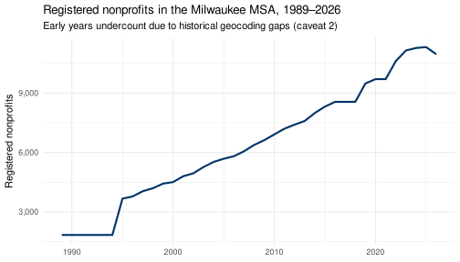
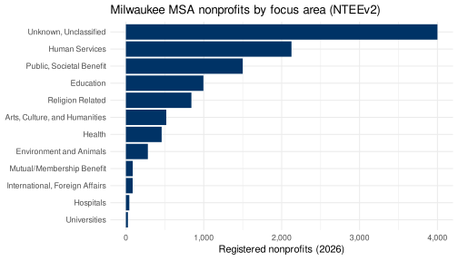
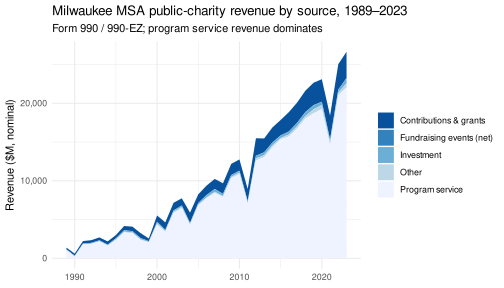

## The ask

> For the Milwaukee MSA — most recent snapshot and history back to 1989:
> how many nonprofits overall and by county; how many by focus area;
> revenue by focus area; revenue by source; and revenue by focus area ×
> source.

(Requester identity and the verbatim ask are in the gitignored
`_private.md`.)

## Geography — the Milwaukee MSA

“Milwaukee MSA” resolves to OMB CBSA **`33340` “Milwaukee-Waukesha,
WI”** — four counties: **Milwaukee, Waukesha, Ozaukee, Washington** —
held fixed (2023 OMB vintage) across all years so the series is
comparable. Geography is composed by the canonical crosswalk join only,
never re-derived:

    BMF (geo_state_abbr, geo_county)
      └─ join county-fips crosswalk  → geo_county_fips
           └─ join cbsa crosswalk    → cbsa_code, filter == "33340"

## Data & method

- **Counts & focus area → geocoded BMF master** (`nccs_read`): one row
  per EIN (3.67M), cumulative across vintages, each carrying
  `first_year_in_bmf` / `last_year_in_bmf` (span **1989–2026**),
  geography, and NTEE. Defunct orgs are retained. “Registered in year Y”
  ⟺ `first_year_in_bmf ≤ Y ≤ last_year_in_bmf`.
- **Revenue → CORE 990 merged tier** (`nccs_read_core`). CORE carries
  **EIN + financials only** — geography/NTEE come from joining CORE →
  master on `ein` (consumer-composed, ADR 0016). Public charities
  (990/990-EZ → `990combined`) and private foundations (`990pf`) are
  read separately and reported separately.
- **Focus area = `nteev2_subsector`** (Arts, Education, Environment,
  Health, Human Services, Public/Societal Benefit, Religion, …). Chosen
  over the legacy major group because it classifies far more revenue —
  see caveat 3.
- **Revenue sources** (990combined): contributions & grants
  (`total_contributions`), program services (`program_service_revenue`),
  fundraising events — net (`net_income_fundraising_events`), investment
  (`investment_income`), other (`other_revenue_total_11e`).
- **Dollars:** both nominal and CPI-adjusted (real 2024 \$, BLS CPI-U
  annual avg).

### Coverage caveats (validated against the data — read before citing)

1.  **Two populations.** Counts = the *registered* universe (BMF, all
    org types). Revenue = filers only — **Form 990 + 990-EZ** (public
    charities, ~2,800/yr recently) and **Form 990-PF** (private
    foundations, ~1,600/yr recently), reported separately. Orgs below
    the filing threshold (and Form 990-N postcard filers) report no
    financials.
2.  **Historical geocoding decays with age.** Share of *then-active* WI
    orgs with a resolvable county: 1989 **40%** · 2005 61% · 2015 83% ·
    2020 93% · 2024+ **100%**. Recent snapshot is exact; **pre-2010
    by-county/focus counts undercount** — read early years as
    trend/lower-bound.
3.  **~⅓ of revenue is unclassified.** Even with `nteev2_subsector`,
    “UNU” (unclassified) holds 33% of 2023 Form 990/990-EZ revenue (and
    ~36% of the current count). The legacy major group was worse (63%
    unclassified). UNU is reported as its own row, not dropped.
4.  **Count series is a step function at vintage years.** Vintages are
    sparse pre-1995 (only 1989, then 1995), so 1990–1994 repeat the 1989
    value; resolution improves over time.
5.  **2024 is partial** (filings still arriving) — the latest *complete*
    revenue year is **2023**. Snapshot tables use 2023.
6.  Revenue-source fields drift over time (dues folded into program
    revenue ~2008; “events” is net of direct expenses); classification
    is latest-observed per EIN.
7.  **Legacy-year revenue reflects upstream completeness.** Pre-2012
    filer counts are depressed by the geocoding gap (caveat 2) plus
    thinner legacy ingest; several years dip (e.g. 1999, 2009, 2011;
    Form 990-PF 2016–2018 is sparse). Read pre-2012 dollars as
    directional, not exact.

``` r
bmf <- read_bmf_master(
  req, state = "WI",
  columns = c("ein", "geo_state_abbr", "geo_county", "nteev2_subsector",
              "first_year_in_bmf", "last_year_in_bmf"),
  cache = FALSE,   # read S3 directly with predicate pushdown (no 400MB cache)
  note = "WI universe, all vintages 1989-2026"
)
xwalk_county <- read_crosswalk(req, "county-fips")
xwalk_cbsa   <- read_crosswalk(req, "cbsa")

msa <- bmf |>
  left_join(xwalk_county, by = c("geo_state_abbr", "geo_county" = "geo_county_raw")) |>
  left_join(xwalk_cbsa,   by = c("geo_county_fips" = "county_fips")) |>
  filter(cbsa_code == "33340") |>
  mutate(focus = ifelse(is.na(nteev2_subsector) | nteev2_subsector == "", "UNU", nteev2_subsector))

active <- function(df, y) filter(df, first_year_in_bmf <= y, last_year_in_bmf >= y)
```

## Findings

### Q1 — How many nonprofits, overall and by county

Registered nonprofits in the Milwaukee MSA (geocoded; selected years):

| Year | 1989  | 1995  | 2000  | 2005  | 2010  | 2015  | 2020  | 2023   | 2025   | 2026   |
|------|-------|-------|-------|-------|-------|-------|-------|--------|--------|--------|
| Orgs | 1,842 | 3,680 | 4,521 | 5,724 | 6,964 | 8,374 | 9,769 | 11,218 | 11,388 | 11,024 |

Current (2026) by county: **Milwaukee 6,918 · Waukesha 2,717 · Ozaukee
695 · Washington 694** (total 11,024). *Early-year figures undercount —
caveat 2.*



### Q2 — By focus area (current, 2026)

| Focus area (NTEEv2)                                       | Orgs       |
|-----------------------------------------------------------|------------|
| Human Services                                            | 2,149      |
| Public & Societal Benefit                                 | 1,522      |
| Education                                                 | 1,056      |
| Religion                                                  | 842        |
| Health                                                    | 522        |
| Arts, Culture & Humanities                                | 521        |
| Environment                                               | 282        |
| Mutual/Membership, International, Hospitals, Universities | \<100 each |
| *Unclassified (UNU)*                                      | *3,949*    |



### Q3 — Revenue by focus area (2023, Form 990/990-EZ, \$M)

| Focus area                     | Filers | Revenue (\$M) |
|--------------------------------|--------|---------------|
| Health                         | 240    | 10,401        |
| *Unclassified*                 | 771    | *8,906*       |
| Education                      | 311    | 3,577         |
| Human Services                 | 765    | 2,730         |
| Public & Societal Benefit      | 300    | 739           |
| Arts                           | 185    | 340           |
| Hospitals (narrow code)        | 2      | 166           |
| Religion / Environment / Other | —      | \<140 each    |

Health systems dominate metro nonprofit revenue.

### Q4 — Revenue by source (Form 990/990-EZ, \$M)

| Year | Contributions | Program svc | Events (net) | Investment | Other | Total  |
|------|---------------|-------------|--------------|------------|-------|--------|
| 1989 | 221           | 1,070       | 0            | 84         | 0     | 1,509  |
| 2000 | 817           | 4,337       | 16           | 206        | 168   | 5,919  |
| 2010 | 1,464         | 10,870      | 18           | 240        | 198   | 12,938 |
| 2019 | 2,938         | 18,714      | 14           | 534        | 525   | 23,162 |
| 2023 | 3,421         | 22,067      | 9            | 688        | 548   | 27,205 |

Total 990/990-EZ revenue: nominal **\$1.5B (1989) → \$27.2B (2023)**; in
real 2024 dollars **\$3.8B → \$28.0B** (~7×), with a 2021 dip to \$19.2B
nominal. **Program service revenue is ~80%** of the total — the
hospital/health footprint. (Full 35-row series in
`data/revenue_by_source_by_year_1989-2023.csv`.)



### Q5 — Revenue by focus area × source (2023, Form 990/990-EZ, \$M)

| Focus           | Contrib. | Program | Events | Invest. | Other | Total  |
|-----------------|----------|---------|--------|---------|-------|--------|
| Health          | 427      | 9,207   | 0      | 299     | 388   | 10,401 |
| Unclassified    | 515      | 8,109   | 2      | 165     | 87    | 8,906  |
| Education       | 693      | 2,613   | 2      | 82      | 43    | 3,577  |
| Human Services  | 925      | 1,647   | 4      | 39      | 19    | 2,730  |
| Public/Societal | 461      | 194     | 1      | 49      | 2     | 739    |
| Arts            | 186      | 134     | 1      | 7       | 3     | 340    |

Human services lean on contributions; health/education on program
revenue.

### Private foundations (Form 990-PF), reported separately (\$M)

| Year | Filers | Nominal | Real-2024 |
|------|--------|---------|-----------|
| 1989 | 245    | 97      | 246       |
| 2000 | 630    | 574     | 1,045     |
| 2010 | 1,155  | 754     | 1,085     |
| 2019 | 1,275  | 640     | 786       |
| 2023 | 1,634  | 1,153   | 1,187     |

Form 990-PF revenue grew from ~\$0.1B (1989) to ~\$1.2B (2023) nominal.
*(2016–2018 is sparse upstream — merged-tier 990pf backfill gap; full
series in `data/q_pf_total_revenue_by_year.csv`.)*

``` r
# Full reproducible computation lives in data/_compute.R (writes the CSVs the
# tables above are drawn from). It reads CORE 990combined (990/990-EZ) + 990pf
# (990-PF) for 1989:2023 via the merged tier (per-year reads to absorb legacy
# schema drift), joins the MSA universe on EIN, and aggregates by year / focus /
# source with CPI deflation.
```

## Takeaways

- The four-county Milwaukee metro has ~**11,000** registered nonprofits
  today, roughly **6×** the geocodable 1989 count (early counts
  undercount).
- Human services, public/societal benefit, education, and religion are
  the most numerous; **health systems dominate revenue** (~\$10B of
  ~\$27B in 2023).
- **Form 990/990-EZ** (public-charity) revenue grew from ~\$1.5B (1989)
  to ~\$27.2B
  2023) nominal — ~\$3.8B → ~\$28.0B in real 2024 dollars (~7×).
        **Program service revenue is the overwhelming source (~80%)**;
        contributions are second (~\$3.4B in 2023).
- **Form 990-PF** (private foundations) add ~\$1.2B (2023), reported
  separately.

------------------------------------------------------------------------

*Reproducibility: reads the vintages pinned in `_pins.csv`. See ADR 0024
/ 0025 in `nccs-contracts`.* </content>
